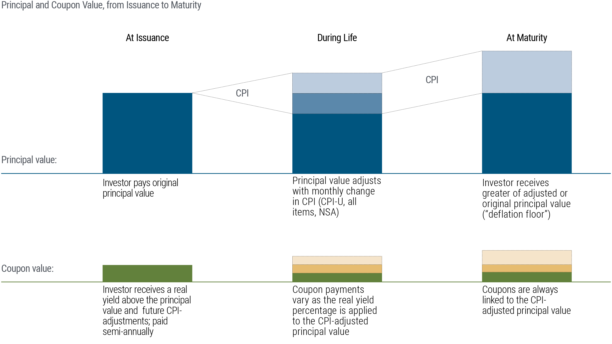

Inflation is a pervasive economic phenomenon that can significantly diminish the purchasing power of investments. As prices rise, the real value of money declines, which can erode the returns on investment portfolios if not properly managed. For investors seeking to protect their portfolios against this erosion, inflation-linked bonds, also known as index-linked bonds, present a viable solution. These bonds are designed to adjust their principal and interest payments in line with inflation indices, thereby preserving the real value of returns. This contrasts with traditional bonds, which offer fixed nominal returns and may lose purchasing power during inflationary periods.

Inflation-linked bonds offer numerous advantages. By aligning returns with inflationary patterns, they protect investors from potential erosions in value, ensuring that the investment maintains its purchasing power over time. In the context of the United States, Treasury Inflation-Protected Securities (TIPS) are a well-known example, offering a secure investment that is inherently resistant to inflationary pressures. Similarly, other countries offer their variants, such as real return bonds in Canada, each designed to maintain real value in the face of rising prices.



The mechanics of inflation-linked bonds differ from those of traditional bonds due to their inflation-adjustment feature. As inflation increases, the bond’s face value and subsequent interest payments rise proportionately, enabling investors to achieve a real rate of return. This capacity to maintain purchasing power makes them particularly attractive during periods of economic fluctuation.

Moreover, the integration of algorithmic trading in bond markets offers an additional layer of strategy for managing bond investments. Algorithmic trading utilizes computer algorithms to automate and optimize trading strategies, which can be particularly beneficial for inflation-linked bonds. By leveraging data on inflation trends and price indices, algorithms can swiftly adjust portfolios to maximize returns and mitigate risks.

In conclusion, inflation-linked bonds represent a strategic investment choice for those seeking to protect their investments from the adverse effects of inflation. Their ability to offer inflation-adjusted returns, combined with the potential for enhanced performance through algorithmic trading, makes them a valuable tool in diversifying and optimizing investment portfolios. As inflation becomes an ever-present concern, the role of such financial instruments in safeguarding purchasing power becomes increasingly critical.

## Table of Contents

## Understanding Inflation-Linked Bonds

Inflation-linked bonds are a type of fixed-income investment specifically designed to shield investors from the erosive impacts of inflation. Unlike traditional bonds, which offer fixed nominal payments, the principal and interest payments of inflation-linked bonds are adjusted in accordance with a designated price index. This adjustment ensures that the bonds' returns maintain purchasing power in real terms.

The most widely used price index for these bonds is the Consumer Price Index (CPI), a statistical measure that examines the weighted average of prices of a basket of consumer goods and services. By linking the bond's returns to the CPI, these bonds can adjust for inflation over time, thereby preserving the investor's purchasing power. 

The mechanics of inflation-linked bonds work as follows: the bond's principal value is adjusted periodically based on the changes in the CPI. For example, if the principal of a bond is initially $1,000 and the CPI increases by 3% over a period, the adjusted principal would then be $1,030. Consequently, the interest payments, calculated on this adjusted principal, will also increase. This mechanism allows investors to obtain a real rate of return, which is the return after accounting for inflation.

In many markets, government-issued inflation-linked bonds provide a reliable and low-risk means of inflation protection. For instance, the United States offers Treasury Inflation-Protected Securities (TIPS), which adjust their principal and coupon payments based on variations in the U.S. CPI. Similarly, Canada offers real return bonds that are indexed to the Canadian CPI. 

These bonds are particularly appealing in an economic environment characterized by unpredictable inflation trends. Investors seeking stable returns that preserve purchasing power often consider them a viable component of a diversified investment portfolio. The principle adjustment feature differentiates these bonds from conventional fixed-income securities, where inflation erodes the real value of nominal payments over time.

## How Inflation-Linked Bonds Work

Inflation-linked bonds are financial instruments designed to safeguard investors from the erosive effects of inflation. The primary mechanism by which these bonds function involves adjusting both the face value and interest payments in alignment with inflation rates. Typically, this adjustment is tied to a comprehensive measure of inflation such as the Consumer Price Index (CPI).

The face value, or principal, of an inflation-linked bond increases with rising inflation. When inflation occurs, the index utilized (e.g., CPI) rises, which in turn raises the bond's principal value. Consequently, both the value of the principal and the interest payments expand, allowing the investor to achieve a rate of return that maintains purchasing power over time. Mathematically, the adjustment of the principal can be expressed as:

$$
\text{Adjusted Principal} = \text{Original Principal} \times \frac{\text{Current CPI}}{\text{Base CPI}}
$$

Interest payments on these bonds are calculated based on the adjusted principal. If $r$ represents the real rate of interest, the actual interest payment can be evaluated as:

$$
\text{Interest Payment} = \text{Adjusted Principal} \times r
$$

Such adjustments ensure that the investor effectively earns a real rate of return, insulating the investment from inflationary pressures.

During periods of deflation, these bonds may incorporate specific provisions to protect the principal. For instance, in certain inflation-linked bonds, the principal is guaranteed not to decrease below its original value regardless of deflationary trends. This floor on the principal value renders the bond a more secure investment by preventing loss of principal during economic downturns marked by falling prices. 

Inflation-linked bonds thus offer investors a robust tool for preserving capital value by systematically adjusting to inflation and, where applicable, deflation, ensuring that the real purchasing power of the invested funds remains intact over time.

## Benefits of Investing in Inflation-Linked Bonds

Inflation-linked bonds offer several compelling benefits to investors, particularly in volatile economic environments where inflation is a significant concern. These bonds are explicitly designed to protect against inflation, ensuring that the purchasing power of the investment is maintained over time.

The primary advantage of inflation-linked bonds is their ability to hedge against inflation. These bonds adjust both their principal and interest payments based on changes in the Consumer Price Index (CPI) or similar indices, which provides investors with a real rate of return. Consequently, as inflation rises, both the principal and interest payments on these bonds increase, preserving the real value of the investment. This is a crucial benefit for investors looking to safeguard their investments from the eroding effects of inflation.

Another significant benefit is the stable income that inflation-linked bonds provide. The inflation-adjusted interest payments ensure a reliable income stream that rises with increases in the price level, making these bonds an ideal choice for risk-averse investors who prioritize income stability. Unlike fixed-rate bonds, where real income may decline if inflation surges, inflation-linked bonds offer a level of predictability and security in income generation.

Additionally, inflation-linked bonds contribute to investment portfolio diversification. Historically, the returns from these bonds exhibit a low correlation with other asset classes such as stocks and conventional bonds. This attribute can be particularly advantageous for investors seeking to reduce portfolio [volatility](/wiki/volatility-trading-strategies) and enhance risk-adjusted returns. By including inflation-linked bonds, investors can benefit from an asset class that reacts differently to economic changes compared to equities or fixed-income securities, thereby improving overall portfolio resilience.

In summary, the benefits of investing in inflation-linked bonds include robust protection against inflation, a reliable and adjusting income stream, and diversification advantages that strengthen investment portfolios. These qualities make them a strategic addition for investors focused on maintaining their purchasing power and achieving long-term financial stability.

## Risks and Considerations

Investing in inflation-linked bonds, while offering significant benefits, comes with its own set of risks and considerations that investors must be aware of. One of the primary concerns is taxation. The adjustments to the principal and interest payments for inflation are often treated as taxable income. This means that the accrued inflation component, even if not received as cash, may be subject to tax. For instance, if the principal amount of the bond increases due to inflation adjustments, the increase may still be taxed despite the investor not having immediate access to that cash. This aspect can create a tax liability that reduces the effective return on these investments.

Deflation risk is another consideration. Inflation-linked bonds are designed to adjust the principal in line with inflation indices. However, during periods of deflation, where the price level declines, the principal value could potentially be adjusted downward. Most inflation-linked bonds, such as U.S. Treasury Inflation-Protected Securities (TIPS), have provisions to prevent the principal from decreasing below its original value at maturity. Nonetheless, in a deflationary environment, the benefits expected from inflation adjustments are mitigated, and the nominal returns may not be as attractive.

Interest rate sensitivity is also a key [factor](/wiki/factor-investing). Although inflation-linked bonds display less sensitivity to [interest rate](/wiki/interest-rate-trading-strategies) changes compared to traditional fixed-rate bonds, they are not immune. Interest rate changes influence the real yield of these bonds; when interest rates rise, the price of existing bonds typically falls. The degree of sensitivity is generally lower because the inflation adjustments provide a cushion against interest rate fluctuations. However, during rising interest rate scenarios, the market value of inflation-linked bonds can still experience volatility.

Investors should also consider the overall market conditions and economic environment when assessing the risks associated with inflation-linked bonds. A diversified bond investment strategy that takes into account these factors can help mitigate risks and optimize returns. Understanding these intricacies aids investors in making informed decisions about including inflation-linked bonds in their portfolios.

## Algorithmic Trading and Bond Investments

Algorithmic trading utilizes computer algorithms to automate trading strategies, significantly optimizing bond portfolios. By implementing predefined sets of rules and mathematical models, [algorithmic trading](/wiki/algorithmic-trading) allows for executing transactions at speeds and frequencies that are impossible for human traders. This efficient and high-frequency trading method is particularly beneficial in the context of bond investments, where timing and precision are critical.

Certain algorithms are engineered specifically to target index-linked bonds, leveraging data from inflation patterns and price indices to make informed trading decisions. These algorithms continuously analyze economic indicators that influence inflation, such as the Consumer Price Index (CPI). By integrating vast datasets and real-time analytics, the algorithms can swiftly identify and capitalize on market opportunities, ensuring that the portfolio maintains its value in an inflationary environment.

Moreover, automated trading strategies enable investors to quickly adjust their positions in response to fluctuating market conditions, thus protecting and potentially enhancing the portfolio's real rate of return. For example, algorithms can be programmed to shift investment focus from traditional bonds to inflation-linked bonds during periods of rising inflation metrics. This adaptability is crucial for maintaining purchasing power and achieving investment objectives.

Python is a popular language for developing these algorithmic trading strategies due to its extensive libraries and frameworks. A simple example of such a strategy might involve the use of historical inflation data to predict future trends, and subsequently optimize bond allocations:

```python
import numpy as np
from sklearn.linear_model import LinearRegression

# Historical inflation data
inflation_rates = np.array([2.1, 2.3, 1.8, 3.0, 2.6])
bond_prices = np.array([100, 103, 102, 105, 107])

# Train a simple linear regression model
model = LinearRegression()
model.fit(inflation_rates.reshape(-1, 1), bond_prices)

# Predict bond price based on future inflation prediction
future_inflation = np.array([2.5]).reshape(-1, 1)
predicted_bond_price = model.predict(future_inflation)

print(f"Predicted Bond Price: {predicted_bond_price}")
```

In this example, a linear regression model is employed to predict bond prices based on historical inflation rates. Such models can be expanded to incorporate more complex datasets and leverage [machine learning](/wiki/machine-learning) techniques for more robust predictions and strategy optimizations. By employing algorithmic trading, investors can effectively manage inflation risks and make data-driven decisions that optimize their bond investment outcomes.

## Conclusion

Inflation-linked bonds are a strategic tool for investors seeking to preserve purchasing power during periods of economic uncertainty. As these bonds adjust both their principal and interest payments in accordance with inflation rates, they provide a robust hedge against cost-of-living increases. This intrinsic capability ensures that investors maintain a real rate of return, making inflation-linked bonds an attractive addition to diversified investment portfolios.

The appeal of inflation-linked bonds is further enhanced when combined with algorithmic trading. By utilizing advanced algorithms, investors can automate the management of bond portfolios, enabling swift responses to market changes. Algorithms designed to factor in inflation trends and price indices can optimize investment strategies, enhancing the potential for returns. For instance, automated trading systems can quickly adjust holdings in response to inflation forecast adjustments, ensuring that the portfolio remains aligned with inflation-hedging objectives.

Overall, inflation-linked bonds present a compelling option for investors aiming to mitigate inflation risk while ensuring stable income streams. By incorporating algorithmic trading techniques, investors can optimize their bond investments, potentially increasing returns despite volatile market conditions.

## References & Further Reading

[1]: Campbell, John Y., Shiller, Robert J., & Viceira, Luis M. (2009). ["Understanding Inflation-Indexed Bond Markets."](https://www.nber.org/papers/w15014) National Bureau of Economic Research.

[2]: ["Handbook of Inflation Indexed Bonds"](https://www.wiley.com/en-us/Handbook+of+Inflation+Indexed+Bonds-p-9781883249489) by Mark Deacon, Andrew Derry, & Dariush Mirfendereski

[3]: ["Treasury Inflation-Protected Securities (TIPS)"](https://www.treasurydirect.gov/indiv/products/prod_tips_glance.htm) U.S. Department of the Treasury.

[4]: ["Algorithmic Trading: Winning Strategies and Their Rationale"](https://www.amazon.com/Algorithmic-Trading-Winning-Strategies-Rationale-ebook/dp/B00CY5HC0U) by Ernie Chan

[5]: Evans, Martin D.D. (2003). ["Real Returns in the United States: 1871–2000."](https://faculty.georgetown.edu/evansm1/Home%20page.htm) Journal of Applied Econometrics.

[6]: ["Inflation-Protected Securities: Bonds, Funds, and ETFs - A Complete Guide"](https://money.usnews.com/funds/etfs/rankings/inflation-protected-bond) by Michael P. Dennis