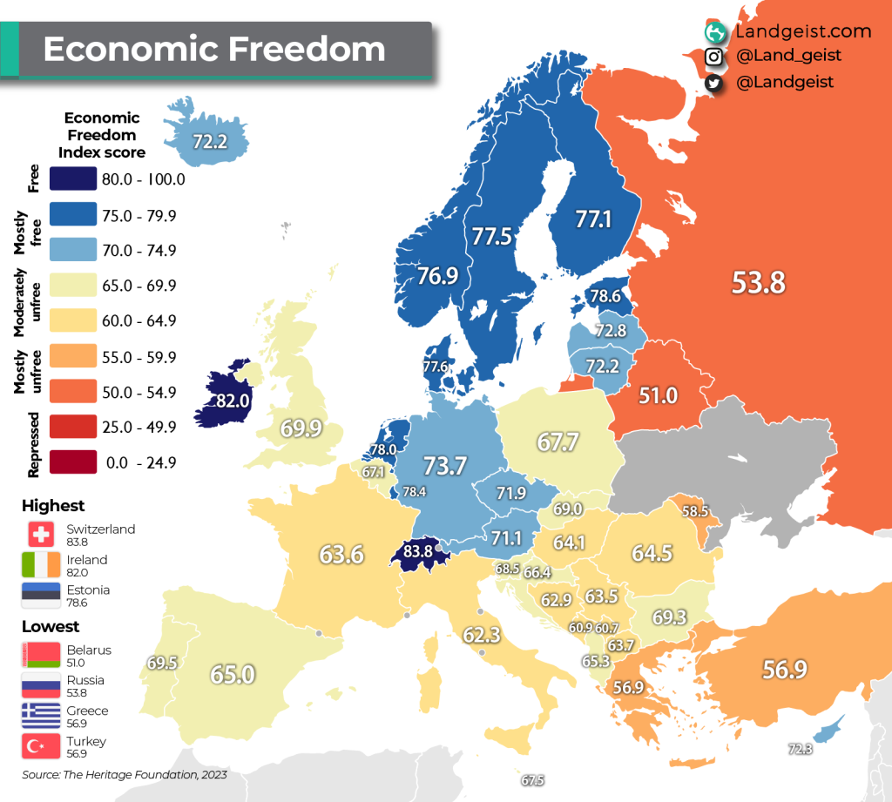

## Table of Contents

## What is the Index of Economic Freedom?

The Index of Economic Freedom is a report that looks at how free countries are when it comes to their economies. It is made by The Heritage Foundation and The Wall Street Journal. The report checks things like how easy it is to start a business, how much taxes people have to pay, and how well property rights are protected in different countries. Each country gets a score based on these factors, and the scores help show which countries have the most economic freedom.

The index is important because it can show how well a country's economy might do. Countries with more economic freedom often have stronger economies, more jobs, and higher incomes for their people. The report can help leaders and businesses understand where to invest or make changes to improve their economy. It also helps people see how their country compares to others in terms of economic freedom.

## Who publishes the Index of Economic Freedom?

The Index of Economic Freedom is published by The Heritage Foundation and The Wall Street Journal. These two groups work together to make the report every year. The Heritage Foundation is a group that thinks about and studies policies, and The Wall Street Journal is a big newspaper that talks about business and money.

The report looks at many countries and gives each one a score. It checks things like how easy it is to start a business, how much taxes people have to pay, and how well property rights are protected. This helps people see which countries have the most economic freedom and can help leaders and businesses make better decisions.

## How often is the Index of Economic Freedom updated?

The Index of Economic Freedom is updated every year. This means a new report comes out once every 12 months. The Heritage Foundation and The Wall Street Journal work together to make sure the information is fresh and up-to-date.

Each year, they look at the latest data from many countries. They check things like how easy it is to start a business, how much taxes people have to pay, and how well property rights are protected. This helps them give each country a new score, so people can see how economic freedom has changed over time.

## What are the main components or factors considered in the Index of Economic Freedom?

The Index of Economic Freedom looks at many different parts of a country's economy to see how free it is. Some of the main things they check are how easy it is to start a business, how much taxes people have to pay, and how well property rights are protected. They also look at how free trade is, how much the government spends, and how easy it is to get money from banks. These parts help show if people can make their own choices about money and work.

Another important part is how well the laws work and how fair the government is. The index checks if the laws are clear and if they are followed the same for everyone. It also looks at how much money people lose to corruption and how safe they feel. All these pieces together give a full picture of how free a country's economy is. This helps people understand which countries have the best conditions for businesses and workers.

## How is the Index of Economic Freedom calculated?

The Index of Economic Freedom is calculated by looking at many parts of a country's economy. The Heritage Foundation and The Wall Street Journal collect data on things like how easy it is to start a business, how much taxes people have to pay, and how well property rights are protected. They also check how free trade is, how much the government spends, and how easy it is to get money from banks. Each of these parts gets a score, and all the scores are added up to make the final score for a country.

These scores help show how free a country's economy is. A higher score means the country has more economic freedom, which often leads to stronger economies, more jobs, and higher incomes for people. The index is updated every year, so the scores can change based on new data. This helps people see how economic freedom is changing over time and helps leaders and businesses make better decisions about where to invest or make changes to improve their economy.

## What is the purpose of the Index of Economic Freedom?

The Index of Economic Freedom helps people understand how free countries are when it comes to their economies. It is made by The Heritage Foundation and The Wall Street Journal. They look at things like how easy it is to start a business, how much taxes people have to pay, and how well property rights are protected. Each country gets a score based on these factors, which shows how much economic freedom they have. This can help leaders and businesses see where to invest or make changes to improve their economy.

The index is important because it can show how well a country's economy might do. Countries with more economic freedom often have stronger economies, more jobs, and higher incomes for their people. The report comes out every year, so it can help people see how economic freedom is changing over time. This information can be used by leaders, businesses, and anyone who wants to understand how their country compares to others in terms of economic freedom.

## How does the Index of Economic Freedom impact global economic policies?

The Index of Economic Freedom can help shape global economic policies by showing which countries have the most freedom in their economies. When countries see that others with more economic freedom have stronger economies, more jobs, and higher incomes, they might want to make changes to their own policies. Leaders and policymakers can use the index to see what works well in other countries and try to copy those ideas. For example, if a country sees that low taxes and easy business rules help other countries, they might decide to lower their taxes or make it easier to start a business.

The index also helps international groups and businesses decide where to invest their money. If a country has a high score on the index, it might attract more investment because people think it's a good place to do business. This can lead to more money coming into the country, which can help grow the economy. Over time, as more countries try to improve their scores on the index, global economic policies can change to focus more on freedom and less on control. This can lead to a world where more people have the chance to start businesses, work, and earn money.

## Can you provide examples of countries with high and low scores on the Index of Economic Freedom?

Some countries that score high on the Index of Economic Freedom are Singapore and Hong Kong. These places have rules that make it easy to start a business, low taxes, and strong property rights. This means people can make their own choices about money and work, which often leads to a strong economy with lots of jobs and good incomes. People from around the world like to invest in these countries because they think it's a good place to do business.

On the other hand, countries like Venezuela and North Korea have low scores on the Index of Economic Freedom. In these places, it's hard to start a business, taxes are high, and property rights are not well protected. The government has a lot of control over the economy, which can make it hard for people to make their own money. This often leads to weaker economies with fewer jobs and lower incomes. People might not want to invest in these countries because they see it as a riskier place to do business.

## What are the criticisms or limitations of the Index of Economic Freedom?

Some people say the Index of Economic Freedom has problems. One big issue is that it might not look at everything that matters for a country's economy. For example, it doesn't talk about how fair the money is shared among people or how good the schools and hospitals are. These things can also affect how well an economy does. Another problem is that the index is made by The Heritage Foundation, which some people think has its own ideas about what makes a good economy. This can make people wonder if the index is fair or if it's just showing what The Heritage Foundation thinks is important.

Another criticism is that the index might not be the best way to compare countries. Different countries have different ways of doing things, and what works in one place might not work in another. For example, a country with a lot of natural resources might have a different kind of economy than a country that doesn't have those resources. The index might not take these differences into account. Also, the data used to make the index can sometimes be hard to get or not very accurate, which can make the scores less reliable. Even with these problems, the index can still be a helpful tool for understanding how free a country's economy is, but it's good to know its limits.

## How does the Index of Economic Freedom correlate with other economic indicators like GDP growth?

The Index of Economic Freedom often shows a link with other economic indicators like GDP growth. Countries that score high on the index usually have stronger economies. This means they often have higher GDP growth rates. When a country has more economic freedom, it's easier for people to start businesses, invest money, and make their own choices about work. This can lead to more jobs and higher incomes, which helps the whole economy grow.

However, the link between the Index of Economic Freedom and GDP growth isn't perfect. Other things can affect a country's economy too, like how much money people have to spend, how good the schools and hospitals are, and what's happening in the world around them. Sometimes, a country might have a high score on the index but still face problems that slow down its GDP growth. So, while the index can give a good idea of how free an economy is, it's just one piece of the puzzle when looking at the whole picture of a country's economic health.

## What trends have been observed in the Index of Economic Freedom over the past decade?

Over the past ten years, the Index of Economic Freedom has shown some interesting trends. Many countries have been working to make their economies more free. They've done things like lowering taxes, making it easier to start businesses, and protecting property rights better. This has led to higher scores for some countries on the index. For example, countries like Singapore and Hong Kong have stayed at the top of the list, showing that their economies are very free. Other countries, like some in Eastern Europe, have also improved their scores a lot by making big changes to their economic rules.

However, not all countries have seen their scores go up. Some places, like Venezuela and North Korea, have stayed at the bottom of the list. Their economies are still very controlled by the government, which makes it hard for people to make their own money. Also, some countries have seen their scores go down because of things like more corruption or less freedom in trade. Overall, the trend over the past decade shows that while many countries are trying to make their economies more free, there are still big differences between countries, and some are moving in the opposite direction.

## How can policymakers use the Index of Economic Freedom to improve their country's economic performance?

Policymakers can use the Index of Economic Freedom to see how their country's economy compares to others. By looking at the scores, they can find out which parts of their economy need to be more free. For example, if a country has a low score in starting businesses, policymakers might make the rules easier so people can start companies faster. If taxes are too high, they might lower them to give people more money to spend and invest. By making these changes, they can help their country's economy grow stronger and create more jobs.

Another way policymakers can use the index is by learning from other countries. If a country with a high score on the index has done well in areas like trade or property rights, policymakers can try to copy those ideas. For example, if a country sees that free trade has helped another country's economy, they might make their own trade rules less strict. By using the index to guide their decisions, policymakers can make their country a better place for businesses and workers, which can lead to a healthier economy overall.

## References & Further Reading

[1]: Miller, T., Kim, A. B., & Roberts, J. M. (2021). ["2021 Index of Economic Freedom."](https://www.researchgate.net/publication/351483265_2021_Index_of_Economic_Freedom_Results_and_Observations_on_Kenya_EAC_Select_SSA_Economies) The Heritage Foundation.

[2]: Lopez de Prado, M. (2018). ["Advances in Financial Machine Learning."](https://www.amazon.com/Advances-Financial-Machine-Learning-Marcos/dp/1119482089) Wiley.

[3]: Chan, E. P. (2009). ["Quantitative Trading: How to Build Your Own Algorithmic Trading Business."](https://github.com/ftvision/quant_trading_echan_book) Wiley.

[4]: Jansen, S. (2020). ["Machine Learning for Algorithmic Trading."](https://github.com/stefan-jansen/machine-learning-for-trading) Packt Publishing.

[5]: Aronson, D. R. (2007). ["Evidence-Based Technical Analysis: Applying the Scientific Method and Statistical Inference to Trading Signals."](https://www.amazon.com/Evidence-Based-Technical-Analysis-Scientific-Statistical/dp/0470008741) Wiley.