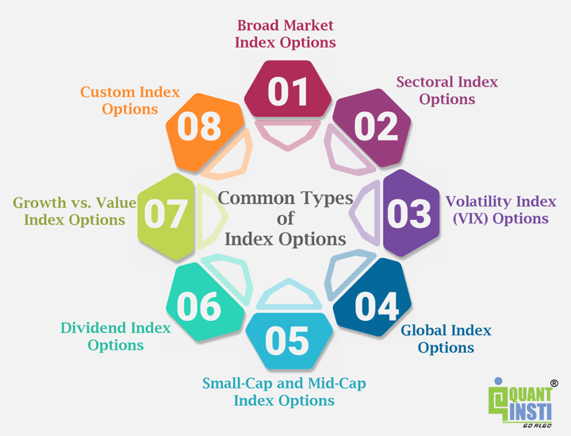

The financial market landscape is continuously expanding and transforming, presenting a variety of opportunities for investors seeking to optimize their portfolios. Among the many facets of this dynamic environment, index options trading has gained prominence as a versatile tool that allows traders to leverage the performance of entire stock indices, such as the S&P 500 or the Dow Jones Industrial Average, rather than individual securities. This form of trading provides the unique benefit of diversification, reducing risk by spreading exposure across a wide range of stocks within an index.

Simultaneously, algorithmic trading—or algo trading—has emerged as a revolutionary force in financial markets, driven by the power of sophisticated computer programs capable of executing trades at lightning-fast speeds based on pre-defined criteria. By removing the human emotional element, algorithmic trading ensures disciplined, rule-based trading decisions that can adapt to market conditions with precision and efficiency.



Combining the strategic potential of index options trading with the technical capabilities of algorithmic trading offers significant enhancements to investment strategies. This amalgamation has the potential to optimize trade execution, manage risk more effectively, and capture unprecedented opportunities in the market. This article examines the multifaceted features of both index options and algorithmic trading, providing insights that range from the fundamental basics to more complex strategies, to equip investors with the tools needed to navigate this intricate and competitive arena.

## Table of Contents

## Understanding Index Options Trading

Index options are financial derivatives that grant the holder the right, but not the obligation, to buy or sell a stock index at a pre-specified price within a defined period. These options are inherently linked to stock indices like the S&P 500 or the Dow Jones Industrial Average, which track the performance of a basket of stocks. This characteristic allows investors to gain broad exposure to the stock market, facilitating portfolio diversification with relative ease.

These derivatives are typically European-styled, meaning they can only be exercised at the contract's expiration date, rather than any time before. This differentiates them from American-styled options, which allow for exercise at any time up to expiration. The European-style exercise mechanism generally simplifies the pricing model for these options and aligns the payoff realization to a single period.

Investors utilize index options through various strategies. At a fundamental level, these include buying calls or puts. A call option grants the right to purchase an index, anticipating that the index's value will rise, while a put option provides the right to sell, expecting a decline. Beyond these basic strategies, more complex approaches involve spreads such as bull call spreads and bear put spreads. In a bull call spread, an investor buys call options at a lower strike price and sells the same number of calls at a higher strike price, reducing the cost and capping the profit potential. Conversely, a bear put spread involves purchasing put options at a higher strike price and selling the same amount of puts at a lower strike price.

Trading index options serves dual purposes: hedging and speculating. When used for hedging, these options act as insurance, allowing investors to protect their portfolios from adverse market movements. For example, an investor anticipating a market downturn might purchase put options to offset potential losses in their stock holdings. On the other hand, speculation using index options enables traders to profit from anticipated market moves with leveraged exposure, often involving only a fraction of the capital required to buy the underlying stocks directly.

A fundamental component of understanding index options trading involves grasping their pricing, typically modeled through the Black-Scholes formula, which assesses factors such as the index's current price, the options strike price, time to expiration, [volatility](/wiki/volatility-trading-strategies), and the risk-free [interest rate](/wiki/interest-rate-trading-strategies). This mathematical approach allows traders to evaluate fair prices for buying or selling index options, thus informing their strategic decisions.

Overall, index options provide a versatile tool for investors, granting exposure to comprehensive market movements with the ability to conduct refined strategic maneuvers based on individual market outlooks and risk tolerance.

## Advantages of Algo Trading in Financial Markets

Algorithmic trading, often referred to as algo trading, is a sophisticated approach that utilizes computer algorithms to automate and optimize trading decisions. This method significantly enhances market responsiveness, as algorithms can analyze vast datasets and execute trades at speeds beyond human capability. By programming predefined rules and conditions, algo trading effectively eliminates the emotional biases that can cloud human judgment, resulting in more consistent and disciplined trading strategies.

A key advantage of algo trading is its ability to process and analyze market data in real-time. This capability allows traders to exploit market opportunities rapidly and efficiently. The automation provided by these algorithms facilitates not only quicker execution of trades but also the ability to execute complex trading strategies that would be impractical manually. For example, algorithms can simultaneously manage multiple trades, execute large orders by breaking them into smaller pieces to minimize market impact, and react to market fluctuations promptly.

Furthermore, algo trading excels in risk management. By utilizing sophisticated risk assessment techniques, algorithms can better manage a portfolio's exposure to market volatility. Strategies can be designed to automatically adjust positions based on various risk parameters, such as volatility or [liquidity](/wiki/liquidity-risk-premium). This adjustment is often done using advanced mathematical models that incorporate statistical measures such as standard deviation and the various "Greeks" from options trading theory. For instance, delta hedging—a strategy that aims to maintain a delta-neutral position to mitigate the effect of price changes—can be algorithmically implemented to enhance portfolio stability.

The precision and efficiency of algo trading also enable firms to engage in high-frequency trading ([HFT](/wiki/high-frequency-trading-strategies)), where profits stem from executing a large number of trades at high speeds. This is possible due to the algorithms' ability to quickly identify and capitalize on small price discrepancies across markets.

Incorporating algo trading into financial markets not only streamlines operational efficiency and execution precision but also provides traders with robust tools for risk management and strategic trade execution. As financial markets continue to evolve, the application of algo trading represents a crucial frontier in achieving optimal trading performance and competitive advantage.

## Synergy Between Index Options and Algo Trading

Algo trading significantly enhances the practice of index options trading by leveraging sophisticated mathematical models and computational power to make informed trading decisions. This integration allows for the seamless execution of complex options strategies, such as straddles, strangles, and iron condors, which require precise timing and execution to be effective.

For instance, a straddle strategy, which involves buying a call and a put option with the same strike price and expiration date, can benefit from algo trading. Algorithms can monitor market data in real-time and execute trades at optimal points, thus capturing volatility-based opportunities that human traders might miss due to market inefficiencies. This rapid execution capability is crucial in options markets, where prices can fluctuate significantly over short periods.

The algorithmic approach also extends to strangle strategies, which involve purchasing out-of-the-money call and put options. By automating these trades, algo systems can continuously scan for opportunities across multiple indices, adjusting positions dynamically as market conditions change. This adaptability is vital in managing the delicate balance between risk and reward in options trading.

Moreover, employing iron condor strategies—where traders hold both a short strangle and a long strangle at different strike prices—algo trading can quickly set up and dismantle positions to lock in profits or minimize losses. The ability to compute complex variables and scenarios almost instantaneously allows these systems to maintain a strategic edge in volatile markets.

A Python-based algo trading system for index options might look like this:

```python
import numpy as np
import pandas as pd
from datetime import datetime
from trading_platform import execute_trade  # hypothetical module

def iron_condor_strategy(index_data):
    # Assuming index_data is a pandas DataFrame with historical prices
    current_price = index_data['close'].iloc[-1]

    call_strike_1 = current_price + 10
    put_strike_1 = current_price - 10
    call_strike_2 = current_price + 20
    put_strike_2 = current_price - 20

    # Conditions to execute the iron condor
    if np.std(index_data['close'].pct_change()) > 0.2:  # check for volatility
        # Buy put at put_strike_2, sell put at put_strike_1
        execute_trade('buy', 'put', put_strike_2)
        execute_trade('sell', 'put', put_strike_1)

        # Buy call at call_strike_1, sell call at call_strike_2
        execute_trade('buy', 'call', call_strike_1)
        execute_trade('sell', 'call', call_strike_2)

# Sample index data reading
# index_data = pd.read_csv('index_data.csv', parse_dates=['date'])
# iron_condor_strategy(index_data)
```

This code illustrates the automated setup of an iron condor based on volatility checking, a process that would be cumbersome manually. By analyzing historical price data and applying statistical metrics, algos determine the best times to enter and [exit](/wiki/exit-strategy) trades, enhancing profitability and mitigating risks.

Combining these elements—advanced strategies, real-time data processing, and algorithmic precision—enables traders to efficiently navigate the complex and fast-paced nature of options markets. This synergy not only maximizes profit potential but also enhances the ability to adapt swiftly to market changes, thereby creating a robust framework for traders in the evolving financial ecosystem.

## Developing and Implementing Strategies

Adapting options trading strategies for [algorithmic trading](/wiki/algorithmic-trading) necessitates a structured approach, beginning with defining precise rules and quantifying criteria that dictate trade actions. This process includes setting up parameters such as entry and exit signals, risk thresholds, and target profit levels. The emphasis is on transforming traditional trading strategies into algorithmic models that can be systematically tested and optimized.

Critical to this process is the use of historical and real-time data analysis. Historical data allows traders to backtest strategies across varying market conditions. Backtesting involves running a strategy on historical data to evaluate its effectiveness. A test strategy's reliability often depends on its performance across various datasets and timeframes. Real-time data, on the other hand, assists in refining the strategy's performance by providing insights into current market dynamics and allowing immediate adjustments when necessary.

Optimization of trading strategies involves fine-tuning parameters to enhance performance outcomes such as return maximization or risk reduction. Parameters like strike prices, deltas, and trade execution timings must be adjusted judiciously to align with the trader’s objectives. For example, adjusting the strike price parameter might involve shifting the buy-call options higher or lower based on expected market movement, using calculations like the Black-Scholes model for option pricing.

Several platforms offer robust environments for developing, testing, and deploying algorithmic trading strategies. Platforms such as UltraAlgo and Alpaca provide tools tailored for constructing algorithmic models, facilitating the process of strategizing and executing trades without extensive manual intervention. These platforms typically feature APIs for real-time data feeds, [backtesting](/wiki/backtesting) engines, and live trading capabilities, which together create an ecosystem conducive to algorithmic trading.

By emphasizing a systematic approach, traders ensure the effective execution of complex strategies with minimal market impact. This systematic execution is crucial, particularly in high-frequency trading scenarios, where the precision and speed provided by algorithms significantly reduce slippage and other trading costs. For instance, algorithmic trading can adjust orders based on statistical [arbitrage](/wiki/arbitrage) or market-making strategies, which rely on narrow pricing inefficiencies or liquidity provision.

In addition, a well-designed algorithm incorporates rigorous performance metrics and continuously evaluates these against predefined benchmarks, refining its processes in response to new market information. Overall, developing and implementing strategies in algorithmic options trading is a cyclic process of continual review and adaptation, ensuring alignment with evolving market landscapes.

## Managing Risks in Algorithmic Options Trading

Effective risk management is pivotal in algorithmic options trading, where the rapid execution of trades requires a robust strategy to mitigate potential losses. Key techniques in managing these risks include volatility management, Greek management, and diversification.

Volatility management involves closely monitoring market volatility to adjust trading strategies accordingly. Options trading is sensitive to volatility, as it impacts option pricing significantly. Traders often use tools such as the VIX (Volatility Index) to gauge expected market volatility and adjust their positions proactively.

Greek management refers to the utilization of the “Greeks” — Delta, Gamma, Theta, Vega, and Rho — to manage risk in options portfolios. Each Greek measures a different aspect of risk and sensitivity in an options position. For instance, Delta measures the sensitivity of the option's price to changes in the price of the underlying asset, while Vega indicates sensitivity to changes in implied volatility. By carefully monitoring and adjusting these Greeks, traders can better hedge their positions and optimize their portfolios' risk-return profile.

Diversification is another core principle, which involves spreading investments across various options and underlying assets to reduce risk. This technique aims to minimize the impact of adverse movements in any single position or asset.

Implementing stop-loss mechanisms is crucial in managing risk, allowing traders to automatically close positions when losses reach a predefined threshold. This discipline helps in mitigating potential losses and preserving capital. Additionally, monitoring leverage is essential, as excessive leverage can magnify losses and lead to significant financial distress. 

Continuous scenario analysis and stress testing are imperative in preparing for adverse market scenarios. By simulating various market conditions and examining potential impacts on their portfolios, traders can develop strategies to cushion against unforeseen events. Stress testing helps in understanding how extreme market movements could affect options portfolios, thus aiding in better preparedness.

Dynamic hedging strategies are often employed to adjust portfolios in response to changes in market volatility. These strategies involve rebalancing positions dynamically to maintain the desired risk exposure and protect against adverse price movements. For instance, delta-neutral hedging is designed to make the portfolio insensitive to small price movements in the underlying asset.

Compliance with regulatory standards is also paramount, ensuring that trading practices adhere to legal requirements and minimize operational risks. Regulatory compliance helps in avoiding potential legal penalties and maintaining a reputation for ethical trading practices.

In conclusion, a comprehensive approach to risk management in algorithmic options trading requires integrating these strategies to curtail potential losses, protect investments, and ensure long-term trading success.

## Conclusion

The integration of index options trading with algorithmic technology has unlocked significant potential within financial markets. By adopting these advanced techniques, investors can make more informed and efficient decisions, capitalizing on the full capabilities of options markets. Algorithmic tools allow traders to systematically analyze vast quantities of data, execute trades with precision, and adapt strategies swiftly to changing market conditions. This level of sophistication provides a substantial edge over traditional methods, enabling the execution of complex strategies that can optimize returns while mitigating risk.

Nonetheless, the successful application of these techniques requires a solid understanding of both the financial instruments and the algorithms governing them. Risk management is paramount, as inefficiencies or errors within algorithmic models can pose significant threats to investment portfolios. Therefore, traders must remain vigilant, continuously enhancing their knowledge and updating their systems to navigate the complexities of these trading environments effectively.

The dynamic nature of financial markets means that continued learning and adaptation are crucial. As algorithmic and trading technologies evolve, so too must the strategies employed by traders. Embracing a mindset of continual development and responsiveness to new information will ensure that the integration of index options and algorithmic trading remains a powerful tool for achieving financial objectives.

## References & Further Reading

[1]: Bergstra, J., Bardenet, R., Bengio, Y., & Kégl, B. (2011). ["Algorithms for Hyper-Parameter Optimization."](https://dl.acm.org/doi/10.5555/2986459.2986743) Advances in Neural Information Processing Systems 24.

[2]: ["Advances in Financial Machine Learning"](https://www.amazon.com/Advances-Financial-Machine-Learning-Marcos/dp/1119482089) by Marcos Lopez de Prado

[3]: ["Evidence-Based Technical Analysis: Applying the Scientific Method and Statistical Inference to Trading Signals"](https://www.amazon.com/Evidence-Based-Technical-Analysis-Scientific-Statistical/dp/0470008741) by David Aronson

[4]: ["Machine Learning for Algorithmic Trading"](https://github.com/stefan-jansen/machine-learning-for-trading) by Stefan Jansen

[5]: ["Quantitative Trading: How to Build Your Own Algorithmic Trading Business"](https://www.amazon.com/Quantitative-Trading-Build-Algorithmic-Business/dp/1119800064) by Ernest P. Chan