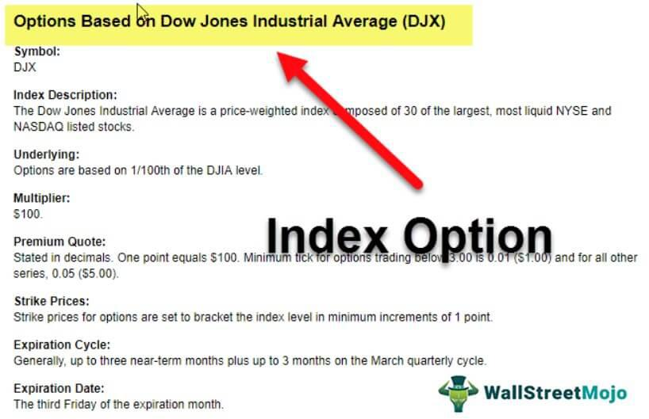

In the evolving world of finance, investment instruments have been developed to address varying investor needs. Among these, index options have become prominent as a distinctive derivative product. These options enable investors to trade the movements of substantial market indices, such as the S&P 500, without directly acquiring individual stocks.

Index options offer several benefits, primarily providing a tool to track and trade on the overall market performance, rather than focusing on the specific performance of individual stocks. Investors can manage risk more effectively or speculate on market directions, depending on their strategy and risk appetite. This feature is particularly advantageous when engaging with large, diversified indices that represent the broader economy. 



By using index options, investors can also leverage the dynamic nature of option contracts. These contracts have a defined structure, including elements such as strike price, expiration date, and premium, which enable diverse strategies based on the investor's market outlook. Additionally, the growing field of algorithmic trading is increasingly being integrated into index options trading, enhancing decision-making through advanced data analysis and high-speed execution.

Overall, index options serve as a valuable tool for accessing and investing in broad market indices, offering flexibility, risk management, and diverse strategic opportunities. With continuous advancements and the incorporation of sophisticated technologies, the future of index options trading is poised to become more efficient and accessible to a broader range of investors.

## Table of Contents

## Understanding Index Options

An index option is a derivative financial instrument that bases its value on a specified benchmark index. Unlike stock options, which are tied to individual stocks, index options offer investors a mechanism to wager on or protect against market movements as reflected in major indices such as the S&P 500 or the Nasdaq Composite. The unique attribute of these options is that they track the collective performance of a wide range of assets, thereby enabling investors to take positions on broad market trends without owning the actual stocks within the index.

Investors utilize index options to speculate on the directional moves of these indices. For instance, an investor who anticipates a market rise might purchase a call option on the index. Alternatively, to protect an existing portfolio from market downturns, an investor can acquire a put option, which appreciates in value as the index declines, providing a hedge against losses.

A distinguishing feature of index options is their cash-settlement aspect. Upon exercise, particularly at expiration, rather than delivering physical stocks or commodities, the transactions are settled in cash. This is based on the difference between the index level at expiration and the option's strike price. Mathematically, the payoff for a call option at expiration is calculated as:

$$
\text{Payoff for a call} = \max(0, \text{Index Level} - \text{Strike Price})
$$

Similarly, for a put option, the payoff is:

$$
\text{Payoff for a put} = \max(0, \text{Strike Price} - \text{Index Level})
$$

Another important characteristic is that most index options are European-style, which implies that they can only be exercised at their expiry date, not before. This differentiates them from American-style options, which can be exercised at any point before expiration. The European-style nature offers a streamlined approach that aligns with the objectives of macro-level market engagement rather than individual stock performance.

By capturing the aggregated movements of the market, index options offer the dual capacity for speculation and risk management on a macroeconomic scale. Their structure provides a versatile tool for investors to exploit broad market movements while mitigating certain risks inherent in traditional stock holdings.

## The Role of Benchmark Indices

Benchmark indices such as the S&P 500, Dow Jones Industrial Average, and Nasdaq Composite play a critical role in the functioning of index options. These indices are instrumental in tracking the performance of a specific set of companies, offering valuable insights into broader market trends. The S&P 500, for example, comprises 500 of the largest companies listed on stock exchanges in the United States and is widely regarded as one of the best representations of the U.S. stock market. Similarly, the Dow Jones Industrial Average is a price-weighted index that includes 30 significant publicly traded companies, providing a snapshot of the economic health of industrial sectors. The Nasdaq Composite, which includes over 3,000 stocks, is heavily weighted towards technology companies, serving as a barometer for the tech industry.

Investors leverage these benchmark indices to utilize options for speculating on macroeconomic movements and hedging against market [volatility](/wiki/volatility-trading-strategies). By aligning their investment strategies with the movements and trends of these indices, investors can better position themselves to capitalize on economic cycles. For instance, if an investor believes that the technology sector will outperform due to a favorable macroeconomic environment, they might use options on the Nasdaq Composite to potentially increase returns. Conversely, if an investor anticipates a downturn in the market, index options can offer a way to hedge portfolios and minimize potential losses.

This strategic utilization of benchmark indices enables investors to make informed decisions based on comprehensive market data, enhancing their ability to navigate complex financial landscapes. By aligning their positions with the underlying trends, investors can effectively use index options as a tool for managing risk and optimizing returns.

## Structure of Option Contracts

Option contracts on indices, unlike those on individual stocks, involve specific components that make them unique in terms of structure and execution. These components include the strike price, expiration date, and premium, all of which are integral to the functioning of the contract.

### Strike Price

The strike price in an index option is the predetermined price at which the holder of the option can buy (call option) or sell (put option) the underlying index at expiration. For instance, if a trader anticipates that an index currently valued at 1500 will rise, they might purchase a call option with a strike price close to this anticipated level, say 1550, which would be profitable if the index rises above 1550 before expiration.

### Expiration Date

The expiration date is the date on which the option contract expires and must be settled. Unlike American-style options, which can be exercised at any time before expiration, index options are typically European-style, implying they can only be exercised on the expiration date. This feature is essential for managing expectations and strategic planning around the expiry cycle.

### Premium

The premium is the price paid by the buyer to the seller to acquire the option. It is determined by various factors including the volatility of the index, time to expiration, current index value relative to the strike price, and interest rates. The premium represents the market's consensus on the potential future movement of the index, encompassing both intrinsic value and time value.

### Cash Settlement

Unlike stock options, index options do not entail the physical delivery of the underlying asset. Instead, they are settled in cash. Upon expiration, the difference between the market index value and the strike price (multiplied by the contract's multiplier) determines the amount to be settled. Cash settlement simplifies the settlement process and avoids the logistical challenge of transferring a basket of stocks equivalent to the index.

### Contract Multiplier

The contract multiplier is a key element in index options that scales the value of the option contract, typically set at 100. For example, if an index option is valued at $20, the actual monetary value of the contract is $20 x 100 = $2,000. This multiplier affects both the cost of entering a position and the potential profits or losses, making it a critical [factor](/wiki/factor-investing) for traders to consider.

In essence, understanding these components is crucial for anyone looking to engage in index options trading. Proper knowledge of how strike prices, expiration dates, premiums, and the contract multiplier interact can significantly impact the strategies employed and the outcomes achieved in options trading.

## Advantages of Index Options

Index options offer a range of advantages to investors, primarily due to their inherent diversification properties. By encompassing a broad market index or sector, these options allow investors to gain exposure to a wide array of stocks without needing to purchase each one individually. This diversification reduces the idiosyncratic risk associated with holding individual stocks, as the performance of any single company has a limited impact on the overall value of the index.

Furthermore, index options provide investors with cost-effective means to hedge against market downturns or to speculate on macroeconomic trends. By using options, investors can protect their portfolios from falling markets by limiting potential losses while maintaining the possibility of [earning](/wiki/earning-announcement) profits from favorable movements. For instance, during a market downturn, purchasing a put option on an index can offset losses in an investor's equity portfolio, effectively acting as an insurance policy.

Another significant advantage of index options lies in their favorable tax treatment under the 60/40 rule, applicable in certain jurisdictions like the United States. Under this rule, profits from index options are taxed as 60% long-term capital gains and 40% short-term capital gains, irrespective of the holding period. This tax treatment can lead to substantial savings for investors, particularly those in higher tax brackets. For instance, if an investor makes $10,000 in profit from index options, $6,000 would be taxed at the lower long-term capital gains rate, and $4,000 at the short-term rate. The effective tax rate is thus reduced compared to other forms of investment income, making index options an attractive proposition for tax-savvy investors.

These attributes collectively make index options a versatile and appealing investment tool, providing broad market exposure, hedging capabilities, and tax efficiencies.

## Popular Trading Strategies with Index Options

Index options are versatile tools in financial markets, offering a range of strategies that can align with various investment goals and market conditions. Common strategies involve straightforward bullish or bearish bets, while others are designed to exploit market volatility irrespective of the market direction.

### Long Calls and Puts

A long call option strategy involves purchasing call options, providing the investor the right, but not the obligation, to buy the underlying index at a specified strike price before expiration. This strategy is typically employed when an investor anticipates a rise in the index. Conversely, a long put option offers the right to sell the index, suitable for bearish outlooks.

### Covered Calls

The covered call strategy combines the purchase of the underlying index (or a proxy such as an index fund) with the sale of call options on the same index. This strategy aims to generate additional income (through the option premium) while holding a long position in the underlying asset. It's particularly beneficial when expectations are for a modest uptick in the index or during sideways market conditions.

### Protective Puts

Protective puts involve purchasing a put option for an index that an investor already owns or has invested in. This strategy provides downside protection, as the put option gains value if the index declines, offsetting losses on the underlying investment. It's akin to an insurance policy on the investment, especially useful in uncertain markets.

### Advanced Strategies: Straddles and Strangles

For investors seeking to capitalize on volatility, regardless of the market direction, straddles and strangles offer intriguing possibilities.

- **Straddle Strategy**: This involves buying both a call and a put option on the same index, with the same strike price and expiration date. The straddle benefits from significant price movements in either direction. The profitability driver here is volatility; hence, investors engage in this strategy when they expect considerable market swings.

- **Strangle Strategy**: Similar to the straddle, a strangle involves purchasing a call and a put option. However, the call and put have different strike prices, with the call strike above and the put strike below the current index level. This strategy is typically cheaper than a straddle due to the out-of-the-money options but still benefits from volatility.

### Flexibility for Market Outlooks

Index options provide flexibility by allowing investors to tailor their exposure based on market outlooks. Strategies such as straddles and strangles accommodate scenarios where direction is uncertain but volatility is anticipated, making them versatile tools in an investor's arsenal. Furthermore, these strategies can be adapted to leverage market movements, whether bullish or bearish, enhancing their applicability across varying market environments.

## The Impact of Algorithmic Trading

Algorithmic trading, often referred to as algo trading or automated trading, has significantly changed how trades are executed in financial markets, including the market for index options. By utilizing pre-programmed algorithms, traders can execute large orders at considerably high speeds and with a precision that surpasses traditional trading methods. This transformation is underpinned by the capacity to process vast datasets and generate trading signals based on complex mathematical models.

**Benefits of Algorithmic Trading in Index Options**

One of the main advantages of [algorithmic trading](/wiki/algorithmic-trading) in the context of index options is efficiency. Automated systems enable the simultaneous assessment of multiple indices and option contracts, which would be unattainable manually. This capability allows traders to capitalize on fleeting opportunities by swiftly analyzing market conditions and executing trades with minimal latency.

Algorithmic trading also enhances the accuracy of trades. Algorithms can be designed to factor in a wide array of data points, from historical price movements to real-time market news, reducing human error and bias. By simulating thousands of possible scenarios and executing trades that align with optimized parameters, traders can achieve outcomes that closely align with their strategic objectives.

For example, consider an index option trader utilizing a mean-reversion strategy. The trader can deploy an algorithm that identifies when an index diverges significantly from its historical mean and triggers trades to take advantage of expected reversions to the mean. Such a strategy could be coded in Python as follows:

```python
import numpy as np

# Sample data: index values
index_values = np.array([3200, 3210, 3190, 3240, 3225])

# Calculate the historical mean
historical_mean = np.mean(index_values)

# Determine trading signal
def trading_signal(current_value):
    if current_value < historical_mean:
        return "Buy Index Option"
    elif current_value > historical_mean:
        return "Sell Index Option"
    else:
        return "Hold Position"

# Example usage
current_index_value = 3180
signal = trading_signal(current_index_value)
print(signal)  # Output: Buy Index Option
```

**Challenges of Algorithmic Trading in Index Options**

Despite its benefits, algorithmic trading also brings forth certain challenges. Market volatility can sometimes render algorithms less effective if they have not been adjusted to accommodate unexpected market conditions. Additionally, the reliance on past data to predict future movements can be problematic if the underlying assumptions fail to hold in turbulent markets.

Moreover, the prevalence of algorithmic trading raises concerns about market fairness and stability. The speed at which these algorithms operate can lead to market phenomena such as flash crashes, where prices plummet and recover at extremely rapid rates, often resulting in losses for those not equipped with similar technology.

Furthermore, the sophisticated nature of developing and maintaining these systems necessitates a high level of expertise in quantitative analysis and technical infrastructure. As such, there is a considerable barrier to entry for individual investors or smaller firms without access to significant technological resources.

In conclusion, while algorithmic trading has undeniably revolutionized the trading of index options by increasing efficiency and accuracy, it is imperative for participants to remain vigilant about the inherent risks and potential market impacts associated with its widespread use.

## Conclusion

Index options serve as a significant financial instrument, allowing investors to effectively interact with major market indices without directly dealing in individual stocks. They provide unique advantages, including diversification and strategic flexibility, enhancing the potential of any investment portfolio. By appropriately leveraging index options with a thorough understanding and well-considered strategies, investors can capitalize on market trends and hedges, benefiting from their favorable taxation treatment and the efficiency of cash settlement.

The evolution of algorithmic trading is poised to further transform the trading landscape for index options. As technology advances, algorithmic trading systems can offer increased speed, accuracy, and the ability to analyze massive datasets, making them an indispensable tool for navigating complex markets. This technology supports sophisticated trading strategies that can adapt to a wide range of market situations, thus optimizing the execution of trades and minimizing costs. Future developments in algorithmic trading promise to enhance the precision and efficacy of index options trading, potentially leading to greater market accessibility and fewer barriers for investors.

By integrating index options into their investment strategies, investors can leverage the insights provided by market indices and exploit algorithmic trading advancements. As such, these options represent a promising avenue for achieving comprehensive market engagement and strategic portfolio enhancement.

## FAQs

**What are the risks associated with index options?**

Index options, like all investments, come with specific risks. One of the primary risks is market risk, as index options are inherently tied to market indices. If the market moves in an unexpected direction, it can lead to significant losses. Additionally, because these options are typically European-style, they can only be exercised at expiration, which means investors cannot react to interim events that might affect the index's performance. Another risk is the potential for large losses with certain trading strategies, especially those involving short positions. Finally, [liquidity](/wiki/liquidity-risk-premium) risk can also arise if there is a lack of buyers or sellers in the market, potentially leading to increased costs due to larger bid-ask spreads.

**How are index options different from stock options?**

Index options are distinct from stock options in several key aspects. Firstly, the underlying asset of an index option is a market index, such as the S&P 500, rather than an individual stock. This means index options provide exposure to broader market movements instead of the price changes of single companies. Secondly, index options are typically cash-settled, as there is no physical delivery of the asset, whereas stock options usually involve the delivery or receipt of the underlying stock. Additionally, index options are often European-style, meaning they can only be exercised at expiration, compared to stock options, which can be American-style and exercised at any time before expiration. Finally, index options can offer favorable tax treatment under the 60/40 rule, where 60% of gains are treated as long-term capital gains and 40% as short-term, regardless of the holding period. 

**Can index options be exercised before the expiration date?**

No, index options are typically European-style options, which means they can only be exercised at their expiration date. This is different from American-style options, which allow the holder to exercise the option at any time before expiration. The European-style nature of index options necessitates that traders plan their strategies around the expiration date, taking into account anticipated market movements and making adjustments through secondary market transactions, such as buying or selling options, rather than exercising the options themselves.

## References & Further Reading

[1]: McMillan, L. G. (2002). ["Options as a Strategic Investment"](https://www.amazon.com/Options-Strategic-Investment-Lawrence-McMillan/dp/0735201978). Prentice Hall Press.

[2]: Hull, J. C. (2018). ["Options, Futures, and Other Derivatives"](https://www.semanticscholar.org/paper/Options%2C-Futures%2C-and-Other-Derivatives-Hull/89bdee500c8623864fc9eb7a471546aa713acc44). Pearson.

[3]: Chance, D. M., & Brooks, R. (2015). ["An Introduction to Derivatives and Risk Management"](https://archive.org/details/introductiontode0000chan_m1l1). Cengage Learning.

[4]: Fabozzi, F. J., Fuss, R., & Kolm, P. N. (2010). ["Handbook of Quantitative Finance and Risk Management"](https://onlinelibrary.wiley.com/doi/book/10.1002/9781119202172). Springer.

[5]: Black, F., & Scholes, M. (1973). ["The Pricing of Options and Corporate Liabilities."](https://www.cs.princeton.edu/courses/archive/fall09/cos323/papers/black_scholes73.pdf) Journal of Political Economy, 81(3), 637-654.

[6]: Lopez de Prado, M. (2018). ["Advances in Financial Machine Learning"](https://www.amazon.com/Advances-Financial-Machine-Learning-Marcos/dp/1119482089). John Wiley & Sons.

[7]: Chan, E. (2009). ["Quantitative Trading: How to Build Your Own Algorithmic Trading Business"](https://github.com/ftvision/quant_trading_echan_book). Wiley.