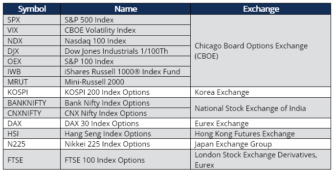

## Table of Contents

## What are index options and how do they differ from stock options?

Index options are financial contracts that give you the right, but not the obligation, to buy or sell a specific stock market index at a set price before a certain date. These indexes, like the S&P 500 or the Dow Jones, represent a basket of stocks, so when you trade index options, you're not betting on one company but on the overall performance of a group of companies. This can be a way to hedge against market movements or to speculate on where you think the market is headed.

Stock options, on the other hand, are similar contracts but they are tied to the performance of a single company's stock. When you buy a stock option, you're making a bet on the future price of that specific stock. This can be riskier than index options because the fortunes of one company can be more volatile than a diversified index. However, it also means that if you have good information about a company, you might be able to make a bigger profit with stock options than with index options.

## Which benchmark indices are commonly used for index options?

Some of the most popular benchmark indices for index options are the S&P 500, the Dow Jones Industrial Average, and the Nasdaq-100. The S&P 500 is made up of 500 large companies and is a good way to measure the overall health of the U.S. stock market. The Dow Jones Industrial Average, often just called the Dow, includes 30 big companies and is another widely watched indicator of the market's performance. The Nasdaq-100 focuses on the 100 largest non-financial companies listed on the Nasdaq stock exchange, which often includes many technology firms.

These indices are used for index options because they give investors a way to bet on or protect against the movement of the whole market or specific sectors. For example, if you think the tech sector is going to do well, you might buy options on the Nasdaq-100. Or, if you're worried about a general market downturn, you might buy options on the S&P 500 to hedge your investments. This can be less risky than betting on individual stocks because these indices are diversified across many companies.

## How are index options priced and what factors influence their price?

Index options are priced based on a few key factors. The main one is the current value of the index they're tied to, like the S&P 500. If the index goes up, the price of the options usually goes up too. Another big [factor](/wiki/factor-investing) is how much time is left until the options expire. The more time there is, the more the option might be worth because there's more chance for the index to move in a way that benefits the option holder. Also, the expected ups and downs of the index, called [volatility](/wiki/volatility-trading-strategies), play a role. If people think the index will swing a lot, the options might cost more because there's a bigger chance of making a big profit or loss.

Other things can affect the price of index options too. One is the [interest rate](/wiki/interest-rate-trading-strategies), which can change how much it costs to hold onto the option until it expires. Another is any dividends that the stocks in the index might pay out, which can affect the overall value of the index. Finally, the general mood of the market can push option prices up or down. If everyone's feeling optimistic, they might be willing to pay more for options. But if people are worried, they might want to buy options to protect themselves, which can also drive up the price.

## What are the basic strategies for trading index options?

One basic strategy for trading index options is called buying calls. This means you're betting that the index will go up. You pay a certain amount, called a premium, to buy the right to buy the index at a set price before a certain date. If the index goes up a lot, you can make money by buying the index at the lower price you locked in and then selling it at the higher market price. But if the index doesn't go up, you just lose the premium you paid.

Another strategy is buying puts. This is when you think the index will go down. You pay a premium to get the right to sell the index at a set price before a certain date. If the index drops a lot, you can buy it at the lower market price and then sell it at the higher price you locked in, making a profit. If the index doesn't go down, you lose the premium. Both of these strategies can be used to make money or to protect other investments you have.

A third strategy is selling options, either calls or puts. When you sell a call, you're betting that the index won't go up much, and you get to keep the premium if you're right. If you sell a put, you're betting the index won't go down much, and again, you keep the premium if you're right. But selling options can be riskier because if the index moves against you, you might have to buy or sell the index at a bad price. This strategy can be used to make extra income from your investments, but it's important to understand the risks involved.

## How can index options be used for hedging purposes?

Index options can be a good tool for hedging because they let you protect your investments from big drops in the market. If you own a lot of stocks and you're worried that the market might go down, you can buy put options on an index like the S&P 500. These options give you the right to sell the index at a set price, even if the market goes down a lot. This can help limit your losses because you can sell your stocks at the higher price you locked in with the put options, instead of the lower market price.

Another way to use index options for hedging is by buying call options if you're worried about missing out on a market rise. If you have a lot of money in bonds or cash and you think the stock market might go up, you can buy call options on an index. These options give you the right to buy the index at a set price, so if the market does go up, you can buy the index at the lower price and sell it at the higher market price. This way, you can still make money from a rising market without having to sell your bonds or use all your cash to buy stocks.

## What are the tax implications of trading index options?

When you trade index options, you need to know about the taxes you might have to pay. The money you make from index options is usually treated as capital gains. If you hold the options for less than a year before selling them, the gains are short-term and taxed at your regular income tax rate. But if you hold them for more than a year, the gains are long-term and taxed at a lower rate, which can be 0%, 15%, or 20% depending on your income.

There's also something called the wash-sale rule that can affect your taxes. If you sell an index option at a loss and then buy a similar option within 30 days, you can't use that loss to lower your taxes right away. Instead, you have to add the loss to the cost of the new option. This rule is meant to stop people from selling something at a loss just to get a tax break and then buying it right back. So, it's important to keep track of when you buy and sell your options to make sure you're following the rules and not missing out on any tax benefits.

## How do settlement procedures for index options work?

When you trade index options, the settlement process is a bit different from stock options. For index options, most of the time, you don't actually buy or sell the index itself. Instead, you settle in cash. This means that if you have an option that's in the money when it expires, you'll get paid the difference between the index's value and the strike price of your option. For example, if you have a call option with a strike price of 3000 and the index closes at 3100, you'll get $100 for each option you own.

The settlement usually happens on the day after the option expires. This is called the expiration date, and it's important to know when this is because it affects when you get your money. The options exchange figures out how much you're owed based on the final value of the index at the close of trading on the expiration day. They then make sure the money gets to your account. This whole process is automatic and handled by the exchange, so you don't have to do much except make sure your account details are up to date.

## What are the differences between American and European style index options?

American style index options give you more freedom. You can choose to use your option, or "exercise" it, at any time before it expires. This means if you think it's a good time to make money or protect your investments, you can do it right away. For example, if you have a call option and the index goes up a lot, you can exercise it early to buy the index at the lower price you locked in. But remember, exercising early might not always be the best move because you lose the chance to make more money if the index keeps going up.

European style index options are a bit stricter. You can only exercise them on the day they expire, not before. This can be good if you want to plan ahead because you know exactly when you'll find out if you made money or not. For example, if you have a put option and you think the index will go down by the expiration date, you can wait until then to see if you're right. But if the index goes down a lot before the expiration date, you can't do anything about it until the end, which might be frustrating if you want to act sooner.

## How does the volatility of an index affect the pricing of its options?

When people talk about the volatility of an index, they mean how much the index's value goes up and down over time. If an index is very volatile, it means it can change a lot in a short time. This volatility is a big deal for the price of index options because it affects how risky the options are. When an index is more volatile, there's a bigger chance that the options could end up being worth a lot of money. Because of this, people are usually willing to pay more for the options, so the price goes up.

On the other hand, if an index is not very volatile, it means its value doesn't change much. This makes the options less risky because there's less chance of big swings in the index's value. When options are less risky, people don't want to pay as much for them, so the price goes down. So, in simple terms, the more an index jumps around, the more expensive its options will be, and the less it moves, the cheaper the options will be.

## What are the risks associated with trading index options?

Trading index options can be risky because the market can go up and down a lot. If you buy a call option and the index doesn't go up, you can lose all the money you paid for the option. The same thing happens if you buy a put option and the index doesn't go down. Also, if you sell options, you can lose a lot more money than you made from selling them. This is because if the market moves against you, you might have to buy or sell the index at a bad price.

Another risk is that options have an expiration date. If the index doesn't move the way you want before that date, your option could expire worthless, and you lose your money. Also, trading options can be confusing, and if you don't understand them well, you might make bad choices. It's important to learn about options and maybe even talk to a financial advisor before you start trading them.

## How can advanced traders use index options for portfolio diversification?

Advanced traders can use index options to spread out their investments and lower the risk of losing money. Instead of putting all their money into one stock or a few stocks, they can use index options to bet on how a whole group of stocks will do. For example, if a trader owns a lot of tech stocks, they might buy put options on a tech index like the Nasdaq-100. This way, if the tech sector goes down, the put options can help make up for the money they lose on their stocks. It's like having insurance for their portfolio.

Another way advanced traders can use index options for diversification is by using them to get exposure to different parts of the market without buying a lot of different stocks. They can buy call options on different indexes, like the S&P 500 for big companies or the Russell 2000 for smaller ones. This lets them make money if those parts of the market go up, without having to buy all the individual stocks in those indexes. By using index options like this, traders can have a more balanced portfolio and not depend too much on any one stock or sector.

## What are some of the latest trends and innovations in the index options market?

One of the latest trends in the index options market is the growth of weekly options. These are options that expire every week instead of every month, which gives traders more chances to make money or protect their investments. Weekly options can be good for people who want to take advantage of short-term changes in the market. They're popular because they let traders react quickly to news or events that might move the market.

Another innovation is the introduction of options on new types of indexes. For example, there are now options on indexes that focus on things like environmental, social, and governance ([ESG](/wiki/esg-investing)) criteria. These options let traders bet on or protect against the performance of companies that meet certain ethical or sustainability standards. This is part of a bigger trend where more people want to invest in ways that match their values, and the options market is trying to meet that demand.

## What are Index Options and how can they be understood?

An index option is a derivative financial instrument that bases its value on a specified benchmark index. Unlike stock options, which are tied to individual stocks, index options offer investors a mechanism to wager on or protect against market movements as reflected in major indices such as the S&P 500 or the Nasdaq Composite. The unique attribute of these options is that they track the collective performance of a wide range of assets, thereby enabling investors to take positions on broad market trends without owning the actual stocks within the index.

Investors utilize index options to speculate on the directional moves of these indices. For instance, an investor who anticipates a market rise might purchase a call option on the index. Alternatively, to protect an existing portfolio from market downturns, an investor can acquire a put option, which appreciates in value as the index declines, providing a hedge against losses.

A distinguishing feature of index options is their cash-settlement aspect. Upon exercise, particularly at expiration, rather than delivering physical stocks or commodities, the transactions are settled in cash. This is based on the difference between the index level at expiration and the option's strike price. Mathematically, the payoff for a call option at expiration is calculated as:

$$
\text{Payoff for a call} = \max(0, \text{Index Level} - \text{Strike Price})
$$

Similarly, for a put option, the payoff is:

$$
\text{Payoff for a put} = \max(0, \text{Strike Price} - \text{Index Level})
$$

Another important characteristic is that most index options are European-style, which implies that they can only be exercised at their expiry date, not before. This differentiates them from American-style options, which can be exercised at any point before expiration. The European-style nature offers a streamlined approach that aligns with the objectives of macro-level market engagement rather than individual stock performance.

By capturing the aggregated movements of the market, index options offer the dual capacity for speculation and risk management on a macroeconomic scale. Their structure provides a versatile tool for investors to exploit broad market movements while mitigating certain risks inherent in traditional stock holdings.

## References & Further Reading

[1]: McMillan, L. G. (2002). ["Options as a Strategic Investment"](https://www.amazon.com/Options-Strategic-Investment-Lawrence-McMillan/dp/0735201978). Prentice Hall Press.

[2]: Hull, J. C. (2018). ["Options, Futures, and Other Derivatives"](https://www.semanticscholar.org/paper/Options%2C-Futures%2C-and-Other-Derivatives-Hull/89bdee500c8623864fc9eb7a471546aa713acc44). Pearson.

[3]: Chance, D. M., & Brooks, R. (2015). ["An Introduction to Derivatives and Risk Management"](https://archive.org/details/introductiontode0000chan_m1l1). Cengage Learning.

[4]: Fabozzi, F. J., Fuss, R., & Kolm, P. N. (2010). ["Handbook of Quantitative Finance and Risk Management"](https://onlinelibrary.wiley.com/doi/book/10.1002/9781119202172). Springer.

[5]: Black, F., & Scholes, M. (1973). ["The Pricing of Options and Corporate Liabilities."](https://www.cs.princeton.edu/courses/archive/fall09/cos323/papers/black_scholes73.pdf) Journal of Political Economy, 81(3), 637-654.

[6]: Lopez de Prado, M. (2018). ["Advances in Financial Machine Learning"](https://www.amazon.com/Advances-Financial-Machine-Learning-Marcos/dp/1119482089). John Wiley & Sons.

[7]: Chan, E. (2009). ["Quantitative Trading: How to Build Your Own Algorithmic Trading Business"](https://github.com/ftvision/quant_trading_echan_book). Wiley.