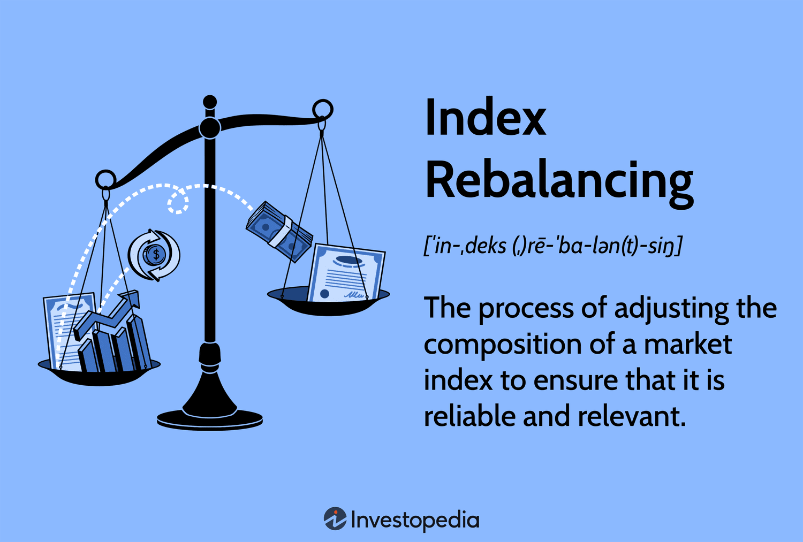

Index rebalancing refers to the process of realigning the weightings of a portfolio of assets. This is done by periodically buying or selling assets to maintain a desired level of asset allocation or risk. It is a critical component of a comprehensive investment strategy, which encompasses making decisions aimed at achieving specific financial goals, aligned with an investor's risk tolerance. Portfolio management is the science and art of selecting and overseeing a group of investments that meet the long-term financial objectives and risk tolerance of an investor. Lastly, algorithmic trading involves the use of computer algorithms to execute trading orders, often incorporating complex strategies at speeds and frequencies that are impossible for humans alone.

Index rebalancing is integral to a robust investment strategy because it ensures that a portfolio's risk profile remains consistent with an investor's objectives. Without regular rebalancing, a portfolio that initially aligned with the investor's risk tolerance and asset allocation preferences can drift due to market movements, potentially exposing the investor to unintended risks.



Algorithmic trading plays a pivotal role in index rebalancing by offering efficiency and precision. With algorithms, trades can be executed automatically based on pre-defined criteria, reducing human error and allowing for rapid adjustments in response to market changes. This is particularly beneficial in maintaining the balance of a portfolio in real-time, which might otherwise be cumbersome and time-consuming.

This article will explore the concepts of index rebalancing, investment strategy, portfolio management, and algorithmic trading. It aims to provide insights into why integrating these elements is beneficial for enhancing investment performance. We will discuss how to understand and implement index rebalancing, align it with investment strategies, leverage algorithmic trading for efficient rebalancing, develop strategic approaches using algorithms, and analyze the benefits and risks associated with algorithmic index rebalancing.

The benefits of adopting this multi-faceted approach include maintaining a portfolio aligned with risk preferences, optimizing return potential, and minimizing transaction costs. With the advent of advanced trading technologies, investors now have the opportunity to refine their strategies for superior performance, making this a critical area of focus for those looking to maximize their investment returns.

## Table of Contents

## Understanding Index Rebalancing

Index rebalancing refers to the process of realigning the weightings of a financial index to maintain and reflect the index's target allocation. It is a crucial operation to ensure that the investment goals continue to align with the investor's risk tolerance and financial objectives. Rebalancing is imperative because financial markets are subject to fluctuations, leading to shifts in the relative weightings of index components. Without rebalancing, an index can drift away from its original objectives, potentially increasing risk or diminishing returns.

Several factors necessitate index rebalancing. Market fluctuations are perhaps the most common [factor](/wiki/factor-investing), as prices of individual assets are continually changing. These fluctuations can lead to a misalignment of the intended allocation, thereby altering the risk profile of the index. Changes in investment objectives, such as moving toward more conservative or aggressive investment strategies, also require index rebalancing to realign with these new goals.

Indices can be broadly categorized into several types, pertinent to various investment strategies. Stock indices, like the S&P 500, track a specific set of equities and are instrumental for strategies focusing on equity markets. Bond indices, on the other hand, focus on fixed-income securities and are vital for strategies targeting income generation and risk reduction. Other indices, such as commodity indices or real estate indices, allow investors to gain exposure to various asset classes, each necessitating unique rebalancing considerations based on their inherent characteristics and market dynamics.

Timing and frequency are critical considerations in effective index rebalancing. Rebalancing too frequently can lead to increased transaction costs and potential short-term tax implications. Conversely, rebalancing too infrequently can cause the portfolio to deviate significantly from its target allocation, potentially increasing risk. Common strategies include periodic rebalancing, which occurs at regular intervals (such as quarterly or annually), and threshold rebalancing, which occurs when an asset's weighting drifts beyond a specific percentage from its target.

Real-world examples of rebalancing can be observed in major index funds. For instance, the S&P 500 index is reconstituted quarterly to account for changes such as mergers, bankruptcies, or shifts in a company's market capitalization. These adjustments ensure that the index remains a representative benchmark of the U.S. large-cap equity market. The Russell indices also undergo annual rebalancing, which involves re-ranking companies to reflect the broad U.S. equity market accurately.

In summary, index rebalancing is a vital component of maintaining alignment with investment goals amid ever-changing market conditions. By understanding the factors that necessitate rebalancing, the types of indices, and the timing considerations involved, investors can better manage their portfolios to achieve desired outcomes.

## Investment Strategy and Portfolio Management

Investment strategy is fundamentally about aligning investment choices with the investor's specific goals and risk tolerance. This alignment ensures that the investment approach effectively meets the financial objectives while respecting the investor's comfort with risk exposure. Typically, a well-defined investment strategy begins with identifying the desired outcomes, such as growth, income, or preservation of capital, and evaluates how much risk is acceptable to achieve these outcomes. Once these parameters are established, the strategy can guide decisions regarding asset allocation, diversification, and other critical factors in portfolio construction.

A well-balanced portfolio is crucial for achieving long-term investment success. It mitigates risk by distributing investments across a variety of asset classes, each of which may behave differently under the same economic conditions. This balance is achieved by considering factors such as expected returns, [volatility](/wiki/volatility-trading-strategies), and correlation between asset classes. The idea is to create a mix that maximizes return potential while minimizing risk, respecting the investor's risk tolerance. For instance, a combination of stocks, bonds, and other asset classes can provide a buffer against market downturns, as these assets typically react differently to market conditions.

Diversification plays a pivotal role in portfolio management by spreading investments across various sectors, geographic regions, and investment vehicles. This strategy reduces the impact of a poor-performing asset on the entire portfolio, thereby decreasing overall risk. For example, during a downturn in the technology sector, strong performance in sectors such as healthcare or consumer staples could offset potential losses. The aim of diversification is to enhance returns while reducing volatility and risk in the portfolio.

Index rebalancing connects directly to broader investment strategies by maintaining the desired allocation among asset classes. As market values fluctuate, the allocation of assets can drift from the original plan. Rebalancing involves realigning the weightings of a portfolio periodically, selling assets that have performed well and buying those that have underperformed, to return to the target allocation. This process not only helps in maintaining the desired level of risk but also ensures adherence to the predetermined investment strategy.

To construct a robust portfolio that incorporates rebalancing principles, consider the following tips:

1. **Set Clear Objectives**: Define clear financial goals and the time horizon for investments to determine appropriate risk levels and asset classes.

2. **Diversify Wisely**: Include a mix of asset classes that complement each other to reduce overall risk. Consider factors such as market capitalization, sectors, and geographic locations.

3. **Establish a Rebalancing Schedule**: Determine a regular schedule for reviewing and adjusting the portfolio, such as quarterly or annually, or set thresholds for asset class deviations that trigger rebalancing.

4. **Evaluate and Adjust**: Continuously evaluate the performance of assets and adjust the portfolio as necessary to remain aligned with the financial goals and risk parameters.

5. **Leverage Technology**: Use algorithmic tools and software to track the portfolio's performance efficiently and implement rebalancing strategies with precision, reducing the emotional bias that can accompany manual intervention.

By adhering to these principles, investors can create a resilient portfolio that not only aligns with their investment strategy but is also positioned to adapt to market changes while striving for long-term financial goals.

## Role of Algorithmic Trading in Index Rebalancing

Algorithmic trading refers to the use of computer programs and software to execute trades in financial markets, leveraging mathematical models and complex algorithms to determine the best timing, price, and quantity for buying or selling assets. The increasing influence of [algorithmic trading](/wiki/algorithmic-trading) in financial markets is largely due to the rapid processing speeds, accuracy, and data analysis capabilities that surpass human capabilities.

Algorithms facilitate efficient and precise index rebalancing by systematically adjusting the composition of an investment portfolio to align with predefined criteria, such as target asset allocation or risk exposure. This automation allows for timely execution of trades based on real-time market data and conditions, ensuring that the portfolio remains aligned with the investor's objectives.

One of the primary benefits of algorithmic trading is its ability to execute trades with speed and accuracy. Algorithms can assess vast amounts of market data, identify trading opportunities, and execute orders in milliseconds. This speed reduces the likelihood of slippage, wherein the price at which a trade is executed deviates from the expected price, and minimizes the impact of human error, enhancing overall trading efficiency.

The development of rebalancing algorithms involves sophisticated technology and comprehensive data analysis. Techniques such as [machine learning](/wiki/machine-learning) and [artificial intelligence](/wiki/ai-artificial-intelligence) are increasingly utilized to create more adaptive and intelligent algorithms. Python is often the programming language of choice due to its robust libraries for data analysis and machine learning, such as pandas and scikit-learn. These algorithms can analyze historical and real-time data to predict market trends and inform rebalancing decisions.

For instance, a simple rebalancing algorithm in Python might look like this:

```python
import pandas as pd

def rebalance_portfolio(current_weights, target_weights, prices):
    port_value = sum(current_weights[key] * prices[key] for key in current_weights)
    target_values = {key: port_value * target_weights[key] for key in target_weights}

    trades = {key: target_values[key] / prices[key] - current_weights[key] for key in current_weights}
    return trades

# current portfolio and prices
current_weights = {'Stock_A': 100, 'Stock_B': 50}
target_weights = {'Stock_A': 0.6, 'Stock_B': 0.4}
prices = {'Stock_A': 150, 'Stock_B': 200}

trades = rebalance_portfolio(current_weights, target_weights, prices)
```

Case studies demonstrate how algorithmic trading has improved rebalancing efficiency and outcomes. For example, major financial institutions have implemented algorithmic strategies to rebalance mutual funds and exchange-traded funds (ETFs) efficiently. Vanguard, a prominent asset management firm, employs algorithms to maintain the intended balance in its index funds, minimizing transaction costs and optimizing tax efficiency.

In summary, algorithmic trading plays an instrumental role in index rebalancing, offering significant advantages in terms of speed, accuracy, and efficiency. The use of sophisticated technology and data analysis techniques enables the creation of algorithms capable of seamlessly restoring and maintaining portfolio balance, ultimately enhancing investment performance.

## Developing a Rebalancing Strategy with Algorithms

Developing an algorithmic index rebalancing strategy involves several systematic steps aimed at optimizing portfolio performance through precise and timely adjustments. This process leverages technological tools and data-driven insights to maintain alignment with investment objectives.

### Step-by-Step Guide to Developing an Algorithmic Rebalancing Strategy

#### 1. Define Objectives and Constraints
The initial step in developing an algorithmic rebalancing strategy is to clearly define the investment objectives, risk tolerance, and any constraints. Objectives may include targeting a specific return, maintaining asset allocation proportions, or minimizing risk. Constraints might involve regulatory requirements, transaction limits, or [liquidity](/wiki/liquidity-risk-premium) considerations.

#### 2. Choose an Appropriate Algorithmic Framework
Algorithms can range from simple threshold-based models to more complex machine learning techniques. Commonly used approaches include:

- **Threshold Rebalancing:** This method triggers rebalancing when asset weights deviate from predetermined thresholds.
- **Periodic Rebalancing:** Adjustments occur at defined intervals, such as monthly or quarterly.
- **Optimization Models:** Techniques like Mean-Variance Optimization can be applied to balance risk and return.

An example of a threshold-based algorithm can be implemented as follows:

```python
def threshold_rebalancing(portfolio, target_allocation, threshold):
    for asset, current_weight in portfolio.items():
        target_weight = target_allocation[asset]
        deviation = abs(target_weight - current_weight)
        if deviation > threshold:
            portfolio[asset] = target_weight
    return portfolio
```

#### 3. Select Tools and Platforms
Several platforms offer robust environments for algorithmic trading and rebalancing. Some commonly used tools include:

- **MetaTrader and TradeStation**: Popular platforms with scripting capabilities for developing custom trading algorithms.
- **Python Libraries (e.g., `pandas`, `NumPy`, `PyPortfolioOpt`)**: These libraries offer extensive data analysis and optimization functionalities essential for developing and back-testing algorithms.
- **QuantConnect and Interactive Brokers**: Enable the execution and back-testing of strategies in live market conditions with real-time data.

#### 4. Back-Testing with Historical Data
Back-testing is crucial for validating the effectiveness of a rebalancing strategy. It involves simulating the strategy using historical market data to assess performance under various market conditions. A key metric to evaluate during back-testing is the Sharpe Ratio, which measures risk-adjusted returns.

```python
def backtest_strategy(strategy, historical_data):
    for period in historical_data:
        portfolio = strategy.execute(period)
    return calculate_performance_metrics(portfolio)
```

#### 5. Address Potential Challenges
Implementing an algorithmic rebalancing strategy presents several challenges, such as:

- **Data Quality:** Ensuring access to accurate and comprehensive historical and real-time data is essential.
- **Model Complexity:** Overfitting models to past data can result in poor performance in unseen market conditions.
- **Execution Risks:** Slippage and transaction costs can erode expected returns, necessitating strategies for minimizing these impacts.

#### 6. Examples of Successful Strategies
Successful rebalancing strategies often share common components like robust risk management and adaptability to changing market conditions. A notable example includes strategies employing Artificial Intelligence (AI) to dynamically adjust rebalancing thresholds based on predictive analytics.

### Conclusion
By integrating algorithmic efficiency and rigorous back-testing with clearly defined investment objectives, rebalancing strategies can achieve precise and consistent investment outcomes. Despite challenges, the use of sophisticated tools and models can significantly enhance the rebalancing process, leading to improved portfolio performance.

## Benefits and Risks of Algorithmic Index Rebalancing

Algorithmic trading, when combined with index rebalancing, offers several significant advantages that refine and enhance investment strategies. One of the primary benefits of this synergy is the substantial reduction in human error. By automating the decision-making process, algorithmic systems can execute rebalancing tasks with precision and consistency, adhering strictly to predefined parameters and rules. This automation ensures that emotional bias, a common pitfall in manual trading, is removed from the equation, allowing for more objective and disciplined adherence to investment strategies.

Moreover, algorithmic index rebalancing offers improved efficiency in processing large volumes of data and executing trades swiftly. In scenarios where markets are highly volatile or require rapid response times, algorithms can assess and react to market conditions far quicker than human traders, securing optimal trade executions. This capability is invaluable in enhancing portfolio performance, as it allows investors to capitalize on short-lived market inefficiencies and price discrepancies.

Despite its benefits, algorithmic index rebalancing carries certain risks. One such risk is the potential for over-optimization, where algorithms are excessively fine-tuned to past market data, leading to strategies that may not perform well under future market conditions. This risk can be mitigated by ensuring robust back-testing processes that include diverse market scenarios and stress testing. Additionally, the reliance on technology introduces operational risks related to system failures or cyber threats. Investors should implement comprehensive risk management protocols, including redundancies and cybersecurity measures, to safeguard against these vulnerabilities.

Algorithmic rebalancing is especially beneficial in scenarios where frequent adjustments to the portfolio are necessary due to dynamic asset price movements or changing market indices. For example, in rapidly fluctuating markets, algorithms can quickly adjust asset weights to maintain alignment with investment objectives.

One impact to consider is how algorithmic trading affects transaction costs. Although automation can reduce the cost per trade through efficiency gains, the increased frequency of trading activity necessitated by constant rebalancing could raise overall transaction costs. To balance this, investors should optimize their algorithms to focus on rebalancing actions that yield the most substantial benefit relative to cost, potentially using techniques like threshold rebalancing to limit unnecessary trades.

Continued monitoring and adjustment of algorithmic strategies are critical to maintaining their effectiveness. Market conditions, technological advancements, and data availability are subject to change, necessitating regular updates and refinements to the algorithms employed. By proactively adjusting strategies, investors can ensure that their rebalancing approach remains relevant and optimized for current market environments, ultimately supporting sustained investment success.

## Conclusion

In conclusion, the integration of algorithmic trading with index rebalancing and portfolio management represents a transformative approach to maximizing investment performance. The synergy between these elements allows investors to navigate the complexities of modern financial markets with precision and efficiency. Through algorithmic trading, investors can execute trades at high speed and with accuracy, reducing the potential for human error and taking advantage of optimal market conditions. This is particularly beneficial in the context of index rebalancing, where adjustments must be timely and in alignment with investment objectives.

As financial markets become increasingly data-driven, the adoption of advanced strategies such as algorithmic trading and systematic rebalancing becomes imperative for investors seeking to maintain a competitive edge. Embracing these approaches enables more sophisticated portfolio management, which is essential for achieving long-term investment success and resilience against market fluctuations.

Looking ahead, the future of algorithmic trading and index rebalancing is poised for significant growth. With advances in artificial intelligence and machine learning, algorithms will likely become even more adept at identifying market trends and executing complex rebalancing tasks. This evolution could further diminish transaction costs and improve overall investment returns, making it a compelling area for investor exploration.

For investors seeking to implement these strategies, several actionable steps can be taken. First, familiarize yourself with algorithmic trading platforms and tools, enhancing your understanding of their functionalities. Second, engage in extensive back-testing of potential rebalancing strategies using historical data to ensure their viability. Third, remain vigilant in monitoring and adjusting your strategies to adapt to changing market conditions and your evolving investment goals.

By embracing these advanced strategies, investors can enhance their portfolio's robustness, optimize returns, and position themselves advantageously within the rapidly evolving landscape of financial markets.

## References & Further Reading

[1]: ["Advances in Financial Machine Learning"](https://www.amazon.com/Advances-Financial-Machine-Learning-Marcos/dp/1119482089) by Marcos Lopez de Prado

[2]: ["Quantitative Trading: How to Build Your Own Algorithmic Trading Business"](https://www.amazon.com/Quantitative-Trading-Build-Algorithmic-Business/dp/1119800064) by Ernest P. Chan

[3]: ["Algorithmic Trading: Winning Strategies and Their Rationale"](https://www.wiley.com/en-us/Algorithmic+Trading%3A+Winning+Strategies+and+Their+Rationale-p-9781118460146) by Ernest P. Chan

[4]: ["Machine Learning for Algorithmic Trading"](https://github.com/stefan-jansen/machine-learning-for-trading) by Stefan Jansen

[5]: ["Evidence-Based Technical Analysis: Applying the Scientific Method and Statistical Inference to Trading Signals"](https://www.amazon.com/Evidence-Based-Technical-Analysis-Scientific-Statistical/dp/0470008741) by David Aronson