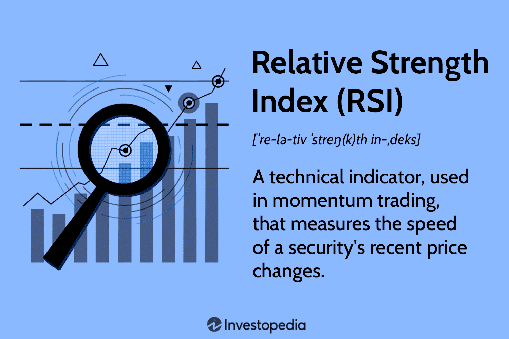

In the rapidly evolving world of finance, futures contracts and commodity trading are gaining significant attention, primarily due to their ability to secure future prices and manage financial risks effectively. These instruments play a crucial role in providing a hedge against price volatility for various market participants, including producers, consumers, and speculators. At the core of these strategies lies the index roll, a passive investment strategy designed to maintain a position within a financial index. This mechanism involves the regular transition from expiring futures contracts to more distant ones, allowing investors to sustain market exposure over time.

Algorithmic trading, with its foundation in advanced computing and real-time data analysis, has brought a transformative change to the financial landscape, particularly within the domain of futures contracts and commodity indices. The integration of algorithmic techniques has significantly enhanced the precision and efficiency of executing trades, minimizing manual intervention and human-driven errors. By leveraging sophisticated algorithms, traders can swiftly analyze vast datasets, identify market trends, and execute trades with remarkable speed and accuracy.



This article intends to explore the intricate relationships intertwining futures contracts, index rolls, and algorithmic trading within the commodity trading index. Understanding these elements and their interactions is crucial for participants seeking to navigate this complex and dynamic sector, optimize investment strategies, and effectively manage associated risks.

## Table of Contents

## Understanding Futures Contracts

Futures contracts represent binding agreements between two parties to buy or sell an underlying asset at a specified price on a future date. These contracts are essential components of modern financial markets, playing pivotal roles in maintaining liquidity, facilitating price discovery, and managing risk. 

Standardization in these agreements ensures that all contracts of the same type have the same delivery date, price, and quantity, which aids in enhancing market liquidity. This uniformity allows futures contracts to be easily traded on exchanges, fostering a high level of participation from diverse market entities. The active trading contributes to setting accurate market prices through continuous price discovery, which reflects the collective assessment of the asset's future value.

The function of futures contracts in risk management cannot be overstated. Market participants employ these contracts to hedge against potential adverse price movements of underlying assets. For example, an agricultural producer might use futures to lock in a price for their crop, thereby safeguarding against price declines. Conversely, an investor might purchase futures contracts to benefit from anticipated price increases, serving a speculative rather than protective intention.

Different market players engage in futures trading for assorted purposes. Hedge funds, for instance, often use futures to enhance portfolio returns through leverage while managing exposure to various markets. Institutional investors like pension funds and insurance companies may use futures to align their asset allocation strategies with future liabilities, maintaining a balance between risk and return. Retail traders, though smaller in comparison, actively participate in futures trading primarily for speculation, aiming to profit from short-term price variations.

In conclusion, futures contracts have become integral to financial ecosystems by ensuring [liquidity](/wiki/liquidity-risk-premium), enabling efficient price discovery, and offering robust mechanisms for risk management. Their structured nature and wide acceptance among various market participants underscore their importance in contemporary trading and investment strategies.

## The Role of Commodity Trading in Index Rolls

Commodity trading is a vital component of the global financial ecosystem, involving the exchange of raw materials and primary products such as oil, gold, and agricultural produce. This trading often employs futures contracts, which are agreements to buy or sell these commodities at a predetermined price at a specified future date. These contracts are essential for ensuring liquidity and price discovery in the markets, while also offering a mechanism for managing risk exposure.

Within the framework of commodity trading, index rolls are a critical strategy for investors seeking to maintain continuous market exposure. An index roll is a process by which an investor switches from a futures contract that is nearing its expiration to another contract with a later expiration date. This approach not only maintains exposure to the commodity but also mitigates the risks associated with the expiration of futures contracts.

For example, consider an investor holding futures contracts for [crude oil](/wiki/crude-oil) that are set to expire in the current month. As the expiration date approaches, the investor would roll over these contracts into futures with a later expiration date, such as contracts due to expire in the following month. This rollover is crucial to avoid the physical delivery of the commodity, which most investors are neither capable of nor interested in handling. The rollover ensures that the investor remains invested in the desired commodity index over the long term, maintaining their exposure and potential for profit without the logistical complications of actual delivery.

Mathematically, this process can be represented through the calculation of a roll yield. The roll yield is the gain or loss realized when an expiring contract is rolled over into a new one. This yield is determined by the price difference between the expiring and the new contract. Typically, a positive roll yield indicates a contango market, where future prices are higher than the current, while a negative roll yield suggests backwardation, where future prices are lower.

Python's capabilities can simplify this rollover process. A hypothetical Python script might look like this:

```python
def calculate_roll_yield(expiring_contract_price, new_contract_price):
    return new_contract_price - expiring_contract_price

# Example prices
expiring_contract_price = 50.0
new_contract_price = 52.0

roll_yield = calculate_roll_yield(expiring_contract_price, new_contract_price)
print(f"Roll Yield: {roll_yield:.2f}")
```

This script calculates the roll yield by subtracting the price of the expiring contract from that of the new contract, helping investors to quickly evaluate the cost or benefit of the roll. 

In conclusion, index rolls are a foundational component of commodity trading strategies. They enable investors to navigate the complexities of futures contracts, facilitating ongoing market participation while efficiently managing the challenges associated with contract expiration.

## Algorithmic Trading in Commodity Futures

Algorithmic trading automates trading decisions by utilizing computer algorithms for market data analysis. This technology has transformed commodity futures trading, enabling traders to execute transactions with unprecedented speed and precision. The core advantage of [algorithmic trading](/wiki/algorithmic-trading) lies in its capacity to recognize short-term market inefficiencies. By quickly analyzing patterns and trends in massive datasets, algorithms can identify profitable trading opportunities that might be missed by human traders.

Algorithms in futures trading operate based on predefined instructions or models that dictate when and how trades should be executed. These models can be as simple as moving average crossovers or as complex as [machine learning](/wiki/machine-learning)-based predictions. The automation of trading processes allows for rapid execution, which minimizes latency and maximizes the potential for capitalizing on favorable market conditions.

The efficiency of futures trading algorithms is further enhanced by their ability to process vast quantities of data swiftly and accurately. They can evaluate data coming from various sources such as market news, historical prices, and even social media sentiment. This comprehensive analysis supports traders in making informed decisions and optimizing their investment strategies.

Python has become a popular language for developing algorithmic trading systems due to its robust libraries and tools. For instance, the following Python code snippet uses the popular library `pandas` to demonstrate a simplistic moving average crossover strategy:

```python
import pandas as pd

# Load historical price data
data = pd.read_csv('commodity_prices.csv')

# Calculate short and long moving averages
data['Short_MA'] = data['Close'].rolling(window=40).mean()
data['Long_MA'] = data['Close'].rolling(window=100).mean()

# Define buy/sell signals
data['Signal'] = 0
data['Signal'][40:] = np.where(data['Short_MA'][40:] > data['Long_MA'][40:], 1, 0)
data['Position'] = data['Signal'].diff()
```

In this example, a short-term moving average crossover above a long-term average triggers a buy signal, while a crossover below triggers a sell signal. This fundamental algorithmic strategy shows how straightforward models can be implemented to exploit market conditions.

Despite its advantages, algorithmic trading is not without challenges. The market's dynamic nature can render models obsolete if they fail to adapt to new patterns or unexpected events. Furthermore, technical glitches or algorithm malfunctions can lead to significant financial losses. Thus, continuous [backtesting](/wiki/backtesting), monitoring, and refinement of algorithms are crucial.

In summary, the integration of algorithmic trading in commodity futures has significantly optimized trading strategies by allowing for fast, data-driven decisions. While it presents certain risks, proper management and ongoing development of trading algorithms can harness the full potential of this technology in modern financial markets.

## Advantages and Risks of Algorithmic Trading

Algorithmic trading offers a plethora of advantages, primarily driven by its capability for speed and precision in executing transactions. In traditional trading environments, manual execution can lead to delays and human error, which algorithmic trading effectively mitigates. By utilizing pre-programmed strategies, algorithmic trading can execute orders at a rate and frequency that would be impossible for human traders. This significantly reduces market impact and minimizes slippage, which is the difference between the expected price of a trade and the actual price at which the trade is executed. These efficiencies are particularly crucial in high-frequency trading ([HFT](/wiki/high-frequency-trading-strategies)) scenarios, where every millisecond counts.

Furthermore, algorithmic trading removes the emotional component from trading decisions. Human traders are often influenced by fear and greed, which can lead to irrational decision-making and inconsistent results. Algorithms follow specific mathematical models and pre-set rules, ensuring a consistent and disciplined approach to trading. As a result, traders can backtest their strategies against historical data to determine their effectiveness before deployment.

Despite its numerous benefits, algorithmic trading is not without risks. Technical failures pose significant challenges; even minor software bugs or glitches can lead to substantial financial losses. Furthermore, the dependence on technology means that power outages or connectivity issues can disrupt trading activities, potentially resulting in missed opportunities.

Market [volatility](/wiki/volatility-trading-strategies) is another risk [factor](/wiki/factor-investing). Although algorithms can process vast amounts of data to identify profitable trading opportunities, sudden market fluctuations can render these models ineffective. Algorithms based on historical data may not adapt well to unforeseen events or paradigm shifts in the market.

Liquidity risks also play a pivotal role. In highly liquid markets, the large [volume](/wiki/volume-trading-strategy) of trades executed by algorithms can lead to significant price movements. Conversely, in illiquid markets, algorithms may struggle to execute trades at desired prices, thus exacerbating slippage.

In conclusion, while algorithmic trading offers enhanced speed, accuracy, and discipline, it is imperative for traders to implement robust risk management strategies to mitigate the inherent challenges posed by technical failures, market volatility, and liquidity risks.

## Impact of Algorithmic Trading on Index Roll Strategies

Algorithmic trading significantly enhances the efficiency of index roll strategies by ensuring the exact and timely execution of contract rollovers. These rollovers involve substituting a contract that is close to its expiration with one that has a later expiry date, allowing investors to maintain a continuous market exposure. Traditionally, performing index rolls manually could be labor-intensive and prone to delays or errors, which could result in unfavorable price movements or slippage costs. However, algorithmic trading processes these tasks with precision and speed.

One of the core advantages of algorithmic strategies is their capability to manage leveraged positions by dynamically responding to market conditions. Leveraged investments involve borrowing funds or using financial derivatives to increase exposure to the underlying asset. Algorithms can automatically assess the market's liquidity, volatility, and price movements, adjusting the positions accordingly to maintain desired leverage levels while minimizing risk exposure. By processing large volumes of data in real-time, these systems can optimize the timing and size of each trade within an index roll, thereby reducing market impact and enhancing execution quality.

The growing integration of [artificial intelligence](/wiki/ai-artificial-intelligence) (AI) and big data analytics is further transforming index roll strategies. AI-driven algorithms can leverage machine learning techniques to predict price trends, detect market patterns, and optimize trading strategies based on extensive historical and current market data. Big data analytics allows traders to incorporate a wider range of factors into their decision-making processes, including sentiment analysis from news articles and social media, historical trading volumes, and macroeconomic indicators. This comprehensive analysis leads to more informed trading decisions, improving the overall effectiveness of index roll strategies.

In practice, a Python script utilizing machine learning for index roll optimization might look like this:

```python
import pandas as pd
from sklearn.ensemble import RandomForestRegressor
from sklearn.model_selection import train_test_split

# Load market data
data = pd.read_csv('market_data.csv')

# Feature selection
X = data[['previous_close', 'volume', 'volatility', '[momentum](/wiki/momentum)']]
y = data['future_price']

# Train-test split
X_train, X_test, y_train, y_test = train_test_split(X, y, test_size=0.2, random_state=42)

# Model initialization and training
model = RandomForestRegressor(n_estimators=100, random_state=42)
model.fit(X_train, y_train)

# Predict future prices
predictions = model.predict(X_test)
```

This example illustrates how machine learning algorithms process large datasets to predict future market prices, aiding in the strategic planning of index rolls. Algorithmic trading, with its blend of AI and big data analytics, not only optimizes the mechanical aspects of index rollovers but also equips traders with strategic insights, making it indispensable in modern commodity trading.

## Conclusion

The convergence of futures contracts, commodity trading, index roll strategies, and algorithmic trading has fundamentally reshaped the landscape of financial markets. This dynamic integration facilitates enhanced price discovery, liquidity, and risk management, while also introducing complexities that demand sophisticated understanding for effective engagement. 

As futures contracts provide a structured approach to speculate or hedge against price movements, their efficient management is pivotal for investors aiming to leverage market opportunities. The process of index rolling, essential for maintaining long-term exposure without being adversely affected by contract expirations, requires meticulous planning and precise execution. Algorithmic trading significantly aids in this respect by automating and optimizing the execution of trades, which minimizes human error and the impact of emotional decisions. By leveraging algorithms, investors can swiftly adapt to market conditions, thereby ensuring optimal execution of roll strategies.

However, amid these advantages, comprehensive knowledge of market dynamics and risks remains crucial. Technical glitches, unexpected market volatility, and liquidity challenges pose significant threats that can undermine even the most well-planned strategies. Hence, robust risk management techniques are indispensable to mitigate potential pitfalls. 

Furthermore, technology empowers investors to fine-tune their strategies continually. Machine learning and big data analytics can analyze vast data sets to derive predictive insights, allowing for more informed decision-making. This tech-driven approach not only enhances returns but also allows investors to manage risk more effectively, ensuring sustainable success in a competitive financial environment.

In conclusion, the modern financial market demands expertise and agility, presenting both opportunities and challenges. By harnessing the power of technology and developing a thorough comprehension of trading mechanisms, investors can optimize their strategies to achieve superior outcomes while navigating the complexities inherent in today's financial markets.

## Further Reading and Resources

Explore more on futures contracts and algorithmic trading strategies on reputable financial education platforms such as Coursera, Khan Academy, and edX, which offer courses that cover the foundational and advanced concepts of financial markets. These platforms provide comprehensive modules on derivatives, algorithmic trading, and risk management, suitable for both beginners and seasoned traders.

Stay updated with market trends and insights through financial news outlets like Bloomberg, Reuters, and the Financial Times. These sources provide real-time market analyses, expert opinions, and detailed reports on emerging trends in futures contracts and algorithmic trading. Additionally, industry reports from organizations such as the International Monetary Fund (IMF) and the World Economic Forum (WEF) can offer valuable perspectives on global financial developments.

Engage with professional courses to deepen your understanding of advanced trading strategies and risk management. Institutions like the CFA Institute and the Chartered Market Technician Association offer certifications that focus on financial analysis, trading algorithms, and strategic risk management techniques. Moreover, attending webinars and workshops hosted by financial professionals and trading experts can enhance practical knowledge and application skills in this rapidly evolving domain.

## References & Further Reading

[1]: Bergstra, J., Bardenet, R., Bengio, Y., & Kégl, B. (2011). ["Algorithms for Hyper-Parameter Optimization."](https://dl.acm.org/doi/10.5555/2986459.2986743) Advances in Neural Information Processing Systems 24.

[2]: ["Advances in Financial Machine Learning"](https://www.amazon.com/Advances-Financial-Machine-Learning-Marcos/dp/1119482089) by Marcos Lopez de Prado

[3]: ["Evidence-Based Technical Analysis: Applying the Scientific Method and Statistical Inference to Trading Signals"](https://books.google.com/books/about/Evidence_Based_Technical_Analysis.html?id=MeoJAQAAMAAJ) by David Aronson

[4]: ["Machine Learning for Algorithmic Trading"](https://github.com/stefan-jansen/machine-learning-for-trading) by Stefan Jansen

[5]: ["Quantitative Trading: How to Build Your Own Algorithmic Trading Business"](https://www.amazon.com/Quantitative-Trading-Build-Algorithmic-Business/dp/1119800064) by Ernest P. Chan