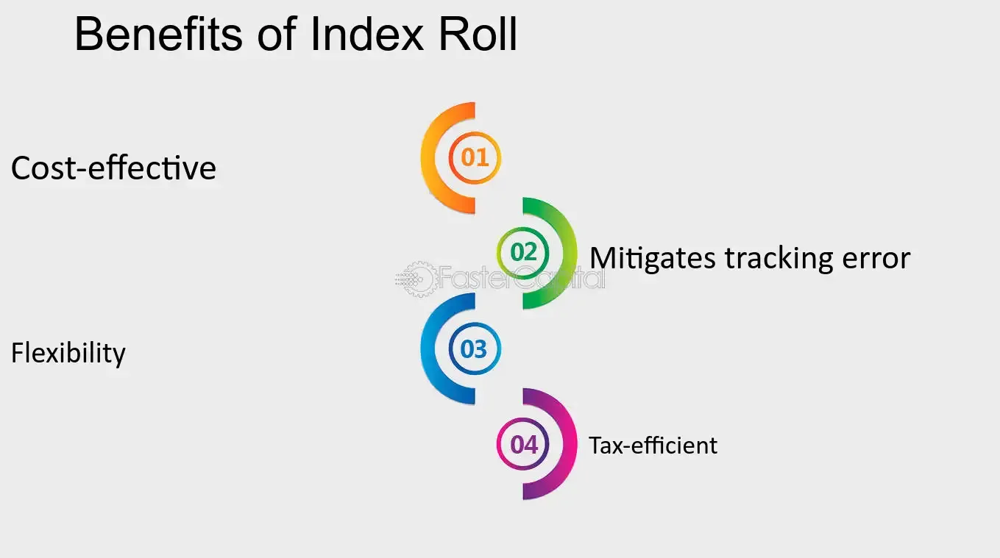

## Table of Contents

## What is an index roll?

An index roll is a process used in finance when someone wants to switch from one index to another. This often happens when the old index is no longer useful or a new, better index is available. For example, if a person has investments tied to an old stock market index, they might want to switch to a new one that better matches their goals.

During an index roll, the old index is gradually replaced by the new one. This can take some time and involves careful planning to make sure the switch happens smoothly. People need to keep track of how their investments are doing during this period to make sure they don't lose money. It's important to do this carefully to avoid any big surprises or losses.

## Why is index rolling important in financial markets?

Index rolling is important in financial markets because it helps keep investments up to date. When a new index comes out that might be better or more relevant, people can switch to it. This means their money can be put into something that matches their goals better. If someone keeps using an old index that isn't working well anymore, they might miss out on better opportunities.

Doing an index roll also helps manage risk. When switching from one index to another, people need to be careful and plan it out. This way, they can avoid big losses that might happen if they switch too quickly or without thinking. By taking the time to do an index roll properly, investors can make sure their money stays safe and continues to grow.

## How does the mechanism of an index roll work?

An index roll happens when someone decides to switch from one index to another. This could be because the old index isn't working well anymore, or there's a new index that might be better. The person starts by figuring out which new index they want to switch to. They look at how well the new index has been doing and if it matches their goals. Once they pick the new index, they need to plan how to move their money from the old index to the new one without losing too much.

The actual process of moving the money can take some time. The person might decide to move a little bit of money at a time, so they don't risk losing a lot all at once. They keep checking how their investments are doing during this time. If the new index starts doing better, they might move more money faster. If it's not doing well, they might slow down the process. The goal is to finish the switch without losing money and to start benefiting from the new index as soon as possible.

## What are the key components involved in an index roll?

An index roll involves several important parts. First, you need to pick a new index that you think will work better than the old one. You look at things like how well the new index has been doing and if it matches what you want to achieve with your money. Once you choose the new index, you start planning how to move your money from the old index to the new one.

The actual moving of the money is another key part. You might decide to move a little bit at a time to be safe. While you're doing this, you keep an eye on how your investments are doing. If the new index is doing well, you might move your money faster. If it's not, you might take more time. The whole point is to finish switching to the new index without losing money and to start enjoying the benefits of the new index as soon as you can.

## What are the common challenges faced during an index roll?

One common challenge during an index roll is deciding when to switch from the old index to the new one. You need to keep a close watch on how both indexes are doing. If you switch too early and the new index doesn't do well right away, you could lose money. If you wait too long, you might miss out on good opportunities with the new index. It's a bit like trying to jump from one moving train to another without falling.

Another challenge is managing the risk while you're moving your money. You don't want to move all your money at once because that could be risky. Instead, you move it little by little, but this takes time and patience. During this time, the market can change, and you need to be ready to adjust your plan. It's like trying to fill a bucket with water from a moving stream without spilling too much.

## How can liquidity issues impact the process of an index roll?

Liquidity issues can make an index roll harder. If the old index or the new index doesn't have enough buyers and sellers, it can be tough to move your money. When there aren't many people trading, it's like trying to sell something in a quiet store. You might not get a good price for your investments, and it can take longer to switch from the old index to the new one. This can be frustrating and might even cause you to lose some money.

Because of these [liquidity](/wiki/liquidity-risk-premium) problems, you have to be very careful about when and how you do the index roll. You might need to move your money even more slowly to make sure you can find buyers and sellers. It's like walking carefully on a slippery path. You take small steps to make sure you don't fall. If you rush, you could slip up and lose more money than you planned. So, you need to keep a close eye on the market and be ready to change your plan if things get too hard.

## What role do market makers play in index rolling?

Market makers are important during an index roll because they help keep the market running smoothly. They are like the people who make sure there's always someone to buy or sell your investments. When you're trying to switch from an old index to a new one, market makers help make sure you can find someone to trade with. This is really helpful, especially if the new index isn't very popular yet and doesn't have many people trading it.

If there aren't enough buyers and sellers, it can be hard to do an index roll. Market makers step in to fill this gap. They provide the liquidity you need to move your money from the old index to the new one without too much trouble. By doing this, they help make the process smoother and less risky. So, having market makers around is a big help when you're trying to switch indexes.

## How does the timing of an index roll affect its success?

The timing of an index roll can make a big difference in how well it goes. If you switch to a new index too early, before it starts doing well, you might lose money. It's like trying to catch a bus that's still far away. You might end up waiting a long time or even missing it. On the other hand, if you wait too long to switch, you could miss out on good opportunities with the new index. It's like staying on a bus that's going the wrong way when you could have gotten off and caught a better one.

So, you need to watch the market closely and pick the right time to do the index roll. This means looking at how both the old and new indexes are doing and trying to guess when the new one will start doing better. It's a bit like trying to jump from one moving train to another without falling. You need to time your jump just right to land safely on the new train. If you get the timing right, your index roll can be a success, and you can start enjoying the benefits of the new index.

## What strategies can be employed to minimize the risks associated with index rolling?

To minimize the risks of an index roll, you can start by moving your money slowly from the old index to the new one. Instead of switching all at once, you move a little bit at a time. This way, if the new index doesn't do well right away, you won't lose all your money. It's like testing the water before jumping in. You also need to keep a close eye on how both indexes are doing. If the new index starts doing better, you can move more money faster. If it's not doing well, you can slow down or even stop until things look better.

Another strategy is to use stop-loss orders. These are like safety nets that automatically sell your investments if they start losing too much value. This can help you avoid big losses if the market suddenly goes down. It's also a good idea to spread your money across different types of investments. This way, if one index doesn't do well, you still have money in other places that might be doing better. It's like not putting all your eggs in one basket. By using these strategies, you can make your index roll safer and more successful.

## How do different types of indices (e.g., equity, commodity) influence the index roll process?

Different types of indices, like equity and commodity indices, can change how you do an index roll. Equity indices track stocks, so when you switch from one equity index to another, you're moving your money between different groups of stocks. This can be tricky because stock markets can go up and down a lot. You need to watch the market closely and move your money slowly to avoid big losses. Commodity indices track things like oil, gold, or wheat. When you switch between commodity indices, you're dealing with goods that can have their own special problems, like changes in supply and demand. This means you need to think about different things when you plan your index roll, like how the prices of these goods might change.

Both types of indices need careful planning, but the things you need to think about can be different. For equity indices, you might worry more about how the stock market is doing overall. You might also look at how well the companies in the new index are doing compared to the old one. For commodity indices, you need to pay attention to things like weather or big news events that can change the prices of the goods. No matter what type of index you're rolling, it's important to move your money slowly and keep watching how things are going. This way, you can make sure you're switching at the right time and not losing too much money.

## What advanced tools or technologies are used to manage and optimize index rolls?

Advanced tools and technologies help make index rolls easier and safer. One important tool is [algorithmic trading](/wiki/algorithmic-trading) software. This software uses math to decide when to buy and sell investments. It can help you move your money from the old index to the new one at the best times. Another helpful technology is real-time market data feeds. These give you up-to-date information about how the market is doing, so you can make quick decisions. You can see how both the old and new indexes are performing and adjust your plan if needed.

Risk management platforms are also very useful. These platforms help you keep track of how much risk you're taking during the index roll. They can warn you if things start going wrong and help you use stop-loss orders to protect your money. Lastly, portfolio management systems can help you see all your investments in one place. This makes it easier to move money slowly and carefully from the old index to the new one. By using these tools, you can make your index roll smoother and less risky.

## How can regulatory changes impact the strategies and outcomes of index rolling?

Regulatory changes can make a big difference in how you do an index roll. When the rules about investing change, you might need to adjust your plan. For example, if new rules make it harder to trade certain kinds of investments, you might have to move your money more slowly or pick a different new index. These changes can also affect how much risk you're taking. If the rules make it safer to invest in one type of index, you might want to switch to that one. So, you need to keep an eye on what the rules are and be ready to change your strategy if they do.

The outcome of an index roll can also be affected by regulatory changes. If new rules help the new index do better, your switch could be more successful. But if the rules make it harder for the new index to do well, you might not get the results you were hoping for. It's important to understand how these changes could impact your investments. By staying informed about the rules and planning carefully, you can make your index roll go more smoothly and reach your goals.

## References & Further Reading

[1]: Bergstra, J., Bardenet, R., Bengio, Y., & Kégl, B. (2011). ["Algorithms for Hyper-Parameter Optimization."](https://dl.acm.org/doi/10.5555/2986459.2986743) Advances in Neural Information Processing Systems 24.

[2]: ["Advances in Financial Machine Learning"](https://www.amazon.com/Advances-Financial-Machine-Learning-Marcos/dp/1119482089) by Marcos Lopez de Prado

[3]: ["Evidence-Based Technical Analysis: Applying the Scientific Method and Statistical Inference to Trading Signals"](https://books.google.com/books/about/Evidence_Based_Technical_Analysis.html?id=MeoJAQAAMAAJ) by David Aronson

[4]: ["Machine Learning for Algorithmic Trading"](https://github.com/stefan-jansen/machine-learning-for-trading) by Stefan Jansen

[5]: ["Quantitative Trading: How to Build Your Own Algorithmic Trading Business"](https://www.amazon.com/Quantitative-Trading-Build-Algorithmic-Business/dp/1119800064) by Ernest P. Chan