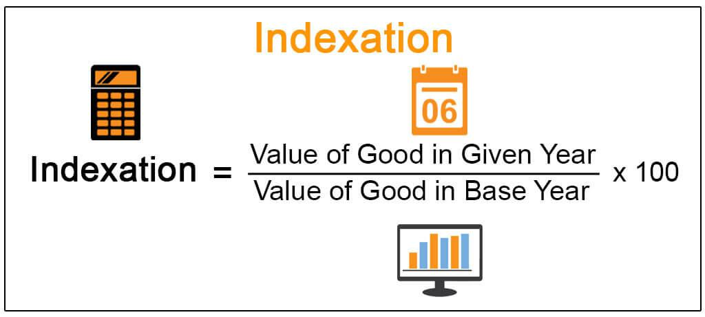

In the dynamic world of finance and economics, indexation plays a crucial role in ensuring stability and fairness across various financial metrics. This systematic adjustment mechanism allows financial values to be modified based on changes in predefined indices, effectively safeguarding against the erosive effects of inflation and other economic shifts. By linking adjustments to indices like the Consumer Price Index (CPI) or the Producer Price Index (PPI), indexation helps maintain the real value of wages, prices, and other economic variables over time.

Indexation's applications are evident across numerous facets of the economy, ranging from social security payments and tax brackets to wage agreements and investment strategies. Each of these areas demonstrates the principle's utility in protecting purchasing power—a critical component of economic stability. In social security, for example, payments are often indexed to inflation to preserve beneficiaries' living standards. Similarly, tax systems employ indexation to adjust tax brackets, which prevents "bracket creep" where inflation pushes income into higher tax bands without an actual increase in purchasing power.



The significance of indexation extends beyond just maintaining economic balance. It intersects intriguingly with modern algorithmic trading, where sophisticated strategies leverage indexation to adjust and optimize trading algorithms in response to real-time market data. This integration ensures that trading decisions reflect the most current economic conditions, enhancing efficiency and effectiveness in capital markets.

Indexation thus emerges as an indispensable tool in the arsenal of policymakers, investors, and individuals, offering a more accurate and fair assessment of economic values. As the financial landscape continues to evolve, understanding the mechanisms and benefits of indexation will be vital for navigating economic challenges and maximizing financial interests.

## Table of Contents

## Understanding Economic Indexation

Economic indexation is a mechanism that adjusts financial values based on changes in specified indices, primarily to protect these values from the eroding effects of inflation. In periods of inflation, the purchasing power of money declines, meaning goods and services become more expensive. To maintain their real value, certain financial elements such as wages, pensions, and taxes are indexed to inflation-related indicators. This ensures that as prices increase, the amounts received or paid out rise accordingly, preserving economic stability.

Economic indices like the Consumer Price Index (CPI) and the Producer Price Index (PPI) are pivotal in the process of indexation. The Consumer Price Index measures the average change over time in the prices paid by urban consumers for a basket of goods and services. It is a key indicator of inflation and is often used in indexation formulas to adjust salaries, retirement benefits, and more. For example, if the CPI indicates a 2% increase in inflation over a year, wages linked to this index might be adjusted upwards by 2% to ensure that the recipients do not lose purchasing power.

Similarly, the Producer Price Index measures the average change over time in the selling prices received by domestic producers for their output. It serves a similar purpose to CPI but focuses on the production and wholesale levels. The PPI can influence the pricing strategies of businesses and is used to adjust contracts and business agreements to reflect changes in costs that producers incur.

To express indexation mathematically, consider an initial value $V_0$ subject to indexation based on a specific index change ratio $r$. The indexed value $V_1$ is calculated as:

$$
V_1 = V_0 \times (1 + r)
$$

Where $r$ is the index change over a specific period, often determined by the percentage change in an index like the CPI or PPI. This formula helps ensure that the adjusted value maintains its real value by accounting for the inflation rate reflected in the index. For simplicity, consider a wage of $50,000 indexed to a 3% CPI increase:

$$
\text{New Wage} = 50,000 \times (1 + 0.03) = 51,500
$$

Thus, economic indexation is a critical tool for stabilizing wages and prices by adjusting them in line with inflation, ensuring consistency in purchasing power amid fluctuating economic conditions.

## Examples of Indexation

Indexation is a fundamental mechanism in economic systems, ensuring that various financial values are adjusted according to shifts in specific indices, thereby maintaining their real value despite economic fluctuations. This process is crucial in contexts such as Social Security payments, tax indexing, and wage agreements, where maintaining the purchasing power and fairness of economic transactions is paramount.

Social Security payments in the United States are a prime example of indexation in action. These payments are adjusted annually based on changes in the Consumer Price Index for Urban Wage Earners and Clerical Workers (CPI-W). The aim is to ensure that benefits reflect the inflation rate, allowing recipients to maintain their purchasing power. For instance, if the CPI-W indicates a 2% increase from one year to the next, Social Security payments will typically increase by an equivalent percentage. This approach safeguards beneficiaries from losing their financial standing due to rising living costs.

Tax indexation is another critical area where indexation is applied. It helps prevent "bracket creep," where taxpayers are pushed into higher income tax brackets due to inflation rather than an actual increase in real income. Governments adjust tax brackets, exemptions, and deductions in line with inflationary changes, typically using indices like the Consumer Price Index (CPI). By indexing tax parameters, taxpayers are protected from inadvertent tax increases unrelated to genuine income hikes. For example, if a taxpayer’s income rises by 3% solely due to inflation, the tax brackets should adjust similarly to avoid an increase in tax burden purely based on nominal income changes.

Wage indexation agreements are common in labor contracts, primarily aimed at preserving employees' purchasing power in inflationary times. These agreements often stipulate that wages will be adjusted in tandem with inflation, as measured by an agreed-upon price index. This ensures that salary increases are reflective of, at minimum, the inflation rate. Such agreements are especially prevalent in sectors with strong union presence, where collective bargaining is used as a tool to negotiate fair wage adjustments.

Indexation across these areas underscores a critical protective feature against economic instability brought about by inflation. Whether through Social Security, taxes, or wages, indexation serves to align economic policies and personal finances with changing economic realities, promoting fairness and stability in financial systems.

## Indexation in Investment Strategies

Indexation within the context of investment strategies is primarily associated with mutual funds and exchange-traded funds (ETFs). Both of these instruments utilize indexation as a mechanism to mirror the performance of specific stock indices, such as the S&P 500 or the Nasdaq-100. This technique allows investors to achieve a diversified portfolio that reflects the broader market trends without the necessity of selecting individual stocks, thereby reducing the risk associated with concentrated investments.

In mutual funds, indexation involves assembling a portfolio that emulates the composition and performance of a defined index. The fund manager purchases the stocks comprising the index according to their market capitalization weights or other predefined criteria. This passive investment strategy is cost-effective because it minimizes the need for active management and frequent trading, which can incur significant fees and expenses. As a result, investors can gain long-term exposure to the market with relatively lower administrative costs compared to actively managed funds.

ETFs operate similarly, as they are designed to track the performance of a specific index by holding a collection of securities that generate comparable returns. Unlike mutual funds, ETFs are traded on stock exchanges, offering greater [liquidity](/wiki/liquidity-risk-premium) and flexibility. The indexation strategy in ETFs provides transparency, enabling investors to know precisely what they are investing in and making it easier to manage risk and maintain stable returns over time.

Capital gains indexation is another crucial aspect of investment strategy, particularly for reducing taxable income. Capital gains indexation involves adjusting the acquisition cost of an asset for inflation, effectively lowering the realized gain upon sale and, consequently, the taxable amount. For example, if an investment initially costs $100,000 and inflation increases by 3% annually, the indexed cost after one year would be $103,000. If the asset is sold for $120,000, the taxable capital gain, without indexation, would be $20,000. However, with indexation, the taxable gain is reduced to $17,000, thus lowering the investor's tax liability.

Investors also leverage indexation to manage risk and achieve stable returns by diversifying their portfolios across various indices and sectors. This approach spreads exposure and mitigates the impact of market [volatility](/wiki/volatility-trading-strategies) on individual assets. By employing indexation, investors maintain alignment with broader market changes, which can be particularly beneficial in volatile economic environments. Consequently, indexation offers a balanced investment strategy that conservatively builds wealth while safeguarding against inflation and economic downturns. 

Furthermore, the accessibility and simplicity of investing in index funds or ETFs make these vehicles attractive to both novice and experienced investors seeking reliable returns and reduced complexity in portfolio management. The stability and predictability associated with these investments underscore their significance in contemporary investment strategies.

## Indexation in Algorithmic Trading

Algorithmic trading leverages indexation to enhance its strategies by adjusting for market fluctuations efficiently. In this context, indexation refers to the practice of using indices to inform trading decisions, ensuring that trading strategies remain aligned with current market conditions. This approach is pivotal for maintaining the relevance and effectiveness of algorithmic models.

One primary application of indexation in [algorithmic trading](/wiki/algorithmic-trading) is through index-tracking algorithms. These algorithms are designed to replicate the performance of a specific index, such as the S&P 500 or the NASDAQ-100. They enable traders to achieve diversified market exposure with minimal cost and effort. Index-tracking algorithms follow a passive investment strategy, where the goal is not to outperform the index but to mirror its movements as closely as possible. This is often achieved through techniques such as statistical [arbitrage](/wiki/arbitrage), which exploits pricing inefficiencies between index futures and cash markets.

Indexation is also crucial in real-time data adjustments within automated trading systems. Such systems utilize constant data streams from financial markets to adjust trading strategies on-the-fly. Python, a popular programming language in algorithmic trading, provides robust libraries like NumPy and pandas to handle real-time data adjustments efficiently. For example, by employing a moving average crossover strategy, traders can utilize historical and real-time index data to generate buy or sell signals. The following Python code snippet illustrates a simple implementation of this strategy:

```python
import pandas as pd
import numpy as np

# Sample index data for demonstration
data = {'IndexValue': [100, 101, 102, 104, 103, 105, 108, 107, 106, 109]}
df = pd.DataFrame(data)

# Calculate moving averages
df['Short_MA'] = df['IndexValue'].rolling(window=3).mean()
df['Long_MA'] = df['IndexValue'].rolling(window=5).mean()

# Generate buy/sell signals
df['Signal'] = np.where(df['Short_MA'] > df['Long_MA'], 1, 0)

print(df)
```

In this example, the short-term moving average (Short_MA) is compared to the long-term moving average (Long_MA). A buy signal is generated when the short-term average crosses above the long-term average, indicating a potential upward trend, while a sell signal would be generated for the opposite condition.

The integration of indexation into automated trading systems offers numerous advantages, including enhanced response times and reduced human error. However, the challenge lies in selecting the appropriate indices that accurately reflect market changes relevant to the strategy being employed. Additionally, the efficiency of these systems can be affected by the quality of data used, requiring robust data acquisition and management frameworks.

In summary, indexation serves as a cornerstone in the construction and execution of algorithmic trading strategies, assisting in tracking market indices and adjusting strategies based on real-time data. The sophistication of these processes ensures that they remain crucial in navigating the complexities of modern trading environments.

## Benefits and Challenges of Indexation

Indexation serves as a critical mechanism for safeguarding financial assets and economic structures against the erosive effects of inflation. One of the primary benefits of indexation is its capacity to preserve purchasing power. By adjusting financial values, such as wages and pension payments, according to inflation indices like the Consumer Price Index (CPI), indexation ensures that individuals maintain their standard of living despite rising prices. This adjustment process promotes stability and fairness within the economy by aligning nominal income with real value.

Another advantage of indexation is its role in providing more accurate economic assessments. By accounting for inflation when evaluating economic performance, indexation allows for a clearer comparison of economic data across different time periods. This adjustment helps policymakers and analysts make informed decisions based on real-world conditions.

However, the process of indexation is not without its challenges. Choosing the appropriate index for adjustment is a complex task. Different indices like the CPI or Producer Price Index (PPI) can yield varied results, as they measure different baskets of goods and services. The selection of an inappropriate index may lead to inaccurate adjustments, thereby affecting economic calculations and decision-making processes.

Maintaining indexation accuracy presents another challenge. The cascading effect of inaccurate indexation may distort economic indicators, leading to misguided fiscal and monetary policies. Ensuring the timeliness and precision of index data is vital to uphold the integrity of indexation processes.

Moreover, there is a potential risk of over-indexing, where adjustments exceed actual changes in price levels. Such discrepancies can introduce distortions into the economy, whereby wages, benefits, or contracts become disproportionately high, placing undue strain on businesses and government budgets. Over-indexing can create an inflationary spiral, wherein increased costs lead to higher prices, which in turn necessitate further adjustments.

In summary, while indexation offers substantial benefits in preserving purchasing power and ensuring economic fairness, it necessitates careful consideration of indices and constant vigilance to maintain accuracy. Missteps in these areas can pose significant economic challenges, affecting both individual livelihoods and broader economic stability.

## Conclusion

Indexation serves as a fundamental mechanism in the financial sector, playing a crucial role in ensuring economic stability and consistency. By aligning financial values with various indices, the adverse effects of inflation and other economic fluctuations are mitigated, protecting the real value of wages, investments, and other financial instruments. This protective measure is essential for policymakers, who rely on accurate economic assessments to make informed decisions that impact the broader economy.

For investors, understanding and leveraging indexation is a strategy to safeguard and enhance financial portfolios. By indexing tax brackets or wages, individuals can maintain purchasing power, ensuring that their economic well-being is not eroded over time. Additionally, this understanding minimizes taxable income, especially with capital gains indexation, which provides a more accurate reflection of real financial growth.

As technology evolves at an unprecedented rate, the application of indexation in trading, particularly algorithmic trading, becomes more complex and critical. Algorithmic trading strategies utilize indexation to adjust swiftly for market changes, providing traders with the ability to react to real-time data efficiently. This is accomplished through sophisticated algorithms that track and adjust to various indices, ensuring optimal trading outcomes. The automation of these processes not only enhances the precision and speed of trading strategies but also reduces the risk associated with market volatility.

In conclusion, as both financial landscapes and technological advancements continue to evolve, the importance of indexation in trading is amplified. Its ability to provide stability, risk management, and fair economic assessment makes it an indispensable tool in the financial world. Thus, a thorough understanding of indexation is imperative for anyone involved in economic planning or investment management, as it is fundamental to preserving and maximizing financial interests in an ever-changing economic environment.

## References & Further Reading

[1]: Bodie, Z., Kane, A., & Marcus, A. J. (2013). ["Investments"](https://www.mheducation.com/highered/product/Investments-Bodie.html). McGraw-Hill. 

[2]: Poterba, J. M. (1998). ["Indexation of Government Bonds"](https://scholar.google.com/citations?user=CjY21_oAAAAJ). National Bureau of Economic Research.

[3]: Shiller, R. J. (2003). ["The New Financial Order: Risk in the 21st Century"](https://www.jstor.org/stable/j.ctt7rhkh). Princeton University Press.

[4]: Arnott, R. D., & Asness, C. S. (2003). ["Surprise! Higher Dividends = Higher Earnings Growth"](https://images.aqr.com/-/media/AQR/Documents/Insights/Journal-Article/Surprise-Higher-Dividends-Equal-Higher-Earnings-Growth.pdf). Financial Analysts Journal, 59(1), 70-87.

[5]: Chan, E. (2009). ["Quantitative Trading: How to Build Your Own Algorithmic Trading Business"](https://github.com/ftvision/quant_trading_echan_book). Wiley Trading.

[6]: ["Advances in Financial Machine Learning"](https://www.amazon.com/Advances-Financial-Machine-Learning-Marcos/dp/1119482089) by Marcos Lopez de Prado.

[7]: ["The Little Book of Common Sense Investing: The Only Way to Guarantee Your Fair Share of Stock Market Returns"](https://www.amazon.com/Little-Book-Common-Sense-Investing/dp/1119404509) by John C. Bogle.

[8]: Malkiel, B. G. (2003). ["A Random Walk Down Wall Street"](https://yourknowledgedigest.org/wp-content/uploads/2020/04/a-random-walk-down-wall-street.pdf). W. W. Norton & Company.

[9]: Fama, E. F., & French, K. R. (1993). ["Common Risk Factors in the Returns on Stocks and Bonds"](https://www.sciencedirect.com/science/article/pii/0304405X93900235). Journal of Financial Economics, 33(1), 3-56.