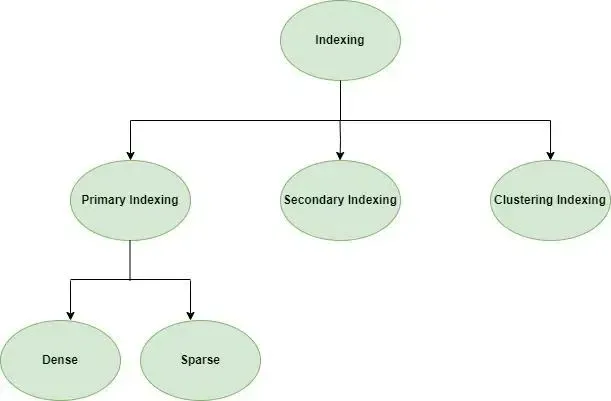

## Table of Contents

## What is indexing in the context of databases and search engines?

Indexing in databases and search engines is like making a list to help find things faster. Imagine you have a big book with lots of pages. If you want to find a specific word, you would have to read every page, which takes a long time. But if you have an index at the back of the book that tells you which pages have the word you're looking for, you can find it much quicker. In databases and search engines, an index works the same way. It's a special list that helps the computer find data or web pages faster without looking through everything.

In databases, an index is created on one or more columns of a table. This helps the database system quickly find rows that match certain criteria without scanning the entire table. For example, if you have a table of customer information and you often search by last name, an index on the last name column would speed up those searches. In search engines, indexing involves crawling the web to gather information about pages and storing it in a way that makes it easy to search. When you type a query into a search engine, it uses its index to quickly find and rank relevant pages, making your search results appear almost instantly.

## Why is indexing important for performance?

Indexing is important for performance because it makes searching for information much faster. Without an index, a computer would have to look at every single piece of data to find what you're looking for. This is like trying to find a specific book in a library by checking every shelf one by one. It takes a long time. But with an index, the computer can go straight to the right place, like using the library's catalog to find the book's exact location. This saves a lot of time and makes the computer work more efficiently.

In databases, for example, an index on a column like a customer's last name means the system can quickly find all customers with a certain last name without going through the entire list. This is especially helpful when dealing with large amounts of data. Search engines also use indexing to quickly find and rank web pages that match your search. Without indexing, search engines would be much slower, and you'd have to wait a long time for results. So, indexing helps make databases and search engines faster and more efficient, improving the overall user experience.

## What are the basic types of indexes?

There are two main types of indexes: single-column indexes and composite indexes. A single-column index is made on just one column in a table. For example, if you often search for customers by their last name, you might make an index on the last name column. This helps the computer find the right information faster. 

A composite index is made on more than one column. If you often search for customers by both their last name and first name, a composite index on these two columns can help speed up those searches. Composite indexes are useful when you need to search using multiple pieces of information at the same time.

These types of indexes help make searching faster and more efficient. They are used in databases and search engines to improve performance and make it easier to find what you're looking for.

## How does a simple index work?

A simple index, also called a single-column index, is like a special list that helps a computer find information faster. Imagine you have a big book with lots of pages. If you want to find a specific word, you would have to read every page, which takes a long time. But if you have an index at the back of the book that tells you which pages have the word you're looking for, you can find it much quicker. In a database, a simple index works the same way. It's made on one column of a table, like the last name of customers. When you search for a customer by their last name, the computer can use the index to go straight to the right place instead of looking through the whole list.

For example, if you have a table with customer information and you often search by last name, a simple index on the last name column would speed up those searches. The index keeps track of where each last name is in the table, so when you search for "Smith," the computer can quickly find all the Smiths without going through every row. This makes the search much faster, especially when you have a lot of data. So, a simple index helps make databases work more efficiently by speeding up searches on one specific column.

## What is the difference between a clustered and a non-clustered index?

A clustered index is like rearranging the [books](/wiki/algo-trading-books) on a shelf so that all the books by the same author are next to each other. In a database, a clustered index changes how the data is stored so that all the rows with the same value in the indexed column are kept together. For example, if you have a clustered index on the last name column, all the customers with the last name "Smith" would be stored right next to each other. This makes searching by last name very fast because the computer can go straight to the right place. However, you can only have one clustered index per table because the data can only be arranged in one way.

A non-clustered index is more like a separate list that tells you where to find the books on the shelf. It doesn't change how the data is stored in the table. Instead, it creates a new structure that points to the original data. For example, if you have a non-clustered index on the last name column, it would create a list that says where to find each last name in the table. This can still speed up searches, but it might not be as fast as a clustered index because the computer has to look at the index and then go to the actual data. You can have many non-clustered indexes on a table, which is helpful if you need to search by different columns.

## What are the considerations for choosing the right index?

When choosing the right index, you need to think about what you search for most often. If you always look for customers by their last name, an index on that column can make things faster. But if you search by different things, like last name and first name together, a composite index might be better. Also, think about how big your table is. If it's very large, indexes can make a big difference in speed. But if it's small, the difference might not be worth the extra work to keep the index updated.

Another thing to consider is how often you update your data. If you add, change, or delete information a lot, too many indexes can slow things down because they need to be updated too. So, you have to balance the speed of searching with the speed of updating. Also, remember that a clustered index can only be used once per table, so choose it for the column you use most often for searching. Non-clustered indexes can be used more often, so use them for other important columns. By thinking about these things, you can pick the right indexes to make your database work better.

## How do composite indexes function and when should they be used?

Composite indexes work by combining more than one column into a single index. Imagine you often search for customers by both their last name and first name. Instead of having separate indexes for each, a composite index on these two columns can help the computer find the right information faster. It's like having a list that tells you where to find people by both their last and first names together. When you search, the computer can use this list to go straight to the right place without looking through the whole table.

You should use composite indexes when you often search using multiple columns at the same time. For example, if you always look for customers by their last name and then their first name, a composite index can make these searches much quicker. But remember, composite indexes can slow down updates because they need to be updated too. So, use them when the speed of searching is more important than the speed of updating, and when you often search using the same set of columns together.

## What are the trade-offs involved in indexing?

Indexing can make searching for information much faster. It's like having a special list that tells the computer where to find things quickly, without looking through everything. This is really helpful when you have a lot of data and you search for things often. For example, if you always look for customers by their last name, an index on that column can make your searches much quicker. This makes your database or search engine work better and saves time.

But there are also some downsides to indexing. When you add, change, or delete data, the indexes need to be updated too. This can slow down the process of updating your data, especially if you have a lot of indexes. So, you have to think about whether the speed of searching is more important than the speed of updating. Also, indexes take up extra space on your computer. If you have a big table with lots of data, too many indexes can use a lot of space. So, it's important to balance the benefits of faster searches with the costs of slower updates and more space used.

## How can indexing strategies be optimized for specific use cases?

To optimize indexing strategies for specific use cases, you need to think about what you search for most often and how big your data is. If you always look for customers by their last name, an index on that column can make things faster. But if you search by different things, like last name and first name together, a composite index might be better. Also, if your table is very large, indexes can make a big difference in speed. But if it's small, the difference might not be worth the extra work to keep the index updated.

Another thing to consider is how often you update your data. If you add, change, or delete information a lot, too many indexes can slow things down because they need to be updated too. So, you have to balance the speed of searching with the speed of updating. For example, if you have a table where you search by last name a lot but also update it often, you might choose a clustered index on the last name column because it's the most important for searching. But if you have other columns you search by sometimes, you could add non-clustered indexes on those, but not too many, to keep updates fast. By thinking about these things, you can pick the right indexes to make your database work better for your specific needs.

## What advanced indexing techniques exist, such as bitmap or full-text indexing?

Bitmap indexing is a way to make searching faster when you have columns with only a few different values, like "yes" or "no," or a few categories. It works by using bits (0s and 1s) to show which rows have which values. For example, if you have a column that says if a customer is active or not, a bitmap index would use a 1 for active customers and a 0 for inactive ones. This makes it quick to find all the active customers because the computer can just look at the bits. Bitmap indexes are really good for big tables with lots of data because they save space and speed up searches.

Full-text indexing is used to search through text, like in books or websites. It breaks down the text into smaller pieces, like words or phrases, and makes an index of them. When you search for a word or phrase, the computer can use this index to find it quickly without reading through all the text. This is really helpful for search engines or databases with lots of text data. Full-text indexing can also understand things like synonyms or different forms of words, which makes searching even better. It's important for making sure you can find what you're looking for in big collections of text.

## How do indexing techniques vary across different database systems?

Indexing techniques can be different in various database systems because each system has its own way of handling data. For example, in SQL databases like MySQL or PostgreSQL, you can use simple indexes, composite indexes, clustered indexes, and non-clustered indexes. These help speed up searches by organizing data in certain ways. MySQL, for instance, also supports full-text indexing, which is great for searching through text data. On the other hand, NoSQL databases like MongoDB use different kinds of indexes. MongoDB has single-field indexes, compound indexes, and even supports text indexes for searching text, but it doesn't use clustered indexes like SQL databases do. Each type of database has its own set of indexing tools to make searching faster.

In addition to these, some database systems have unique indexing features. For example, Oracle databases support bitmap indexes, which are really good for columns with a small number of distinct values. These can make searches much faster in big tables. Also, some systems like Elasticsearch, which is often used for search engines, use inverted indexes. An inverted index is like a list that tells you which documents contain certain words, making it very fast to search through lots of text. So, the way indexing works can change a lot depending on the database system you're using, and it's important to understand these differences to make your searches as fast as possible.

## What are the latest trends and future directions in indexing technology?

The latest trends in indexing technology focus a lot on making searches faster and more efficient, especially with big data. One big trend is the use of [machine learning](/wiki/machine-learning) to improve how indexes work. Machine learning can help figure out which indexes are most useful based on how people search, and it can even change indexes automatically to make them better over time. Another trend is the growth of in-memory indexing, where data is kept in the computer's memory instead of on a hard drive. This makes searches much quicker because the computer can get to the data faster. Also, more databases are using columnar storage, which is good for indexing because it makes it easier to search through specific columns of data.

Looking to the future, indexing technology is likely to keep getting better at handling huge amounts of data. As more and more data is created every day, new ways of indexing will be needed to keep searches fast. One future direction could be the use of more advanced AI to not just improve indexes but also to predict what people will search for and prepare the indexes ahead of time. Another direction might be the development of even more specialized indexes for different types of data, like images or videos, to make searching through them faster and more accurate. Overall, the future of indexing technology will be about making it easier and quicker to find what you need in a world full of data.

## References & Further Reading

[1]: Baeza-Yates, R., & Ribeiro-Neto, B. (2011). ["Modern Information Retrieval: The Concepts and Technology behind Search."](https://www.semanticscholar.org/paper/Modern-information-retrieval%3A-the-concepts-and-Baeza-Yates-Ribeiro-Neto/f54bf5c3e2dfbf06612c7d949fcc94e0c0fa842d) Addison Wesley.

[2]: López de Prado, M. (2018). ["Advances in Financial Machine Learning."](https://www.amazon.com/Advances-Financial-Machine-Learning-Marcos/dp/1119482089) Wiley.

[3]: Rösch, B. (2020). ["High-Frequency Trading: A Practical Guide to Algorithmic Strategies and Trading Systems."](https://www.wiley.com/en-us/High+Frequency+Trading%3A+A+Practical+Guide+to+Algorithmic+Strategies+and+Trading+Systems-p-9780470579770) Wiley.

[4]: Nitin, R. (2015). ["Data Structures and Algorithms in Python."](https://books.google.com/books/about/Data_Structures_and_Algorithms_in_Python.html?id=2UccAAAAQBAJ) Wiley.

[5]: Hull, J. C. (2017). ["Options, Futures, and Other Derivatives."](https://www.semanticscholar.org/paper/Options%2C-Futures%2C-and-Other-Derivatives-Hull/89bdee500c8623864fc9eb7a471546aa713acc44) Pearson.

[6]: Leskovec, J., Rajaraman, A., & Ullman, J. D. (2020). ["Mining of Massive Datasets."](http://infolab.stanford.edu/~ullman/mmds/book.pdf) Cambridge University Press.