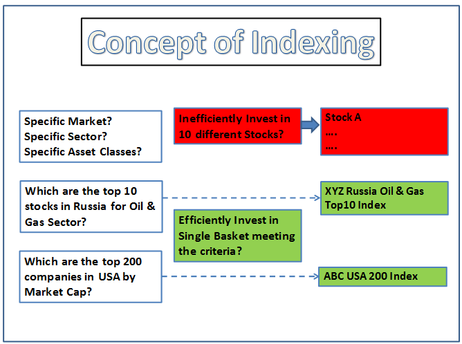

The integration of information retrieval, index data, indexing, and algorithmic trading is paramount for businesses seeking to thrive in today's data-driven landscape. Information retrieval, a foundational component, involves extracting pertinent data from vast repositories of unstructured information. This process is crucial for interpreting and leveraging data across diverse domains.

Indexing plays an indispensable role in accelerating data retrieval, which is particularly pivotal in sectors such as trading, where decision-making speed can determine success. By organizing data into efficient structural representations, indexing dramatically reduces the time required to access critical information, thus enhancing operational efficiency.



Algorithmic trading, fundamentally altering the finance sector, deploys complex algorithms to facilitate rapid, data-informed trading decisions. These algorithms analyze market indicators and execute trades in fractions of a second, far surpassing human capabilities. The convergence of information retrieval and indexing within trading platforms is integral to maximizing the benefits of algorithmic trading, allowing for swift, informed navigation through substantial datasets.

This article will examine how these intersecting domains impact various industries, propelling advancements and shaping future technological innovations. By understanding the synergies among information retrieval, indexing, and algorithmic trading, businesses can harness these tools to drive competitive advantage and operational success.

## Table of Contents

## Information Retrieval and Index Data

Information retrieval is the process of obtaining relevant data from a vast collection of information, which is crucial in today’s digitally dominated environment. The fundamental objective of information retrieval systems is to identify and deliver information that meets various user queries, efficiently sorting through large volumes of unstructured data.

The concept of index data is integral to creating effective retrieval systems, such as databases and search engines. Index data functions as a structured representation of the raw data, facilitating quick and efficient search operations. A crucial part of this process is the construction of an inverted index, a widely used data structure in information retrieval systems. 

An inverted index is designed to link terms to documents, making it easier to locate any term across a dataset. It essentially functions in two parts: a vocabulary or dictionary, which includes all unique terms in the corpus, and a postings list, which contains references to the locations where each term occurs within the documents. Due to its ability to associate terms directly with the documents they appear in, the inverted index significantly optimizes search operations, reducing the time complexity required to retrieve information from large datasets.

Consider an example where a simple Python code can be used to create an inverted index from a collection of documents. Below is a basic implementation of this concept:

```python
def create_inverted_index(documents):
    inverted_index = {}
    for doc_id, text in enumerate(documents):
        for term in text.split():
            if term not in inverted_index:
                inverted_index[term] = []
            inverted_index[term].append(doc_id)
    return inverted_index

# Example usage
documents = [
    "information retrieval systems store data",
    "index data is crucial for retrieval",
    "retrieval of data requires efficient systems"
]

inverted_index = create_inverted_index(documents)
print(inverted_index)
```

This simple example illustrates how each term in the documents is linked to the document indices in which it appears, thereby allowing quick retrieval of documents based on individual keywords.

The efficiency gained through such indexing mechanisms is of paramount importance. It enhances the performance of search operations by allowing retrieval systems to bypass irrelevant data and focus directly on the specific segments of interest. This optimization is essential across various sectors, including digital libraries, online search engines, and large-scale information databases.

In summary, the concepts of information retrieval and index data are cornerstones of modern data management, enabling faster, more accurate information processing. As data volumes continue to grow, the importance of efficient indexing and retrieval systems will only increase, further emphasizing their role in the processing and accessibility of information.

## Data Indexing Techniques

Data indexing is a fundamental aspect of database management and information retrieval, essential for enhancing the speed and efficiency of data operations. Various techniques are employed to create effective data structures for quicker searching and retrieval of information.

One popular data indexing technique is the use of **B-trees**, which are essentially balanced tree data structures that maintain sorted data and allow for efficient insertion, deletion, and lookup operations. B-trees are particularly suited to applications involving large amounts of data that cannot fit into main memory, as they minimize the number of disk reads needed by maintaining balance in the tree structure.

Another prevalent method is **hash indexing**, which uses a hash function to compute the location of data items. Hash indexes provide high-speed data retrieval because they offer constant-time complexity, O(1), for both search operations and insertions, assuming a good hash function is used. However, hash indexes are most effective with equality comparisons rather than range queries.

**Inverted indexes** are primarily used in search engines and document retrieval systems. They store a mapping from content, such as words or numbers, to their location within a database file. This data structure vastly improves the performance of search operations across large datasets by allowing quick full-text searches. The inverted index comprises a list of all unique terms found in the data and a list of documents in which each term occurs.

The selection of an appropriate indexing method depends on the nature of the data and the specific requirements of the application. For instance, if range queries are a common operation, B-trees might be more appropriate, whereas hash indexing would be preferred for exact match queries.

Advanced indexing strategies involve enhancing **data granularity** and **optimizing index structures** to improve performance. Enhancing data granularity refers to indexing at a finer level of detail, which can provide more precise retrieval of information. Optimizing index structures often includes approaches such as combined indexes and multi-level indexing schemes, which can adapt to varying query patterns and data distributions.

The continuous evolution of data indexing techniques underpins the development of high-performance modern applications, significantly impacting sectors that rely on rapid data access, such as finance, market analysis, and online search systems.

## Algorithmic Trading

Algorithmic trading employs algorithms to automate the trading process, utilizing pre-programmed instructions that define various trade execution criteria such as time, price, quantity, or complex mathematical models. By adhering to these parameters, [algorithmic trading](/wiki/algorithmic-trading) seeks to leverage computational power to execute trades that adhere to specified strategies with minimal human intervention.

The algorithms can be specialized to exploit specific market conditions or trading opportunities. For instance, they may be programmed to execute trades at particular times, adhere to specific price thresholds, or optimize order quantities. These strategies allow for executing large orders without significant market impact, achieving favorable prices through speed and efficiency.

Indexing is crucial in algorithmic trading as it ensures real-time data retrieval necessary for immediate decision-making. Efficient data index systems facilitate quick access to market data, including historical price information and real-time quotes, essential in crafting trading decisions. This real-time data processing capability is vital as it aids algorithms to adapt to market changes instantly and execute trades accordingly, thereby enhancing responsiveness and precision.

The primary advantage of algorithmic trading lies in its speed. The algorithms can execute numerous trades within fractions of a second, offering a lucrative edge in volatile markets where prices can shift rapidly. In such scenarios, the ability to make fast trading decisions is a significant advantage, often translating to reduced transaction costs and improved execution quality.

Python is a commonly used language in coding for algorithmic trading due to its simplicity and the availability of financial libraries. The following is a simple Python example illustrating a basic moving average strategy:

```python
import pandas as pd

def moving_average_strategy(data, short_window, long_window):
    signals = pd.DataFrame(index=data.index)
    signals['signal'] = 0.0

    # Short moving average
    signals['short_mavg'] = data['price'].rolling(window=short_window, min_periods=1, center=False).mean()
    # Long moving average
    signals['long_mavg'] = data['price'].rolling(window=long_window, min_periods=1, center=False).mean()

    # Buy signal when short mavg crosses above long mavg
    signals['signal'][short_window:] = np.where(
        signals['short_mavg'][short_window:] > signals['long_mavg'][short_window:], 1.0, 0.0)

    # Generate trading orders
    signals['positions'] = signals['signal'].diff()

    return signals

# Example usage
# data is a pandas DataFrame containing stock prices with a column named 'price'
# signals = moving_average_strategy(data, short_window=40, long_window=100)
```

This code demonstrates a moving average crossover strategy, where buy signals are generated when a short-term moving average surpasses a long-term moving average. This simple strategy typifies how algorithms can automate reactions to market data based on predefined models.

Overall, algorithmic trading's integration with robust data indexing enables the realization of high-frequency trading benefits, pushing boundaries in the speed and accuracy of financial trading operations.

## The Critical Role of Indexing in Algo Trading

Efficient indexing is pivotal in minimizing latency and enabling prompt trading decisions in algorithmic trading. This critical aspect is facilitated through the implementation of robust data structures, such as inverted indexes and B-trees, within trading databases to ensure rapid data access.

Inverted indexes, widely utilized in information retrieval systems, map content, such as terms or keywords, to the documents or records in which they appear. This approach allows for the swift identification and retrieval of relevant trading data, thereby enhancing decision-making speed. The ability to quickly search and access required trading data is essential, particularly in high-frequency trading environments where every millisecond counts.

B-trees, another foundational data structure, play a significant role in maintaining sorted data and enabling efficient search, insertion, and deletion operations. By organizing indices in a hierarchical manner, B-trees ensure that data retrieval operations remain efficient and scalable, even as data volumes expand. This efficiency is vital for trading systems that must process extensive amounts of market data in real-time to generate trading signals.

Indexing is equally crucial in optimizing the retrieval of historical data, a fundamental component of [backtesting](/wiki/backtesting) and strategy formulation. Historical data enables traders and algorithms to simulate trading scenarios and assess the viability of various strategies before deployment in live markets. Index structures that excel in efficient data retrieval facilitate comprehensive analyses of past data trends, [volatility](/wiki/volatility-trading-strategies) patterns, and market behaviors, thereby informing the development of robust trading strategies.

The convergence of indexing techniques and algorithmic trading underscores the imperative for high-performance computational methods. As trading systems increasingly rely on automated processes to execute intricate strategies, the need for swift, reliable data access becomes paramount. Efficient indexing techniques, therefore, represent a cornerstone in ensuring that trading algorithms can function at optimal speed and precision, maintaining a competitive edge in rapidly evolving financial markets.

## Case Studies and Applications

Leading financial institutions have successfully integrated advanced indexing techniques to optimize their trading platforms, significantly enhancing trade execution efficiency. Indexing methods, such as inverted indexes and B-trees, have been pivotal in ensuring swift data access, crucial for algorithmic trading. For instance, high-frequency trading ([HFT](/wiki/high-frequency-trading-strategies)) firms rely on these methods to achieve millisecond-level trade executions. By leveraging these indexing techniques, firms can quickly retrieve large volumes of market data, analyze it, and respond to market fluctuations with unprecedented speed.

A notable case study is the use of these techniques by [quantitative trading](/wiki/quantitative-trading) firms like Renaissance Technologies and Two Sigma. These firms utilize vast amounts of historical data to backtest trading strategies and require efficient retrieval systems to access this data quickly. Indexing allows them to efficiently handle the enormous datasets involved, leading to more effective trading strategies and improved market predictions.

Beyond finance, indexing technologies have transformative applications in other sectors, including data analysis and market research. In data analysis, indexing optimizes the processing and retrieval of structured and unstructured data, enabling faster query responses and real-time analytics. For example, companies use indexing to analyze consumer data trends, allowing them to tailor marketing strategies effectively.

Market research also benefits from these techniques as firms can index and query large datasets to extract valuable insights, helping businesses understand consumer behavior and market dynamics more deeply. The ability to efficiently retrieve and process large datasets can provide a competitive edge, allowing companies to make informed, data-driven decisions.

These applications of indexing in various fields underscore the potential for future innovations. As data volumes grow, efficient indexing will become increasingly vital, pointing to a future where faster, more accurate data retrieval systems enable more complex and nuanced analyses. Continued advancements in these techniques promise to unlock new possibilities for industries reliant on big data, paving the way for innovative solutions and more robust data-driven strategies.

## Challenges and Future Directions

Data indexing and retrieval are crucial components in modern computational systems, addressing the needs of various industries, including algorithmic trading. However, these processes face numerous challenges, notably in handling large datasets and ensuring data security. As datasets grow in size and complexity, traditional indexing methods can struggle to maintain performance and scalability. Advances in big data technologies necessitate robust indexing systems capable of processing vast amounts of information efficiently and securely.

One primary challenge is scalability. As the [volume](/wiki/volume-trading-strategy) of data expands, indexing structures must adapt to maintain quick access times. Techniques such as distributed indexing can help, enabling systems to partition data across multiple nodes, thus balancing load and reducing query times. However, distributed systems can introduce additional complexities, such as ensuring consistency and managing node failures.

Data security is another critical concern. With the increasing threat of cyberattacks, secure indexing methods are essential. Encryption and access control measures need to be integrated to protect sensitive data from unauthorized access, complicating the design of efficient retrieval systems. Developing techniques that balance security with speed remains a crucial area of research.

Ongoing research is focused on enhancing the scalability and efficiency of indexing methods. For instance, techniques to optimize the performance of B-trees and inverted indexes through parallel processing and hardware acceleration are being explored. Additionally, adaptive indexing approaches that automatically adjust to workload changes are gaining traction, offering a way to maintain performance as data environments evolve.

The integration of [machine learning](/wiki/machine-learning) presents a promising future advancement. Machine learning algorithms can be employed to optimize various aspects of data indexing and retrieval. For example, they can predict query patterns and adjust indexing strategies accordingly, leading to more efficient data retrieval processes. Machine learning can also aid in anomaly detection, identifying irregularities in data access that may indicate performance bottlenecks or security threats.

Understanding and addressing these challenges will be pivotal for the continued evolution of trading technologies. As the demand for real-time data processing grows, particularly in fields like algorithmic trading, the pressure to develop sophisticated indexing and retrieval systems will only increase. Future innovations are likely to emerge at the intersection of distributed computing, machine learning, and data security, fostering the development of more reliable and efficient data management systems.

In summary, while data indexing and retrieval face significant challenges, they also present opportunities for innovation. By improving scalability, enhancing security, and integrating new technologies like machine learning, these systems can be optimized, supporting the future needs of data-driven industries.

## Conclusion

Indexing in information retrieval and algorithmic trading signifies a pivotal technological development in data processing and decision-making. This advancement allows for more efficient handling of vast datasets, enabling rapid access to relevant information, which is especially critical in high-frequency trading environments. By implementing advanced indexing techniques, financial institutions can significantly reduce latency, thereby improving their trading execution and overall market responsiveness.

As these technologies continue to evolve, we can anticipate enhanced efficiency and reliability in trading and data analytics applications. Innovations in machine learning, for instance, hold the potential to complement existing data indexing methodologies, further optimizing algorithm execution and precision in trading strategies. The integration of machine learning could pave the way for predictive analytics, enhancing the decision-making framework by identifying patterns and trends that were previously difficult to discern.

Moreover, future research and technological improvements are likely to yield more sophisticated trading mechanisms, incorporating elements such as real-time data processing and predictive analytics. Such advancements could ultimately lead to an era of trading where decisions are made with unprecedented speed and accuracy, driven by data insights that are both deep and actionable.

Understanding the interplay between information retrieval, data indexing, and algorithmic trading is critical for fostering future innovations and sustaining growth within the tech-driven financial sector. As these domains increasingly converge, professionals in finance and technology must collaboratively navigate the challenges and opportunities presented. This collaboration will be instrumental in shaping the next wave of advancements, ensuring that the financial sector remains agile and competitive in an ever-evolving technological landscape.

## References & Further Reading

[1]: Baeza-Yates, R., & Ribeiro-Neto, B. (2011). ["Modern Information Retrieval: The Concepts and Technology behind Search."](https://www.semanticscholar.org/paper/Modern-information-retrieval%3A-the-concepts-and-Baeza-Yates-Ribeiro-Neto/f54bf5c3e2dfbf06612c7d949fcc94e0c0fa842d) Addison Wesley.

[2]: López de Prado, M. (2018). ["Advances in Financial Machine Learning."](https://www.amazon.com/Advances-Financial-Machine-Learning-Marcos/dp/1119482089) Wiley.

[3]: Rösch, B. (2020). ["High-Frequency Trading: A Practical Guide to Algorithmic Strategies and Trading Systems."](https://www.wiley.com/en-us/High+Frequency+Trading%3A+A+Practical+Guide+to+Algorithmic+Strategies+and+Trading+Systems-p-9780470579770) Wiley.

[4]: Nitin, R. (2015). ["Data Structures and Algorithms in Python."](https://books.google.com/books/about/Data_Structures_and_Algorithms_in_Python.html?id=2UccAAAAQBAJ) Wiley.

[5]: Hull, J. C. (2017). ["Options, Futures, and Other Derivatives."](https://www.semanticscholar.org/paper/Options%2C-Futures%2C-and-Other-Derivatives-Hull/89bdee500c8623864fc9eb7a471546aa713acc44) Pearson.

[6]: Leskovec, J., Rajaraman, A., & Ullman, J. D. (2020). ["Mining of Massive Datasets."](http://infolab.stanford.edu/~ullman/mmds/book.pdf) Cambridge University Press.