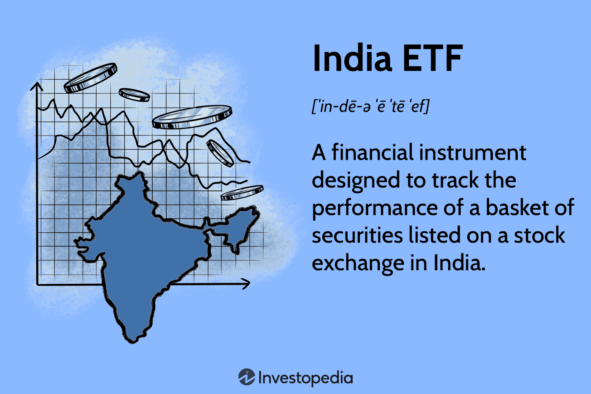

## Table of Contents

## What is an Exchange-Traded Fund (ETF)?

An Exchange-Traded Fund (ETF) is a type of investment that works like a mix of a stock and a mutual fund. It's a basket of different investments, like stocks, bonds, or commodities, that you can buy and sell on a stock exchange, just like you would with a single stock. This means you can trade ETFs throughout the day at market prices, which change constantly, unlike mutual funds which are only traded at the end of the day.

ETFs are popular because they offer a way to diversify your investments easily. Instead of buying many different stocks or bonds yourself, you can buy one ETF that already includes a variety of them. This can help spread out your risk. Plus, ETFs often have lower fees than mutual funds, making them a cost-effective choice for many investors.

## What is an India Exchange-Traded Fund?

An India Exchange-Traded Fund, or India ETF, is a type of ETF that focuses on investments in India. It includes stocks of companies that are based in India or have a lot of their business there. This way, if you want to invest in the Indian market without buying individual stocks, you can buy shares of an India ETF. It's like getting a piece of the Indian economy in one go.

These ETFs are traded on stock exchanges, just like any other stock. This means you can buy or sell them anytime during the trading day at the current market price. India ETFs are popular among investors who want to diversify their portfolio by adding exposure to one of the world's fastest-growing economies. They offer a simple and cost-effective way to invest in India, without needing to know a lot about individual Indian companies.

## How does an India ETF work?

An India [ETF](/wiki/etf-trading-strategies) works by pooling money from many investors to buy a basket of stocks from companies in India. This basket represents a part of the Indian stock market. When you buy shares of an India ETF, you're essentially buying a small piece of all those companies at once. The value of the ETF goes up or down based on how well the stocks in the basket are doing.

Trading an India ETF is easy because it's listed on a stock exchange, just like a regular stock. You can buy or sell shares of the ETF anytime during the trading day at the current market price. This is different from mutual funds, which you can only buy or sell at the end of the day. By investing in an India ETF, you get to spread your risk across many companies in India, and it's a simple way to tap into the growth of the Indian economy without having to pick individual stocks.

## What are the different types of India ETFs available?

India ETFs come in different types, depending on what they invest in. Some India ETFs focus on large companies listed on the main stock exchange in India, like the Nifty 50 or the BSE Sensex. These ETFs give you exposure to big and well-known Indian companies. Other India ETFs might focus on smaller companies or specific sectors like technology, finance, or healthcare. This way, you can choose an ETF that matches your interest or investment strategy.

Another type of India ETF is one that invests in Indian companies but is listed on a foreign stock exchange, like in the US or Europe. These ETFs are handy if you want to invest in India but live outside the country. They're traded in the currency of the exchange they're listed on, which could be dollars or euros. Lastly, some India ETFs use strategies like leveraging or inverse investing. Leveraged ETFs aim to give you higher returns but come with higher risk, while inverse ETFs try to profit from falling markets. Each type has its own benefits and risks, so it's good to understand them before you invest.

## What are the benefits of investing in an India ETF?

Investing in an India ETF can help you spread out your money across many different companies in India without having to pick them one by one. This is good because it lowers the risk. If one company doesn't do well, it won't hurt your whole investment as much. Plus, India's economy is growing fast, so by investing in an India ETF, you can be part of that growth. It's like getting a piece of the whole Indian market in one go.

Another benefit is that India ETFs are easy to buy and sell. You can trade them on a stock exchange just like you would with a regular stock. This means you can buy or sell them anytime during the day at the current price. Also, India ETFs often have lower fees than other types of funds, so you get to keep more of your money. If you live outside of India, you can still invest in the Indian market through an India ETF that's listed on a foreign exchange, making it simple and convenient.

## How can an India ETF help in diversifying an investment portfolio?

An India ETF can help diversify your investment portfolio by spreading your money across many different companies in India. Instead of putting all your money into one or a few stocks, an India ETF lets you invest in a whole bunch of companies at once. This means if one company doesn't do well, it won't hurt your whole investment as much because you have other companies to balance it out. It's like not putting all your eggs in one basket.

Adding an India ETF to your portfolio also gives you exposure to the Indian economy, which is growing fast. This can be a good way to balance out investments you might have in other countries or regions. By including an India ETF, you're not just relying on the performance of one market. It helps you spread your risk and potentially increase your returns by tapping into the growth of India's economy.

## What are the risks associated with investing in India ETFs?

Investing in India ETFs comes with some risks you should know about. One big risk is that the Indian market can be more unpredictable than markets in other countries. This means the value of your ETF can go up and down a lot. If the Indian economy has a bad time, your investment could lose value. Also, India has different rules and ways of doing things compared to other places, which can make it harder to understand and predict what will happen.

Another risk is that India ETFs can be affected by things happening outside of India. For example, if there's a big problem in the world economy, it can hurt the Indian market too. Plus, if you're investing in an India ETF that's listed on a foreign exchange, you have to think about changes in currency values. If the Indian rupee gets weaker compared to the currency you're using, it could make your investment worth less.

Lastly, like any investment, India ETFs have fees. These fees can eat into your returns over time. It's important to look at how much the ETF costs to make sure it's a good deal for you. Also, some India ETFs might focus on certain parts of the market or use special strategies that can be riskier. It's a good idea to understand what the ETF is investing in and how it works before you put your money in.

## How do India ETFs compare to other investment options like mutual funds or direct stock investments?

India ETFs are a bit different from mutual funds and direct stock investments. An India ETF is like a mix between a stock and a mutual fund. You can buy and sell it on a stock exchange whenever you want during the day, just like a stock. But it holds a bunch of different stocks from Indian companies, like a mutual fund. This means you get to spread your money across many companies without having to pick them yourself. ETFs often have lower fees than mutual funds, which can save you money over time.

On the other hand, if you invest directly in stocks, you're choosing specific companies to put your money into. This can be riskier because if one company does badly, your whole investment could suffer. But it also gives you more control over what you're investing in. You might know a lot about a certain company and think it's going to do well. With an India ETF, you don't get to pick the individual stocks, but you get a piece of the whole Indian market, which can be less risky because it's more spread out.

Both India ETFs and mutual funds can help you diversify your investments, but they work a bit differently. Mutual funds are only traded at the end of the day, and they might have higher fees. India ETFs give you more flexibility because you can trade them anytime during the day. If you want to invest in India but don't want to pick individual stocks, an India ETF could be a good choice. It's a simple way to get exposure to the Indian market without needing to be an expert on Indian companies.

## What are the tax implications of investing in India ETFs?

Investing in India ETFs can have different tax implications depending on where you live and how you invest. If you're living in India and investing in an India ETF, you'll have to pay capital gains tax. This tax depends on how long you hold the ETF before selling it. If you sell it within a year, it's considered a short-term capital gain, and you'll be taxed at your income tax rate. If you hold it for more than a year, it becomes a long-term capital gain, and the tax rate is lower, usually 10% if the gain is over a certain amount.

If you live outside India and invest in an India ETF that's listed on a foreign exchange, like in the US or Europe, the tax rules of that country will apply. In the US, for example, you'll have to pay capital gains tax on any profits you make, similar to how it works in India. But you might also have to deal with taxes on dividends if the ETF pays them out. It's important to understand the tax treaty between your country and India, as it can affect how much tax you pay. Always talking to a tax advisor can help you figure out the best way to handle your taxes when investing in India ETFs.

## How can one start investing in India ETFs?

To start investing in India ETFs, you first need to choose a brokerage that lets you trade ETFs. Many big brokerages around the world offer India ETFs, so you can pick one that's easy for you to use and has low fees. Once you've picked a brokerage, you'll need to open an account with them. This usually involves filling out some forms online and maybe sending in some documents to prove who you are. After your account is set up, you can put money into it and start looking for India ETFs to buy.

When you're ready to invest, you can search for India ETFs on your brokerage's website or app. They'll have names like "iShares India 50 ETF" or "Invesco India ETF." You can read about each ETF to see what companies it invests in and how it's been doing. Once you find one you like, you can buy shares of it just like you would buy a regular stock. You can decide how many shares you want to buy and place your order. After that, you'll own a piece of the Indian market and can watch your investment grow over time.

## What are the key performance indicators to look at when evaluating India ETFs?

When you're looking at India ETFs, you want to check a few important things to see how well they're doing. One big thing is the ETF's total return, which shows how much money you could have made if you invested in it. This includes any price changes and dividends. You should also look at the expense ratio, which is how much the ETF charges you to manage your money. A lower expense ratio means you get to keep more of your returns. Another thing to consider is the ETF's tracking error, which tells you how closely the ETF follows the index it's supposed to mimic. A smaller tracking error is better because it means the ETF is doing what it's supposed to do.

It's also good to look at the ETF's [liquidity](/wiki/liquidity-risk-premium), which is how easy it is to buy and sell shares. High liquidity means you can trade the ETF without affecting its price too much. You might also want to check the ETF's assets under management (AUM), which is the total value of all the money invested in the ETF. A higher AUM can mean the ETF is more popular and stable. Lastly, consider the ETF's risk measures like beta and standard deviation. Beta shows how much the ETF moves with the market, and standard deviation tells you how much the ETF's returns can swing up and down. These can help you understand how risky the ETF might be.

## What advanced strategies can be used to maximize returns from India ETFs?

To maximize returns from India ETFs, one strategy is to use dollar-cost averaging. This means you invest a fixed amount of money into the ETF at regular times, like every month. By doing this, you buy more shares when the price is low and fewer when it's high. Over time, this can help you pay less on average for your shares and increase your overall returns. Another strategy is to keep an eye on the Indian market and global economic trends. If you think the Indian economy is going to do well, you might want to put more money into India ETFs. But if you see signs that things might get tough, you could take some money out to protect your investment.

Another advanced strategy is to use leveraged or inverse ETFs. Leveraged ETFs try to give you higher returns by using borrowed money to invest more than you actually put in. This can make your gains bigger, but it also makes your losses bigger if the market goes down. Inverse ETFs, on the other hand, aim to go up when the market goes down. They can be a way to make money even if you think the Indian market is going to have a rough time. Both of these types of ETFs are riskier, so it's important to understand them well before you use them. Also, think about rebalancing your portfolio. This means checking your investments every so often and making sure you're still happy with how much you have in India ETFs compared to other investments. If things have changed, you might want to buy or sell some shares to get back to your plan.

## References & Further Reading

[1]: Kirilenko, A., Kyle, A. S., Samadi, M., & Tuzun, T. (2017). ["The Flash Crash: High-Frequency Trading in an Electronic Market."](https://www.jstor.org/stable/26652722) The Journal of Finance, 72(3), 967-998.

[2]: Securities and Exchange Board of India. (2013). ["Guidelines for Algorithmic Trading."](https://www.sebi.gov.in/legal/circulars/mar-2012/broad-guidelines-on-algorithmic-trading_22471.html) SEBI Circular.

[3]: Lopez de Prado, M. (2018). ["Advances in Financial Machine Learning."](https://www.amazon.com/Advances-Financial-Machine-Learning-Marcos/dp/1119482089) Wiley.

[4]: Chan, E. (2009). ["Quantitative Trading: How to Build Your Own Algorithmic Trading Business."](https://github.com/ftvision/quant_trading_echan_book) Wiley.

[5]: Aronson, D. R. (2006). ["Evidence-Based Technical Analysis: Applying the Scientific Method and Statistical Inference to Trading Signals."](https://www.amazon.com/Evidence-Based-Technical-Analysis-Scientific-Statistical/dp/0470008741) Wiley.

[6]: Jansen, S. (2020). ["Machine Learning for Algorithmic Trading."](https://github.com/stefan-jansen/machine-learning-for-trading) Packt Publishing.