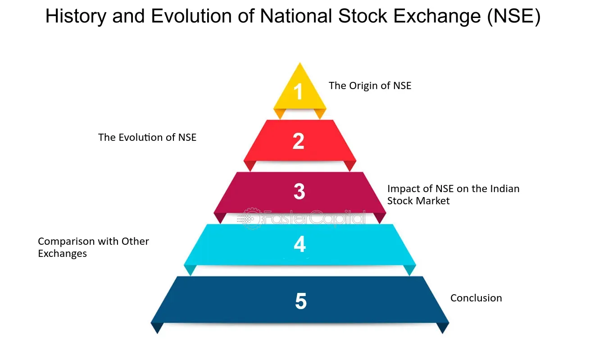

## Table of Contents

## What is the Indian stock market and why is it important?

The Indian stock market is a place where people can buy and sell shares of companies. It is like a big store where instead of buying things like clothes or food, you buy small pieces of big companies. The two main stock markets in India are the Bombay Stock Exchange (BSE) and the National Stock Exchange (NSE). When you buy shares, you become a part-owner of the company and can earn money if the company does well.

The Indian stock market is important for many reasons. It helps companies get money to grow their business by selling shares to the public. This is good for the economy because it creates jobs and helps the country develop. For people, the stock market is a way to invest their money and possibly earn more money over time. It also shows how well the economy is doing; if the stock market is going up, it usually means the economy is doing well, and if it is going down, it might mean the economy is struggling.

## What are the main stock exchanges in India?

The main stock exchanges in India are the Bombay Stock Exchange (BSE) and the National Stock Exchange (NSE). The BSE is the oldest stock exchange in Asia, started in 1875. It is located in Mumbai and is known for its benchmark index called the Sensex, which tracks the performance of the top 30 companies listed on the exchange.

The NSE, on the other hand, was founded in 1992 and is also based in Mumbai. It is the largest stock exchange in India in terms of the number of trades. The NSE's main index is called the Nifty 50, which tracks the performance of the top 50 companies listed on the exchange. Both the BSE and NSE play a crucial role in the Indian economy by helping companies raise money and allowing people to invest in them.

## How do the Bombay Stock Exchange (BSE) and the National Stock Exchange (NSE) differ?

The Bombay Stock Exchange (BSE) and the National Stock Exchange (NSE) are both important stock markets in India, but they have some differences. The BSE is older and was started in 1875, making it the oldest stock exchange in Asia. It is located in Mumbai and is famous for its Sensex index, which shows how the top 30 companies on the BSE are doing. The BSE is known for having a large number of listed companies, with over 5,000 companies trading on it.

The NSE, on the other hand, was founded much later in 1992 and is also based in Mumbai. It is the biggest stock exchange in India when it comes to the number of trades that happen every day. The NSE's main index is called the Nifty 50, which tracks the performance of the top 50 companies listed on the exchange. The NSE is known for its modern technology and electronic trading system, which makes it easier and faster for people to buy and sell shares.

Both the BSE and NSE are important for the Indian economy. They help companies get money to grow and give people a way to invest their money. While the BSE has more listed companies, the NSE is known for its high trading [volume](/wiki/volume-trading-strategy) and advanced technology.

## What are stock market indexes and why are they important?

Stock market indexes are like scorecards for the stock market. They show how a group of stocks is doing by putting their prices together into one number. In India, the Sensex is an index for the Bombay Stock Exchange (BSE) and it looks at the top 30 companies. The Nifty 50 is an index for the National Stock Exchange (NSE) and it looks at the top 50 companies. These indexes help people see if the stock market is going up or down without having to check every single stock.

Indexes are important because they give a quick and easy way to understand the health of the stock market and the economy. If the Sensex or Nifty 50 goes up, it usually means that the companies in India are doing well and people feel good about the economy. If the indexes go down, it might mean that people are worried about the economy. Investors use these indexes to make decisions about buying or selling stocks, and they also help people who don't invest to understand how the economy is doing.

## What are the major stock market indexes in India?

The major stock market indexes in India are the Sensex and the Nifty 50. The Sensex, which stands for Sensitive Index, is run by the Bombay Stock Exchange (BSE). It tracks the performance of the top 30 companies listed on the BSE. These companies are big and important, so the Sensex helps people see how the overall market and economy are doing.

The Nifty 50 is run by the National Stock Exchange (NSE). It looks at the top 50 companies listed on the NSE. Like the Sensex, the Nifty 50 gives a quick snapshot of how the stock market is doing. Both indexes are important because they help investors and regular people understand if the economy is growing or if there might be problems.

## How is the Sensex calculated and what does it represent?

The Sensex is calculated by taking the prices of the top 30 companies listed on the Bombay Stock Exchange (BSE) and putting them together into one number. It uses a method called the "free-float market capitalization" method. This means it looks at how much of the company's stock is available for people to buy and sell, not the total value of the company. The prices of these 30 companies are added up and then divided by a special number called the "index divisor" to make the Sensex. This divisor changes over time to keep the Sensex fair and accurate.

The Sensex represents how well the biggest and most important companies in India are doing. It's like a report card for the Indian stock market. When the Sensex goes up, it usually means that these big companies are doing well and people feel good about the economy. If the Sensex goes down, it might mean that people are worried about the economy. The Sensex is important because it helps investors decide when to buy or sell stocks, and it gives everyone a quick way to see how the stock market is doing.

## What is the Nifty 50 and how does it differ from the Sensex?

The Nifty 50 is an important stock market index in India that is run by the National Stock Exchange (NSE). It looks at the top 50 companies listed on the NSE and puts their prices together into one number. Like the Sensex, the Nifty 50 uses a method called "free-float market capitalization" to calculate its value. This means it only counts the shares of the companies that are available for people to buy and sell. The Nifty 50 helps people see how the Indian stock market is doing by showing if these big companies are doing well or not.

The Nifty 50 is different from the Sensex in a few ways. The main difference is that the Nifty 50 tracks 50 companies, while the Sensex tracks 30 companies. Also, the Nifty 50 is run by the NSE, while the Sensex is run by the BSE. Both indexes are important because they help people understand the health of the economy, but they look at slightly different groups of companies. The Nifty 50 is often seen as a bit more representative of the overall market because it includes more companies.

## How can one invest in the Indian stock market?

To invest in the Indian stock market, you first need to open a trading account with a stockbroker. A stockbroker is like a helper who lets you buy and sell shares. You can choose from many brokers, both online and offline. Once you have your account, you need to put money into it. This money is what you'll use to buy shares of companies. You can then use the broker's platform to pick which companies you want to invest in. You can buy shares of big companies like those in the Sensex or Nifty 50, or smaller companies that you think will do well.

After you've bought shares, you can keep an eye on how they're doing by watching the stock market. If the price of your shares goes up, you can sell them for a profit. If the price goes down, you might lose money. It's a good idea to learn about the companies you're investing in and maybe even talk to a financial advisor to help you make smart choices. Investing in the stock market can be a good way to grow your money over time, but it also comes with risks, so it's important to be careful and do your homework.

## What are the trading hours and holidays for the Indian stock market?

The Indian stock market is open from Monday to Friday. The trading hours for the Bombay Stock Exchange (BSE) and the National Stock Exchange (NSE) are from 9:15 AM to 3:30 PM Indian Standard Time (IST). There is also a pre-open session from 9:00 AM to 9:15 AM where you can place orders before the market officially opens. This helps make sure the market starts smoothly.

The Indian stock market is closed on weekends, which are Saturday and Sunday. It also has holidays throughout the year. These holidays include national holidays like Republic Day on January 26th, Independence Day on August 15th, and Gandhi Jayanti on October 2nd. There are also other holidays like Diwali, Holi, and Good Friday. The list of holidays can change a little bit each year, so it's a good idea to check the BSE or NSE website to see when the market will be closed.

## What are the regulations and oversight bodies for the Indian stock market?

The Indian stock market is regulated by the Securities and Exchange Board of India (SEBI). SEBI is like a big boss that makes sure everyone follows the rules when buying and selling shares. They make rules to keep the market fair and safe for everyone. SEBI also checks to make sure that companies tell the truth about their business when they want to sell shares to the public. If someone breaks the rules, SEBI can punish them to keep the market honest.

Besides SEBI, there are other groups that help watch over the stock market. The stock exchanges themselves, like the Bombay Stock Exchange (BSE) and the National Stock Exchange (NSE), have their own rules and people who make sure those rules are followed. They keep an eye on trading to stop any bad behavior. The Ministry of Finance and the Reserve Bank of India (RBI) also play a role in making sure the whole financial system, including the stock market, works well and stays stable.

## How do global economic events impact the Indian stock market?

Global economic events can have a big effect on the Indian stock market. When something big happens in another country, like a financial crisis or a change in interest rates, it can make people in India worried about their own economy. For example, if the U.S. stock market goes down a lot, people might start selling their shares in India too, because they think the same thing might happen here. Also, if there's a big problem in the world, like a war or a health crisis, it can make companies in India have a harder time doing business, which can make their stock prices go down.

On the other hand, good news from around the world can help the Indian stock market too. If other countries are doing well, it can make people feel more confident about investing in India. For example, if a big country like China starts buying more things from India, it can help Indian companies make more money and their stock prices might go up. So, what happens in the rest of the world can make the Indian stock market go up or down, depending on whether the news is good or bad.

## What advanced trading strategies can be used in the Indian stock market?

Advanced trading strategies in the Indian stock market can help people make smarter choices about buying and selling shares. One popular strategy is called "technical analysis." This means looking at charts and graphs to see how stock prices have moved in the past and trying to guess where they might go next. Traders use tools like moving averages, which help smooth out price changes over time, and the Relative Strength Index (RSI), which shows if a stock might be overbought or oversold. Another strategy is "[momentum](/wiki/momentum) trading," where people buy stocks that are going up quickly and sell them before they start to go down. This can be risky but can also lead to big profits if done right.

Another advanced strategy is "options trading." Options are special contracts that give you the right to buy or sell a stock at a certain price by a certain date. Traders use options to bet on where they think the stock market will go without actually buying the stocks themselves. This can be a good way to make money if you're right about the market, but it can also lead to big losses if you're wrong. "Arbitrage" is another strategy where traders look for small differences in price between different markets or different forms of the same stock, and they buy and sell quickly to make a profit from these differences. All these strategies need a lot of knowledge and practice, and they can be risky, so it's important to learn about them carefully before trying them out.

## References & Further Reading

[1]: Narang, R. (2013). ["Inside the Black Box: A Simple Guide to Quantitative and High Frequency Trading."](https://onlinelibrary.wiley.com/doi/book/10.1002/9781118662717) Wiley.

[2]: De Prado, M. L. (2018). ["Advances in Financial Machine Learning."](https://www.amazon.com/Advances-Financial-Machine-Learning-Marcos/dp/1119482089) Wiley.

[3]: Bouchentouf, A., & Singh, S. (2019). ["Algorithmic Trading: A Comprehensive Beginner's Guide to Learn Algorithmic Trading and its Basics."](https://pmc.ncbi.nlm.nih.gov/articles/PMC7792680/) 

[4]: Bandy, T. (2018). ["Quantitative Technical Analysis: An Integrated Approach to Trading System Development and Trading Management."](https://www.semanticscholar.org/paper/Quantitative-Technical-Analysis%3A-An-integrated-to-Bandy/81d4a1143830060c941ca24d7f4b3d29cf297546) Blue Owl Press.

[5]: Securities and Exchange Board of India. (2018). ["Framework for Algorithmic Trading."](https://www.sebi.gov.in/legal/regulations/feb-2022/securities-and-exchange-board-of-india-depositories-and-participants-regulations-2018-last-amended-on-february-23-2022-_56449.html) SEBI Circular. 

[6]: Deboeck, G. J. (1994). ["Trading on the Edge: Neural, Genetic, and Fuzzy Systems for Chaotic Financial Markets."](https://dl.acm.org/doi/book/10.5555/528266) Wiley. 

[7]: Patel, I., & Deshpande, D. (2018). "Algorithmic Trading in India: An Empirical Study." International Journal of Trade, Economics and Finance, 9(3). 

