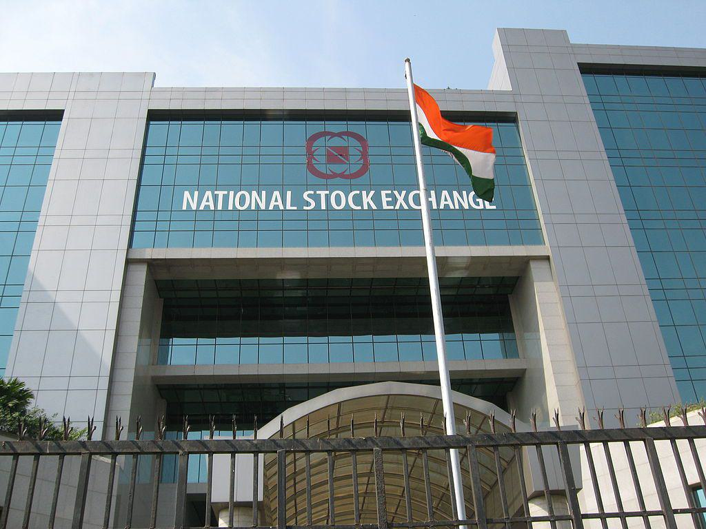

The Indian stock market is a cornerstone of the country's financial system, offering a platform for corporations to raise capital and investors to participate in economic growth. It comprises several stock exchanges, the most prominent being the National Stock Exchange (NSE) and the Bombay Stock Exchange (BSE). These exchanges facilitate the buying and selling of stocks, bonds, and other financial instruments. Traditionally, trading activities were conducted manually, but technological advancements have transformed the landscape into a highly automated environment.

Stock indexes, such as the NIFTY 50 and the SENSEX, play a crucial role in reflecting the performance of the Indian stock market. The NIFTY 50, an index of the NSE, and the SENSEX, representing the BSE, consist of the top-performing companies and serve as benchmarks for market sentiment and economic health. These indexes provide investors with a snapshot of market trends and help in investment decision-making.

Algorithmic trading has emerged as a significant development in the securities market. It involves the use of computer algorithms to execute trades at speeds and frequencies impossible for human traders. This method leverages mathematical models and statistical analyses to maximize trading efficiency and accuracy. In India, algorithmic trading is gaining traction due to exchanges facilitating high-speed trading and the continuous evolution of technological infrastructure. The speed and precision of algorithmic trading offer distinct advantages, such as improved market liquidity, better price discovery, and reduced transaction costs.

This article aims to explore the intricacies of the Indian stock market, focusing on the interconnected roles of exchanges, indexes, and algorithmic trading. Readers will gain insights into how these components interact to shape the trading environment. Understanding these dynamics is vital, as they contribute to market efficiency and stability, impacting investors, traders, and the broader economy.

With the Indian stock market entering a new era marked by rapid technological evolution, comprehending the synergy between exchanges, indexes, and algorithmic trading becomes imperative for anyone involved in trading activities. This article promises to provide a comprehensive overview, equipping readers with the knowledge necessary to navigate and succeed in this transformative period.

## Table of Contents

## Understanding Exchanges and Indexes

Stock exchanges in India, primarily the National Stock Exchange (NSE) and Bombay Stock Exchange (BSE), are pivotal institutions in the Indian financial ecosystem. These exchanges serve as platforms facilitating the buying and selling of securities, including stocks, bonds, and derivatives. They ensure the transparent and efficient execution of trades, thereby instilling investor confidence in the market. The NSE, established in 1992, is one of the largest exchanges globally by market capitalization and provides a fully automated screen-based trading system. The BSE, on the other hand, is the oldest stock exchange in Asia, founded in 1875, and was traditionally known for its open outcry trading system before transitioning to electronic trading.

Stock market indexes, such as NIFTY and SENSEX, are essential components of these exchanges. NIFTY 50, associated with the NSE, comprises 50 major stocks, representing about 66.8% of the free-float market capitalization of all the companies listed on the NSE. SENSEX, the flagship index of the BSE, comprises 30 well-established and financially sound companies, representing various industrial sectors of the economy. These indexes are critical indicators of market performance, reflecting the overall market sentiment and economic health. They serve as benchmarks for investors, allowing them to gauge market trends and make informed decisions.

The interrelation between exchanges and indexes is fundamental to the trading ecosystem. Exchanges provide the infrastructure for stocks to be listed and traded, while indexes offer a snapshot of market trends, enabling traders to evaluate market performance effectively. This dynamic forms the backbone of market analysis and trading strategies, influencing a wide range of stakeholders, from retail investors to large institutional traders.

Recent trends in Indian exchanges and indexes include an increased focus on technology and innovation to enhance market accessibility and efficiency. Both NSE and BSE have adopted advanced trading platforms and data analytics tools to improve transparency and execution speed. The growth of Exchange-Traded Funds (ETFs) and index-based derivatives signifies a shift towards passive investing, further highlighting the importance of indexes in the financial markets. Additionally, initiatives to list new age digital companies and small and medium enterprises (SMEs) indicate a broadening of market opportunities.

As the Indian stock market continues to evolve, the role of exchanges and indexes remains more significant than ever, providing critical insights and facilitating the seamless operation of trading activities. These developments underscore the necessity for continual adaptation to technological advancements and changing market dynamics.

## Algorithmic Trading: The New Era

Algorithmic trading, often referred to as algo trading, leverages computer algorithms to automate the decision-making process for trading in financial markets. This form of trading utilizes pre-defined sets of rules and conditions to execute orders at optimal speeds and moments, often much faster than human traders could achieve manually. Unlike traditional trading, which relies heavily on human intuition and analysis, [algorithmic trading](/wiki/algorithmic-trading) is characterized by its reliance on complex mathematical models and high-speed data processing.

### Historical Background and Global Trends

The evolution of algorithmic trading traces back to the late 1970s and early 1980s when it began making headway in U.S. markets. It gained prominence with the advent of electronic trading platforms, offering new opportunities to execute trades rapidly and on a large scale. As markets became more interconnected globally, algorithmic trading strategies expanded across Europe and Asia. The rise of electronic communication networks (ECNs) and the adoption of Direct Market Access (DMA) catalyzed the growth of algo trading across various asset classes.

### Growth and Adoption in India

In India, algorithmic trading has seen significant growth over the past decade. The National Stock Exchange (NSE) introduced DMA in 2008, which was a critical milestone that enabled the development of algo trading in the country. This move paved the way for institutional investors and hedge funds to implement sophisticated trading strategies at lower costs. By 2020, algorithmic trading accounted for around 50% of the total trading [volume](/wiki/volume-trading-strategy) on the NSE, highlighting its substantial adoption among market participants. Factors such as technological advancements, increased data availability, and the competitive nature of financial markets have driven the widespread adoption of algo trading strategies in India.

### Advantages for Market Participants

Algo trading offers several advantages for market participants:

- **Speed and Efficiency**: Algorithms can execute trades much faster than human traders, allowing participants to capitalize on small price movements quickly.

- **Cost Reduction**: Automation reduces transaction costs by minimizing human intervention and increasing efficiency.

- **Minimized Emotional Influence**: Algorithms operate on pre-defined rules, thus eliminating emotional biases from trading decisions.

- **Enhanced Market Liquidity**: High-frequency strategies often contribute to increased market liquidity, making it easier to buy and sell large volumes quickly.

- **Precision**: Algo trading enables precise entry and exit points, thus optimizing the timing and size of trades.

### Current Regulations and Compliance

Algo trading in India is subject to a regulatory framework established by the Securities and Exchange Board of India (SEBI). SEBI sets detailed guidelines to ensure market integrity and prevent systemic risk. Key regulations include the requirement for brokers to obtain prior approval for the use of algorithms, mandatory risk checks for all orders, and periodic audits of algorithmic systems. These regulations are designed to safeguard against market manipulation and to maintain fair trading practices.

The compliance standards focus on maintaining transparency and accountability in algo trading activities, requiring detailed reporting of algorithmic trade data. Additionally, SEBI mandates robust risk management measures to handle market [volatility](/wiki/volatility-trading-strategies) and operational risks. As the market evolves, regulations are continually refined to address emerging challenges and to align with international best practices.

In conclusion, algorithmic trading represents a transformative shift in the Indian financial markets, characterized by speed, efficiency, and enhanced market [liquidity](/wiki/liquidity-risk-premium). As it continues to grow, both the opportunities and regulatory challenges signify its dynamic nature in India's trading ecosystem.

## The Impact of Algo Trading on Exchanges and Indexes

Algorithmic trading has significantly transformed the landscape of stock exchanges and indexes in India, predominantly through its influence on market liquidity and efficiency. By using sophisticated algorithms to execute trades at speeds unattainable by human traders, algorithmic trading enhances liquidity by providing continuous bid and ask quotes, thus narrowing the bid-ask spread. This increased liquidity has the potential to improve market efficiency, as it facilitates faster absorption of information into stock prices.

Moreover, algorithmic trading plays a crucial role in price discovery and affecting volatility. Automated systems can rapidly process vast amounts of market data and execute trades based on pre-established criteria, which aids in more accurate price setting. However, these systems can also contribute to increased short-term volatility. The rapid execution can sometimes lead to erratic price movements, particularly in less liquid securities or during times of market stress.

The rise of algorithmic trading has led to noticeable changes in trading volumes on Indian exchanges. Data suggests a marked increase in overall trade volumes on both the National Stock Exchange (NSE) and the Bombay Stock Exchange (BSE) as algorithmic strategies have gained prominence. The utilization of high-frequency trading - a subset of algorithmic trading - has particularly contributed to this rise, as it involves executing a large number of orders at extremely high speeds.

As for the impact on stock market indexes such as NIFTY and SENSEX, algorithmic trading can both enhance and challenge their performance and reliability. On one hand, it promotes efficiency by ensuring that index prices reflect all available information quickly. On the other hand, the susceptibility of algorithms to glitches or unforeseen market data can lead to flash crashes or spikes, which might temporarily distort index values. 

A notable example illustrating the impact of algorithmic trading in India is the 'Flash Crash' of 2012 on the NSE, where a drastic drop in the SENSEX index occurred due to erroneous sell orders placed by a brokerage firm’s automated trading system. This incident highlighted the need for robust regulatory frameworks and safeguards to mitigate risks associated with algorithmic trading.

In conclusion, while algorithmic trading has undeniably contributed to improved liquidity and efficiency in Indian markets, its impact on volatility and index performance necessitates ongoing scrutiny to ensure stability and reliability within the financial ecosystem.

## Challenges and Future Prospects

Algorithmic trading in India has experienced considerable growth, yet it is not without challenges. Traders face several hurdles such as latency issues, market fragmentation, and the need for compliance with stringent regulations. High-frequency trading ([HFT](/wiki/high-frequency-trading-strategies)) requires infrastructure capable of minimizing latency to micro or even nanoseconds, which can be difficult due to technical constraints or lack of resources.

Another major challenge is the fragmentation of the Indian stock market. With various exchanges like the National Stock Exchange (NSE) and Bombay Stock Exchange (BSE), algo traders must adapt their strategies to maintain efficiency across platforms. The constant evolution of trading algorithms necessitates continuous adaptation, a considerable task given the rapid pace of technological advancements.

Potential risks associated with algorithmic trading include market manipulation and flash crashes. Algorithms, without proper oversight, can lead to unintended consequences, such as price manipulation or rapid sell-offs, contributing to market instability. The Securities and Exchange Board of India (SEBI) imposes rigorous compliance requirements to mitigate such risks, necessitating traders to maintain transparency and prevent the misuse of algorithms.

Technological advancements are significantly shaping the future of algorithmic trading. Improved processing power, reduced latencies, and sophisticated algorithms are enhancing decision-making and execution speeds. The incorporation of [machine learning](/wiki/machine-learning) and [artificial intelligence](/wiki/ai-artificial-intelligence) offers smarter trading decisions and predictive analytics, allowing traders to anticipate market trends effectively.

Looking ahead, the evolution of exchanges and indexes will be geared towards greater technological integration, aiming to accommodate the growing demands of high-frequency trading. It is anticipated that exchanges will invest in cutting-edge infrastructure to support faster trading speeds and enhanced security protocols.

The Indian algorithmic trading landscape is expected to grow more competitive, presenting opportunities for both new entrants and existing players. Traders with superior technological capabilities and unique algorithmic strategies will find opportunities for success. Furthermore, as the market becomes more mature, the demand for specialized skills in data analysis and algorithm design is likely to increase, offering avenues for professionals in these domains.

To conclude, while algorithmic trading in India faces challenges related to technology and regulation, its future is promising with advancements that could redefine trading dynamics. Understanding these challenges and embracing technological innovation will be critical for sustaining growth and efficiency in the market.

## Conclusion

The Indian stock market continues to evolve, underpinned by the critical infrastructure of exchanges and indexes, which are pivotal in the growing practice of algorithmic trading. Stock exchanges like the National Stock Exchange (NSE) and Bombay Stock Exchange (BSE) provide the necessary platforms for trading activities, while indexes such as NIFTY and SENSEX serve as vital indicators of market performance, reflecting the economic health and investment sentiment within India.

Algorithmic trading, characterized by the use of automated, pre-programmed trading instructions, has significantly impacted these platforms. It enhances market liquidity and increases trading volumes, thereby facilitating efficient price discovery. The influence of algo trading is evident in the way it smooths market operations, although it also introduces challenges related to market volatility and regulatory compliance.

Looking forward, the future landscape of the Indian stock market is poised for further transformation. With continuous technological advancements, including artificial intelligence and machine learning, algorithmic trading is set to gain even more prominence. This evolution will likely bring about greater efficiency and new opportunities, yet it demands vigilance toward potential risks, such as system failures or market manipulation.

Investors and traders are encouraged to remain informed and adaptive, as understanding the underlying mechanics of exchanges, indexes, and algo trading is crucial for capitalizing on market opportunities. Engaging with algorithmic trading allows participants to harness its potential benefits, from improved execution speed to strategic diversification, thereby fostering a more dynamic and resilient trading environment.

Thus, as the Indian stock market advances, staying abreast of developments and participating in the algo trading landscape is crucial for those seeking to thrive in this evolving financial ecosystem.

## References & Further Reading

[1]: Narang, R. (2013). ["Inside the Black Box: A Simple Guide to Quantitative and High Frequency Trading."](https://onlinelibrary.wiley.com/doi/book/10.1002/9781118662717) Wiley.

[2]: De Prado, M. L. (2018). ["Advances in Financial Machine Learning."](https://www.amazon.com/Advances-Financial-Machine-Learning-Marcos/dp/1119482089) Wiley.

[3]: Bouchentouf, A., & Singh, S. (2019). ["Algorithmic Trading: A Comprehensive Beginner's Guide to Learn Algorithmic Trading and its Basics."](https://pmc.ncbi.nlm.nih.gov/articles/PMC7792680/) 

[4]: Bandy, T. (2018). ["Quantitative Technical Analysis: An Integrated Approach to Trading System Development and Trading Management."](https://www.semanticscholar.org/paper/Quantitative-Technical-Analysis%3A-An-integrated-to-Bandy/81d4a1143830060c941ca24d7f4b3d29cf297546) Blue Owl Press.

[5]: Securities and Exchange Board of India. (2018). ["Framework for Algorithmic Trading."](https://www.sebi.gov.in/legal/regulations/feb-2022/securities-and-exchange-board-of-india-depositories-and-participants-regulations-2018-last-amended-on-february-23-2022-_56449.html) SEBI Circular. 

[6]: Deboeck, G. J. (1994). ["Trading on the Edge: Neural, Genetic, and Fuzzy Systems for Chaotic Financial Markets."](https://dl.acm.org/doi/book/10.5555/528266) Wiley. 

[7]: Patel, I., & Deshpande, D. (2018). "Algorithmic Trading in India: An Empirical Study." International Journal of Trade, Economics and Finance, 9(3). 

