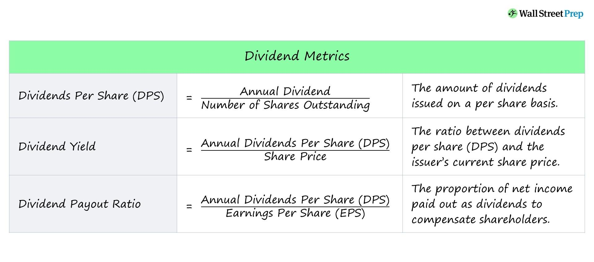

## Table of Contents

## What is an indicated dividend?

An indicated dividend is the amount of money a company expects to pay out to its shareholders in the future, based on its current dividend payments. It is calculated by taking the most recent dividend payment and multiplying it by the number of times that payment is made in a year. For example, if a company pays a quarterly dividend of $0.50 per share, the indicated dividend would be $2.00 per share per year.

This figure is useful for investors because it gives them an idea of the income they can expect to receive from their investment in the company. It helps them compare the potential returns from different investments. However, it's important to remember that the indicated dividend is just an estimate. The actual dividends paid out can change if the company's financial situation changes or if its board of directors decides to adjust the dividend policy.

## How is an indicated dividend different from an actual dividend?

An indicated dividend is like a guess about how much money a company will pay out to its shareholders in the future. It's based on what the company is paying now. For example, if a company pays $0.50 every three months, the indicated dividend would be $2.00 for the whole year. This helps people who invest in the company to plan their money and see what they might get back.

An actual dividend is the real money that a company pays out to its shareholders. It's not a guess; it's what you actually get in your pocket. Sometimes, the actual dividend can be different from the indicated dividend. This can happen if the company makes more or less money than expected, or if the people in charge decide to change how much they pay out. So, the indicated dividend is just a helpful tool, but the actual dividend is what really matters to investors.

## Why is the indicated dividend important for investors?

The indicated dividend is important for investors because it helps them figure out how much money they might get back from their investment in the future. It's like a sneak peek at what the company plans to pay out based on what it's doing now. This can help investors decide if they want to put their money into a certain company or if they should look somewhere else.

Knowing the indicated dividend also lets investors compare different companies. They can see which ones might give them more money back and make better choices about where to invest. But, it's good to remember that the indicated dividend is just a guess. The actual money you get can be different if things change at the company. So, while it's a useful tool, it's not a promise.

## How do you calculate the indicated dividend for a stock?

To calculate the indicated dividend for a stock, you need to know the most recent dividend payment and how often the company pays dividends. If a company pays a dividend every three months, that's called a quarterly dividend. Let's say the quarterly dividend is $0.50 per share. To find the indicated dividend, you multiply the quarterly dividend by four, because there are four quarters in a year. So, $0.50 times four equals $2.00. That means the indicated dividend is $2.00 per share for the whole year.

Sometimes, a company might pay dividends in other ways, like monthly or semi-annually. If it's monthly, you'd multiply the monthly dividend by twelve to get the yearly indicated dividend. For example, if the monthly dividend is $0.10, the indicated dividend would be $0.10 times twelve, which equals $1.20 per share for the year. If it's semi-annually, you'd multiply the semi-annual dividend by two. The key is to know how often the dividend is paid and then multiply that amount by the number of payments in a year.

## What are the key components needed to compute the indicated dividend?

To compute the indicated dividend, you need to know two main things: the amount of the most recent dividend payment and how often the company pays dividends. The dividend payment could be monthly, quarterly, semi-annually, or annually. For example, if a company pays a dividend every three months, that's a quarterly dividend. If you know the company paid $0.50 per share last quarter, you can use that information to figure out the indicated dividend.

Once you have these two pieces of information, calculating the indicated dividend is easy. You just multiply the most recent dividend payment by the number of times it's paid in a year. If it's a quarterly dividend of $0.50, you'd multiply $0.50 by four because there are four quarters in a year. That gives you an indicated dividend of $2.00 per share for the year. This helps investors guess how much money they might get from the company in the future.

## Can the indicated dividend change, and if so, why?

Yes, the indicated dividend can change. It's like a guess about how much money a company will pay out to its shareholders in the future. If the company's situation changes, like if it makes more or less money than expected, the indicated dividend might need to be updated. Also, if the people in charge of the company decide to change how much they pay out, that can affect the indicated dividend too.

For example, if a company was doing well and decided to increase its quarterly dividend from $0.50 to $0.60, the new indicated dividend would be $2.40 per year instead of $2.00. On the other hand, if the company ran into financial trouble and had to cut its dividend to $0.40, the indicated dividend would drop to $1.60. So, while the indicated dividend is a helpful tool for planning, it's not set in stone and can change based on what happens with the company.

## How does the frequency of dividend payments affect the indicated dividend?

The frequency of dividend payments is really important when figuring out the indicated dividend. It tells you how often the company gives money to its shareholders. If a company pays dividends every three months, that's called a quarterly dividend. To find the indicated dividend, you take the amount of the quarterly dividend and multiply it by four, because there are four quarters in a year. So, if the quarterly dividend is $0.50, the indicated dividend would be $2.00 for the whole year.

But, if the company pays dividends in a different way, like every month or every six months, you need to change how you calculate the indicated dividend. For a monthly dividend, you'd multiply the monthly amount by twelve, since there are twelve months in a year. If the monthly dividend is $0.10, the indicated dividend would be $1.20. For a semi-annual dividend, you'd multiply the amount by two, because there are two six-month periods in a year. So, the frequency of the dividend payments directly affects how you calculate the indicated dividend, helping investors understand what they might get back from their investment.

## What role does the company's dividend policy play in the indicated dividend?

The company's dividend policy is like a set of rules that decides how much money the company will pay out to its shareholders and how often. This policy is really important because it directly affects the indicated dividend. The indicated dividend is a guess about how much money shareholders might get in the future, based on what the company is doing now. If the company has a policy to pay a certain amount every three months, that's called a quarterly dividend. To find the indicated dividend, you multiply that quarterly amount by four, because there are four quarters in a year.

But, the company's dividend policy can change. If the people in charge decide to increase or decrease the dividend payments, that changes the indicated dividend too. For example, if the company decides to pay more money each quarter because it's doing well, the indicated dividend goes up. If it has to cut the dividend because it's not making as much money, the indicated dividend goes down. So, the dividend policy is a big deal because it shapes what investors think they might get back from their investment, even though it's just a guess and can change.

## How can investors use the indicated dividend to assess a stock's performance?

Investors can use the indicated dividend to get a good idea of how much money they might get back from a stock in the future. It's like a guess based on what the company is paying out right now. If a company pays a dividend every three months and the last payment was $0.50, the indicated dividend would be $2.00 for the whole year. This helps investors see if the stock might give them a good return on their money. They can compare the indicated dividend of different stocks to see which one might pay them more.

But, it's important to remember that the indicated dividend is just a guess. It can change if the company's situation changes or if the people in charge decide to pay out more or less money. So, while it's a helpful tool for planning, investors should also look at other things like the company's overall health and how its stock price is doing. By using the indicated dividend along with other information, investors can make smarter choices about where to put their money.

## What are the limitations of using the indicated dividend as an investment metric?

The indicated dividend is a helpful guess about how much money a company might pay out to its shareholders in the future. But it's not perfect. It's based on what the company is doing right now, and things can change. If the company makes more or less money than expected, or if the people in charge decide to change how much they pay out, the actual dividend can be different from what was indicated. So, investors should be careful and not rely only on the indicated dividend when deciding where to put their money.

Also, the indicated dividend doesn't tell the whole story about a company's health or how its stock is doing. It's just one piece of the puzzle. Investors need to look at other things too, like how the company is growing, its debts, and what other people think about its stock. If they focus too much on the indicated dividend, they might miss important signs that the company isn't doing as well as it seems. So, while the indicated dividend can be a useful tool, it's important to use it along with other information to make the best investment choices.

## How does the indicated dividend relate to yield calculations?

The indicated dividend is closely tied to the dividend yield, which is a way to figure out how much money you're getting back from your investment compared to what you paid for it. To find the dividend yield, you take the indicated dividend and divide it by the current price of the stock. For example, if the indicated dividend is $2.00 and the stock price is $50, the dividend yield would be 4% ($2.00 divided by $50, then multiplied by 100 to get a percentage).

But, just like the indicated dividend, the dividend yield can change. If the stock price goes up or down, or if the company changes how much it pays out in dividends, the yield will be different. So, the indicated dividend is important because it helps you calculate the dividend yield, which gives you a quick way to see how much return you might get from a stock. But remember, it's a guess, and things can change, so it's good to look at other stuff too when deciding where to invest your money.

## In what ways can advanced financial models incorporate the indicated dividend for forecasting?

Advanced financial models can use the indicated dividend to help guess what might happen with a company's future payments to shareholders. These models take the indicated dividend, which is a guess based on what the company is paying out now, and use it to make predictions. They look at things like how often the company pays dividends, how much it's paying, and how these payments have changed in the past. By putting all this information together, the models can help investors see what they might get back from their investment in the future.

But, these models also know that the indicated dividend is just a guess and can change. So, they use other information too, like how the company is doing overall, what's happening in the economy, and what other experts think. This helps make the predictions more accurate. By including the indicated dividend along with other data, advanced financial models can give investors a better idea of what to expect, but they always remind investors that things can change and to be ready for that.

## How can one understand dividend calculations?

Dividends are regular payments made by a corporation to its shareholders out of its profits or reserves. They serve as a tangible measure of financial health, signaling a company's profitability and stability. When a company generates a profit, it can choose to reinvest in its operations or distribute a portion of these earnings to shareholders in the form of dividends. Companies that pay regular dividends are often perceived as financially stable, which can attract more investors and provide a cushion against stock [volatility](/wiki/volatility-trading-strategies).

There are several types of dividends that a company may issue: 

**Cash Dividends**: Cash dividends are the most straightforward form, where shareholders receive a cash payment. Typically paid on a per-share basis, this type of dividend provides immediate and tangible value to shareholders. Cash dividends are commonly distributed quarterly.

**Stock Dividends**: Unlike cash dividends, stock dividends involve issuing additional shares to shareholders. This increases the total number of shares outstanding, and each shareholder owns a slightly larger portion of the company. This approach allows companies to reward shareholders without reducing their cash reserves.

**Special Dividends**: Special dividends, or one-time dividends, are extraordinary payouts that may be issued when a company experiences unexpectedly high profits or liquidates an asset. While not part of a regular dividend schedule, they can offer windfall gains to shareholders.

Calculating dividends involves understanding several key metrics. The dividend yield is one such metric, calculated as:

$$
\text{Dividend Yield} = \left( \frac{\text{Annual Dividends per Share}}{\text{Price per Share}} \right) \times 100
$$

This formula provides a percentage that indicates what an investor might expect to earn from dividends in relation to the share price.

Another critical measure is the payout ratio, calculated as:

$$
\text{Dividend Payout Ratio} = \left( \frac{\text{Dividends Paid}}{\text{Net Income}} \right) \times 100
$$

This ratio helps assess the sustainability of dividends by comparing the total dividends paid to the company's net income. A higher payout ratio could imply less room for dividend growth or reinvestment into the business.

Understanding the importance and calculation of dividends is vital for evaluating a company's profitability and future payout potential. Dividends offer insight into management's confidence in the company's continued success. A consistent dividend payment or gradual increase in dividends reflects positively on a company's financial structure, indicating a balanced allocation of resources and strategic growth.

## What are the methods for dividend calculation?

In the financial market, understanding dividend calculations is fundamental for investors aiming to evaluate a company's profitability and predict future income accurately. Methods for dividend calculation provide insights using both historical and projected methodologies, which [factor](/wiki/factor-investing) in growth or contraction projections based on market conditions.

### Traditional Methods

Traditional dividend calculation methods involve examining historical data to assess the stability and reliability of dividend payouts. This approach generally comprises a review of the Dividend Per Share (DPS), Dividend Yield, and Dividend Payout Ratio.

1. **Dividend Per Share (DPS)** is calculated by dividing the total dividends paid out by a company over a period by the number of outstanding shares. This provides investors with an idea of the value of dividends they would earn per share.
$$
   \text{DPS} = \frac{\text{Total Dividends Paid}}{\text{Number of Outstanding Shares}}

$$

2. **Dividend Yield** is a financial ratio that shows how much a company pays out in dividends each year relative to its stock price. It is a useful measure for comparing the income-generating ability of different investments.
$$
   \text{Dividend Yield} = \frac{\text{DPS}}{\text{Stock Price per Share}} \times 100

$$

3. **Dividend Payout Ratio** assesses the proportion of earnings a company distributes as dividends to shareholders. It helps in understanding if the dividends are sustainable in the long term.
$$
   \text{Dividend Payout Ratio} = \frac{\text{Dividends per Share}}{\text{Earnings per Share (EPS)}} \times 100

$$

### Growth/Contraction Projections

While historical data provides a snapshot of the past, growth and contraction projections enable investors to anticipate future dividend changes by considering market trends and economic factors. This involves:

- **Dividend Growth Models**, such as the Gordon Growth Model, which assumes that dividends will increase at a constant growth rate indefinitely. The formula helps determine the present value of an infinite series of future dividends.
$$
  P = \frac{D_0 \times (1 + g)}{r - g}

$$

  where $P$ is the current stock price, $D_0$ is the current dividend, $g$ is the growth rate of the dividend, and $r$ is the required rate of return.

- **Economic and Market Analysis**: This involves examining broader economic indicators, such as GDP growth, inflation, and interest rates, which can influence a company’s ability to maintain or grow dividends.

- **Scenario Analysis and Stress Testing**: Investors may use scenario analysis to understand how different economic conditions could affect dividend payments. Stress testing helps in evaluating how extreme market conditions might impact a company’s dividend policy.

### Understanding Forecasting Methods

By integrating both historical data and growth/contraction projections, investors can form a comprehensive view of a company’s potential future dividends. This dual approach assists in making more informed decisions about potential income streams and assessing the risks associated with a given investment. In practice, using these methodologies ensures that investors are prepared for market fluctuations, which can impact dividend reliability and profitability.

## What is the financial analysis for dividend strategies?

Financial analysis plays a vital role in formulating strategies that leverage dividends to maximize investment returns. Two core analysis methods—fundamental and technical analysis—are essential in assessing and forecasting a company’s dividend potential. A synergistic application of these methods provides a comprehensive approach to formulate effective dividend strategies.

**Fundamental Analysis** focuses on evaluating a company's financial health and future prospects through its financial statements and economic indicators. When concentrating on dividends, key factors include earnings, payout ratios, and cash flow stability.

- **Earnings**: A primary indicator of a company's capacity to sustain and increase dividend payments. Investors typically look at the earnings per share (EPS) as a measure of profitability. A higher EPS indicates a greater capacity to pay dividends.

- **Payout Ratios**: This ratio, typically expressed as a percentage, compares the total dividends paid to shareholders against the net income of the company. It is calculated using the formula:
$$
  \text{Payout Ratio} = \left( \frac{\text{Dividends Per Share}}{\text{Earnings Per Share}} \right) \times 100

$$

  A stable or moderately increasing payout ratio can suggest the company is committed to returning profits to its shareholders without compromising growth opportunities.

- **Cash Flow Stability**: Consistent cash flow is crucial for ongoing dividend payments. Free cash flow, which is operating cash flow minus capital expenditures, provides insight into the funds available for dividends.

**Technical Analysis** employs statistical trends derived from trading activity and past performance to inform investment decisions. It analyzes price movements, trading volumes, and moving averages to predict future behavior.

- **Market Trends and Patterns**: Investors use charts and technical indicators to identify patterns such as bullish or bearish trends. Algorithms can automate the detection of these patterns to capitalize on favorable dividend-paying opportunities.

- **Dividends in Technical Analysis**: Dividend yield, a common technical metric, is calculated as:
$$
  \text{Dividend Yield} = \left( \frac{\text{Annual Dividends Per Share}}{\text{Price Per Share}} \right) \times 100

$$

  Tracking changes in dividend yield can provide signals about market expectations regarding a stock's value and income potential.

**Integrating Fundamental and Technical Analysis** offers a holistic approach to dividend strategies. Fundamental analysis provides a deep understanding of a company’s financial health, while technical analysis aids in timing market entry and exit points. By integrating both methods, investors can develop a balanced strategy that aligns with long-term growth and immediate market conditions.

For instance, an investor may use [fundamental analysis](/wiki/fundamental-analysis) to select high-quality dividend-paying stocks with sound financial metrics. They could then apply technical analysis techniques to determine optimal buying points based on market conditions, thus maximizing their investment returns.

In conclusion, the integration of fundamental and technical analysis is essential for developing robust dividend strategies. By comprehensively understanding and applying these analyses, investors can enhance their decision-making processes, resulting in optimized portfolio returns.

## What are some references and further reading materials?

Gordon, M. J. (1959). Dividends, Earnings, and Stock Prices. This seminal work by Myron J. Gordon introduces the Gordon Growth Model, a key formula for valuing a stock based on its future series of dividends that grow at a constant rate. The model, also known as the dividend discount model (DDM), is expressed as:

$$
P = \frac{D_1}{r - g}
$$

where $P$ is the price of the stock, $D_1$ is the expected dividend in the next period, $r$ is the required rate of return, and $g$ is the growth rate of the dividends. This model serves as a cornerstone for understanding dividend impact on stock valuation and is widely applicable in financial analysis.

The Intelligent Investor by Benjamin Graham. First published in 1949, this book is hailed as one of the best [books](/wiki/algo-trading-books) on value investing. Graham emphasizes the importance of dividends in assessing a company's value and underscores the concept of the "margin of safety" in investments. The Intelligent Investor is a crucial resource for understanding how dividends interact with broader financial health and how conservative investment strategies can yield reliable returns.

Algorithmic Trading & DMA: An Introduction to Direct Access Trading Strategies by Barry Johnson. This comprehensive guide introduces the concepts and techniques of algorithmic trading, providing a foundation for executing high-speed trades with precision. It includes insights on using algorithms to identify dividend-based trading opportunities, enhancing decision-making processes with clearly delineated strategies. This book is useful for traders looking to integrate dividend data into algorithmic systems for optimized trading outcomes.

## References & Further Reading

Gordon, M. J. (1959). Dividends, Earnings, and Stock Prices. This seminal work by Myron J. Gordon introduces the Gordon Growth Model, a key formula for valuing a stock based on its future series of dividends that grow at a constant rate. The model, also known as the dividend discount model (DDM), is expressed as:

$$
P = \frac{D_1}{r - g}
$$

where $P$ is the price of the stock, $D_1$ is the expected dividend in the next period, $r$ is the required rate of return, and $g$ is the growth rate of the dividends. This model serves as a cornerstone for understanding dividend impact on stock valuation and is widely applicable in financial analysis.

The Intelligent Investor by Benjamin Graham. First published in 1949, this book is hailed as one of the best [books](/wiki/algo-trading-books) on value investing. Graham emphasizes the importance of dividends in assessing a company's value and underscores the concept of the "margin of safety" in investments. The Intelligent Investor is a crucial resource for understanding how dividends interact with broader financial health and how conservative investment strategies can yield reliable returns.

Algorithmic Trading & DMA: An Introduction to Direct Access Trading Strategies by Barry Johnson. This comprehensive guide introduces the concepts and techniques of algorithmic trading, providing a foundation for executing high-speed trades with precision. It includes insights on using algorithms to identify dividend-based trading opportunities, enhancing decision-making processes with clearly delineated strategies. This book is useful for traders looking to integrate dividend data into algorithmic systems for optimized trading outcomes.

