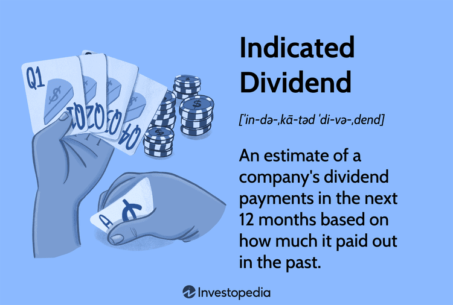

In an ever-evolving investment landscape, mastering dividend calculations is crucial for optimizing portfolio returns. Dividends represent a portion of a company's earnings paid to shareholders and serve as both a symbol of financial health and a source of investor income. This article explores key concepts such as dividend growth, financial analysis, and their integration into algorithmic trading, providing investors with tools to enhance their strategies effectively. By understanding dividend calculations and their implications on investment decisions, investors can make informed choices to enhance portfolio performance.

Comprehending dividend growth is fundamental to this process. Dividends are not static and can fluctuate depending on a company's financial performance and strategic decisions. Companies committed to increasing dividends may signal robust financial health and confidence in future earnings, which can be appealing to investors seeking long-term growth. Analyzing such patterns helps investors anticipate dividend changes and adjust their portfolios accordingly.



Integrating financial analysis with dividends offers a comprehensive view of a company's stability and profitability. Fundamental analysis enables investors to assess key indicators like earnings and payout ratios, while technical analysis provides insights into market trends and patterns. These methodologies, when applied to dividend stocks, can illuminate potential opportunities and risks, ensuring a balanced investment approach.

Meanwhile, the advent of algorithmic trading has revolutionized how investors interact with financial markets. By leveraging algorithms, traders can rapidly process vast amounts of market data, identifying dividend opportunities that may be missed by traditional methods. Algorithmic trading offers advantages such as high-speed trade execution and precision timing, which are essential for capitalizing on fluctuating dividends.

By the end of this article, you’ll have a clearer understanding of how to effectively utilize dividend information in algorithmic trading. This comprehensive guide empowers investors to navigate the complexities of dividends, enhancing their strategies for optimized returns. Whether you're a seasoned trader or a novice investor, embracing the synergy between dividends and technology can lead to significant gains in your investment portfolio.

## Table of Contents

## Understanding Dividend Calculations

Dividends are regular payments made by a corporation to its shareholders out of its profits or reserves. They serve as a tangible measure of financial health, signaling a company's profitability and stability. When a company generates a profit, it can choose to reinvest in its operations or distribute a portion of these earnings to shareholders in the form of dividends. Companies that pay regular dividends are often perceived as financially stable, which can attract more investors and provide a cushion against stock [volatility](/wiki/volatility-trading-strategies).

There are several types of dividends that a company may issue: 

**Cash Dividends**: Cash dividends are the most straightforward form, where shareholders receive a cash payment. Typically paid on a per-share basis, this type of dividend provides immediate and tangible value to shareholders. Cash dividends are commonly distributed quarterly.

**Stock Dividends**: Unlike cash dividends, stock dividends involve issuing additional shares to shareholders. This increases the total number of shares outstanding, and each shareholder owns a slightly larger portion of the company. This approach allows companies to reward shareholders without reducing their cash reserves.

**Special Dividends**: Special dividends, or one-time dividends, are extraordinary payouts that may be issued when a company experiences unexpectedly high profits or liquidates an asset. While not part of a regular dividend schedule, they can offer windfall gains to shareholders.

Calculating dividends involves understanding several key metrics. The dividend yield is one such metric, calculated as:

$$
\text{Dividend Yield} = \left( \frac{\text{Annual Dividends per Share}}{\text{Price per Share}} \right) \times 100
$$

This formula provides a percentage that indicates what an investor might expect to earn from dividends in relation to the share price.

Another critical measure is the payout ratio, calculated as:

$$
\text{Dividend Payout Ratio} = \left( \frac{\text{Dividends Paid}}{\text{Net Income}} \right) \times 100
$$

This ratio helps assess the sustainability of dividends by comparing the total dividends paid to the company's net income. A higher payout ratio could imply less room for dividend growth or reinvestment into the business.

Understanding the importance and calculation of dividends is vital for evaluating a company's profitability and future payout potential. Dividends offer insight into management's confidence in the company's continued success. A consistent dividend payment or gradual increase in dividends reflects positively on a company's financial structure, indicating a balanced allocation of resources and strategic growth.

## Methods for Dividend Calculation

In the financial market, understanding dividend calculations is fundamental for investors aiming to evaluate a company's profitability and predict future income accurately. Methods for dividend calculation provide insights using both historical and projected methodologies, which [factor](/wiki/factor-investing) in growth or contraction projections based on market conditions.

### Traditional Methods

Traditional dividend calculation methods involve examining historical data to assess the stability and reliability of dividend payouts. This approach generally comprises a review of the Dividend Per Share (DPS), Dividend Yield, and Dividend Payout Ratio.

1. **Dividend Per Share (DPS)** is calculated by dividing the total dividends paid out by a company over a period by the number of outstanding shares. This provides investors with an idea of the value of dividends they would earn per share.
$$
   \text{DPS} = \frac{\text{Total Dividends Paid}}{\text{Number of Outstanding Shares}}

$$

2. **Dividend Yield** is a financial ratio that shows how much a company pays out in dividends each year relative to its stock price. It is a useful measure for comparing the income-generating ability of different investments.
$$
   \text{Dividend Yield} = \frac{\text{DPS}}{\text{Stock Price per Share}} \times 100

$$

3. **Dividend Payout Ratio** assesses the proportion of earnings a company distributes as dividends to shareholders. It helps in understanding if the dividends are sustainable in the long term.
$$
   \text{Dividend Payout Ratio} = \frac{\text{Dividends per Share}}{\text{Earnings per Share (EPS)}} \times 100

$$

### Growth/Contraction Projections

While historical data provides a snapshot of the past, growth and contraction projections enable investors to anticipate future dividend changes by considering market trends and economic factors. This involves:

- **Dividend Growth Models**, such as the Gordon Growth Model, which assumes that dividends will increase at a constant growth rate indefinitely. The formula helps determine the present value of an infinite series of future dividends.
$$
  P = \frac{D_0 \times (1 + g)}{r - g}

$$

  where $P$ is the current stock price, $D_0$ is the current dividend, $g$ is the growth rate of the dividend, and $r$ is the required rate of return.

- **Economic and Market Analysis**: This involves examining broader economic indicators, such as GDP growth, inflation, and interest rates, which can influence a company’s ability to maintain or grow dividends.

- **Scenario Analysis and Stress Testing**: Investors may use scenario analysis to understand how different economic conditions could affect dividend payments. Stress testing helps in evaluating how extreme market conditions might impact a company’s dividend policy.

### Understanding Forecasting Methods

By integrating both historical data and growth/contraction projections, investors can form a comprehensive view of a company’s potential future dividends. This dual approach assists in making more informed decisions about potential income streams and assessing the risks associated with a given investment. In practice, using these methodologies ensures that investors are prepared for market fluctuations, which can impact dividend reliability and profitability.

## Financial Analysis for Dividend Strategies

Financial analysis plays a vital role in formulating strategies that leverage dividends to maximize investment returns. Two core analysis methods—fundamental and technical analysis—are essential in assessing and forecasting a company’s dividend potential. A synergistic application of these methods provides a comprehensive approach to formulate effective dividend strategies.

**Fundamental Analysis** focuses on evaluating a company's financial health and future prospects through its financial statements and economic indicators. When concentrating on dividends, key factors include earnings, payout ratios, and cash flow stability.

- **Earnings**: A primary indicator of a company's capacity to sustain and increase dividend payments. Investors typically look at the earnings per share (EPS) as a measure of profitability. A higher EPS indicates a greater capacity to pay dividends.

- **Payout Ratios**: This ratio, typically expressed as a percentage, compares the total dividends paid to shareholders against the net income of the company. It is calculated using the formula:
$$
  \text{Payout Ratio} = \left( \frac{\text{Dividends Per Share}}{\text{Earnings Per Share}} \right) \times 100

$$

  A stable or moderately increasing payout ratio can suggest the company is committed to returning profits to its shareholders without compromising growth opportunities.

- **Cash Flow Stability**: Consistent cash flow is crucial for ongoing dividend payments. Free cash flow, which is operating cash flow minus capital expenditures, provides insight into the funds available for dividends.

**Technical Analysis** employs statistical trends derived from trading activity and past performance to inform investment decisions. It analyzes price movements, trading volumes, and moving averages to predict future behavior.

- **Market Trends and Patterns**: Investors use charts and technical indicators to identify patterns such as bullish or bearish trends. Algorithms can automate the detection of these patterns to capitalize on favorable dividend-paying opportunities.

- **Dividends in Technical Analysis**: Dividend yield, a common technical metric, is calculated as:
$$
  \text{Dividend Yield} = \left( \frac{\text{Annual Dividends Per Share}}{\text{Price Per Share}} \right) \times 100

$$

  Tracking changes in dividend yield can provide signals about market expectations regarding a stock's value and income potential.

**Integrating Fundamental and Technical Analysis** offers a holistic approach to dividend strategies. Fundamental analysis provides a deep understanding of a company’s financial health, while technical analysis aids in timing market entry and exit points. By integrating both methods, investors can develop a balanced strategy that aligns with long-term growth and immediate market conditions.

For instance, an investor may use [fundamental analysis](/wiki/fundamental-analysis) to select high-quality dividend-paying stocks with sound financial metrics. They could then apply technical analysis techniques to determine optimal buying points based on market conditions, thus maximizing their investment returns.

In conclusion, the integration of fundamental and technical analysis is essential for developing robust dividend strategies. By comprehensively understanding and applying these analyses, investors can enhance their decision-making processes, resulting in optimized portfolio returns.

## Role of Algorithmic Trading in Dividend Strategies

Algorithmic trading has transformed the financial markets by automating trades based on pre-determined criteria, facilitating high-speed trade executions that were once impossible in manual trading. This approach is particularly beneficial for dividend strategies, where timely data analysis and execution can enhance profitability.

To understand the benefits of [algorithmic trading](/wiki/algorithmic-trading) in dividend strategies, we must first define what it entails. Algorithmic trading involves using complex algorithms to make trading decisions, minimizing human intervention and emotional biases. The main advantage is speed — algorithms can process vast amounts of market data and execute trades in microseconds, far faster than human traders. This rapid execution is critical in capturing small price inefficiencies that may occur in the market, leading to improved returns.

In dividend strategies, market data analysis becomes crucial. Algorithms are designed to comb through historical and real-time data to identify patterns and opportunities related to dividend payments. By analyzing data such as dividend yields, payout ratios, and historical payment consistency, algorithms can forecast future payouts and determine whether a stock is undervalued relative to its dividend potential.

For example, consider a Python algorithm that scrapes dividend announcement data and stock prices in real-time. This algorithm could use the following logic:

```python
import pandas as pd
import yfinance as yf  # For more datasets, visit: https://paperswithbacktest.com/datasets

def fetch_dividend_data(ticker):
    stock = yf.Ticker(ticker)
    dividends = stock.dividends
    return dividends

def analyze_dividend_yield(price, dividends):
    annual_dividend = dividends.resample('A').sum().iloc[-1]
    dividend_yield = annual_dividend / price * 100
    return dividend_yield

ticker = 'AAPL'
dividends = fetch_dividend_data(ticker)
current_price = yf.Ticker(ticker).history(period='1d')['Close'].iloc[0]
dividend_yield = analyze_dividend_yield(current_price, dividends)

print(f"Current dividend yield for {ticker}: {dividend_yield:.2f}%")
```

This script calculates the dividend yield for a given stock, helping investors quickly gauge potential investment opportunities based on real-time price changes and dividend announcements.

Real-world applications of algorithmic trading in dividend strategies are vast. One notable example is the use of dividend capture strategies, where algorithms are programmed to buy stocks just before the ex-dividend date to qualify for the dividend, and then sell shortly after the dividend is paid. This strategy maximizes short-term dividend income while focusing on [liquidity](/wiki/liquidity-risk-premium) and minimal price risk.

Moreover, quantitative hedge funds have applied algorithms to identify dividend [growth stocks](/wiki/growth-stocks), using metrics such as dividend growth rate and return on equity as part of their predictive models. These algorithms continuously adapt to market changes, ensuring the strategy remains effective under various conditions.

Overall, the integration of algorithmic trading in dividend strategies offers significant advantages, particularly in terms of speed, accuracy, and the ability to manage large datasets to identify lucrative opportunities. As technology advances, the role of algorithms in optimizing dividend strategies is set to expand further, offering new and improved methods for enhancing portfolio returns.

## Case Studies and Practical Applications

### Historical Case Studies: Analysis of Successful Dividend Investment Strategies

Dividend investment strategies have proven effective in various historical contexts, providing steady income and contributing to overall portfolio growth. One notable example is the strategy employed by Warren Buffett and Berkshire Hathaway. Buffett's focus on companies with a strong track record of dividend payments and stable earnings growth has been a cornerstone of his investment philosophy. For instance, his long-term holdings in Coca-Cola and Procter & Gamble demonstrate the power of selecting firms with reliable dividend yields and consistent financial performance.

Another historical case is the “Dogs of the Dow” strategy, popularized in the late 20th century. This approach involves selecting the ten highest-yielding stocks from the Dow Jones Industrial Average at the beginning of each year. By focusing on large-cap companies with temporarily depressed stock prices resulting in higher yields, the strategy aims to capitalize on both high dividends and potential price recovery. Studies have shown periods where this approach outperformed the broader market, emphasizing the potential of dividend-driven strategies.

### Practical Applications: How to Implement These Strategies Using Algorithms

The integration of algorithmic trading into dividend strategies can significantly enhance their implementation. Algorithms can automatically screen for companies meeting specific dividend criteria, such as yield thresholds or payout ratios, efficiently processing vast datasets to identify suitable investments. 

In Python, investors can utilize libraries like pandas for data manipulation and NumPy for numerical operations to create algorithms that follow dividend investment criteria. Below is a basic example of how one might code a screening algorithm for high-dividend stocks:

```python
import pandas as pd

# Load stock data, assume 'data' is a DataFrame containing stock information
data = pd.read_csv('stock_data.csv')

# Define the dividend yield threshold
minimum_yield = 0.03  # 3%

# Screen for stocks with dividend yields above the threshold
high_yield_stocks = data[data['dividend_yield'] > minimum_yield]

# Display the selected stocks
print(high_yield_stocks)
```

This simple script demonstrates the fundamental screening process, allowing for complex algorithms incorporating additional financial metrics and technical indicators.

### Lessons Learned: Key Takeaways from Market Leaders and Their Dividend Strategies

Market leaders have shown that maintaining a focus on financial health and consistent dividend policies is vital. Successful investors like Buffett prioritize companies with competitive advantages, strong cash flows, and capable management, all of which support sustainable dividend payments. Furthermore, diversification is a critical component, as it reduces the risk associated with individual stocks and sectors.

Another key takeaway is the necessity of adapting strategies to market changes. The Dogs of the Dow, for example, occasionally underperforms, highlighting the importance of regularly analyzing and adjusting strategies based on current economic conditions.

Embracing technology, such as algorithmic trading, provides the flexibility and speed needed to respond to market shifts while ensuring disciplined adherence to selected investment criteria. With the capacity for [backtesting](/wiki/backtesting) and simulation, algorithms allow investors to evaluate potential outcomes and refine their approaches continually. This adaptability is crucial for maximizing dividend strategies' effectiveness in evolving financial landscapes.

## Conclusion

Dividends play a pivotal role in investment success by providing regular income and indicating the financial health and profitability of a company. Understanding dividends and their calculations allows investors to make informed decisions, contributing to long-term portfolio growth. Dividend growth serves as a reliable indicator of a company's financial stability, offering insights into its capacity to sustain payouts. Calculating the dividend yield, defined as the annual dividends per share divided by the price per share, is one of the primary methods to assess an investment's income-generating potential.

The integration of dividend calculations with algorithmic trading emphasizes the synergy between financial data and advanced technology. Algorithmic trading enables the automation of trades based on predefined strategies, leveraging real-time market data to identify opportunities and execute transactions swiftly. By incorporating dividend data into these algorithms, investors can refine their trading strategies to capitalize on dividend-paying stocks, enhancing returns while managing risk effectively. Such integration allows for the quick adaptation to fluctuations in the market, using sophisticated models to predict dividend changes and adjust investment tactics accordingly.

Continuous learning and adaptation are essential for maximizing the benefits of dividend investing enhanced by algorithmic strategies. The financial landscape is continually evolving, and remaining informed about technological advancements and emerging market trends ensures sustained investment growth. By embracing new analytical tools and exploring innovative trading strategies, investors can harness the full potential of dividends in optimizing their portfolios. Learning how to integrate comprehensive financial analysis and dividend data into algorithmic models represents a significant step towards achieving robust investment performance.

## References & Further Reading

Gordon, M. J. (1959). Dividends, Earnings, and Stock Prices. This seminal work by Myron J. Gordon introduces the Gordon Growth Model, a key formula for valuing a stock based on its future series of dividends that grow at a constant rate. The model, also known as the dividend discount model (DDM), is expressed as:

$$
P = \frac{D_1}{r - g}
$$

where $P$ is the price of the stock, $D_1$ is the expected dividend in the next period, $r$ is the required rate of return, and $g$ is the growth rate of the dividends. This model serves as a cornerstone for understanding dividend impact on stock valuation and is widely applicable in financial analysis.

The Intelligent Investor by Benjamin Graham. First published in 1949, this book is hailed as one of the best [books](/wiki/algo-trading-books) on value investing. Graham emphasizes the importance of dividends in assessing a company's value and underscores the concept of the "margin of safety" in investments. The Intelligent Investor is a crucial resource for understanding how dividends interact with broader financial health and how conservative investment strategies can yield reliable returns.

Algorithmic Trading & DMA: An Introduction to Direct Access Trading Strategies by Barry Johnson. This comprehensive guide introduces the concepts and techniques of algorithmic trading, providing a foundation for executing high-speed trades with precision. It includes insights on using algorithms to identify dividend-based trading opportunities, enhancing decision-making processes with clearly delineated strategies. This book is useful for traders looking to integrate dividend data into algorithmic systems for optimized trading outcomes.

