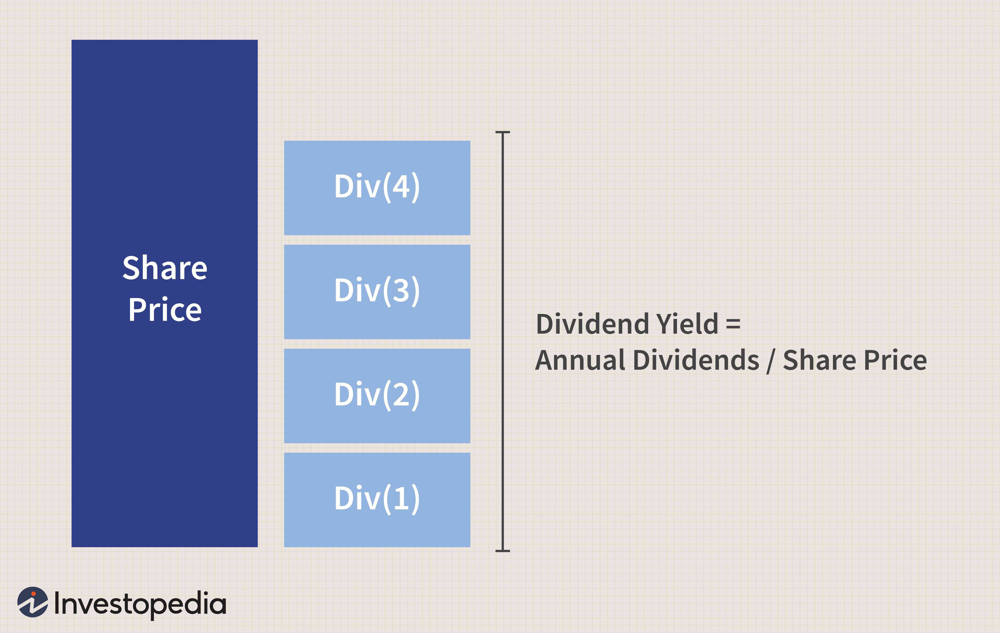

In the ever-evolving world of investing, understanding key metrics such as yield calculations and investment performance metrics is essential for making well-informed decisions. Yield calculations serve as the bedrock for evaluating the profitability and potential income of various investments. From stocks and bonds to mutual funds, these metrics offer insights into the expected returns, enabling investors to gauge the performance and financial health of their portfolios. Among these yield measures, indicated yield stands out as a forward-looking metric that predicts the annual dividend return of a stock based on its most recent dividend, providing critical foresight for investors seeking stable income sources.

Beyond merely understanding yield measures, the integration of algorithmic trading into investment strategies underscores a modern approach to maximizing returns. Algorithmic trading utilizes computer algorithms to execute trades, leveraging yield metrics and other financial data to optimize strategies in real-time. This technology facilitates precision and efficiency in trades, essential for navigating competitive markets and enhancing overall portfolio performance.



By exploring the nuances of yield calculations alongside the strategic application of algorithmic trading, investors can effectively enhance their portfolios. This comprehensive approach not only aids in making informed decisions but also provides a framework for sustainable growth and risk management amid fluctuating market conditions. Throughout this discussion, we aim to provide a thorough understanding of how these tools, when used together, can significantly boost investment outcomes.

## Table of Contents

## Understanding Indicated Yield

Indicated yield is a crucial financial metric for investors seeking to gauge the potential income from stock investments. This forward-looking measurement is derived from a company's most recent dividend and serves as an estimate of its annual dividend return. The indicated yield provides insights into the income-generating capability of a stock, helping investors make informed decisions.

To compute the indicated yield, you take the most recent dividend issued by the company, multiply it by the number of dividend payments made each year, and then divide the product by the current price of a single share of the company's stock. The formula for indicated yield is expressed as follows:

$$
\text{Indicated Yield} = \left( \frac{\text{Most Recent Dividend} \times \text{Number of Dividends Per Year}}{\text{Current Share Price}} \right)
$$

Understanding indicated yield is essential for evaluating the income potential of stock investments efficiently. In relatively stable financial environments, indicated yield functions as a reliable forecast of future dividend yields. Investors use it to project the return they can expect from dividends relative to their investment, making it a powerful tool for income-focused investment strategies. 

The indicated yield acts not only as a measure of current dividend profitability but also as an indicator of the company’s financial health and management's commitment to returning value to shareholders. It provides investors with a snapshot of the income they might derive from their stock holdings, expressed as a percentage of the share price, thus helping them compare the dividend potential of different stocks in their portfolio.

## Comparing Yield Metrics

Different yield metrics, including indicated yield, SEC yield, and 30-day yield, provide essential insights into investment income and performance. Each of these metrics serves a unique purpose and helps investors make informed decisions based on their specific financial instruments and investment goals.

Indicated yield refers to the forward-looking annual dividend return of a stock. It is calculated using the formula:

$$
\text{Indicated Yield} = \left(\frac{\text{Most Recent Dividend} \times \text{Number of Dividends Per Year}}{\text{Current Share Price}}\right) \times 100
$$

This metric offers investors a projection of the income a stock might generate, aiding in the assessment of its income potential. Indicated yield is particularly useful for evaluating dividend-paying stocks as a part of a long-term investment strategy.

SEC yield, on the other hand, is a standardized measure for mutual and bond funds, calculated under guidelines set by the U.S. Securities and Exchange Commission. It represents the interest and dividend income, discounted to take account of fund expenses, over a 30-day period. This measure ensures consistency and transparency across funds, allowing investors to compare fund income-generating efficiency effectively. The SEC yield is especially beneficial when evaluating bond funds, as it provides a realistic view of a bond fund's [earning](/wiki/earning-announcement) potential after accounting for operating costs.

The 30-day yield provides a snapshot of a fund's potential annual returns based on current conditions. It assesses the fund's past month of income generation and projects this performance forward as if conditions remain constant. This metric is valuable as it highlights a fund's recent performance in income generation and offers a quick insight into its earning capacity. For fund managers and investors, it acts as a tool for assessing potential annual income returns from a mutual fund or exchange-traded fund ([ETF](/wiki/etf-trading-strategies)).

Each yield measure offers distinct insights depending on the financial instrument invested. Indicated yield primarily aids in stock analysis, particularly for dividend-paying equities. SEC yield is crucial for mutual and bond fund evaluations, ensuring that investors understand the net income potential after expenses. Finally, the 30-day yield is useful for evaluating short-term income trends in mutual funds and ETFs. By understanding these different yield metrics, investors can better navigate investment opportunities and tailor their strategies to optimize income relative to their chosen financial products.

## Algorithmic Trading and Yield Optimization

Algorithmic trading uses computer algorithms to automate trading processes, leveraging yield metrics and other financial data to enhance decision accuracy and efficiency. By incorporating yield calculations such as SEC and 30-day yields, algorithmic systems can optimize investment performance by adapting strategies in real-time based on market conditions. This adaptability not only facilitates improved transaction timing but also enhances risk management, providing a competitive advantage in fast-paced markets.

The integration of yield metrics into [algorithmic trading](/wiki/algorithmic-trading) allows for precise transaction optimization. For instance, algorithms can assess a security's SEC yield, which offers a standardized measure of income returns after expenses, to determine the best possible entry or [exit](/wiki/exit-strategy) strategy for a trade. Similarly, algorithms utilizing 30-day yield calculations can project a fund’s potential income on an annualized basis, leveraging this data to calibrate trading actions accordingly. The precision offered by these algorithms stems from their ability to process large volumes of data instantly, thus enabling traders to capitalize on fleeting market opportunities.

Python, a popular language for developing algorithmic trading systems, allows for dynamic integration of yield analytics into trading strategies. Utilizing libraries such as Pandas for data manipulation and NumPy for numerical calculations, traders can create algorithms that ingest real-time yield data, perform complex analyses, and execute trades based on predefined criteria. For example, a Python algorithm might be structured as follows to optimize yield-based trading:

```python
import pandas as pd
import numpy as np

def calculate_sec_yield(price_data, dividend_data):
    # Calculate SEC yield based on latest price and dividend data
    dividends = np.sum(dividend_data)
    sec_yield = (dividends / price_data[-1]) * 100
    return sec_yield

def trading_strategy(price_data, dividend_data, threshold_yield):
    # Calculate SEC yield
    sec_yield = calculate_sec_yield(price_data, dividend_data)

    # If SEC yield surpasses threshold, trigger a buying strategy
    if sec_yield > threshold_yield:
        print("SEC yield is high, consider buying.")
        # Execute buy logic here
    else:
        print("SEC yield does not meet criteria.")
        # Execute sell or hold logic here

# Example price data and dividend data
price_data = np.array([100, 102, 101, 104, 106])
dividend_data = np.array([2, 2, 2, 2, 2])

# Run the trading strategy
trading_strategy(price_data, dividend_data, 3.5)
```

This code snippet demonstrates how algorithmic traders might structure their logic to use calculated yield metrics as a basis for making trade decisions. By maintaining a flexible, data-driven approach, the use of algorithmic trading can significantly enhance portfolio performances in ever-evolving financial landscapes.

## Implications for Investors

Yield metrics, like indicated yield, SEC yield, and 30-day yield, are pivotal for evaluating the income potential of various investments. Each metric serves a unique purpose by providing different angles of insight into an investment's performance. Indicated yield offers a projection of future dividend income from stocks, SEC yield allows the comparison of mutual funds based on standardized calculations, and the 30-day yield reflects recent income generation trends. By analyzing these metrics, investors can make well-informed decisions about portfolio allocation and potential returns.

Algorithmic trading enhances the use of yield metrics by automating trading strategies, thus increasing precision and minimizing emotional biases. Through algorithms, investors can analyze large datasets efficiently, adjust strategies in real-time, and execute trades in milliseconds, which provides a competitive edge. For instance, Python, a popular programming language in the finance industry, can be used to develop algorithms that track yield trends and optimize portfolio performance. Here's an example of a simple Python code snippet that might be used to calculate indicated yield:

```python
def calculate_indicated_yield(last_dividend, dividends_per_year, current_price):
    annual_dividend = last_dividend * dividends_per_year
    return (annual_dividend / current_price) * 100

# Example usage
last_dividend = 2.5  # Last dividend paid
dividends_per_year = 4  # Dividends issued quarterly
current_share_price = 50  # Current price of the stock

yield_percentage = calculate_indicated_yield(last_dividend, dividends_per_year, current_share_price)
print(f"Indicated Yield: {yield_percentage:.2f}%")
```

By integrating these calculated metrics into algorithmic trading platforms, investors can enhance their portfolio management strategies to optimize returns while managing risk more effectively. 

Practical advice for investors includes maintaining an informed perspective on yield trends and continuously refining their investment strategies. Markets are dynamic, and being adaptable by incorporating new tools and data insights is crucial for sustained investment success. Emphasizing a cycle of continuous learning and timely reaction to market conditions will allow investors to maximize their portfolios' income potential and reduce associated risks.

## Conclusion

The integration of yield metrics such as indicated yield, SEC yield, and 30-day yield with algorithmic trading strategies creates an effective framework for maximizing investment returns. By grasping the calculations and implications of these yield measures, investors can make well-informed decisions about their portfolios. Understanding formulae like the indicated yield, which is calculated as:

$$
\text{Indicated Yield} = \left( \frac{\text{Recent Dividend} \times \text{Annual Dividend Frequency}}{\text{Current Share Price}} \right) \times 100
$$

empowers investors to forecast potential income streams from their holdings accurately. The precision of algorithmic systems, which can be built using programming languages like Python, further enhances trade execution and risk management, adapting strategies in real-time to capitalize on market opportunities.

The continually evolving financial environment necessitates a proactive approach to integrating new trading technologies and metrics. This adaptability is vital for continued success in investment strategies. Investors should prioritize continual learning, staying informed about evolving yield trends and technological advancements to refine strategies effectively. The adoption of innovative methods will also be key to improving performance, as embracing technological developments allows for efficient portfolio management and optimization. For future preparedness, investors are encouraged to remain open to new tools and techniques, ensuring they maintain a competitive edge in the digital economy.

## References & Further Reading

[1]: Bergstra, J., Bardenet, R., Bengio, Y., & Kégl, B. (2011). ["Algorithms for Hyper-Parameter Optimization."](https://dl.acm.org/doi/10.5555/2986459.2986743) Advances in Neural Information Processing Systems 24.

[2]: ["Advances in Financial Machine Learning"](https://www.amazon.com/Advances-Financial-Machine-Learning-Marcos/dp/1119482089) by Marcos Lopez de Prado

[3]: ["Evidence-Based Technical Analysis: Applying the Scientific Method and Statistical Inference to Trading Signals"](https://www.amazon.com/Evidence-Based-Technical-Analysis-Scientific-Statistical/dp/0470008741) by David Aronson

[4]: ["Machine Learning for Algorithmic Trading"](https://github.com/stefan-jansen/machine-learning-for-trading) by Stefan Jansen

[5]: ["Quantitative Trading: How to Build Your Own Algorithmic Trading Business"](https://www.amazon.com/Quantitative-Trading-Build-Algorithmic-Business/dp/1119800064) by Ernest P. Chan