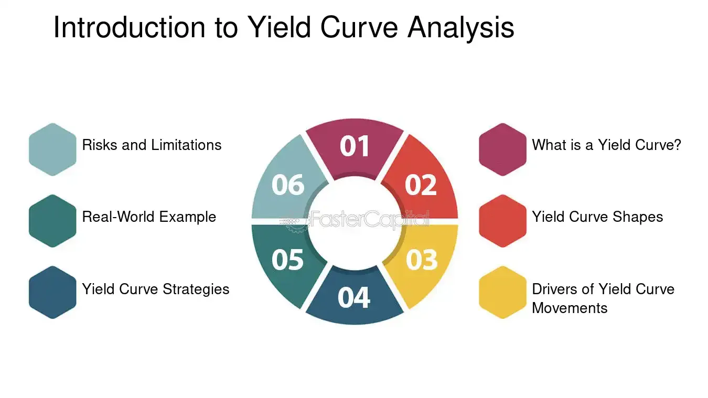

## Table of Contents

## What is indicated yield?

Indicated yield is a way to guess how much money you might earn from an investment each year. It's like a prediction based on what the investment has done in the past. For example, if you have a stock that paid $2 in dividends last year and the stock price is $40 now, the indicated yield would be 5%. You find this by dividing the $2 dividend by the $40 stock price and then turning that into a percentage.

This number helps people decide if an investment is good for them. But, it's important to remember that the indicated yield is just a guess. It might not be exactly what you get because things can change. The company might pay different dividends next year, or the stock price might go up or down. So, while it's a helpful tool, it's not a promise of what will happen.

## How is indicated yield calculated?

Indicated yield is calculated by taking the total dividends paid out by an investment over the past year and dividing it by the current price of the investment. For example, if a stock paid $2 in dividends last year and its current price is $40, you would divide $2 by $40 to get 0.05, which you then multiply by 100 to turn into a percentage, giving you an indicated yield of 5%.

This calculation gives investors an idea of what they might earn from their investment in the future, based on what has happened in the past. However, it's important to understand that the indicated yield is just an estimate. The actual yield can change because the dividends a company pays can go up or down, and the price of the investment can also change. So, while the indicated yield is a useful tool for making decisions, it's not a guarantee of future earnings.

## Why is indicated yield important for investors?

Indicated yield is important for investors because it helps them see how much money they might make from an investment each year. It's like a guess based on what the investment did in the past. When investors know the indicated yield, they can compare different investments to see which one might give them more money. For example, if one stock has an indicated yield of 3% and another has 5%, an investor might choose the one with 5% because it could make more money.

However, it's also important to remember that indicated yield is just a guess. The actual money you get from an investment can be different. This is because the company might change how much it pays out, or the price of the investment might go up or down. So, while indicated yield is a helpful tool for making choices, it's not a promise of what will happen. Investors should look at other things too, like how safe the investment is and what might happen in the future.

## Can you explain the difference between indicated yield and actual yield?

Indicated yield is a guess about how much money you might get from an investment each year. It's based on what the investment did in the past. For example, if a company paid $2 in dividends last year and its stock price is $40 now, the indicated yield would be 5%. You find this by dividing the $2 dividend by the $40 stock price and turning it into a percentage. It's like looking at old weather reports to guess what the weather might be like tomorrow.

Actual yield, on the other hand, is the real amount of money you get from an investment over a certain time. It's what actually happens, not just a guess. For instance, if the same company pays $2.50 in dividends this year and the stock price is still $40, the actual yield would be 6.25%. The actual yield can be different from the indicated yield because things can change. The company might decide to pay more or less in dividends, or the stock price might go up or down. So, while indicated yield helps you plan, actual yield shows you the real results.

## What are the common uses of indicated yield in financial analysis?

Indicated yield is often used by investors to compare different investments. They look at the indicated yield to see which investment might give them more money each year. For example, if one stock has an indicated yield of 3% and another has 5%, an investor might choose the one with 5% because it could make more money. This helps them make decisions about where to put their money, based on what the investments have done in the past.

Financial analysts also use indicated yield to give advice to clients. They might say, "This bond has an indicated yield of 4%, which is good for someone looking for steady income." It's a way to show how much money an investment might make, which helps people plan their finances. But, analysts always remind clients that indicated yield is just a guess and the actual money they get can be different because things can change.

## How does indicated yield relate to dividend stocks?

Indicated yield is really important for people who invest in dividend stocks. A dividend stock is one that pays out money to its shareholders regularly, usually every three months or once a year. The indicated yield tells investors how much money they might get from these dividends each year, based on what the company did in the past. For example, if a company paid $2 in dividends last year and the stock price is $40 now, the indicated yield would be 5%. This helps investors see which dividend stocks might give them more money.

However, it's important to know that the indicated yield is just a guess. The actual money you get from dividend stocks can be different because the company might change how much it pays out, or the stock price might go up or down. So, while indicated yield is a useful tool for comparing dividend stocks and planning, it's not a promise of what will happen. Investors should also look at other things, like how safe the company is and what might happen in the future, before making their decisions.

## What are the limitations of using indicated yield as a sole investment metric?

Using indicated yield as the only way to decide on an investment can be tricky because it's just a guess based on what happened in the past. The actual money you get from an investment can be different. This is because the company might change how much it pays out, or the price of the investment might go up or down. So, if you only look at indicated yield, you might miss out on important changes that could affect your investment.

Also, indicated yield doesn't tell you everything about an investment. It doesn't show you if the company is doing well or if it's safe to invest in. It also doesn't tell you about other ways you might make money from the investment, like if the price goes up. So, while indicated yield is a helpful tool, it's not enough by itself. You need to look at other things too, like how the company is doing and what might happen in the future, to make a good decision.

## How can market conditions affect the reliability of indicated yield?

Market conditions can change how reliable indicated yield is. Indicated yield is a guess about how much money you might get from an investment each year, based on what happened in the past. But if the market goes up or down a lot, the company might change how much it pays out in dividends. For example, if the economy is doing badly, a company might pay less in dividends to save money. This means the actual money you get could be different from what the indicated yield predicted.

Also, the price of the investment can change because of market conditions. If the stock price goes up a lot, the indicated yield might look lower than it really is because it's based on the old price. On the other hand, if the stock price goes down, the indicated yield might look higher, but that doesn't mean you'll actually get more money. So, market conditions can make it hard to trust the indicated yield as a good guess of what you'll earn.

## What are some advanced methods to adjust indicated yield for more accurate analysis?

To make indicated yield more accurate, you can look at more than just the past year's dividends. One way is to use a moving average of dividends over several years. This helps smooth out any big changes from one year to the next. For example, if a company paid different amounts of dividends over the last three years, you could average those amounts to get a better guess of what they might pay next year. This can give you a more reliable indicated yield because it considers a longer period of time.

Another way to adjust indicated yield is to think about what might happen in the future. You can look at things like the company's earnings, the economy, and industry trends to see if the company might change its dividend payments. If you think the company will do better or worse, you can adjust the indicated yield to match your predictions. This makes your analysis more accurate because it takes into account possible changes instead of just looking at what happened before.

## How do changes in a company's dividend policy impact indicated yield?

Changes in a company's dividend policy can make the indicated yield less accurate. If a company decides to pay more or less in dividends, the amount of money you get each year will be different from what the indicated yield predicted. For example, if a company used to pay $2 in dividends last year but decides to increase it to $2.50 this year, the actual yield will be higher than the indicated yield. On the other hand, if the company cuts its dividends to $1.50, the actual yield will be lower. So, when a company changes how much it pays out, the indicated yield can't tell you exactly what you'll get.

It's important to keep an eye on a company's dividend policy because it can change a lot. Companies might decide to change their dividends based on how they're doing financially, what's happening in the economy, or other reasons. If you're using indicated yield to plan your investments, you need to remember that it's just a guess based on the past. If the company's policy changes, your actual earnings might be different. So, always think about what might happen in the future when you look at indicated yield.

## Can you discuss the role of indicated yield in portfolio management?

Indicated yield plays an important role in portfolio management because it helps investors see how much money they might earn from their investments each year. When managing a portfolio, people look at the indicated yield to compare different investments and decide which ones might give them more money. For example, if one stock has an indicated yield of 3% and another has 5%, an investor might choose to put more money into the one with the higher yield to increase their overall earnings. This helps them plan and make choices about where to invest their money based on what the investments have done in the past.

However, it's important to remember that indicated yield is just a guess. In portfolio management, you need to look at more than just the indicated yield because the actual money you get can be different. The company might change how much it pays out, or the price of the investment might go up or down. So, while indicated yield is a useful tool for planning and comparing investments, it's not enough by itself. Good portfolio management involves looking at other things too, like how safe the investments are and what might happen in the future, to make the best decisions.

## What are the best practices for incorporating indicated yield into long-term investment strategies?

When you're planning your long-term investments, indicated yield can help you see how much money you might earn each year from your investments. It's a good idea to look at the indicated yield of different investments to compare them and decide which ones might give you more money. For example, if you're choosing between two stocks, one with an indicated yield of 3% and another with 5%, you might pick the one with the higher yield to boost your overall earnings. But remember, indicated yield is just a guess based on what happened in the past. So, it's important to use it as one part of your plan, not the only thing you look at.

To make the most of indicated yield in your long-term strategy, you should also think about other things. For instance, you need to consider how safe the investments are and what might happen in the future. The company might change how much it pays out, or the price of the investment might go up or down, so the actual money you get can be different from what the indicated yield says. It's a good practice to keep an eye on the company's dividend policy and any news that might affect your investments. By looking at all these things together, you can make better choices and build a strong long-term investment plan.

## What is Understanding Indicated Yield?

Indicated yield is a crucial financial metric for investors seeking to gauge the potential income from stock investments. This forward-looking measurement is derived from a company's most recent dividend and serves as an estimate of its annual dividend return. The indicated yield provides insights into the income-generating capability of a stock, helping investors make informed decisions.

To compute the indicated yield, you take the most recent dividend issued by the company, multiply it by the number of dividend payments made each year, and then divide the product by the current price of a single share of the company's stock. The formula for indicated yield is expressed as follows:

$$
\text{Indicated Yield} = \left( \frac{\text{Most Recent Dividend} \times \text{Number of Dividends Per Year}}{\text{Current Share Price}} \right)
$$

Understanding indicated yield is essential for evaluating the income potential of stock investments efficiently. In relatively stable financial environments, indicated yield functions as a reliable forecast of future dividend yields. Investors use it to project the return they can expect from dividends relative to their investment, making it a powerful tool for income-focused investment strategies. 

The indicated yield acts not only as a measure of current dividend profitability but also as an indicator of the company’s financial health and management's commitment to returning value to shareholders. It provides investors with a snapshot of the income they might derive from their stock holdings, expressed as a percentage of the share price, thus helping them compare the dividend potential of different stocks in their portfolio.

## What are the differences when comparing yield metrics?

Different yield metrics, including indicated yield, SEC yield, and 30-day yield, provide essential insights into investment income and performance. Each of these metrics serves a unique purpose and helps investors make informed decisions based on their specific financial instruments and investment goals.

Indicated yield refers to the forward-looking annual dividend return of a stock. It is calculated using the formula:

$$
\text{Indicated Yield} = \left(\frac{\text{Most Recent Dividend} \times \text{Number of Dividends Per Year}}{\text{Current Share Price}}\right) \times 100
$$

This metric offers investors a projection of the income a stock might generate, aiding in the assessment of its income potential. Indicated yield is particularly useful for evaluating dividend-paying stocks as a part of a long-term investment strategy.

SEC yield, on the other hand, is a standardized measure for mutual and bond funds, calculated under guidelines set by the U.S. Securities and Exchange Commission. It represents the interest and dividend income, discounted to take account of fund expenses, over a 30-day period. This measure ensures consistency and transparency across funds, allowing investors to compare fund income-generating efficiency effectively. The SEC yield is especially beneficial when evaluating bond funds, as it provides a realistic view of a bond fund's [earning](/wiki/earning-announcement) potential after accounting for operating costs.

The 30-day yield provides a snapshot of a fund's potential annual returns based on current conditions. It assesses the fund's past month of income generation and projects this performance forward as if conditions remain constant. This metric is valuable as it highlights a fund's recent performance in income generation and offers a quick insight into its earning capacity. For fund managers and investors, it acts as a tool for assessing potential annual income returns from a mutual fund or exchange-traded fund ([ETF](/wiki/etf-trading-strategies)).

Each yield measure offers distinct insights depending on the financial instrument invested. Indicated yield primarily aids in stock analysis, particularly for dividend-paying equities. SEC yield is crucial for mutual and bond fund evaluations, ensuring that investors understand the net income potential after expenses. Finally, the 30-day yield is useful for evaluating short-term income trends in mutual funds and ETFs. By understanding these different yield metrics, investors can better navigate investment opportunities and tailor their strategies to optimize income relative to their chosen financial products.

## What is the conclusion?

The integration of yield metrics such as indicated yield, SEC yield, and 30-day yield with [algorithmic trading](/wiki/algorithmic-trading) strategies creates an effective framework for maximizing investment returns. By grasping the calculations and implications of these yield measures, investors can make well-informed decisions about their portfolios. Understanding formulae like the indicated yield, which is calculated as:

$$
\text{Indicated Yield} = \left( \frac{\text{Recent Dividend} \times \text{Annual Dividend Frequency}}{\text{Current Share Price}} \right) \times 100
$$

empowers investors to forecast potential income streams from their holdings accurately. The precision of algorithmic systems, which can be built using programming languages like Python, further enhances trade execution and risk management, adapting strategies in real-time to capitalize on market opportunities.

The continually evolving financial environment necessitates a proactive approach to integrating new trading technologies and metrics. This adaptability is vital for continued success in investment strategies. Investors should prioritize continual learning, staying informed about evolving yield trends and technological advancements to refine strategies effectively. The adoption of innovative methods will also be key to improving performance, as embracing technological developments allows for efficient portfolio management and optimization. For future preparedness, investors are encouraged to remain open to new tools and techniques, ensuring they maintain a competitive edge in the digital economy.

## References & Further Reading

[1]: Bergstra, J., Bardenet, R., Bengio, Y., & Kégl, B. (2011). ["Algorithms for Hyper-Parameter Optimization."](https://dl.acm.org/doi/10.5555/2986459.2986743) Advances in Neural Information Processing Systems 24.

[2]: ["Advances in Financial Machine Learning"](https://www.amazon.com/Advances-Financial-Machine-Learning-Marcos/dp/1119482089) by Marcos Lopez de Prado

[3]: ["Evidence-Based Technical Analysis: Applying the Scientific Method and Statistical Inference to Trading Signals"](https://www.amazon.com/Evidence-Based-Technical-Analysis-Scientific-Statistical/dp/0470008741) by David Aronson

[4]: ["Machine Learning for Algorithmic Trading"](https://github.com/stefan-jansen/machine-learning-for-trading) by Stefan Jansen

[5]: ["Quantitative Trading: How to Build Your Own Algorithmic Trading Business"](https://www.amazon.com/Quantitative-Trading-Build-Algorithmic-Business/dp/1119800064) by Ernest P. Chan