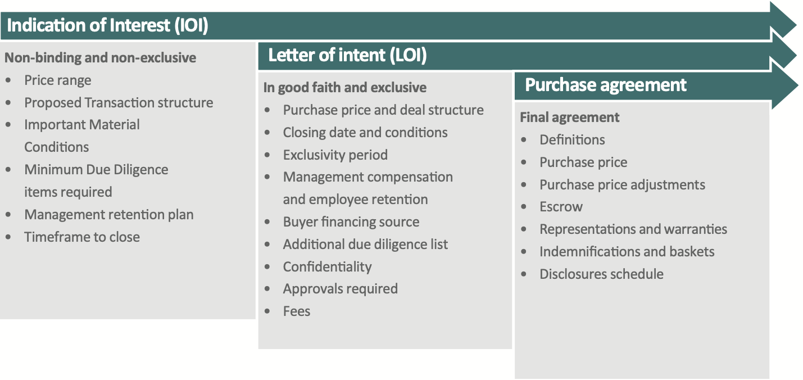

## Table of Contents

## What is an Indication of Interest (IOI)?

An Indication of Interest (IOI) is a way for someone to show they might want to buy something, like a stock or a company, without making a final decision. It's like saying, "I'm interested, but I need more time to think about it." Companies or investors use IOIs to start talking about a possible deal without being fully committed yet.

IOIs are often used in big business deals, like when one company wants to buy another. It helps both sides understand if there's a real chance for a deal before they spend a lot of time and money on detailed talks. It's a helpful first step that keeps things flexible and open.

## How does an IOI function in the financial markets?

In the financial markets, an Indication of Interest (IOI) is like a signal that someone is thinking about buying something, like stocks or bonds. It's not a promise to buy, but it shows that the person or company is interested and wants to learn more. For example, if a big investor sends an IOI to a stockbroker, it means they are considering buying a certain amount of shares but haven't decided yet. This helps the broker know there might be a buyer, so they can start preparing for a possible trade.

IOIs are useful because they help keep the market moving smoothly. When a company wants to sell new shares, they might get IOIs from different investors. This gives the company an idea of how much interest there is in their shares before they actually sell them. It's like testing the waters to see if people want to buy. By using IOIs, everyone can plan better and make smarter decisions without rushing into anything.

## Who typically uses IOIs and why?

IOIs are usually used by investors and companies who want to buy or sell things like stocks, bonds, or even whole businesses. Investors, like big funds or rich people, use IOIs to show they might want to buy something without making a final choice right away. They do this because it lets them check if there's a good deal without spending a lot of time and money on detailed talks that might not lead anywhere. Companies also use IOIs when they want to sell new shares or when they're thinking about selling the whole business. By sending out IOIs, they can see how much interest there is before they make big decisions.

Brokers and investment banks also use IOIs a lot. For brokers, getting IOIs from their clients helps them plan their trading better. They can see what their clients might want to buy or sell and prepare for those trades. Investment banks use IOIs when they're helping a company sell new shares or when they're trying to find buyers for a company that wants to be sold. IOIs help them understand the market's interest and make the selling process smoother and more efficient.

## What is the difference between an IOI and a firm order?

An Indication of Interest (IOI) and a firm order are two different things in the world of buying and selling. An IOI is like saying, "I might want to buy this, but I'm not sure yet." It's a way for someone to show they are interested in something, like stocks or a company, without making a final decision. It's useful because it helps people start talking about a possible deal without being fully committed.

On the other hand, a firm order is like saying, "Yes, I definitely want to buy this." It's a promise to buy something at a certain price. When someone places a firm order, they are fully committed to the deal and expect it to go through. Unlike an IOI, a firm order is a final decision, and the buyer has to follow through with the purchase.

## Can you provide a basic example of how an IOI is used?

Imagine a big company called "TechCo" wants to sell some of its shares to raise money. They don't want to just put the shares up for sale without knowing if anyone will buy them. So, TechCo sends out an Indication of Interest (IOI) to a few big investors. The IOI says, "We're thinking about selling 1 million shares at $50 each. Are you interested?" This way, TechCo can see if there's any interest before they go through with the sale.

One of the investors, "BigFund," sees the IOI and thinks it might be a good deal. They send back an IOI saying, "We might be interested in buying 200,000 shares at $50 each, but we need more time to decide." This IOI from BigFund helps TechCo know that there's at least one potential buyer. It's not a promise to buy, but it's a good sign that helps TechCo plan their next steps without rushing into anything.

## What are the benefits of using IOIs in trading?

Using Indications of Interest (IOIs) in trading helps both buyers and sellers. For buyers, IOIs let them show they might want to buy something without making a final decision right away. This is helpful because it gives them time to do more research and think things over before they commit to a deal. They can also test the market to see if the price is right without having to buy anything yet. This can save them time and money because they don't have to go through detailed talks that might not lead to a deal.

For sellers, like companies that want to sell new shares or their whole business, IOIs are a way to see how much interest there is before they go ahead with a sale. By sending out IOIs, they can get a sense of who might want to buy and at what price. This helps them plan better and make smarter decisions. It also makes the selling process smoother because they know there's real interest before they spend a lot of time and effort on the deal.

## What are the potential risks associated with IOIs?

Using IOIs can have some risks. One risk is that people might think an IOI is a promise to buy or sell, but it's not. If someone relies too much on an IOI, they might be disappointed if the deal doesn't happen. This can cause confusion and even hurt relationships between buyers and sellers if they expect more than what an IOI really means.

Another risk is that IOIs can sometimes give away too much information. If a company sends out an IOI and it gets into the wrong hands, it might let other people know about their plans before they're ready. This can affect the company's stock price or make it harder to get a good deal later on. So, it's important to be careful about who sees the IOI and to understand that it's just a first step, not a final commitment.

## How do regulatory requirements impact the use of IOIs?

Regulatory requirements can affect how people use Indications of Interest (IOIs). These rules are set by government agencies to make sure that everyone in the market plays fair and that no one gets cheated. For example, some rules say that companies have to be open about what they're doing with their shares. If a company uses IOIs, they have to follow these rules and make sure they don't hide important information from the public. This means they have to be careful about how they send out IOIs and who gets to see them.

Also, there are rules about how brokers and investment banks can use IOIs. These rules help make sure that they don't use IOIs to trick people or give some investors special treatment. For instance, a broker might have to keep records of all the IOIs they get and send, so regulators can check if they're doing things the right way. This can make using IOIs a bit more complicated, but it's important for keeping the market honest and fair for everyone.

## What technologies are commonly used to manage and distribute IOIs?

To manage and distribute Indications of Interest (IOIs), people often use special computer systems and software. These systems help keep track of who is interested in buying or selling and at what price. They can send IOIs quickly to many people at once, making the process easier and faster. Some common technologies include trading platforms, like Bloomberg Terminal, where traders can see and send IOIs. These platforms also have tools to help keep the IOIs organized and safe, so only the right people see them.

Another important technology is email and messaging systems. These are used to send IOIs directly to specific people or groups. They are simple to use but can be less secure than trading platforms. To make sure IOIs are handled correctly, many companies also use special software that keeps a record of all IOIs sent and received. This helps them follow the rules and make sure everything is done fairly.

## How can the effectiveness of IOIs be measured and optimized?

The effectiveness of Indications of Interest (IOIs) can be measured by looking at how often they lead to actual deals. If a lot of IOIs turn into firm orders, then they are working well. Another way to measure effectiveness is by seeing how many people respond to the IOIs. If a company sends out IOIs and gets a lot of responses, it means the IOIs are reaching the right people and sparking interest. Also, keeping track of how quickly IOIs lead to deals can help measure their effectiveness. If deals happen fast after sending out IOIs, it's a sign that they are useful.

To optimize the use of IOIs, companies should make sure they are sending them to the right people. This means knowing who might be interested in buying and targeting them directly. Using technology like trading platforms can help manage IOIs better and make sure they are sent securely and efficiently. It's also important to keep the information in the IOIs clear and easy to understand, so people know exactly what the company is offering. By doing these things, companies can make their IOIs more effective and increase their chances of turning those indications into real deals.

## What advanced strategies involve the use of IOIs in complex trading scenarios?

In complex trading scenarios, advanced strategies involving IOIs can help traders and companies navigate the market more effectively. One strategy is using IOIs to gauge market interest before making a big move. For example, a company planning to issue new shares might send out IOIs to see how much demand there is at different price points. This helps them set the right price for their shares and avoid selling too low or too high. Traders might also use IOIs to test the waters for buying or selling large blocks of stocks without moving the market too much. By sending out IOIs, they can find potential buyers or sellers without showing their full hand, which helps them plan their trades better.

Another advanced strategy is using IOIs to build relationships and gather information. Traders might send out IOIs to different brokers to see how they respond and learn more about the market. This can help them understand who the key players are and what kind of deals they might be interested in. By building these relationships, traders can create a network that makes it easier to find buyers or sellers when they need them. This strategy also helps them stay informed about market trends and changes, so they can make smarter decisions about their trades.

## How do IOIs integrate with other trading systems and algorithms?

IOIs can work together with other trading systems and computer programs to make trading easier and smarter. For example, when someone sends an IOI, it can go into a trading platform like Bloomberg Terminal. This platform can then use special computer programs, called algorithms, to look at the IOI and see if it matches with any other orders in the system. If it does, the algorithm can help make the trade happen faster and at a better price. This way, IOIs help the trading system work more smoothly and find good deals for everyone.

Also, IOIs can be used with other tools that help traders make decisions. For instance, a trader might use a computer program to look at market data and see if an IOI is a good idea. If the program says the market is right for the trade, the trader can send out the IOI. Then, other programs can keep track of who responds to the IOI and help the trader decide what to do next. By working together with these other systems and algorithms, IOIs can help traders make better choices and get the best deals possible.

## References & Further Reading

[1]: Markovich, Y. (2019). ["The Role of Indications of Interest in Modern Trading."](https://agupubs.onlinelibrary.wiley.com/doi/full/10.1029/2019WR025676) CFA Institute Financial Analysts Journal.

[2]: Hasbrouck, J., & Saar, G. (2013). ["Low-Latency Trading."](https://www.sciencedirect.com/science/article/abs/pii/S1386418113000165) The Review of Financial Studies, 26(9), 2356-2393.

[3]: Aldridge, I. (2013). ["High-Frequency Trading: A Practical Guide to Algorithmic Strategies and Trading Systems."](https://www.amazon.com/High-Frequency-Trading-Practical-Algorithmic-Strategies/dp/1118343506) John Wiley & Sons.

[4]: Lopez de Prado, M. (2018). ["Advances in Financial Machine Learning."](https://www.amazon.com/Advances-Financial-Machine-Learning-Marcos/dp/1119482089) Wiley.

[5]: Johnson, B., & Wang, C. (2017). ["Volatility and Liquidity in the Trading Process."](https://www.sciencedirect.com/science/article/abs/pii/S0378426621000480) Journal of Financial Econometrics, 25(2), 139-169.

[6]: Jansen, S. (2020). ["Machine Learning for Algorithmic Trading."](https://github.com/stefan-jansen/machine-learning-for-trading) Packt Publishing.  

[7]: Aronson, D. (2006). ["Evidence-Based Technical Analysis: Applying the Scientific Method and Statistical Inference to Trading Signals."](https://www.amazon.com/Evidence-Based-Technical-Analysis-Scientific-Statistical/dp/0470008741) Wiley.

[8]: Chan, E. P. (2008). ["Quantitative Trading: How to Build Your Own Algorithmic Trading Business."](https://github.com/ftvision/quant_trading_echan_book) Wiley.