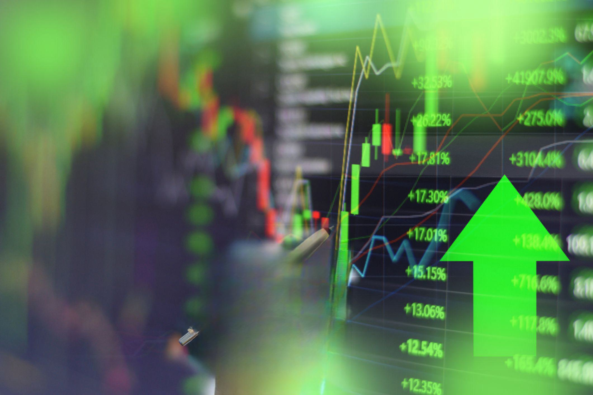

In today's rapidly evolving financial markets, the integration of Indicative Match Price (IMP) and algorithmic trading is crucial for enhancing trading efficiency and accuracy. The Indicative Match Price is essential in determining the optimal price at which the maximum number of buy and sell orders can be executed during securities auctions. This price discovery mechanism aids in navigating order imbalances, a common issue that traders face. By offering a transparent reference point, IMP supports traders in optimizing trade execution, thus improving market transparency and liquidity.

The significance of IMP, when combined with algorithmic trading, is increasingly pronounced in the modern financial landscape. Algorithmic trading, with its reliance on advanced algorithms and computing power, minimizes human intervention and facilitates rapid execution of trades. The synergy between IMP and algorithmic trading revolutionizes trading strategies by leveraging data-driven insights and ensuring precise execution. This integration enables traders to respond swiftly to market conditions, enhancing decision-making processes and improving overall trading outcomes.



Our focus is to explore core concepts, mechanisms, and practical applications surrounding IMP and algorithmic trading. These elements are pivotal in transforming trading strategies, allowing traders to manage risks effectively and capitalize on market opportunities. Understanding the interplay between IMP and algorithmic trading will provide insights into how these tools contribute to creating a more efficient and effective trading environment.

Join us as we unravel the complexities and benefits of this dynamic intersection in the trading world. The fusion of technology with traditional trading practices is not just a trend but a necessity to thrive in the competitive financial markets of today and tomorrow.

## Table of Contents

## Understanding Indicative Match Price

The Indicative Match Price (IMP) is integral to the functioning of securities auctions by serving as the optimal price for executing the maximum number of buy and sell orders. This price plays a critical role in facilitating effective price discovery and enhancing market transparency during auction processes. It provides market participants with a reference point that reflects current supply and demand dynamics, thus enabling informed trading decisions.

In scenarios where multiple indicative match prices are identified, the auction traditionally resorts to executing at the last sale price. This approach aids in managing order imbalances that might otherwise disrupt the equilibrium. By doing so, it ensures a fair and orderly process that balances opposing order flows, thus maintaining stability in the auction environment.

The application of IMP is particularly significant in major auction settings, such as those of the New York Stock Exchange (NYSE) and NYSE American (formerly the American Stock Exchange). These exchanges utilize IMP to ensure market equilibrium by efficiently consolidating information from various market participants into a single, representative price point. This mechanism proves essential in periods of high [volatility](/wiki/volatility-trading-strategies) or significant market events, where order imbalances are more likely to occur.

For traders, a comprehensive understanding of IMP is vital. It enables them to effectively navigate auction markets by anticipating potential price movements and executing strategies that align with the prevailing market conditions. A nuanced grasp of how IMP functions across different auction settings equips traders with the ability to optimize their order execution and potentially enhance their trading performance.

In summary, the Indicative Match Price is a cornerstone of auction markets, providing clarity and stability through its role in price setting and order matching. As such, it is an indispensable tool for traders who seek to capitalize on the dynamic nature of securities auctions.

## Mechanics of Auction Pricing and Order Matching

Auctions play a crucial role in financial markets by facilitating the process of price discovery and order execution, with the Indicative Match Price (IMP) serving as a pivotal element in these scenarios. Understanding the mechanics of auction pricing and order matching is essential for anyone navigating these markets.

Order [books](/wiki/algo-trading-books) are foundational to the auction process, acting as a centralized record of buy and sell orders for specific securities. During Continuous Trading Sessions and Closing Auctions, the [order book](/wiki/order-book-trading-strategies) provides vital data used to calculate the IMP. In a typical order-driven market, the order book helps establish the price level at which the maximum [volume](/wiki/volume-trading-strategy) of securities can be traded, thus determining the IMP. This price is calculated by aligning the highest available buy order with the lowest available sell order, facilitating an equilibrium in transactional volumes.

Real-time auction scenarios often reveal fluctuating order imbalances, necessitating dynamic adjustments in trading strategies. Traders monitor auction imbalance data, which indicates the volume of buy and sell orders at different price levels. This data helps participants identify potential discrepancies between supply and demand, allowing them to adjust their orders strategically. For instance, if a significant surplus of buy orders exists at a certain price, traders might anticipate upward price movements and position themselves accordingly.

An example scenario could involve an auction with a substantial buy-side imbalance. Traders may respond by either placing sell orders to capitalize on the high demand or by adjusting their buy orders to more competitive price levels to increase the likelihood of execution. Conversely, in scenarios devoid of significant imbalances, traders might focus on order executions close to the IMP, favoring stability over aggressive repositioning.

Several factors influence auction outcomes, including market dynamics, trader behavior, and external events. Market dynamics encompass aspects such as [liquidity](/wiki/liquidity-risk-premium) levels, volatility, and the presence of large institutional participants that can sway price movements. Trader behavior also plays a significant role; decisions made by individuals or institutions, influenced by factors such as risk appetite and market sentiment, can shift demand and supply conditions rapidly. Additionally, external events, such as economic announcements or geopolitical developments, can cause sudden market shifts, affecting order imbalances and price levels.

Understanding these elements enables traders to develop strategies that align with market conditions, leveraging auction mechanisms to enhance execution efficiency.

## Algorithmic Trading: Revolutionizing Market Operations

Algorithmic trading, or "algo trading," employs sophisticated algorithms and computing technology to automatically execute trades, thereby reducing reliance on human decision-makers. This approach gained significant traction in the financial markets beginning in the 1980s, driven by advancements in technology and the increasing availability of electronic trading platforms. The adoption of [algorithmic trading](/wiki/algorithmic-trading) has been transformative, contributing to a substantial portion of trading volume globally. By 2021, it was estimated that over 60% of total trading volume in the U.S. equity markets was attributable to algorithmic trading.

The strategies employed in algorithmic trading are diverse, catering to different market conditions and investment goals. One common strategy is trend-following, which involves identifying and capitalizing on market trends. Algorithms programmed for trend-following can detect upward or downward [momentum](/wiki/momentum) and automatically execute buy or sell orders accordingly. Arbitrage, another popular strategy, exploits price discrepancies between related instruments or markets. An algorithm might simultaneously buy and sell equivalent assets in different markets to capture profit from minute differences in prices.

Mean reversion is a strategy based on the idea that asset prices eventually return to their historical average or mean. Algorithms utilizing this strategy constantly analyze price data, and when extreme diverges are detected, trades are executed anticipating the price's reversion to its average. This statistical approach can be effective in markets where historical data show regular cyclic behavior.

The advantages of algorithmic trading are manifold. Chiefly, algorithms can process vast amounts of data more rapidly and accurately than human traders, executing trades at speeds often measured in microseconds. This speed and efficiency allow traders to exploit fleeting market conditions that would be impossible to capitalize on manually. Additionally, by automating trade execution, transaction costs are often reduced, as algorithms can minimize market impact and slippage.

Despite these benefits, algorithmic trading does [carry](/wiki/carry-trading) certain risks. The reliance on sophisticated algorithms introduces vulnerabilities such as coding errors and mis-configurations. Furthermore, the sheer speed at which algorithms operate can exacerbate market volatility, as seen during the "Flash Crash" of 2010, where markets experienced drastic drops within minutes due to cascading algorithmic trades.

Machine learning and [artificial intelligence](/wiki/ai-artificial-intelligence) (AI) are increasingly being integrated into algorithmic trading systems, enhancing their sophistication and adaptability. Machine learning models can sift through historical and real-time data to identify patterns and predict market movements with a level of accuracy unattainable through traditional methods. AI-driven algorithms are designed to learn and evolve over time, continuously improving their performance as they incorporate new data. This creates dynamic systems capable of adapting to continually changing market environments.

In Python, numerous libraries facilitate the development of algorithmic trading systems; these include `pandas` for data manipulation, `numpy` for numerical analysis, and `scikit-learn` for [machine learning](/wiki/machine-learning) implementations. An example of a simple algorithmic strategy in Python might involve using historical price data to calculate moving averages and executing trades based on the crossover of these averages.

```python
import pandas as pd

# Load historical price data
data = pd.read_csv('historical_prices.csv')

# Calculate moving averages
data['Short_MA'] = data['Close'].rolling(window=40).mean()
data['Long_MA'] = data['Close'].rolling(window=100).mean()

# Signal generation
data['Signal'] = 0
data.loc[data['Short_MA'] > data['Long_MA'], 'Signal'] = 1
data.loc[data['Short_MA'] < data['Long_MA'], 'Signal'] = -1

# Print the data with signals
print(data[['Close', 'Short_MA', 'Long_MA', 'Signal']])
```

In conclusion, algorithmic trading has revolutionized market operations, offering unparalleled efficiency and precision in trade execution. As technology continues to advance, the role of algorithms—and the incorporation of AI and machine learning—will likely expand, further embedding these techniques into the fabric of financial markets.

## Integrating Indicative Match Price with Algorithmic Trading

Indicative Match Price (IMP) data serves as a critical input for algorithmic trading, optimizing trade execution by providing insights into market sentiment and potential price movement. IMP is pivotal in the development of trading strategies that seek to maximize returns while mitigating risks associated with order execution.

IMP data, being a reflection of market consensus, allows traders to assess current market conditions effectively. When integrated into algorithmic models, IMP data enhances predictive accuracy by capturing real-time dynamics in buy and sell orders. Algorithmic trading systems leverage this data to fine-tune their strategies, adjusting to order imbalances swiftly and efficiently. These systems can detect patterns indicating potential price shifts and exploit these opportunities before they become apparent to human traders.

For instance, consider a scenario where an algorithmic trading system is programmed to adjust its order flow based on IMP fluctuations. As the IMP changes, the system might recalibrate its pricing model, resulting in optimized execution strategies that take advantage of evolving market conditions. This is especially beneficial in high-frequency trading, where rapid decision-making is the key to success. 

In practice, successful integrations of IMP with algorithmic trading have been documented. For example, institutional investors often use this synergy to improve execution quality, reducing transaction costs and slippage. Market makers, on the other hand, rely on IMP data to adjust their quotes, maintaining market liquidity and stability. Individual traders, albeit on a smaller scale, can also benefit by incorporating IMP insights into their trading algorithms to achieve better entry and [exit](/wiki/exit-strategy) points.

The implications of this integration are far-reaching. Institutional investors gain a competitive edge with superior execution capabilities, while market makers utilize IMP to balance their order books and manage risk. Individual traders, empowered by algorithmic platforms that tap into IMP data, navigate complex markets with enhanced precision. Collectively, these advancements contribute to a more efficient, transparent, and dynamic trading environment, underscoring the transformative potential of combining IMP data with algorithmic trading techniques in contemporary financial landscapes.

## Challenges and Considerations in Imp-Algorithm Integration

Integrating Indicative Match Price (IMP) with algorithmic trading offers considerable advantages but comes with its unique set of challenges and considerations. These challenges predominantly revolve around data accuracy, latency, regulatory concerns, technological requirements, and ethical considerations.

### Data Accuracy and Latency Issues

Accurate and timely data is critical for the success of algorithmic trading strategies that rely on Indicative Match Price data. Errors or delays in data can lead to suboptimal trading decisions, potentially resulting in significant financial losses. Latency issues, which pertain to the delay in data transmission and processing, can impact the effectiveness of trading algorithms. As these algorithms require real-time data to execute trades efficiently, even millisecond delays can alter the execution price, influencing strategy outcomes negatively. Ensuring data integrity and minimizing latency through robust data management practices and cutting-edge technology is paramount.

### Regulatory Considerations

The increasing prevalence of algorithmic trading has prompted regulatory bodies to establish frameworks to ensure market stability and integrity. Regulations often aim to prevent market manipulation and ensure fair trading practices. The integration of IMP within algorithmic models must comply with these regulations. Traders must navigate a complex landscape of global regulatory requirements, such as the Markets in Financial Instruments Directive II (MiFID II) in the European Union or the Securities and Exchange Commission (SEC) rules in the United States. Compliance with these regulations requires a thorough understanding of the legal environment and adaptive algorithmic systems capable of meeting regulatory benchmarks.

### Technological Requirements for Seamless Integration

Integrating IMP with algorithmic trading necessitates advanced computational infrastructure. This includes powerful servers, high-speed internet connections, and sophisticated software capable of processing large volumes of data in real-time. Scalability is also a critical consideration, as algorithms must handle increasing data loads and expand their processing capabilities without compromising performance. Implementing cloud-based solutions or distributed computing can enhance scalability and reliability. The technological ecosystem must also include robust cybersecurity measures to protect sensitive trading data from potential breaches.

### Ethical Considerations

The use of AI-driven algorithms for trading decisions raises ethical questions. Algorithms designed to exploit market inefficiencies could potentially engage in predatory trading practices, unfairly disadvantaging less technologically advanced traders. There is also a risk of unintended market manipulation caused by poorly designed algorithms. Ethical algorithm design should consider fairness, transparency, and accountability, ensuring that trading practices do not harm market integrity or participants. Developing ethical guidelines and implementing oversight mechanisms can mitigate these concerns.

### Risk Mitigation Strategies

To ensure the responsible use of algorithm-based trading systems, several strategies can be employed. Implementing rigorous testing and validation procedures help ensure that algorithms perform as expected under various market conditions. Developing risk management protocols such as circuit breakers can prevent excessive losses during volatility spikes. Continuous monitoring and performance evaluation are essential to identify and rectify issues promptly. Additionally, fostering a culture of transparency and accountability within trading organizations promotes responsible algorithm deployment.

Overall, while integrating IMP with algorithmic trading presents challenges, addressing these considerations can lead to enhanced trading outcomes and a more resilient financial market.

## Conclusion

The transformation of financial markets through the integration of Indicative Match Price (IMP) with algorithmic trading exemplifies the rapid evolution driven by technological advancement and data analytics. This convergence has significantly enhanced market transparency, allowing participants to gain deeper insights into price formation and facilitating efficient price discovery. By leveraging IMP, traders can optimize their decision-making processes, especially during auctions where balancing order imbalances is crucial for achieving equilibrium.

The benefits of this integration extend beyond efficiency. A more transparent market contributes to a fairer trading environment, minimizing opportunities for manipulation and increasing trust among participants. The optimization of trade executions results in cost reductions, fostering a more dynamic and competitive landscape that can accommodate a wider array of trading strategies.

However, to fully realize the potential of combining IMP with algorithmic trading, continuous innovation and adaptation are essential. The financial markets are inherently complex and rapidly evolving, necessitating persistent advancements in trading algorithms and data analytics to maintain their effectiveness. Traders and financial institutions must stay informed, leveraging the latest technologies and methodologies to adapt their strategies dynamically.

As we look ahead, the future of financial markets promises to be increasingly intertwined with data-driven and automated processes. The digital age, characterized by vast amounts of data and powerful computational tools, will continue to push the boundaries of what is achievable in trading. Algorithmic systems are expected to become more sophisticated, incorporating elements of machine learning and artificial intelligence to anticipate market movements with even greater precision.

In conclusion, the fusion of Indicative Match Price and algorithmic trading is a testament to the ongoing evolution of financial markets, driven by data and automation. Embracing these advancements will be vital for traders and institutions aiming to thrive in a rapidly changing environment, ensuring they can navigate complexities with agility and foresight.

## References & Further Reading

[1]: Bergstra, J., Bardenet, R., Bengio, Y., & Kégl, B. (2011). ["Algorithms for Hyper-Parameter Optimization."](https://dl.acm.org/doi/10.5555/2986459.2986743) Advances in Neural Information Processing Systems 24.

[2]: ["Advances in Financial Machine Learning"](https://www.amazon.com/Advances-Financial-Machine-Learning-Marcos/dp/1119482089) by Marcos Lopez de Prado

[3]: ["Evidence-Based Technical Analysis: Applying the Scientific Method and Statistical Inference to Trading Signals"](https://www.amazon.com/Evidence-Based-Technical-Analysis-Scientific-Statistical/dp/0470008741) by David Aronson

[4]: ["Machine Learning for Algorithmic Trading"](https://github.com/stefan-jansen/machine-learning-for-trading) by Stefan Jansen

[5]: ["Quantitative Trading: How to Build Your Own Algorithmic Trading Business"](https://www.amazon.com/Quantitative-Trading-Build-Algorithmic-Business/dp/1119800064) by Ernest P. Chan