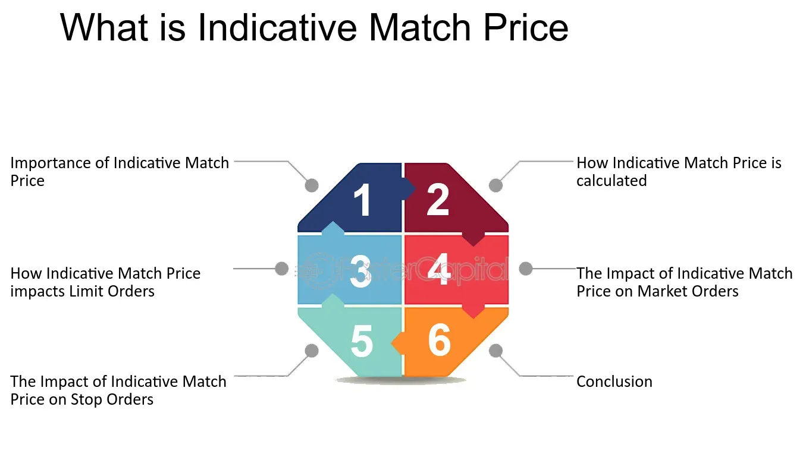

## Table of Contents

## What is an Indicative Match Price (IMP)?

An Indicative Match Price (IMP) is a price that shows what a stock might trade at during an auction. It's used in stock markets to help traders know what price they might get if they buy or sell a stock at that time. The IMP is calculated by looking at all the buy and sell orders that people have placed and finding a price where the most trades could happen.

The IMP is important because it gives traders a good idea of where the market is heading. It helps them make better decisions about when to buy or sell. For example, if the IMP is higher than the last traded price, it might mean that the stock's price is going up. This information can be really useful for traders trying to make smart moves in the market.

## How is the Indicative Match Price calculated?

The Indicative Match Price (IMP) is calculated by looking at all the buy and sell orders that people have placed for a stock. Imagine a big list where some people want to buy the stock at different prices, and others want to sell it at different prices. The IMP is the price where the most trades can happen. It's like finding a middle ground where the number of shares people want to buy matches the number of shares people want to sell.

To find this price, the stock exchange looks at all the orders and tries to match them up. If there are more people wanting to buy at a certain price than there are people wanting to sell, the IMP might be higher. If more people want to sell than buy, the IMP might be lower. The goal is to find a price where the total number of shares people want to buy equals the total number of shares people want to sell. This helps traders know what price they might get if they decide to trade during the auction.

## What is the purpose of the Indicative Match Price in trading?

The Indicative Match Price (IMP) helps traders know what price they might get if they buy or sell a stock during an auction. It's like a sneak peek at where the stock's price could be heading. By showing a price where the most trades could happen, the IMP gives traders a good idea of the market's direction. This is useful because it helps traders decide if they should buy or sell their stocks at that moment.

For example, if the IMP is higher than the last traded price, it might mean that the stock's price is going up. This information can help traders make better choices about when to trade. The IMP is calculated by looking at all the buy and sell orders and finding a price where the number of shares people want to buy matches the number of shares people want to sell. This helps create a fair and efficient market where traders can make informed decisions.

## In which types of markets is the Indicative Match Price used?

The Indicative Match Price (IMP) is mainly used in stock markets during auctions. An auction is a time when lots of people want to buy and sell stocks at the same time. The IMP helps figure out a fair price for the stock during these busy times. It's like a guide that shows what price the stock might trade at, which helps traders decide if they should buy or sell their stocks.

The IMP is especially useful in markets that use electronic trading systems. These systems can quickly look at all the buy and sell orders and find the best price where the most trades can happen. This makes trading smoother and more efficient. By giving traders a clear idea of where the market is heading, the IMP helps them make smarter trading choices.

## How does the Indicative Match Price affect order execution?

The Indicative Match Price (IMP) helps traders know what price they might get if they buy or sell a stock during an auction. It's like a guide that shows where the stock's price could be heading. When traders see the IMP, they can decide if they want to go ahead with their orders or wait for a better price. If the IMP is higher than what they expected, they might decide to sell their stocks right away. If it's lower, they might hold onto their stocks and wait for a better time to sell.

The IMP also helps make sure that orders are executed fairly. During an auction, lots of people want to buy and sell at the same time. The IMP finds a price where the most trades can happen, which means more people can get their orders filled. This makes the market more efficient because it helps match up buyers and sellers quickly. By giving traders a clear idea of the market's direction, the IMP helps them make better choices about when to trade, which can lead to smoother and more successful order execution.

## What are the benefits of using the Indicative Match Price for traders?

The Indicative Match Price (IMP) helps traders by giving them a good idea of what price they might get if they buy or sell a stock during an auction. It's like a sneak peek at where the stock's price is heading. When traders see the IMP, they can decide if it's a good time to go ahead with their orders or if they should wait for a better price. For example, if the IMP is higher than what they expected, they might decide to sell their stocks right away. If it's lower, they might hold onto their stocks and wait for a better time to sell.

Using the IMP also makes trading fairer and more efficient. During an auction, lots of people want to buy and sell at the same time. The IMP finds a price where the most trades can happen, which means more people can get their orders filled. This helps match up buyers and sellers quickly and smoothly. By giving traders a clear idea of the market's direction, the IMP helps them make better choices about when to trade. This can lead to smoother and more successful order execution, making the whole trading process easier and more effective for everyone involved.

## Can the Indicative Match Price influence market behavior?

Yes, the Indicative Match Price (IMP) can influence how people act in the market. When traders see the IMP, they get a good idea of what price they might get if they buy or sell a stock during an auction. This information can make them decide to buy or sell right away, or wait for a better price. For example, if the IMP is higher than the last traded price, traders might think the stock's price is going up and rush to buy it. If it's lower, they might sell their stocks to avoid losing money.

The IMP also helps make the market more stable. By showing a price where the most trades can happen, it helps match up buyers and sellers quickly and fairly. This can calm down the market because everyone knows what to expect. When traders have a clear idea of where the market is heading, they can make better choices. This can lead to fewer big surprises and help keep the market running smoothly.

## What are the limitations or potential drawbacks of relying on the Indicative Match Price?

One limitation of relying on the Indicative Match Price (IMP) is that it's just a guess. It's based on the buy and sell orders people have placed at that moment, but things can change quickly. If new orders come in or people cancel their orders, the IMP can change too. This means traders might make decisions based on a price that isn't accurate anymore. It's like trying to hit a moving target, which can be tricky and lead to mistakes.

Another potential drawback is that the IMP might not always show the true value of a stock. Sometimes, big traders can place orders just to move the IMP in a certain direction. This is called "[order book](/wiki/order-book-trading-strategies) manipulation." If traders rely too much on the IMP without looking at other information, they might get tricked into buying or selling at the wrong time. It's important for traders to use the IMP as one piece of the puzzle, not the whole picture, to make the best decisions.

## How does the Indicative Match Price interact with other market indicators?

The Indicative Match Price (IMP) works together with other market indicators to help traders understand what's happening in the market. For example, if the IMP is going up but the stock's price is going down, it might mean that more people want to buy the stock at a higher price. Traders can use this information along with other indicators like the stock's price, trading [volume](/wiki/volume-trading-strategy), and moving averages to make better decisions. The IMP gives a quick snapshot of where the market might be heading, but looking at other indicators helps traders see the bigger picture.

Sometimes, the IMP might not match up with other indicators. For instance, if the IMP is high but the trading volume is low, it could mean that not many people are actually trading at that price. This might make traders think twice before making a move. By comparing the IMP with other market indicators, traders can get a more complete view of the market and avoid making decisions based on just one piece of information. It's like putting together a puzzle to see the whole picture of what's happening in the market.

## What advanced strategies can traders employ using the Indicative Match Price?

Traders can use the Indicative Match Price (IMP) to make smart moves in the market. One strategy is to watch how the IMP changes over time. If the IMP keeps going up, it might mean that more people want to buy the stock at higher prices. Traders can use this information to buy the stock before the price goes up even more. They can also set their sell orders just above the IMP to make sure they get a good price when they sell. By paying attention to the IMP, traders can time their trades better and make more money.

Another strategy is to compare the IMP with other market indicators like trading volume and moving averages. If the IMP is high but the trading volume is low, it might mean that not many people are actually trading at that price. Traders can use this to decide if they should wait for a better time to trade. They can also look at the IMP along with the stock's price to see if the market is going up or down. By using the IMP together with other indicators, traders can get a fuller picture of the market and make smarter trading decisions.

## How has the use of Indicative Match Price evolved with technological advancements in trading platforms?

The use of Indicative Match Price (IMP) has changed a lot because of new technology in trading platforms. In the past, figuring out the IMP was hard and took a long time because people had to do it by hand. But now, with computers and fast internet, trading platforms can quickly look at all the buy and sell orders and find the IMP in just a few seconds. This makes trading faster and easier for everyone. Traders can see the IMP in real-time, which helps them make quick decisions about buying or selling stocks.

These new technologies also make the IMP more accurate and useful. Trading platforms can now handle a lot more orders at once, which means the IMP can be based on more information. This helps make the IMP a better guide for traders. Also, with smart algorithms and [machine learning](/wiki/machine-learning), trading platforms can predict how the IMP might change in the future. This gives traders even more tools to plan their trades and make smart moves in the market.

## What future developments might impact the functionality and implications of the Indicative Match Price?

In the future, new technology could make the Indicative Match Price (IMP) even better. One big change might be the use of [artificial intelligence](/wiki/ai-artificial-intelligence) (AI) and machine learning. These technologies could help predict how the IMP will change over time by looking at lots of data really fast. This would give traders a better idea of what prices might be in the future, helping them make smarter decisions. Also, blockchain technology could make trading more secure and transparent, which could affect how the IMP is calculated and used.

Another thing that could change the IMP is the growth of high-frequency trading. This is when computers make lots of trades very quickly. As this kind of trading gets more popular, it could make the IMP change more often and faster. Traders would need to keep up with these quick changes to use the IMP effectively. Overall, as technology keeps getting better, the IMP will become a more powerful tool for traders, helping them understand and react to the market in new ways.

## References & Further Reading

[1]: Bergstra, J., Bardenet, R., Bengio, Y., & Kégl, B. (2011). ["Algorithms for Hyper-Parameter Optimization."](https://dl.acm.org/doi/10.5555/2986459.2986743) Advances in Neural Information Processing Systems 24.

[2]: ["Advances in Financial Machine Learning"](https://www.amazon.com/Advances-Financial-Machine-Learning-Marcos/dp/1119482089) by Marcos Lopez de Prado

[3]: ["Evidence-Based Technical Analysis: Applying the Scientific Method and Statistical Inference to Trading Signals"](https://www.amazon.com/Evidence-Based-Technical-Analysis-Scientific-Statistical/dp/0470008741) by David Aronson

[4]: ["Machine Learning for Algorithmic Trading"](https://github.com/stefan-jansen/machine-learning-for-trading) by Stefan Jansen

[5]: ["Quantitative Trading: How to Build Your Own Algorithmic Trading Business"](https://www.amazon.com/Quantitative-Trading-Build-Algorithmic-Business/dp/1119800064) by Ernest P. Chan