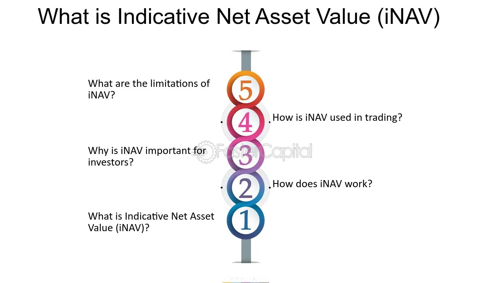

## Table of Contents

## What is Indicative Net Asset Value (iNAV)?

Indicative Net Asset Value (iNAV) is a measure used to show the estimated value of an exchange-traded fund (ETF) throughout the trading day. It gives investors an idea of what the ETF's shares should be worth based on the current prices of the securities it holds. This value is updated in real-time and helps traders and investors make informed decisions about buying or selling the ETF.

The iNAV is calculated by taking the total value of all the assets in the ETF, subtracting any liabilities, and then dividing by the number of shares outstanding. This process is done continuously during market hours, providing a constantly updated figure that reflects the ETF's underlying value. By comparing the iNAV with the ETF's market price, investors can see if the ETF is trading at a premium or discount, which can influence their trading strategies.

## How is iNAV calculated?

iNAV, or Indicative Net Asset Value, is a way to figure out what an ETF (Exchange-Traded Fund) is worth during the trading day. To calculate it, you start by adding up the value of all the things the ETF owns, like stocks or bonds. Then, you subtract any money the ETF owes, which are its liabilities. After that, you divide this number by the total number of ETF shares that exist. This gives you the iNAV, which tells you what each share of the ETF should be worth at that moment.

This calculation happens all the time while the market is open, so the iNAV keeps changing as the prices of the ETF's holdings go up or down. By looking at the iNAV, investors can see if the ETF's market price is higher or lower than its estimated value. If the market price is higher, the ETF is trading at a premium. If it's lower, it's trading at a discount. This helps people decide if it's a good time to buy or sell the ETF.

## Why is iNAV important for investors?

iNAV is important for investors because it helps them understand the true value of an ETF during the trading day. It gives a real-time estimate of what each share should be worth based on the current prices of the assets inside the ETF. By knowing the iNAV, investors can see if the ETF's market price is higher or lower than its estimated value. This can help them make better choices about when to buy or sell the ETF.

If the market price of the ETF is higher than the iNAV, it means the ETF is trading at a premium. This might make investors think twice before buying because they could be paying more than the ETF is actually worth. On the other hand, if the market price is lower than the iNAV, the ETF is trading at a discount. This could be a good time to buy because investors might be getting a deal. By keeping an eye on the iNAV, investors can make smarter decisions and possibly get better results from their investments.

## How often is iNAV updated?

iNAV is updated all the time during the trading day. It changes every few seconds as the prices of the things inside the ETF go up or down. This helps investors see the current value of the ETF without waiting until the end of the day.

By having this real-time information, people can make quick decisions about buying or selling the ETF. If the iNAV shows the ETF is worth more than its market price, it might be a good time to buy. If it's worth less, it might be a good time to sell. This makes iNAV a very useful tool for anyone trading ETFs.

## What is the difference between iNAV and Net Asset Value (NAV)?

iNAV and NAV both help figure out what an ETF is worth, but they do it at different times. NAV, or Net Asset Value, is calculated once a day after the market closes. It's the total value of all the things the ETF owns minus any money it owes, divided by the number of shares. This gives investors a clear picture of what the ETF was worth at the end of the trading day.

On the other hand, iNAV, or Indicative Net Asset Value, is updated all the time while the market is open. It changes every few seconds to show what the ETF should be worth right now, based on the current prices of its holdings. This real-time information helps investors make quick decisions about buying or selling the ETF during the day. So, while NAV gives a final value at the end of the day, iNAV gives a constantly changing estimate throughout the day.

## How can iNAV be used in trading ETFs?

iNAV can be a helpful tool for people trading ETFs. It shows what the ETF should be worth right now, based on the prices of the things it owns. This real-time information lets traders see if the ETF's market price is higher or lower than its estimated value. If the market price is higher than the iNAV, the ETF is trading at a premium. This might make traders think twice before buying because they could be paying more than the ETF is actually worth. But if the market price is lower than the iNAV, the ETF is trading at a discount. This could be a good time to buy because traders might be getting a deal.

Using iNAV can help traders make better decisions during the day. For example, if a trader sees that the iNAV of an ETF is going up while the market price stays the same, it might be a good time to buy. This is because the ETF could soon be worth more. On the other hand, if the iNAV is going down but the market price is not changing, it might be a good time to sell. This way, traders can use the iNAV to find the best times to buy or sell, helping them get better results from their investments.

## What factors can cause discrepancies between iNAV and actual market price?

Discrepancies between iNAV and the actual market price of an ETF can happen because of many reasons. One big reason is how much people want to buy or sell the ETF. If lots of people want to buy it, the price might go up higher than the iNAV, making it trade at a premium. If lots of people want to sell it, the price might go down lower than the iNAV, making it trade at a discount. Another reason is how fast the market changes. If the prices of the things inside the ETF change quickly, it might take a little time for the iNAV to catch up, causing a difference between the two.

Also, things like trading costs and taxes can make a difference. When you buy or sell an ETF, there are costs involved, like fees and taxes. These costs can make the market price different from the iNAV. Sometimes, big news or events can make people feel differently about an ETF, which can also cause the market price to be different from the iNAV. By understanding these factors, traders can make better decisions about when to buy or sell an ETF.

## Can iNAV be used to identify arbitrage opportunities?

Yes, iNAV can be used to find [arbitrage](/wiki/arbitrage) opportunities. Arbitrage means making money by buying something in one place and selling it in another place for a higher price. If the market price of an ETF is different from its iNAV, traders can use this difference to make a profit. For example, if the market price is lower than the iNAV, traders can buy the ETF and then sell the underlying assets at a higher price, making a profit from the difference.

However, this is not always easy. The difference between the market price and the iNAV can be small, and there are costs like trading fees and taxes that can eat into the profit. Also, the prices of the assets inside the ETF can change quickly, making the iNAV change too. So, traders need to be fast and smart to take advantage of these opportunities. By watching the iNAV closely and understanding the market, traders can find times when it makes sense to try arbitrage.

## How reliable is iNAV as a valuation tool?

iNAV is a good tool for figuring out what an ETF is worth during the trading day. It gives you a real-time guess of what the ETF should be worth based on the prices of the things it owns. This can help you see if the ETF's market price is too high or too low compared to its real value. But, iNAV is not perfect. It can change a lot because the prices of the things inside the ETF can go up and down quickly. Also, things like trading costs and taxes can make the market price different from the iNAV.

Even though iNAV is not always exact, it is still very useful for traders. It helps them make quick choices about buying or selling the ETF during the day. If the iNAV shows the ETF is worth more than its market price, it might be a good time to buy. If it's worth less, it might be a good time to sell. By using iNAV, traders can find the best times to trade and maybe make more money. But they need to remember that iNAV is just a guide and the real market can be different.

## What are the limitations of using iNAV?

iNAV is a helpful tool for figuring out what an ETF should be worth during the trading day. It gives you a real-time guess of the value based on the prices of the things the ETF owns. This can help you see if the ETF's market price is too high or too low. But iNAV has some limits. It can change a lot because the prices of the things inside the ETF can go up and down quickly. So, the iNAV might not always show the exact value of the ETF at any moment.

Also, there are other things that can make the market price different from the iNAV. Trading costs and taxes can make a difference. If lots of people want to buy or sell the ETF, that can change the market price too. Big news or events can also make people feel differently about the ETF, causing the market price to be different from the iNAV. So, while iNAV is a good guide, it's not perfect, and traders need to think about these limits when using it to make choices.

## How do different financial institutions calculate iNAV?

Different financial institutions calculate iNAV in a similar way, but there can be small differences because of the tools and data they use. To find the iNAV, they start by adding up the value of all the things the ETF owns, like stocks or bonds. Then, they subtract any money the ETF owes, which are its liabilities. After that, they divide this number by the total number of ETF shares that exist. This gives them the iNAV, which tells them what each share of the ETF should be worth right now. But, because they might use different data sources or ways to figure out the prices, the iNAV can be a little different from one institution to another.

Even though the basic way to calculate iNAV is the same, the small differences can matter to traders. For example, one institution might use real-time data from one stock exchange, while another might use data from a different exchange. This can make the iNAV numbers a bit different. Also, some institutions might update their iNAV more often than others, which can affect how up-to-date the information is. So, traders need to know that while iNAV is a helpful tool, the numbers can vary a little depending on who is calculating it.

## What advanced strategies involve using iNAV for portfolio management?

iNAV can be a powerful tool for managing a portfolio of ETFs. One advanced strategy is to use iNAV to find arbitrage opportunities. If the market price of an ETF is lower than its iNAV, a portfolio manager might buy the ETF and then sell the underlying assets at a higher price, making a profit from the difference. This strategy requires quick action and a good understanding of the market, but it can help improve the overall performance of the portfolio. By keeping an eye on the iNAV, managers can spot these opportunities and take advantage of them to boost returns.

Another strategy involves using iNAV to manage risk. If the iNAV of an ETF starts to drop while the market price stays the same, it might be a sign that the ETF's value is going down. A portfolio manager could then decide to sell the ETF before the market price catches up, avoiding potential losses. This way, iNAV helps managers make smart choices about when to buy or sell, keeping their portfolio safe. By using iNAV in these ways, managers can make their portfolios work better and handle risks more effectively.

## What is Indicative Net Asset Value (iNAV)?

Indicative Net Asset Value (iNAV) is a financial measure that provides a real-time approximation of an Exchange Traded Fund's (ETF) per-share net asset value. Unlike the traditional Net Asset Value (NAV), which is calculated at the end of the trading day, iNAV updates every 15 seconds. This frequent updating provides investors with a nearly immediate visualization of an ETF's value throughout the trading day. It uses the latest market data to accurately assess the value of the underlying assets within an ETF, effectively accounting for market fluctuations as they occur.

The calculation of iNAV involves using real-time market prices of the securities included in the ETF. This includes equities, bonds, and other financial instruments depending on the ETF's structure. The continuous update cycle of iNAV ensures that the valuation remains as close to real-time as possible, adapting to each security’s price movement on the exchange.

The formula to calculate iNAV can be expressed as follows:

$$
\text{iNAV} = \frac{\sum (\text{market price of each component security} \times \text{number of shares of the security}) - \text{Liabilities}}{\text{Total number of ETF shares outstanding}}
$$

The real-time valuation incorporates currency conversion rates where applicable, especially for ETFs containing international assets, making iNAV an invaluable tool for global investors. It also considers accrued income, liabilities, and expenses to provide an accurate moment-to-moment valuation. By offering such dynamic insights, iNAV empowers investors with timely information, enhancing market responsiveness and decision-making across diverse investment strategies.

## What are the components and how is the calculation of iNAV done?

Indicative Net Asset Value (iNAV) is a critical financial metric that provides investors with real-time insights into the value of an exchange-traded fund ([ETF](/wiki/etf-trading-strategies)). The calculation and components involved in deriving iNAV require the integration of multiple real-time financial variables.

At its core, iNAV is reliant on the real-time prices of the underlying assets within an ETF, such as equities, bonds, and other securities. As these asset prices fluctuate throughout the trading day, they directly influence the iNAV, providing a dynamic valuation that reflects current market conditions.

Currency conversion rates are another essential component, particularly for ETFs that contain international assets. Fluctuations in exchange rates can significantly impact the calculation of iNAV, leading to shifts in the valuation as market conditions change globally.

Accrued income, including dividends and interest from the ETF's underlying assets, is factored into the iNAV calculation. This inclusion ensures that the valuation also reflects potential earnings not yet received but anticipated based on historical patterns or expected future payments.

Liabilities, such as fees and other expenses associated with managing the ETF, must be deducted from the calculation to provide a more accurate representation of the net value. This includes ongoing operational costs and any other anticipated liabilities that may affect the fund's overall net asset value.

The computation of iNAV involves determining the total value of the assets within the ETF, subtracting any liabilities, and then dividing this net figure by the number of outstanding shares. Mathematically, this can be represented as:

$$

\text{iNAV} = \frac{\sum (\text{Real-time } \text{Asset Values}) - \text{Liabilities}}{\text{Number of Outstanding Shares}} 
$$

This formulation ensures that investors receive a precise and current valuation that reflects the ETF's worth at any given moment, facilitating informed decision-making based on real-time market conditions.

## What is the difference between iNAV and NAV?

In the financial markets, understanding the differences between Indicative Net Asset Value (iNAV) and Net Asset Value (NAV) is crucial for making informed investment decisions. NAV is a traditional metric, calculated at the end of the trading day, providing an official closing value of a fund's per-share worth. This valuation is determined by taking the total value of the fund's assets, subtracting its liabilities, and dividing by the number of shares outstanding. The formula is expressed as:

$$
\text{NAV} = \frac{\text{Total Assets} - \text{Total Liabilities}}{\text{Number of Shares Outstanding}}
$$

This calculation provides investors with a snapshot of the fund's value at the close of trading, but it does not account for intraday fluctuations.

Contrastingly, iNAV provides continuous updates throughout trading hours, reflecting real-time market conditions and enabling traders to capitalize on intraday opportunities. It is recalculated every 15 seconds using the most recent market data to assess the value of an ETF's underlying assets. This offers a dynamic view of an ETF's worth, crucial for traders engaging in short-term investments.

The critical distinction lies in their applications: NAV is generally more relevant for long-term investors who are less concerned with short-term price fluctuations and focus on the fund's overall performance over extended periods. On the other hand, iNAV is indispensable for traders who focus on short-term gains and require real-time data to make fast-paced decisions within trading hours.

In conclusion, both iNAV and NAV provide essential insights into asset valuation, but their utility varies depending on the investor's goals. While NAV remains a reliable measure for the day's closing value, iNAV offers an up-to-the-second view that is integral to modern, fast-paced trading strategies.

## References & Further Reading

[1]: Bergstra, J., Bardenet, R., Bengio, Y., & Kégl, B. (2011). ["Algorithms for Hyper-Parameter Optimization."](https://dl.acm.org/doi/10.5555/2986459.2986743) Advances in Neural Information Processing Systems 24.

[2]: ["Advances in Financial Machine Learning"](https://www.amazon.com/Advances-Financial-Machine-Learning-Marcos/dp/1119482089) by Marcos Lopez de Prado

[3]: ["Evidence-Based Technical Analysis: Applying the Scientific Method and Statistical Inference to Trading Signals"](https://www.amazon.com/Evidence-Based-Technical-Analysis-Scientific-Statistical/dp/0470008741) by David Aronson

[4]: ["Machine Learning for Algorithmic Trading"](https://github.com/stefan-jansen/machine-learning-for-trading) by Stefan Jansen

[5]: ["Quantitative Trading: How to Build Your Own Algorithmic Trading Business"](https://www.amazon.com/Quantitative-Trading-Build-Algorithmic-Business/dp/1119800064) by Ernest P. Chan