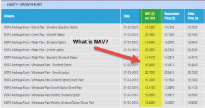

The financial landscape is undergoing significant transformation, with new metrics like the Indicative Net Asset Value (iNAV) becoming increasingly vital, particularly within ETF trading. iNAV offers a near real-time estimate of an ETF's value, setting itself apart from the traditional net asset value (NAV) which is calculated only at the close of trading each day. This distinction is crucial, as iNAV enables investors to receive timely insights into the worth of their investments throughout the trading day.

The emergence of algorithmic trading, which involves automated trading strategies driven by data and computational algorithms, has greatly benefited from the real-time data that iNAV provides. By offering continuous updates on asset values, iNAV facilitates the execution of strategies that require precision and speed, making it an indispensable tool for traders.

For investors operating in today's rapid market environment, understanding and leveraging iNAV is essential. It aids in making informed decisions by offering a transparent and current perspective on investment values, therefore enhancing trading efficiency and potentially improving investment outcomes. As the financial markets continue to evolve, iNAV's role in providing real-time valuation data becomes increasingly critical, representing a significant shift in how investment metrics are utilized.

## Table of Contents

## What is Indicative Net Asset Value (iNAV)?

Indicative Net Asset Value (iNAV) is a financial measure that provides a real-time approximation of an Exchange Traded Fund's (ETF) per-share net asset value. Unlike the traditional Net Asset Value (NAV), which is calculated at the end of the trading day, iNAV updates every 15 seconds. This frequent updating provides investors with a nearly immediate visualization of an ETF's value throughout the trading day. It uses the latest market data to accurately assess the value of the underlying assets within an ETF, effectively accounting for market fluctuations as they occur.

The calculation of iNAV involves using real-time market prices of the securities included in the ETF. This includes equities, bonds, and other financial instruments depending on the ETF's structure. The continuous update cycle of iNAV ensures that the valuation remains as close to real-time as possible, adapting to each security’s price movement on the exchange.

The formula to calculate iNAV can be expressed as follows:

$$
\text{iNAV} = \frac{\sum (\text{market price of each component security} \times \text{number of shares of the security}) - \text{Liabilities}}{\text{Total number of ETF shares outstanding}}
$$

The real-time valuation incorporates currency conversion rates where applicable, especially for ETFs containing international assets, making iNAV an invaluable tool for global investors. It also considers accrued income, liabilities, and expenses to provide an accurate moment-to-moment valuation. By offering such dynamic insights, iNAV empowers investors with timely information, enhancing market responsiveness and decision-making across diverse investment strategies.

## Components and Calculation of iNAV

Indicative Net Asset Value (iNAV) is a critical financial metric that provides investors with real-time insights into the value of an exchange-traded fund ([ETF](/wiki/etf-trading-strategies)). The calculation and components involved in deriving iNAV require the integration of multiple real-time financial variables.

At its core, iNAV is reliant on the real-time prices of the underlying assets within an ETF, such as equities, bonds, and other securities. As these asset prices fluctuate throughout the trading day, they directly influence the iNAV, providing a dynamic valuation that reflects current market conditions.

Currency conversion rates are another essential component, particularly for ETFs that contain international assets. Fluctuations in exchange rates can significantly impact the calculation of iNAV, leading to shifts in the valuation as market conditions change globally.

Accrued income, including dividends and interest from the ETF's underlying assets, is factored into the iNAV calculation. This inclusion ensures that the valuation also reflects potential earnings not yet received but anticipated based on historical patterns or expected future payments.

Liabilities, such as fees and other expenses associated with managing the ETF, must be deducted from the calculation to provide a more accurate representation of the net value. This includes ongoing operational costs and any other anticipated liabilities that may affect the fund's overall net asset value.

The computation of iNAV involves determining the total value of the assets within the ETF, subtracting any liabilities, and then dividing this net figure by the number of outstanding shares. Mathematically, this can be represented as:

$$

\text{iNAV} = \frac{\sum (\text{Real-time } \text{Asset Values}) - \text{Liabilities}}{\text{Number of Outstanding Shares}} 
$$

This formulation ensures that investors receive a precise and current valuation that reflects the ETF's worth at any given moment, facilitating informed decision-making based on real-time market conditions.

## Importance of iNAV in Trading

Indicative Net Asset Value (iNAV) is essential in trading by providing transparency and real-time data that help investors accurately understand an ETF’s value during trading hours. Unlike traditional net asset value (NAV), which offers a static snapshot at the end of the day, iNAV delivers continuous updates which are crucial in volatile markets. This ensures that traders and investors can make timely and informed decisions, particularly those engaged in intraday trading activities. By offering real-time estimates, iNAV allows traders to assess ETF price movements and intrinsic values more precisely, leading to more strategic trading actions. 

Market makers, who play a pivotal role in maintaining market [liquidity](/wiki/liquidity-risk-premium), utilize iNAV to identify [arbitrage](/wiki/arbitrage) opportunities. By comparing the iNAV with the current market price of an ETF, these market participants can exploit price discrepancies, buying when the market price is below the iNAV and selling when it is above, thus aligning market prices with the underlying asset values. This activity, while seeking profit, also contributes to market efficiency by correcting mispricings and ensuring prices reflect true values.

Price discovery, a key [factor](/wiki/factor-investing) in maintaining efficient markets, is significantly enhanced through the use of iNAV. By reflecting real-time changes in the market, iNAV aids in setting a foundation for price adjustments in accordance to the latest market data. This dynamic approach allows market prices to adjust swiftly to new information, enhancing overall market transparency and reducing informational asymmetries that could otherwise lead to inefficiencies.

iNAV thereby supports an environment where market dynamics are more transparent and prices more properly perceived, contributing to robust and effective trading strategies and a healthier trading system overall.

## iNAV vs. NAV

In the financial markets, understanding the differences between Indicative Net Asset Value (iNAV) and Net Asset Value (NAV) is crucial for making informed investment decisions. NAV is a traditional metric, calculated at the end of the trading day, providing an official closing value of a fund's per-share worth. This valuation is determined by taking the total value of the fund's assets, subtracting its liabilities, and dividing by the number of shares outstanding. The formula is expressed as:

$$
\text{NAV} = \frac{\text{Total Assets} - \text{Total Liabilities}}{\text{Number of Shares Outstanding}}
$$

This calculation provides investors with a snapshot of the fund's value at the close of trading, but it does not account for intraday fluctuations.

Contrastingly, iNAV provides continuous updates throughout trading hours, reflecting real-time market conditions and enabling traders to capitalize on intraday opportunities. It is recalculated every 15 seconds using the most recent market data to assess the value of an ETF's underlying assets. This offers a dynamic view of an ETF's worth, crucial for traders engaging in short-term investments.

The critical distinction lies in their applications: NAV is generally more relevant for long-term investors who are less concerned with short-term price fluctuations and focus on the fund's overall performance over extended periods. On the other hand, iNAV is indispensable for traders who focus on short-term gains and require real-time data to make fast-paced decisions within trading hours.

In conclusion, both iNAV and NAV provide essential insights into asset valuation, but their utility varies depending on the investor's goals. While NAV remains a reliable measure for the day's closing value, iNAV offers an up-to-the-second view that is integral to modern, fast-paced trading strategies.

## The Role of iNAV in Algorithmic Trading

Algorithmic trading has become an essential element of modern financial markets, leveraging data-driven strategies to capitalize on momentary market inefficiencies. Indicative Net Asset Value (iNAV) serves as a critical benchmark in [algorithmic trading](/wiki/algorithmic-trading), offering real-time insights that traders depend on to make rapid decisions. 

Algorithmic traders utilize iNAV to design strategies that exploit divergences between iNAV and current market prices. By comparing the continuously updated iNAV with the existing market price of an Exchange Traded Fund (ETF), traders can identify potential arbitrage opportunities. The real-time nature of iNAV enables traders to act swiftly, thus maintaining market efficiency. In circumstances where an ETF's market price deviates from its iNAV, traders can buy undervalued shares or sell overvalued ones, driving the market price towards the intrinsic value indicated by the iNAV.

High-frequency trading ([HFT](/wiki/high-frequency-trading-strategies)) firms heavily depend on iNAV as their operations hinge on executing trades at speeds beyond human capabilities. The instantaneous data provided by iNAV facilitates these firms in executing thousands of transactions per second. This rapid trading not only maintains market efficiency by aligning prices with their intrinsic values but also provides liquidity which is crucial for the smooth functioning of markets.

Market makers, pivotal in ensuring liquidity, rely on iNAV to stabilize market prices. By continuously posting buy and sell orders, they ensure that market prices reflect the iNAV, thereby aligning them with the ETF's intrinsic value. The presence of iNAV allows market makers to adjust their bids and offers to prevent substantial deviations, providing stakeholders—investors and traders alike—with confidence in the market's pricing mechanisms.

Risk management strategies also benefit significantly from iNAV as it allows for real-time monitoring of asset values. By observing iNAV data, traders can manage their exposure effectively, adjusting their portfolios in response to real-time data on the underlying assets of an ETF. This function is crucial for algorithmic trading systems tasked with continuously adjusting positions to maintain desired risk levels. Ensuring accurate exposure management helps in minimizing potential downside risks while capitalizing on profitable opportunities as markets fluctuate.

In summary, iNAV is integral to algorithmic trading, enhancing market transparency and efficiency. It provides traders with immediate information necessary for executing strategies, assures market makers of price alignment with intrinsic values, and supports effective risk management practices. As algorithmic trading continues to evolve, the role of iNAV in sustaining efficient and transparent markets remains undeniably pivotal.

## Conclusion

Indicative Net Asset Value (iNAV) is an indispensable tool in modern finance, enhancing both clarity and efficiency within trading environments. Its ability to deliver real-time insights into the value of Exchange Traded Funds (ETFs) makes iNAV a critical component for algorithmic and institutional traders striving to maintain a competitive advantage. By providing continuous updates, iNAV allows these traders to adapt swiftly to market conditions, optimize strategies, and exploit transient opportunities, thereby enhancing their potential for favorable returns.

However, the effectiveness of iNAV is heavily predicated on the accuracy and timeliness of the data it utilizes. These challenges underscore the importance of robust data collection and dissemination systems, as inaccuracies can lead to mispricing and inefficient markets. Despite these challenges, iNAV significantly contributes to market transparency and efficiency by allowing for more accurate price discovery and minimizing arbitrage opportunities. Consequently, its benefits substantially outweigh the challenges, establishing iNAV as a vital element in contemporary trading practices.

## References & Further Reading

[1]: Bergstra, J., Bardenet, R., Bengio, Y., & Kégl, B. (2011). ["Algorithms for Hyper-Parameter Optimization."](https://dl.acm.org/doi/10.5555/2986459.2986743) Advances in Neural Information Processing Systems 24.

[2]: ["Advances in Financial Machine Learning"](https://www.amazon.com/Advances-Financial-Machine-Learning-Marcos/dp/1119482089) by Marcos Lopez de Prado

[3]: ["Evidence-Based Technical Analysis: Applying the Scientific Method and Statistical Inference to Trading Signals"](https://www.amazon.com/Evidence-Based-Technical-Analysis-Scientific-Statistical/dp/0470008741) by David Aronson

[4]: ["Machine Learning for Algorithmic Trading"](https://github.com/stefan-jansen/machine-learning-for-trading) by Stefan Jansen

[5]: ["Quantitative Trading: How to Build Your Own Algorithmic Trading Business"](https://www.amazon.com/Quantitative-Trading-Build-Algorithmic-Business/dp/1119800064) by Ernest P. Chan