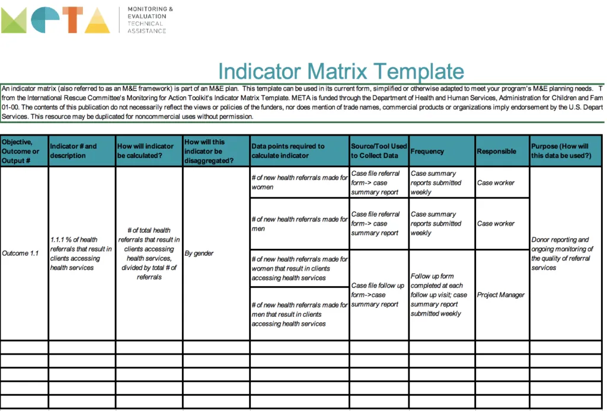

## Table of Contents

## What is an indicator matrix?

An indicator matrix is a special type of matrix used in math and computer science. It is made up of zeros and ones, where each one represents the presence of something, and each zero represents the absence. For example, if you have a list of students and you want to show which students are in a certain club, you can use an indicator matrix. Each row can represent a student, and each column can represent a club. If a student is in a club, you put a one in the corresponding cell; otherwise, you put a zero.

Indicator matrices are useful because they make it easy to see patterns and do calculations. They are often used in areas like statistics, machine learning, and data analysis. For instance, in machine learning, an indicator matrix can help you categorize data into different groups. By using ones and zeros, you can quickly process and analyze large amounts of information. This makes it easier to understand and work with data in many different fields.

## How is an indicator matrix different from other types of matrices?

An indicator matrix is different from other types of matrices because it only uses zeros and ones. Most other matrices can have any numbers in them, like whole numbers, fractions, or even negative numbers. The zeros and ones in an indicator matrix show if something is there or not. For example, if you're tracking which students are in a club, a one means the student is in the club, and a zero means they are not. This makes it easy to see patterns and group things together.

Another difference is that indicator matrices are often used for specific purposes, like in data analysis or [machine learning](/wiki/machine-learning). They help to categorize and process information quickly. Other matrices, like square matrices or identity matrices, might be used for different things, like solving equations or transforming data. While an indicator matrix focuses on showing presence or absence, other matrices can do more complex calculations or represent different kinds of relationships between numbers.

## What are the common uses of an indicator matrix in data analysis?

In data analysis, an indicator matrix is often used to show which items belong to certain groups. For example, if you have a list of customers and you want to see which ones bought a certain product, you can use an indicator matrix. Each row can be a customer, and each column can be a product. If a customer bought the product, you put a one in that spot; if they didn't, you put a zero. This makes it easy to see patterns and figure out which products are popular with which customers.

Another common use of an indicator matrix is in machine learning, where it helps to categorize data. For instance, if you're trying to teach a computer to recognize different types of animals, you can use an indicator matrix to show which features belong to which animal. Each row can represent an animal, and each column can represent a feature like "has fur" or "can fly." By using ones and zeros, you can help the computer learn to tell the animals apart based on their features. This makes it easier to process and analyze large amounts of data quickly.

## How do you construct an indicator matrix from a dataset?

To construct an indicator matrix from a dataset, you first need to decide what you want to show with the matrix. For example, if you have a list of students and you want to see which ones are in a certain club, each row of the matrix can be a student and each column can be a club. You look at each student and check if they are in the club. If they are, you put a one in the cell where the student's row meets the club's column. If they are not in the club, you put a zero in that cell. You do this for every student and every club until the whole matrix is filled.

Once you have filled in the matrix, you can use it to see patterns and make decisions. For example, you can quickly see which clubs are popular by counting the number of ones in each column. Or, you can see which students are involved in a lot of clubs by counting the number of ones in each row. This makes it easy to understand the data and use it for things like planning events or making recommendations. Indicator matrices are useful because they turn complicated information into simple ones and zeros, making it easier to work with data.

## Can you provide a simple example of an indicator matrix?

Let's say we have a group of four students: Alice, Bob, Charlie, and Diana. We want to see which students are in the Chess Club and the Science Club. We can make an indicator matrix to show this. Each row will be a student, and each column will be a club. If a student is in a club, we put a one in that spot. If they are not in the club, we put a zero.

Here's what the indicator matrix might look like:

|          | Chess Club | Science Club |
|----------|------------|--------------|
| Alice    | 1          | 0            |
| Bob      | 0          | 1            |
| Charlie  | 1          | 1            |
| Diana    | 0          | 0            |

In this example, Alice is in the Chess Club but not the Science Club, so her row has a one in the Chess Club column and a zero in the Science Club column. Bob is in the Science Club but not the Chess Club, so his row has a zero in the Chess Club column and a one in the Science Club column. Charlie is in both clubs, so his row has ones in both columns. Diana is not in either club, so her row has zeros in both columns. This simple matrix helps us see at a glance which students are in which clubs.

## What are the mathematical properties of an indicator matrix?

An indicator matrix has some special math properties because it only uses zeros and ones. One important property is that when you add up all the numbers in the matrix, you get the total number of ones. This can help you count how many times something happens or how many things are in a certain group. Another property is that if you multiply an indicator matrix by itself, the result is still an indicator matrix because you are just counting how many ways certain things can happen together.

Indicator matrices are also useful because they can be used to do other kinds of math. For example, if you want to find out how many students are in both the Chess Club and the Science Club, you can multiply the Chess Club column by the Science Club column and add up the results. This kind of math is called a dot product, and it helps you find connections between different groups. Because indicator matrices use simple numbers, they make it easier to see patterns and do calculations, which is why they are so helpful in data analysis and machine learning.

## How does an indicator matrix relate to binary variables?

An indicator matrix is closely related to binary variables because both use zeros and ones to show if something is there or not. In an indicator matrix, each cell is like a binary variable. For example, if you have a matrix showing which students are in a club, each cell is a binary variable that says "yes" (1) or "no" (0) about whether a student is in that club. This makes it easy to see which students belong to which groups.

Just like binary variables, indicator matrices help to turn complex information into simple numbers. This makes them useful in math and computer science because they can be used to do calculations and find patterns. For instance, if you want to know how many students are in both the Chess Club and the Science Club, you can use the binary variables in the indicator matrix to figure it out. This shows how indicator matrices and binary variables work together to make data easier to understand and use.

## What are the advantages of using an indicator matrix in statistical modeling?

Using an indicator matrix in statistical modeling makes things simpler and easier to understand. An indicator matrix turns complicated data into simple ones and zeros. This makes it easy to see which items belong to which groups. For example, if you're looking at customer data, an indicator matrix can show which customers bought certain products. This helps you see patterns and make better decisions, like figuring out which products are popular with which customers.

Another advantage is that indicator matrices are good for doing calculations. Because they only use ones and zeros, they make math easier. You can use them to count how many times something happens or to find out how many items are in different groups. In machine learning, indicator matrices help computers learn to recognize patterns by showing which features belong to which items. This makes it faster and easier to process and analyze large amounts of data.

## How can an indicator matrix be used in machine learning algorithms?

An indicator matrix is really helpful in machine learning because it turns complicated data into simple ones and zeros. This makes it easier for computers to understand and work with the data. For example, if you want to teach a computer to recognize different types of animals, you can use an indicator matrix to show which features belong to which animal. Each row can be an animal, and each column can be a feature like "has fur" or "can fly." By using ones and zeros, the computer can learn to tell the animals apart based on their features.

In machine learning, indicator matrices are often used to categorize data. This means they help group things together based on what they have in common. For instance, if you're trying to predict whether a customer will buy a product, you can use an indicator matrix to show which customers have bought similar products in the past. This helps the computer find patterns and make better predictions. By using indicator matrices, machine learning algorithms can process and analyze large amounts of data quickly and accurately.

## What are some advanced techniques for manipulating indicator matrices?

Advanced techniques for manipulating indicator matrices include using them in matrix operations like multiplication and transposition. When you multiply two indicator matrices, you can find out how many ways certain things can happen together. For example, if you have one matrix showing which students are in the Chess Club and another showing which students are in the Science Club, multiplying them can tell you how many students are in both clubs. Transposing an indicator matrix, which means flipping it so the rows become columns and the columns become rows, can help you look at the data from a different angle. This can be useful for finding new patterns or relationships in the data.

Another advanced technique is using indicator matrices in optimization problems. In these problems, you might want to find the best way to do something, like figuring out which students should be in which clubs to make the most balanced groups. Indicator matrices can help you set up these problems by showing which students are already in certain clubs. Then, you can use math to find the best solution. This kind of technique is often used in areas like operations research and logistics, where you need to make the best use of resources.

## How do indicator matrices handle missing or incomplete data?

When you have missing or incomplete data, indicator matrices can still be useful. You can use a special number, like -1 or a blank space, to show that the data is missing. This way, you can still see which items belong to which groups, even if you don't have all the information. For example, if you're tracking which students are in a club and you don't know if one student is in the Chess Club, you can put a -1 in that spot instead of a 0 or a 1. This tells you that the data is missing, but it doesn't stop you from using the rest of the matrix.

In more advanced cases, you can use special techniques to guess what the missing data might be. This is called imputation. You look at the patterns in the data you do have and use them to fill in the gaps. For instance, if most students who are in the Science Club are also in the Chess Club, you might guess that a student with missing data for the Chess Club is likely to be in it if they are in the Science Club. By using these techniques, indicator matrices can help you work with incomplete data and still get useful results.

## What are the limitations and potential pitfalls of using indicator matrices in complex data scenarios?

Indicator matrices can be tricky to use when the data is very complicated or has a lot of missing information. They work best when you have clear yes-or-no answers, but if the data is not that simple, it can be hard to fit it into an indicator matrix. For example, if you want to track how much students like different clubs, not just if they are in them, an indicator matrix might not be enough. You might need to use other types of data to get a full picture. Also, if you have a lot of missing data, using special numbers like -1 to show what's missing can make the matrix harder to understand and use.

Another problem with indicator matrices is that they can make it hard to see some kinds of patterns. Because they only use zeros and ones, they might not show all the details you need. For example, if you want to see how different clubs are related to each other, an indicator matrix might not be the best tool. You might need to use other math methods to find these relationships. Also, if you have a very big dataset, using an indicator matrix can make your computer work slower because it has to handle a lot of numbers. So, while indicator matrices are helpful, they have limits and you need to think carefully about when to use them.

## What are the components of an Indicator Matrix?

An indicator matrix in [algorithmic trading](/wiki/algorithmic-trading) serves as a comprehensive toolkit designed to provide traders with detailed and actionable market insights. Key components of such a matrix include:

1. **Money Flow**: This component is integral in tracing the liquidity movement within a trading environment, offering insights into the strength or weakness of market conditions. The Money Flow Index (MFI) is often used here, calculated as:
$$
   \text{MFI} = 100 - \left( \frac{100}{1 + \text{Money Flow Ratio}} \right)

$$

   where the Money Flow Ratio is the ratio of positive money flow to negative money flow over a specific period.

2. **Thresholds**: Thresholds are predefined levels within the indicator matrix that signify significant buying or selling pressure. These levels assist traders in identifying critical points where market activity could take a dramatic shift, indicating potential opportunities or risks.

3. **Overflow**: This component is designed to detect periods of excessive buying or selling activities, which may be indicative of upcoming reversals in market trends. A common approach might involve comparing current market movements against historical data to pinpoint unusual spikes in activity.

4. **Hyper Wave Oscillator**: This sophisticated tool offers both trend-following capabilities and divergence detection. It examines how price movements relate to oscillatory patterns in the market, identifying potential continuations or reversals in the current trend.

5. **Real-Time Divergences**: Divergences occur when the price of an asset moves in the opposite direction of a technical indicator. Real-time divergence detection is crucial for alerting traders to possible impending trend reversals. Techniques such as comparing Relative Strength Index (RSI) divergences with price movements can provide timely alerts.

6. **Reversal Signals**: As a predictive component, reversal signals help traders anticipate market turning points. These signals may be generated using a combination of patterns and indicators, offering a pre-emptive insight into possible changes in the trading environment, which can enhance the trader's strategic positioning.

By effectively integrating these components, an indicator matrix aids traders in creating a robust framework for market analysis, offering a multi-faceted view that enhances trading decisions.

## References & Further Reading

[1]: Bergstra, J., Bardenet, R., Bengio, Y., & Kégl, B. (2011). ["Algorithms for Hyper-Parameter Optimization."](https://dl.acm.org/doi/10.5555/2986459.2986743) Advances in Neural Information Processing Systems 24.

[2]: ["Advances in Financial Machine Learning"](https://www.amazon.com/Advances-Financial-Machine-Learning-Marcos/dp/1119482089) by Marcos Lopez de Prado

[3]: ["Evidence-Based Technical Analysis: Applying the Scientific Method and Statistical Inference to Trading Signals"](https://www.amazon.com/Evidence-Based-Technical-Analysis-Scientific-Statistical/dp/0470008741) by David Aronson

[4]: ["Machine Learning for Algorithmic Trading"](https://github.com/stefan-jansen/machine-learning-for-trading) by Stefan Jansen

[5]: ["Quantitative Trading: How to Build Your Own Algorithmic Trading Business"](https://books.google.com/books/about/Quantitative_Trading.html?id=j70yEAAAQBAJ) by Ernest P. Chan