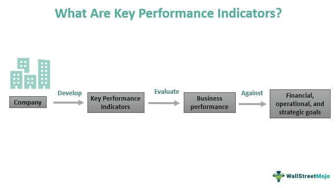

Algorithmic trading has transformed the financial markets, providing traders with the ability to systematically execute trades with precision and speed. As the market landscape becomes increasingly complex, traders continuously seek advanced tools to refine their strategies and gain a competitive edge. One such innovative tool that has garnered considerable attention is the 'indicator matrix.' This sophisticated framework leverages multiple technical indicators together to provide a holistic view of market conditions, enhancing the analytical capabilities of traders.

An indicator matrix is instrumental in algorithmic trading due to its ability to synthesize diverse market signals, helping traders make informed decisions. By integrating a variety of indicators, traders can achieve a more nuanced understanding of market trends, reversals, and potential opportunities. This comprehensive approach aids in the mitigation of risks associated with reliance on single indicators, which may not fully capture the complexities of market dynamics.



This article explores the significance of an indicator matrix in algorithmic trading, emphasizing its components, benefits, and practical integration into trading strategies. By highlighting key elements such as money flow, thresholds, and oscillators, traders can better comprehend how an indicator matrix functions. Furthermore, understanding how such a tool can improve accuracy and reduce noise in trading signals enables traders to optimize their strategies for better market performance.

As an example, the LuxAlgo Oscillator Matrix™ exemplifies a robust implementation of an indicator matrix. This proprietary tool combines multiple innovative components, offering traders enhanced real-time insights and predictive capabilities. Through the lens of the LuxAlgo Oscillator Matrix™, this article will illustrate how traders can leverage advanced indicator matrices to anticipate market movements and make more strategic trading decisions.

## Table of Contents

## What is an Indicator Matrix in Algo Trading?

An indicator matrix in [algorithmic trading](/wiki/algorithmic-trading) is an organized framework that amalgamates multiple technical indicators to provide a holistic assessment of market conditions. By harmonizing diverse indicators, traders are able to discern market trends, anticipate reversals, and pinpoint potential trading opportunities with elevated precision and clarity.

The primary advantage of using an indicator matrix lies in its capability to blend various technical indicators. Such blending allows for the capture of intricate market dynamics, encompassing both trends and reversals. For example, a single moving average might suggest an upward trend, but when combined with [momentum](/wiki/momentum) oscillators, it can offer insights into the sustainability of the trend or emerging reversals. This multifaceted approach empowers traders to make better-informed decisions.

Indicator matrices are engineered for interoperability. This means that various indicators can work together in unison, producing a confluence of signals that depict a clearer, more comprehensive overview of market behavior than any standalone indicator could achieve. Through such interoperability, traders can distinguish between reliable signals and market noise, enhancing the accuracy of their trading decisions.

Advanced indicator matrices typically encompass a diversified array of components, such as oscillators and trend-following indicators, which cater to both trend and counter-trend strategies. Oscillators help in identifying overbought or oversold conditions, offering early warnings for potential price reversals. Trend-following indicators, on the other hand, assist in confirming the continuity of prevailing trends. By integrating these distinct indicators, traders can effectively align their strategies to varying market environments, whether they involve trend continuation or potential counter-movements. 

Ultimately, the deployment of an indicator matrix in algorithmic trading establishes a robust analytical foundation, enhancing the trader’s ability to navigate and interpret complex market terrains.

## Components of an Indicator Matrix

An indicator matrix in algorithmic trading serves as a comprehensive toolkit designed to provide traders with detailed and actionable market insights. Key components of such a matrix include:

1. **Money Flow**: This component is integral in tracing the liquidity movement within a trading environment, offering insights into the strength or weakness of market conditions. The Money Flow Index (MFI) is often used here, calculated as:
$$
   \text{MFI} = 100 - \left( \frac{100}{1 + \text{Money Flow Ratio}} \right)

$$

   where the Money Flow Ratio is the ratio of positive money flow to negative money flow over a specific period.

2. **Thresholds**: Thresholds are predefined levels within the indicator matrix that signify significant buying or selling pressure. These levels assist traders in identifying critical points where market activity could take a dramatic shift, indicating potential opportunities or risks.

3. **Overflow**: This component is designed to detect periods of excessive buying or selling activities, which may be indicative of upcoming reversals in market trends. A common approach might involve comparing current market movements against historical data to pinpoint unusual spikes in activity.

4. **Hyper Wave Oscillator**: This sophisticated tool offers both trend-following capabilities and divergence detection. It examines how price movements relate to oscillatory patterns in the market, identifying potential continuations or reversals in the current trend.

5. **Real-Time Divergences**: Divergences occur when the price of an asset moves in the opposite direction of a technical indicator. Real-time divergence detection is crucial for alerting traders to possible impending trend reversals. Techniques such as comparing Relative Strength Index (RSI) divergences with price movements can provide timely alerts.

6. **Reversal Signals**: As a predictive component, reversal signals help traders anticipate market turning points. These signals may be generated using a combination of patterns and indicators, offering a pre-emptive insight into possible changes in the trading environment, which can enhance the trader's strategic positioning.

By effectively integrating these components, an indicator matrix aids traders in creating a robust framework for market analysis, offering a multi-faceted view that enhances trading decisions.

## Benefits of Using an Indicator Matrix

An indicator matrix in algorithmic trading enhances analysis by offering a multidimensional approach to evaluating market conditions. By combining various signals and indicators, traders gain a holistic view of the market, allowing for a more comprehensive assessment than isolated indicators can provide.

The use of an indicator matrix significantly improves the accuracy of predictions. By leveraging multiple corroborative signals, traders are better positioned to identify genuine trends and reversals. This integration reduces the likelihood of relying on isolated, potentially erroneous signals, thereby increasing forecasting precision.

An essential advantage of an indicator matrix is its ability to facilitate early detection of market trends and reversals. The combination of trend-following and counter-trend indicators enables traders to anticipate market movements, allowing them to position themselves advantageously. This proactive approach aids in optimizing entry and [exit](/wiki/exit-strategy) points, enhancing trading performance.

Moreover, an indicator matrix effectively reduces noise by filtering out false signals. In financial markets, noise refers to erroneous or random data that can obscure true market trends. The confluence of multiple indicators within the matrix acts as a filter, ensuring that only corroborated signals are considered, thus improving decision-making accuracy. By minimizing noise, traders can focus on more substantial market signals, leading to more informed and strategic trading actions.

## LuxAlgo Oscillator Matrix™: A Case Study

The LuxAlgo Oscillator Matrix™ is a comprehensive tool integrating multiple unique components to enhance trading analysis. By employing a combination of oscillators and trend indicators, the matrix provides traders with invaluable real-time insights into the dynamics of market conditions.

At its core, the LuxAlgo Oscillator Matrix™ incorporates several innovative features, including Smart Money Flow, Hyper Wave Oscillator, and Confluence Zones. Smart Money Flow is designed to track the movement of large market participants, providing an indication of [liquidity](/wiki/liquidity-risk-premium) and potential market strength or weakness. By analyzing the flow of institutional money, traders can better anticipate key market moves.

The Hyper Wave Oscillator serves as both a trend-following and divergence detection tool. It captures market trends by analyzing cyclical patterns and helps in identifying potential divergence points that may signal a trend reversal. Such capabilities are crucial for traders seeking to optimize entry and exit points.

Confluence Zones are another vital element of the matrix, offering areas where multiple indicators and signals align, highlighting significant support or resistance levels. These zones allow traders to pinpoint critical market turning points with higher accuracy, enhancing their overall strategy by filtering out false signals and noise.

These components collectively enable traders to achieve enhanced confluence in their trading strategies. Through better anticipation of market movements, traders can make informed decisions and refine their strategies in response to market changes. The LuxAlgo Oscillator Matrix™ thus represents a sophisticated toolset that empowers traders to navigate complex market environments more effectively.

## Integrating Indicator Matrix into Your Trading Strategy

Integrating an indicator matrix into a trading strategy involves a structured approach to selecting, configuring, and continuously optimizing the matrix components. The following steps outline how traders can effectively incorporate an indicator matrix into their trading practices:

1. **Identify Key Indicators**: The selection of indicators is crucial and should align with both the trader's specific goals and prevailing market conditions. Key indicators can include oscillators, moving averages, and volume-based indicators. For example, if a trader focuses on identifying trend reversals, indicators like the Relative Strength Index (RSI) or Moving Average Convergence Divergence (MACD) can be integral components.

2. **Customize Indicator Settings**: Each indicator within the matrix should be finely tuned to reflect the dynamics of the market and the trader's risk appetite. This step may involve adjusting parameters like period lengths or thresholds. Customization ensures that the matrix provides relevant and timely signals. For instance, changing the period of a moving average can specify focus on short-, medium-, or long-term trends.

3. **Backtest Strategies**: Backtesting is essential to validate the effectiveness of the indicator matrix over historical market data. By analyzing past performance, traders can gain insights into the potential success of the strategy. This process often involves programming backtests using platforms like Python with libraries such as Pandas and Backtrader. Here's a basic example in Python:

   ```python
   import pandas as pd
   import backtrader as bt

   class MyStrategy(bt.Strategy):
       def __init__(self):
           self.ma = bt.indicators.SimpleMovingAverage(self.data.close, period=15)

       def next(self):
           if self.data.close[0] > self.ma[0]:
               self.buy()
           elif self.data.close[0] < self.ma[0]:
               self.sell()

   cerebro = bt.Cerebro()
   cerebro.addstrategy(MyStrategy)
   data = bt.feeds.YahooFinanceData(dataname='AAPL', fromdate=pd.datetime(2020, 1, 1), todate=pd.datetime(2023, 1, 1))
   cerebro.adddata(data)
   cerebro.run()
   ```

   Backtesting helps refine strategies by allowing traders to observe how different settings affect performance metrics such as return, drawdown, and Sharpe ratio.

4. **Continuously Monitor and Adjust**: The financial markets are dynamic, requiring strategies to be adaptable. Traders should regularly evaluate the performance of their indicator matrix through real-time analysis and make necessary adjustments to optimize outputs. This might involve recalibrating indicator settings or introducing new indicators in response to shifting market conditions. Monitoring can be managed through analytical tools and platforms that provide updated financial data and performance analytics.

By systematically integrating an indicator matrix into their trading strategy, traders can enhance their analytical capabilities, improve decision accuracy, and maintain a competitive edge in the market.

## Conclusion

The integration of an indicator matrix in algorithmic trading provides traders with a comprehensive approach to market analysis, significantly enhancing the accuracy and timeliness of trading decisions. By utilizing a multi-dimensional framework encompassing various indicators, traders are equipped with a more robust analysis tool that offers a clearer picture of market dynamics. Tools such as the LuxAlgo Oscillator Matrix™ exemplify this by combining a variety of indicators to offer a cohesive and detailed view of market trends and directional shifts. This integration allows traders to better anticipate market movements, thus improving their strategic positioning.

As financial markets continue to demonstrate high [volatility](/wiki/volatility-trading-strategies) and complexity, the need for effective trading strategies becomes increasingly essential. By embracing indicator matrices, traders can leverage the confluence of multiple signals, which reduces noise and increases the reliability of trading signals. This approach not only aids in identifying trends but also enhances the overall decision-making process, allowing traders to capitalize on opportunities with greater precision.

In conclusion, embracing the power of indicator matrices, like the LuxAlgo Oscillator Matrix™, will be integral to achieving success in the ever-evolving landscape of financial markets. With their capability to synthesize a variety of market signals, indicator matrices serve as a valuable asset for traders seeking an edge in their trading strategies.

## References & Further Reading

[1]: Bergstra, J., Bardenet, R., Bengio, Y., & Kégl, B. (2011). ["Algorithms for Hyper-Parameter Optimization."](https://dl.acm.org/doi/10.5555/2986459.2986743) Advances in Neural Information Processing Systems 24.

[2]: ["Advances in Financial Machine Learning"](https://www.amazon.com/Advances-Financial-Machine-Learning-Marcos/dp/1119482089) by Marcos Lopez de Prado

[3]: ["Evidence-Based Technical Analysis: Applying the Scientific Method and Statistical Inference to Trading Signals"](https://www.amazon.com/Evidence-Based-Technical-Analysis-Scientific-Statistical/dp/0470008741) by David Aronson

[4]: ["Machine Learning for Algorithmic Trading"](https://github.com/stefan-jansen/machine-learning-for-trading) by Stefan Jansen

[5]: ["Quantitative Trading: How to Build Your Own Algorithmic Trading Business"](https://books.google.com/books/about/Quantitative_Trading.html?id=j70yEAAAQBAJ) by Ernest P. Chan