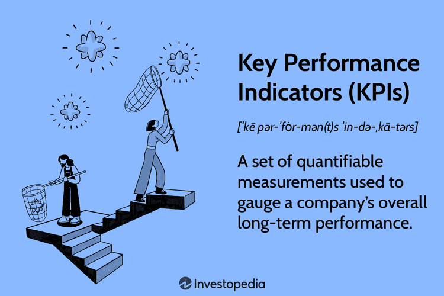

## Table of Contents

## What is an indicator in general terms?

An indicator is something that shows or measures a specific condition or change. It helps us understand if something is happening or how well something is working. For example, a thermometer is an indicator that shows the temperature. In daily life, indicators are used in many ways to help us make decisions or take actions based on the information they provide.

In different fields, indicators can be very important. In health, blood pressure is an indicator of how healthy a person's heart is. In the environment, the level of pollution in the air can be an indicator of air quality. By using indicators, people can monitor situations and make informed choices to improve or maintain conditions.

## How are indicators used in everyday life?

In everyday life, indicators help us know what's going on around us. For example, the fuel gauge in a car shows how much gas is left. If it's low, it's an indicator that we need to fill up the tank soon. Another everyday indicator is the weather forecast. It tells us if it's going to rain or be sunny, so we can decide what to wear or if we need an umbrella.

Indicators also help us keep track of our health. A common health indicator is a thermometer, which shows if we have a fever. If the temperature is high, it's an indicator that we might be sick and need to rest or see a doctor. In our homes, smoke detectors are indicators that warn us if there's a fire, so we can get out safely.

Overall, indicators are important because they give us information that helps us make choices and stay safe. Whether it's checking the fridge to see if we need to buy more milk or using a fitness tracker to see how many steps we've walked, indicators are all around us, helping us live better and smarter.

## What are the basic types of indicators?

Indicators can be grouped into different types based on what they measure. One type is quantitative indicators, which give us numbers or measurements. For example, a speedometer in a car tells us how fast we are going in numbers. Another type is qualitative indicators, which give us information that is not in numbers. For example, a mood ring changes color to show how we feel, but it doesn't use numbers.

Another way to think about indicators is by how they work. Some indicators are direct, meaning they show exactly what they are measuring. A thermometer directly shows the temperature. Other indicators are indirect, meaning they show something related to what we want to know. For example, the smell of smoke can be an indirect indicator of a fire.

These types of indicators help us in many ways. They can be simple, like a light turning red to show when to stop, or more complex, like a stock market index showing how well the economy is doing. Understanding these basic types helps us use indicators better in our everyday lives.

## Can you explain the difference between leading and lagging indicators?

Leading indicators are like clues that tell us what might happen in the future. They help us guess what's coming next. For example, if more people are buying building materials, it might be a leading indicator that the economy will grow because new houses and buildings will be built soon. These indicators are useful because they give us a heads-up, so we can plan or make changes before things happen.

Lagging indicators, on the other hand, tell us about things that have already happened. They are like looking in the rearview mirror of a car. For example, unemployment rates are a lagging indicator because they show how the economy has been doing, not what it will do next. These indicators are helpful for understanding past performance and confirming trends, but they don't help us predict the future.

Both types of indicators are important. Leading indicators help us prepare for what's coming, while lagging indicators help us understand what has happened and learn from it. By using both, we can get a full picture of a situation and make better decisions.

## What are some common examples of economic indicators?

Economic indicators are pieces of information that tell us how the economy is doing. Some common examples include the unemployment rate, which shows the percentage of people who want to work but can't find a job. Another is the Gross Domestic Product (GDP), which measures the total value of all goods and services produced in a country over a certain time. These indicators help us understand if the economy is growing or shrinking. For example, if GDP goes up, it usually means the economy is doing well.

Other important economic indicators are the Consumer Price Index (CPI) and the Producer Price Index (PPI). The CPI measures how much prices for things like food and clothes are changing, helping us understand inflation, or how the cost of living is going up. The PPI looks at the prices that businesses pay for goods and services, which can tell us if costs are rising before they affect consumers. Stock market indices, like the Dow Jones Industrial Average, also act as economic indicators by showing how well big companies are doing, which can reflect overall economic health.

These indicators are used by governments, businesses, and people to make decisions. For instance, if the unemployment rate is high, a government might start programs to create more jobs. If the CPI shows that inflation is rising fast, the central bank might raise interest rates to slow it down. By keeping an eye on these indicators, we can better understand and react to changes in the economy.

## How do technical indicators function in stock market analysis?

Technical indicators are tools that traders and investors use to make sense of the stock market. They help people guess where stock prices might go next by looking at past price movements and trading volumes. These indicators use math formulas to turn this data into graphs or numbers that are easier to understand. For example, a moving average smooths out price changes over time, making it easier to see if a stock's price is going up or down in the long run. Traders often use these indicators to spot patterns or trends that could help them decide when to buy or sell a stock.

There are many types of technical indicators, and they can be grouped into different categories. Some indicators, like the Relative Strength Index (RSI), help traders figure out if a stock is overbought or oversold, which can signal if a price change might be coming soon. Others, like Bollinger Bands, show how much a stock's price has been moving around, which can help traders understand if the market is calm or if big price swings are happening. By using these indicators together, traders can get a fuller picture of what's happening in the market and make smarter trading choices.

## What role do indicators play in scientific experiments?

In scientific experiments, indicators are like helpers that show us what is happening during the experiment. They help scientists see changes or measure things that they can't see with their eyes alone. For example, in a chemistry experiment, litmus paper can change color to show if a liquid is an acid or a base. This is useful because it gives scientists a clear sign of what is going on in their experiment without having to use more complex tools.

Indicators are also important because they help scientists make sure their experiments are working correctly. If an indicator shows that something is not right, scientists can adjust their experiment to fix it. For example, in biology, an indicator like a pH meter can tell scientists if the environment in a test tube is too acidic or too basic for the cells they are studying. By using indicators, scientists can keep their experiments on track and get more accurate results.

## How can indicators be used to measure environmental changes?

Indicators help us keep an eye on the environment by showing us how things are changing. For example, scientists use air quality indicators like the Air Quality Index (AQI) to measure how clean or polluted the air is. If the AQI goes up, it means the air is getting worse, and we might need to take action, like reducing car use or improving factory filters. Water quality indicators, like the amount of oxygen in a river, can tell us if the water is healthy for fish and other animals. If oxygen levels drop, it's a sign that pollution might be harming the river.

Temperature is another important indicator for measuring environmental changes. Scientists use thermometers placed in different parts of the world to track how the Earth's temperature is changing over time. If the average temperature keeps going up, it's a sign of global warming, which can affect weather patterns, sea levels, and wildlife. By watching these indicators, we can understand the health of our environment and make choices to protect it, like reducing greenhouse gas emissions or planting more trees.

## What advanced statistical methods are used to develop new indicators?

Advanced statistical methods help scientists and researchers come up with new indicators by finding patterns and relationships in big sets of data. One way they do this is by using regression analysis, which helps them see how different things are connected. For example, they might look at how air pollution levels are related to hospital visits for breathing problems. By doing this, they can create new indicators that show how changes in the environment affect people's health. Another method is machine learning, which uses computers to find patterns that are too hard for people to see on their own. This can lead to new indicators that predict things like stock market trends or weather changes more accurately.

Another important method is factor analysis, which helps scientists break down a lot of information into smaller, more manageable parts. This can be useful for creating new indicators that measure complex things like quality of life or economic stability. By using factor analysis, researchers can figure out which pieces of information are most important and combine them into a single indicator. Time series analysis is also used to study how things change over time, which can help create indicators that show trends or cycles. For example, scientists might use time series analysis to develop an indicator that tracks the ups and downs of unemployment rates over the years. These advanced methods help make indicators more accurate and useful for understanding and predicting changes in many different areas.

## How do you evaluate the effectiveness of an indicator?

To evaluate the effectiveness of an indicator, you need to check if it gives clear and useful information. This means looking at how well the indicator measures what it's supposed to measure. For example, if you're using a thermometer to check if someone has a fever, you want to make sure it gives a correct temperature reading. You also need to see if the indicator helps you make good decisions. If the thermometer always shows the wrong temperature, it won't help you know if someone is sick or not.

Another way to evaluate an indicator is by looking at how reliable it is over time. If an indicator gives different results every time you use it, even when nothing has changed, it's not very effective. For example, if a speedometer in a car keeps jumping around, it's hard to trust it. Also, you should check if the indicator is easy to understand and use. If it's too complicated, people might not use it correctly, which can make it less effective. By considering these things, you can tell if an indicator is doing its job well.

## What are the challenges in using indicators for predictive analytics?

Using indicators for predictive analytics can be tricky because they don't always tell the whole story. Sometimes, an indicator might show one thing, but other important things are happening that it doesn't see. For example, if you use the stock market as an indicator to predict the economy, it might miss other signs like changes in unemployment or consumer spending. Also, the past doesn't always predict the future perfectly. Just because something happened before doesn't mean it will happen again in the same way. This makes it hard to trust indicators to always give the right predictions.

Another challenge is that indicators can be affected by many things that are hard to control or measure. For instance, a weather indicator might be influenced by sudden changes in the atmosphere that are hard to predict. Also, the data used for indicators can be messy or incomplete, which makes it harder to use them for accurate predictions. If the data isn't good, the indicator won't be good either. So, people who use indicators for predictive analytics have to be careful and always check their information to make sure they're getting the best results possible.

## How can machine learning enhance the accuracy of indicators?

Machine learning can make indicators more accurate by finding patterns in big sets of data that people might miss. It can look at a lot of information at once and figure out which pieces are most important for making predictions. For example, if you're trying to predict the weather, machine learning can use data from past weather patterns, current temperature, and even satellite images to come up with a more accurate forecast. By learning from this data, machine learning can create indicators that are better at showing what will happen next.

Another way machine learning helps is by constantly updating indicators as new data comes in. This means the indicators can get better over time. For instance, if you're using an indicator to predict stock market trends, machine learning can keep learning from new stock prices and news events to make the indicator more reliable. By doing this, machine learning makes sure that the indicators are always using the most up-to-date information, which leads to more accurate predictions and better decision-making.

## What are the types of indicators?

Indicators can generally be divided into four categories: trend, [momentum](/wiki/momentum), [volume](/wiki/volume-trading-strategy), and [volatility](/wiki/volatility-trading-strategies) indicators. Each category serves a distinct purpose in the analysis of financial markets, providing unique insights that traders and economists can use to make informed decisions.

**Trend Indicators**

Trend indicators help identify the direction of market movements over a certain period. These indicators aim to filter out the noise from price data and highlight the underlying trend, whether it is upward, downward, or sideways. One of the most commonly used trend indicators is the Moving Average, which calculates the average price over a specific number of periods and smooths out fluctuations to reveal the trend direction. Trend indicators are useful for recognizing entry and [exit](/wiki/exit-strategy) points that align with the prevailing market trend.

**Momentum Indicators**

Momentum indicators measure the speed or rate at which prices change and are used to identify overbought or oversold conditions. They provide insights into the strength of a price movement and can signal potential reversals. The Relative Strength Index (RSI) is a popular momentum indicator, calculated using the formula:

$$
\text{RSI} = 100 - \frac{100}{1 + \text{RS}}
$$

where RS is the average of 'n' days up closes divided by the average of 'n' days down closes. Typically, an RSI above 70 indicates an overbought market, while an RSI below 30 suggests an oversold market.

**Volume Indicators**

Volume indicators analyze the number of shares or contracts traded over a given timeframe. They provide insights into the strength of a market move — higher volume during a price movement suggests conviction, whereas low volume may indicate a lack of strength. The On-Balance Volume (OBV) indicator accumulates the volume on up days and subtracts it on down days to measure buying and selling pressure. This can help traders confirm trends or predict reversals.

**Volatility Indicators**

Volatility indicators measure the degree of variation in price movements, providing information about the market's uncertainty or risk. High volatility often indicates potential price breakouts and trading opportunities, but it also suggests a higher risk level. Bollinger Bands are a widely used volatility indicator that consists of a middle moving average line and two outer bands, which are standard deviations away from the middle line. These bands expand during high volatility periods and contract during low volatility periods, providing a visual representation of volatility.

In summary, trend, momentum, volume, and volatility indicators each play crucial roles in market analysis. By understanding how to utilize these indicators, traders can enhance their ability to interpret market dynamics and make more informed trading decisions.

## What are Economic Indicators?

Economic indicators are vital measurable data points that reflect the overall health and trajectory of an economy. These metrics are utilized by policymakers, market analysts, and investors to assess economic performance and to predict future economic activity. They offer insights into various facets of an economy, from consumer behavior to industrial productivity, and influence economic policy decisions.

Gross Domestic Product (GDP) is among the most significant economic indicators. It represents the total value of goods and services produced over a specific time period within a country. GDP can be expressed as follows:

$$

\text{GDP} = C + I + G + (X - M) 
$$

where $C$ is consumption, $I$ is investment, $G$ is government spending, $X$ is exports, and $M$ is imports. GDP growth rates are crucial for indicating the economic growth or contraction of a country. An increasing GDP often suggests an expanding economy, whereas a decreasing GDP could indicate economic recession.

The Consumer Price Index (CPI) is another critical indicator that measures changes in the price level of a basket of consumer goods and services purchased by households over time. It is pivotal for understanding inflationary trends within an economy. The formula to calculate the CPI for a given period is:

$$

\text{CPI} = \frac{\text{Cost of Basket in Current Year}}{\text{Cost of Basket in Base Year}} \times 100 
$$

A rising CPI indicates inflation, which erodes purchasing power and can have various economic implications.

Unemployment rates provide another essential view of economic health. This indicator measures the percentage of the labor force that is jobless but actively seeking employment. High unemployment rates can signal economic distress, while low rates often indicate robust economic activity. The formula for unemployment rate is:

$$

\text{Unemployment Rate} = \frac{\text{Number of Unemployed}}{\text{Labor Force}} \times 100
$$

These economic indicators, when analyzed together, provide a comprehensive picture of an economy's performance and are indispensable tools for economic planning and decision-making. They aid stakeholders in understanding current economic conditions and help in forecasting future economic trends.

## What are Technical Indicators?

Technical indicators are integral to technical analysis, offering traders tools to assess market psychology, predict future market swings, and make informed trading decisions. These indicators rely on historical price and volume data, transforming these inputs into various mathematical patterns and signals.

**Moving Averages**

Moving Averages (MAs) are one of the simplest yet most effective indicators used to smooth out price data, thereby identifying the direction of the trend over a specified period. They come in several forms, the most common being the Simple Moving Average (SMA) and the Exponential Moving Average (EMA). The formula for a Simple Moving Average for a period $n$ is:

$$
\text{SMA}_n = \frac{P_1 + P_2 + \cdots + P_n}{n}
$$

where $P_i$ represents the closing price of the $i^{th}$ period.

In contrast, the Exponential Moving Average gives more weight to recent prices, making it more responsive to new information. This can be implemented in Python using:

```python
import pandas as pd

def exponential_moving_average(data, span):
    return data.ewm(span=span, adjust=False).mean()
```

**Relative Strength Index (RSI)**

The Relative Strength Index (RSI) is a momentum oscillator that measures the speed and change of price movements. It oscillates between 0 and 100 and is typically used to identify overbought or oversold conditions in the market. The RSI is calculated using the following formula:

$$
\text{RSI} = 100 - \left( \frac{100}{1 + RS} \right)
$$

where RS is the average of $x$ days' up closes divided by the average of $x$ days' down closes.

A typical RSI uses a 14-day period, with the RSI considered overbought when above 70 and oversold when below 30.

**Moving Average Convergence Divergence (MACD)**

The MACD is a trend-following momentum indicator that shows the relationship between two moving averages of a security’s price. It is calculated by subtracting the 26-period EMA from the 12-period EMA. The result is the MACD line. A nine-day EMA of the MACD called the "signal line," is then plotted on top of the MACD line, which can act as a trigger for buy and sell signals. In Python, this can be programmed as follows:

```python
def MACD(data, short_window=12, long_window=26, signal_window=9):
    short_ema = exponential_moving_average(data, span=short_window)
    long_ema = exponential_moving_average(data, span=long_window)
    macd_line = short_ema - long_ema
    signal_line = exponential_moving_average(macd_line, span=signal_window)
    return macd_line, signal_line
```

These technical indicators form the backbone of many [algorithmic trading](/wiki/algorithmic-trading) systems, where they are used to automate decision-making processes by triggering buy or sell actions based on specific criteria derived from the indicators. Their application helps in identifying trend directions, potential reversal points, and verifying the strength of trends, making them invaluable tools for traders.

## What are some examples of indicators used in algorithmic trading?

Moving Averages are widely utilized in algorithmic trading to identify market trends by smoothing out erratic price data. The most common types of moving averages are the Simple Moving Average (SMA) and the Exponential Moving Average (EMA). The SMA calculates the average of a selected range of prices, typically closing prices, over a specified number of periods $n$. The formula for SMA is:

$$
\text{SMA} = \frac{P_1 + P_2 + \ldots + P_n}{n}
$$

where $P$ represents the price points. On the other hand, the EMA gives more weight to recent prices, making it more responsive to new information. It is computed using the formula:

$$
\text{EMA} = P_t \times \left(\frac{2}{n+1}\right) + \text{EMA}_{y} \times \left(1 - \frac{2}{n+1}\right)
$$

where $P_t$ is the price at time $t$, and $\text{EMA}_{y}$ is the EMA calculated for the previous day.

The Relative Strength Index (RSI) is an oscillator that measures the speed and change of price movements to indicate overbought or oversold market conditions. It ranges from 0 to 100, with readings above 70 typically considered overbought and readings below 30 considered oversold. The RSI is calculated using the formula:

$$
\text{RSI} = 100 - \frac{100}{1 + RS}
$$

where $RS$ is the average of $n$ days' up closes divided by the average of $n$ days' down closes.

The Moving Average Convergence Divergence (MACD) is used to determine momentum and potential buy or sell signals. It is calculated by subtracting the 26-period EMA from the 12-period EMA. A nine-day EMA of the MACD, called the 'signal line', is then plotted on top of the MACD, functioning as a trigger for buy and sell signals. The formula for MACD is:

$$
\text{MACD} = \text{EMA}_{12} - \text{EMA}_{26}
$$

Bollinger Bands consist of a middle band being an $n$-period SMA and two outer bands positioned at $k$ standard deviations from the middle band. It indicates market volatility and possible [breakout](/wiki/breakout-trading) points. The bands widen during volatile periods and contract during less volatile periods. The calculation for Bollinger Bands is:

- Middle Band: $\text{SMA}(n)$
- Upper Band: $\text{SMA}(n) + k \times \text{standard deviation}$
- Lower Band: $\text{SMA}(n) - k \times \text{standard deviation}$

These indicators, when used in algorithmic trading systems, assist traders in making informed buy and sell decisions by identifying trends, signaling momentum changes, and highlighting potential points of increased market volatility.

## References & Further Reading

[1]: Bergstra, J., Bardenet, R., Bengio, Y., & Kégl, B. (2011). ["Algorithms for Hyper-Parameter Optimization."](https://dl.acm.org/doi/10.5555/2986459.2986743) Advances in Neural Information Processing Systems 24.

[2]: ["Advances in Financial Machine Learning"](https://www.amazon.com/Advances-Financial-Machine-Learning-Marcos/dp/1119482089) by Marcos Lopez de Prado

[3]: ["Evidence-Based Technical Analysis: Applying the Scientific Method and Statistical Inference to Trading Signals"](https://www.amazon.com/Evidence-Based-Technical-Analysis-Scientific-Statistical/dp/0470008741) by David Aronson

[4]: ["Machine Learning for Algorithmic Trading"](https://github.com/stefan-jansen/machine-learning-for-trading) by Stefan Jansen

[5]: ["Quantitative Trading: How to Build Your Own Algorithmic Trading Business"](https://github.com/LucindaYa/quant-resources/blob/master/Quantitative%20Trading%20How%20to%20Build%20Your%20Own%20Algorithmic%20Trading%20Business.pdf) by Ernest P. Chan