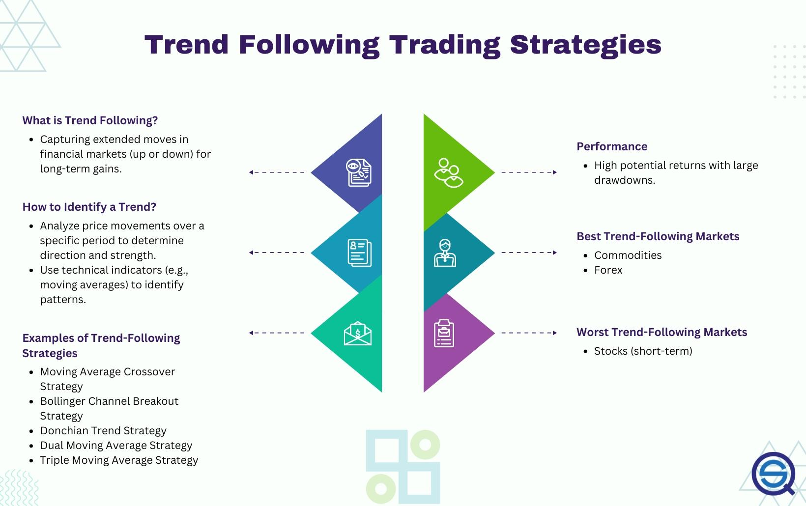

## Table of Contents

## What is a trend-following strategy in trading?

A trend-following strategy in trading is a method where traders try to make money by following the direction of a market trend. They look at how prices are moving over time and try to join the trend as it's happening. For example, if the price of a stock is going up steadily, a trend follower would buy that stock, expecting the price to keep rising. If the price is going down, they might sell or short sell, expecting it to keep falling. The main idea is to "ride the wave" of the market movement.

The key to a trend-following strategy is to identify trends early and stay with them until they show signs of reversing. Traders use different tools like moving averages, trend lines, and other technical indicators to spot these trends. It's important to be patient and not jump in and out of trades too quickly. While trend-following can be profitable, it also comes with risks. Sometimes trends can suddenly change direction, leading to losses. That's why trend followers often use stop-loss orders to limit their losses if the market moves against them.

## Why are indicators important in building a trend-following strategy?

Indicators are important in building a trend-following strategy because they help traders see the direction of the market more clearly. They act like road signs that show whether the price is going up, down, or staying the same. By using indicators, traders can make better decisions about when to buy or sell. For example, a moving average can smooth out price data and show a clearer trend, helping traders decide if it's a good time to join the trend.

Indicators also help traders stay disciplined and stick to their strategy. Without clear signals from indicators, it's easy to get swayed by emotions or short-term price changes. Indicators give traders a set of rules to follow, which can reduce the chances of making impulsive decisions. This is crucial in trend-following because the strategy works best when traders stay in the trend for as long as possible, and indicators help them know when to hold on and when to get out.

## What are the basic principles of trend-following?

The basic principles of trend-following are simple but important. The main idea is to find the direction of the market and go with it. If the price is going up, you buy. If it's going down, you sell or short sell. Trend followers use tools like moving averages and trend lines to see the direction clearly. These tools help them spot when a trend starts and when it might end. The goal is to join the trend early and stay in it as long as it keeps going.

Another key principle is to be patient and not jump in and out of trades too quickly. Trend-following works best when you stick with the trend for a long time. This means you need to ignore short-term ups and downs and focus on the bigger picture. It's also important to use stop-loss orders to limit losses if the market suddenly changes direction. By following these principles, trend followers try to make money by riding the waves of the market.

## Can you explain how moving averages can be used as trend indicators?

Moving averages are a popular tool that traders use to see the direction of a trend. A moving average is just the average price of a stock or another thing you're trading over a certain time. Traders often use two types: a short-term moving average, like over 20 days, and a long-term one, like over 50 or 200 days. When the short-term average goes above the long-term one, it's a sign that a new upward trend might be starting. People call this a "golden cross." On the other hand, if the short-term average goes below the long-term one, it could mean a downward trend is starting, and this is called a "death cross."

Traders use these moving averages to make decisions about buying or selling. If you see the short-term average cross above the long-term one, you might decide to buy because you think the price will keep going up. If it crosses below, you might sell or short sell, expecting the price to go down. Moving averages help smooth out the ups and downs of the market, making it easier to see the overall trend. By watching these averages, traders can get a clearer picture of where the market is heading and make better choices about their trades.

## What is the difference between simple moving averages (SMA) and exponential moving averages (EMA) in trend analysis?

Simple moving averages (SMA) and exponential moving averages (EMA) are both used to help traders see trends, but they do it in different ways. An SMA is just the average price of something over a certain number of days. For example, a 20-day SMA is the average price of the last 20 days. It's easy to calculate and gives you a smooth line that shows the general direction of the trend. But because it treats all days the same, it can be slow to react to new price changes.

On the other hand, an EMA gives more weight to recent prices, so it reacts faster to changes in the market. This means an EMA can show you a new trend sooner than an SMA. For example, if the price suddenly starts going up, an EMA will start to rise more quickly than an SMA. This can be helpful if you want to catch a trend early, but it can also make the EMA line more jumpy and harder to read. So, traders might choose an SMA for a clearer, slower-moving picture of the trend, or an EMA if they want to react quickly to new changes.

## How does the MACD (Moving Average Convergence Divergence) indicator help in identifying trends?

The MACD, or Moving Average Convergence Divergence, is a tool that helps traders see trends by comparing two moving averages. It looks at the difference between a fast moving average, usually a 12-day EMA, and a slow moving average, usually a 26-day EMA. When the fast average goes above the slow one, it means the trend might be turning up, and when the fast average goes below the slow one, it might be turning down. This difference between the two averages is shown as a line called the MACD line. Another line, called the signal line, is usually a 9-day EMA of the MACD line. When the MACD line crosses above the signal line, it's a sign to buy, and when it crosses below, it's a sign to sell.

Traders also look at a histogram on the MACD chart, which shows how far apart the MACD line and the signal line are. If the histogram bars are getting bigger, it means the trend is getting stronger. If they're getting smaller, the trend might be losing strength. By watching these lines and the histogram, traders can get a good idea of whether a trend is starting, getting stronger, or about to end. This helps them decide when to get into or out of a trade to make the most money from the trend.

## What role do the Relative Strength Index (RSI) and other momentum indicators play in trend-following?

The Relative Strength Index (RSI) and other momentum indicators help traders understand the strength of a trend. The RSI measures how fast and how much a price is moving up or down. It gives a number between 0 and 100. If the RSI is above 70, it might mean the price is going up too fast and could soon go down. If it's below 30, it might mean the price is going down too fast and could soon go up. By watching the RSI, traders can see if a trend is strong or if it might be about to change direction.

Other momentum indicators, like the Stochastic Oscillator or the Rate of Change (ROC), also help traders see how strong a trend is. The Stochastic Oscillator shows if a price is near the top or bottom of its recent range, which can help traders know if a trend is about to reverse. The ROC measures how much the price has changed over a certain time, helping traders see if the trend is picking up speed or slowing down. By using these indicators together with trend-following tools like moving averages, traders can make better decisions about when to buy or sell, helping them stay in a trend for as long as possible and make more money.

## How can the Average Directional Index (ADX) be used to gauge the strength of a trend?

The Average Directional Index (ADX) is a tool that helps traders see how strong a trend is. It gives a number between 0 and 100. When the ADX number is above 25, it means the trend is strong. If it's below 20, the trend is weak, and the market might be moving sideways without a clear direction. By looking at the ADX, traders can tell if they should follow a trend or wait for a stronger one to start.

Traders use the ADX along with other tools like moving averages to make better trading decisions. For example, if the ADX shows a strong trend and a moving average shows the trend is going up, a trader might decide to buy. But if the ADX shows a weak trend, the trader might wait for a better time to trade. The ADX helps traders know when to trust a trend and when to be careful, making it easier to make money from the market.

## What are the potential pitfalls of relying solely on trend indicators for trading decisions?

Relying only on trend indicators can be risky because these tools are not perfect. They can give false signals, making you think a trend is starting when it's not. For example, a moving average might cross over another, suggesting a new trend, but then the price might quickly change direction. This can lead to losses if you buy or sell based on these signals without considering other factors. Also, trend indicators can be slow to react to sudden market changes, causing you to miss out on quick profits or stay in a losing trade for too long.

Another problem is that trend indicators work best in markets that are clearly moving up or down. But markets don't always move in clear trends. Sometimes they move sideways, and trend indicators can be confusing in these situations. They might suggest buying or selling when there's no clear trend to follow. This can lead to a lot of small losses that add up over time. It's important to use trend indicators along with other tools and analysis to get a fuller picture of what's happening in the market.

## How can a trader combine multiple indicators to enhance the effectiveness of a trend-following strategy?

A trader can make their trend-following strategy better by using more than one indicator at the same time. For example, they might use moving averages to see the direction of the trend and the RSI to check if the trend is strong or weak. If the moving averages show an upward trend and the RSI is not overbought, it might be a good time to buy. But if the RSI is overbought, even if the moving averages suggest an upward trend, the trader might want to wait or be careful because the trend could be about to reverse.

Another way to combine indicators is to use the MACD along with the ADX. The MACD can help spot when a new trend is starting by showing when the fast moving average crosses over the slow one. The ADX can then tell the trader how strong that trend is. If the MACD shows a new trend and the ADX is above 25, it's a strong signal to follow the trend. But if the ADX is below 20, the trader might want to wait for a stronger trend to develop. By using these indicators together, traders can get a clearer picture of the market and make better trading decisions.

## What advanced techniques can be used to filter out false signals in trend-following?

One way to filter out false signals in trend-following is by using multiple time frames. This means looking at the same market on different time scales, like daily and weekly charts. If the trend looks the same on both, it's more likely to be real. But if the trend is up on the daily chart and down on the weekly chart, it might be a false signal. By checking different time frames, traders can feel more confident about the trend they see.

Another technique is to use a confirmation tool like the ADX. The ADX measures how strong a trend is. If the ADX shows a strong trend, it's more likely that the signal from other indicators is true. But if the ADX shows a weak trend, the signal might be false. By waiting for the ADX to confirm the trend, traders can avoid jumping into trades based on signals that might not be reliable.

Traders can also use volume to help filter out false signals. If a trend is real, it should be supported by high trading volume. If the price is going up but the volume is low, the trend might not be strong. By looking at volume along with trend indicators, traders can make better decisions about which signals to follow and which to ignore.

## How do professional traders adjust their trend-following strategies based on different market conditions?

Professional traders change their trend-following strategies depending on what's happening in the market. In a market that's moving a lot, they might use shorter time frames for their moving averages and other indicators. This helps them catch trends faster and make quick trades. They might also use more sensitive indicators like the EMA instead of the SMA to react to price changes sooner. But if the market is moving a lot, it can also be risky, so they might use tighter stop-loss orders to protect their money.

In a market that's not moving much, professional traders might use longer time frames for their indicators. This helps them see bigger trends that can last longer. They might also use less sensitive tools like the SMA to avoid getting fooled by small price changes that don't mean much. In these calm markets, they might be more patient and wait for stronger signals before making a trade. By adjusting their strategies this way, they can do well no matter what the market is doing.

## What are the important trend following indicators?

Successful trend following strategies in algorithmic trading rely on carefully selected indicators to determine optimal entry and [exit](/wiki/exit-strategy) points. These indicators help traders identify prevailing market trends and potential reversals, enabling them to make informed decisions. Here are some widely used indicators in algorithmic trend following:

1. **Moving Averages (SMA and EMA)**: Moving averages smooth out price data to highlight trends over specific periods. The Simple Moving Average (SMA) calculates the average of a selected range of prices, usually adjusted to the middle of the range. The Exponential Moving Average (EMA) gives more weight to recent prices, making it more responsive to new information. These tools can be represented mathematically as follows:

   For SMA:
$$
   \text{SMA}(t) = \frac{1}{n} \sum_{i=t-n+1}^{t} P_i

$$

   For EMA:
$$
   \text{EMA}(t) = \alpha \times P_t + (1 - \alpha) \times \text{EMA}(t-1)

$$
   where $\alpha = \frac{2}{n+1}$ and $P_t$ is the closing price at time $t$.

2. **Bollinger Bands**: These are volatility indicators that frame price movements within bands that are typically two standard deviations away from a simple moving average. When prices touch these bands, it may indicate overbought or oversold conditions. The standard formula for the bands is:
$$
   \begin{align*}
   \text{Upper Band} &= \text{SMA}(t) + 2\sigma \\
   \text{Lower Band} &= \text{SMA}(t) - 2\sigma
   \end{align*}

$$
   where $\sigma$ is the standard deviation over the specified period.

3. **Moving Average Convergence Divergence (MACD)**: The MACD is momentum-based and illustrates the relationship between two moving averages of prices. It is calculated by subtracting the 26-period EMA from the 12-period EMA. A signal line, the 9-day EMA of the MACD itself, is often used to identify signaling crossovers.
$$
   \text{MACD} = \text{EMA}_{12} - \text{EMA}_{26}

$$

4. **Relative Strength Index (RSI)**: RSI is a momentum oscillator that measures the speed and magnitude of price movements. It ranges from 0 to 100 and is typically used to identify overbought or oversold conditions, generally at levels above 70 and below 30, respectively. The formula for RSI is:
$$
   \text{RSI} = 100 - \frac{100}{1 + RS}

$$
   where $RS$ is the average of $n$ periods' up closes divided by the average of $n$ periods' down closes.

5. **On-Balance Volume (OBV)**: OBV is a cumulative volume-based indicator that predicts changes in stock price by analyzing the volume flow. It adds the volume on up days and subtracts the volume on down days. The goal is to use the dynamics of volume to anticipate price changes.
$$
   \text{OBV} = \text{OBV}_{\text{previous day}} + 
   \begin{cases} 
   \text{Volume}, & \text{if price closes up} \\
   -\text{Volume}, & \text{if price closes down}
   \end{cases}

$$

These indicators, when integrated into trading algorithms, help automate trading decisions based on market trends, minimizing reliance on human intuition and emotion. Properly fine-tuning these indicators to the specific market characteristics is crucial for maximizing the potential benefits of algorithmic trend following strategies.

## References & Further Reading

[1]: ["Advances in Financial Machine Learning"](https://www.amazon.com/Advances-Financial-Machine-Learning-Marcos/dp/1119482089) by Marcos Lopez de Prado

[2]: ["Evidence-Based Technical Analysis: Applying the Scientific Method and Statistical Inference to Trading Signals"](https://www.amazon.com/Evidence-Based-Technical-Analysis-Scientific-Statistical/dp/0470008741) by David Aronson

[3]: ["Machine Learning for Algorithmic Trading"](https://github.com/stefan-jansen/machine-learning-for-trading) by Stefan Jansen

[4]: ["Quantitative Trading: How to Build Your Own Algorithmic Trading Business"](https://books.google.com/books/about/Quantitative_Trading.html?id=j70yEAAAQBAJ) by Ernest P. Chan

[5]: Brock, W., Lakonishok, J., & LeBaron, B. (1992). ["Simple Technical Trading Rules and the Stochastic Properties of Stock Returns."](https://www.jstor.org/stable/2328994) The Journal of Finance, 47(5), 1731-1764.

[6]: Murphy, J. J. (1999). ["Technical Analysis of the Financial Markets."](https://www.amazon.com/Technical-Analysis-Financial-Markets-Comprehensive/dp/0735200661) New York Institute of Finance.

[7]: Kaufman, P. J. (2013). ["Trading Systems and Methods"](https://onlinelibrary.wiley.com/doi/book/10.1002/9781119202561). Wiley.