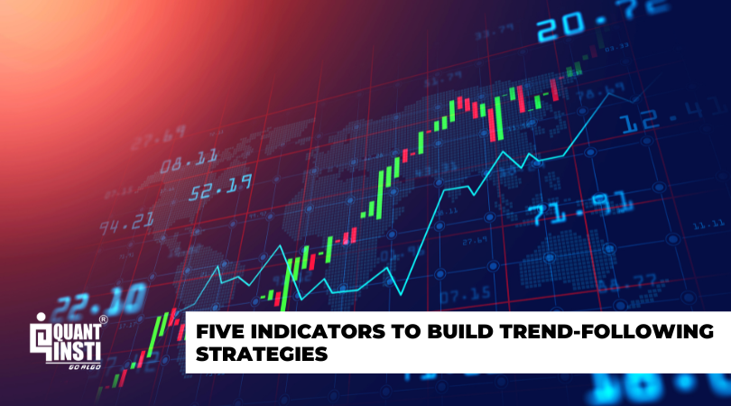

Algorithmic trading, commonly known as algo trading, is a significant advancement in financial markets, fundamentally changing the mechanics of trading by leveraging technology to execute orders with remarkable speed and efficiency. The integration of complex algorithms with market data has enabled traders to conduct transactions in milliseconds, significantly outperforming human execution capabilities. This technological evolution has not only increased market liquidity but also facilitated the execution of high-frequency and large-volume trades seamlessly.

Within algorithmic trading, trend following strategies have gained prominence due to their straightforward approach and proven efficacy in harnessing market trends. Unlike other strategies that may rely heavily on prediction, trend following capitalizes on the natural movement of markets, providing traders with a framework to profit from existing market directions rather than forecasting them. This approach is rooted in the belief that markets can move in sustained trends, either upward or downward, over various timeframes.



Trend following strategies are widely utilized by traders who seek to identify and leverage these market trends to maximize their returns. By implementing a set of rules and indicators, traders can systematically determine entry and exit points, allowing them to profit from the momentum of price movements. Among the tools used to achieve this are moving averages, Bollinger Bands, and the Relative Strength Index (RSI), which help in quantifying trends and determining their strength.

This article explores the specific indicators that are integral to trend following within algo trading. These indicators serve as the cornerstone for traders aiming to discern and benefit from prevailing market movements. By understanding how these tools function, traders are better equipped to automate their trading processes, remove emotional biases, and capitalize on lasting market trends. As the field of algorithmic trading evolves, the role of trend following strategies continues to offer considerable potential for those who methodically apply them.

## Table of Contents

## Understanding Trend Following in Algo Trading

Trend following is a widely adopted trading strategy used within algorithmic trading to capitalize on sustained directional movements in financial markets. Unlike predictive models that forecast future price movements, trend following strategies operate by responding to existing price trends, allowing traders to 'ride the trend' as long as it persists. This method is grounded in the notion that financial markets can enter prolonged directional phases, whether upwards or downwards, making it possible for traders to profit by identifying and aligning with these trends.

At its core, trend following relies on a reactive approach. The strategy doesn't aim to anticipate when a trend will start; instead, it identifies trends once they have already formed and continues to participate until evidence of a reversal is detected. The underlying assumption is that trends, once established, are more likely to continue than reverse, hence enabling a probability edge. By following this approach, trend traders seek to capture substantial price movements and mitigate the noise created by short-term market volatility.

The methodology can be illustrated with a simple example: Suppose a trader notices that a stock's price has been increasing over a period. By employing a [trend following](/wiki/trend-following) strategy, they would enter a long position in the stock. If the price continues to rise, the trader remains invested, benefiting from the upward movement. Conversely, if indicators suggest a trend reversal or the asset's price consistently moves against the current trend, the trader would then close the position to lock in profits or limit losses.

The practical implementation of trend following often involves using technical indicators that highlight the current market direction. These include moving averages and [momentum](/wiki/momentum) oscillators, which filter out market noise and provide clear signals for entering and exiting trades. Traders can utilize these indicators to set rules within algorithmic systems that automatically execute trades, removing the emotional biases typically associated with manual trading.

One of the fundamental principles in trend following is the usage of stop-loss orders. These are employed to protect capital and manage risk, ensuring that traders minimize potential losses if a trend reverses unexpectedly. Stop-loss levels are often adjusted dynamically, in line with emerging market conditions, to allow profits to run while restricting downside risk.

In conclusion, trend following serves as a strategic approach in [algorithmic trading](/wiki/algorithmic-trading), focusing on acknowledging and capitalizing on prevailing market trends rather than attempting to predict future price movements. This strategy requires diligent monitoring of market indicators and adaptive risk management practices to successfully profit from directional movements while mitigating risks associated with market reversals.

## Important Trend Following Indicators

Successful trend following strategies in algorithmic trading rely on carefully selected indicators to determine optimal entry and [exit](/wiki/exit-strategy) points. These indicators help traders identify prevailing market trends and potential reversals, enabling them to make informed decisions. Here are some widely used indicators in algorithmic trend following:

1. **Moving Averages (SMA and EMA)**: Moving averages smooth out price data to highlight trends over specific periods. The Simple Moving Average (SMA) calculates the average of a selected range of prices, usually adjusted to the middle of the range. The Exponential Moving Average (EMA) gives more weight to recent prices, making it more responsive to new information. These tools can be represented mathematically as follows:

   For SMA:
$$
   \text{SMA}(t) = \frac{1}{n} \sum_{i=t-n+1}^{t} P_i

$$

   For EMA:
$$
   \text{EMA}(t) = \alpha \times P_t + (1 - \alpha) \times \text{EMA}(t-1)

$$
   where $\alpha = \frac{2}{n+1}$ and $P_t$ is the closing price at time $t$.

2. **Bollinger Bands**: These are volatility indicators that frame price movements within bands that are typically two standard deviations away from a simple moving average. When prices touch these bands, it may indicate overbought or oversold conditions. The standard formula for the bands is:
$$
   \begin{align*}
   \text{Upper Band} &= \text{SMA}(t) + 2\sigma \\
   \text{Lower Band} &= \text{SMA}(t) - 2\sigma
   \end{align*}

$$
   where $\sigma$ is the standard deviation over the specified period.

3. **Moving Average Convergence Divergence (MACD)**: The MACD is momentum-based and illustrates the relationship between two moving averages of prices. It is calculated by subtracting the 26-period EMA from the 12-period EMA. A signal line, the 9-day EMA of the MACD itself, is often used to identify signaling crossovers.
$$
   \text{MACD} = \text{EMA}_{12} - \text{EMA}_{26}

$$

4. **Relative Strength Index (RSI)**: RSI is a momentum oscillator that measures the speed and magnitude of price movements. It ranges from 0 to 100 and is typically used to identify overbought or oversold conditions, generally at levels above 70 and below 30, respectively. The formula for RSI is:
$$
   \text{RSI} = 100 - \frac{100}{1 + RS}

$$
   where $RS$ is the average of $n$ periods' up closes divided by the average of $n$ periods' down closes.

5. **On-Balance Volume (OBV)**: OBV is a cumulative volume-based indicator that predicts changes in stock price by analyzing the volume flow. It adds the volume on up days and subtracts the volume on down days. The goal is to use the dynamics of volume to anticipate price changes.
$$
   \text{OBV} = \text{OBV}_{\text{previous day}} + 
   \begin{cases} 
   \text{Volume}, & \text{if price closes up} \\
   -\text{Volume}, & \text{if price closes down}
   \end{cases}

$$

These indicators, when integrated into trading algorithms, help automate trading decisions based on market trends, minimizing reliance on human intuition and emotion. Properly fine-tuning these indicators to the specific market characteristics is crucial for maximizing the potential benefits of algorithmic trend following strategies.

## Implementing Trend Following Strategies in Algo Trading

Algorithmic traders harness trend following indicators to develop strategies that automate financial transactions based on current market trends. This automation is achieved by programming algorithms to continuously track these indicators and execute trades without human input. This approach not only reduces emotional biases but also enhances the speed and efficiency of trading operations.

The creation of a successful algorithmic trading strategy requires careful selection of trend following indicators, such as moving averages, MACD, or RSI, depending on the specific goals and risk appetite of the trader. For instance, a trader focused on short-term gains in a volatile market might prefer the Relative Strength Index (RSI) due to its sensitivity to rapid price movements. Conversely, those interested in long-term trends might opt for moving averages, which offer a smoother overview of market direction over time.

The coding process involves defining parameters like entry and exit points, which are based on the chosen indicators. These parameters guide the algorithm in identifying trends and executing trades. For example, an algorithm could be set to buy a stock when its 50-day moving average crosses above the 200-day moving average, a common bullish signal. In Python, this logic could be implemented as follows:

```python
def moving_average(data, window_size):
    return data.rolling(window=window_size).mean()

def buy_signal(short_ma, long_ma):
    return short_ma > long_ma

# Assuming data is a DataFrame with stock prices
data['50_day_ma'] = moving_average(data['close'], 50)
data['200_day_ma'] = moving_average(data['close'], 200)

data['buy_signal'] = buy_signal(data['50_day_ma'], data['200_day_ma'])
```

In addition to selecting indicators, traders must also consider the dynamic nature of financial markets when programming their algorithms. Factors such as market [volatility](/wiki/volatility-trading-strategies), [liquidity](/wiki/liquidity-risk-premium), and economic indicators can impact the effectiveness of trend following strategies. Therefore, ongoing adaptation and [backtesting](/wiki/backtesting) are crucial to refine these strategies. This can be done by simulating trades over historical data to evaluate potential outcomes and modify the algorithms accordingly.

In conclusion, implementing trend following strategies in algorithmic trading involves a meticulous process of selecting appropriate indicators, coding them into actionable algorithms, and continuously refining those algorithms based on market feedback. By doing so, traders can leverage technology to optimize trading outcomes, benefitting from reduced emotional influence and increased transaction speeds.

## Pros and Cons of Trend Following Strategies

Trend following strategies offer significant advantages in algorithmic trading. One of the most notable benefits is their effortless scalability. As market [volume](/wiki/volume-trading-strategy) increases or decreases, these strategies can be adjusted easily to accommodate changes without a substantial rewrite of the trading algorithm. This scalability ensures that traders can maintain competitive while managing larger trading volumes with minimal human intervention.

Another advantage is the reduction in emotional trading. Algorithmic systems execute trades based on predefined criteria, removing the emotional biases that often lead to impulsive decisions. By strictly following trend indicators, traders can focus on adhering to their long-term strategies, thus minimizing the risks associated with emotional decision-making.

Trend following strategies also capitalize on sustained market movements. Given that markets can exhibit trends for prolonged periods, these strategies are designed to 'ride' these trends, allowing traders to systematically enter and exit positions aligned with the prevailing market direction. This capability is especially beneficial during trending markets, where continuous movements provide multiple opportunities for profits.

However, trend following strategies are not without challenges. They are often susceptible to sudden market reversals. Since these strategies are based on the assumption that trends will continue, unexpected changes in market direction can lead to significant losses. Furthermore, false breakouts, where prices temporarily move beyond a support or resistance level only to revert, can trigger incorrect trade signals, resulting in unnecessary trades and increased transaction costs.

Another notable challenge of trend following strategies is their often low win-to-loss ratios. Frequent stop-outs occur when trades are stopped before reaching their full profit potential due to market noise or small fluctuations against the trend. This characteristic means that while trend followers may have fewer winning trades, the winning trades need to be significantly more profitable to offset the losses.

Traders must therefore implement robust risk management practices. Techniques such as setting stop-loss orders, managing position sizes, and using trailing stops are essential to protecting against large losses. Regular backtesting of strategies is also crucial to ensure they remain effective as market conditions evolve. By continuously evaluating and adapting their strategies, traders can better mitigate these challenges and enhance their overall success in algorithmic trading.

## Conclusion

Trend following indicators are integral to algorithmic trading, enabling traders to exploit market trends in a systematic and profitable manner. By adhering to these established strategies, traders can capitalize on the propensity of markets to move in defined directions over extended periods. The efficacy of trend following lies in its disciplined approach, which minimizes the biases often associated with manual trading, and leverages the speed and objectivity inherent in algorithmically driven trades.

While the rewards of trend following are significant, the success of these strategies is contingent upon a profound understanding of market dynamics and meticulous implementation. It is essential for traders to continuously evaluate and adjust their strategies in response to changing market conditions. This requires not only a keen awareness of the current economic environment but also robust backtesting and risk management practices to account for potential market reversals and false signals.

Embracing trend following in algorithmic trading provides a distinct competitive advantage. The automation of trades based on objective indicators reduces the emotional component of trading, allowing for more rational decision-making. Additionally, the ongoing advancements in technology and research are poised to enhance the precision and efficacy of these strategies. As [machine learning](/wiki/machine-learning) and [artificial intelligence](/wiki/ai-artificial-intelligence) integrate more deeply with financial trading systems, trend following strategies will evolve, offering even greater potential for profitability and market insight.

In conclusion, mastering trend following strategies in algorithmic trading offers traders the opportunity to systematically harness market trends, positioning themselves favorably in the fast-paced world of financial markets. The continued evolution of technology and strategy refinement promises sustained success for those who adeptly navigate this domain.

## References & Further Reading

[1]: ["Advances in Financial Machine Learning"](https://www.amazon.com/Advances-Financial-Machine-Learning-Marcos/dp/1119482089) by Marcos Lopez de Prado

[2]: ["Evidence-Based Technical Analysis: Applying the Scientific Method and Statistical Inference to Trading Signals"](https://www.amazon.com/Evidence-Based-Technical-Analysis-Scientific-Statistical/dp/0470008741) by David Aronson

[3]: ["Machine Learning for Algorithmic Trading"](https://github.com/stefan-jansen/machine-learning-for-trading) by Stefan Jansen

[4]: ["Quantitative Trading: How to Build Your Own Algorithmic Trading Business"](https://books.google.com/books/about/Quantitative_Trading.html?id=j70yEAAAQBAJ) by Ernest P. Chan

[5]: Brock, W., Lakonishok, J., & LeBaron, B. (1992). ["Simple Technical Trading Rules and the Stochastic Properties of Stock Returns."](https://www.jstor.org/stable/2328994) The Journal of Finance, 47(5), 1731-1764.

[6]: Murphy, J. J. (1999). ["Technical Analysis of the Financial Markets."](https://www.amazon.com/Technical-Analysis-Financial-Markets-Comprehensive/dp/0735200661) New York Institute of Finance.

[7]: Kaufman, P. J. (2013). ["Trading Systems and Methods"](https://onlinelibrary.wiley.com/doi/book/10.1002/9781119202561). Wiley.