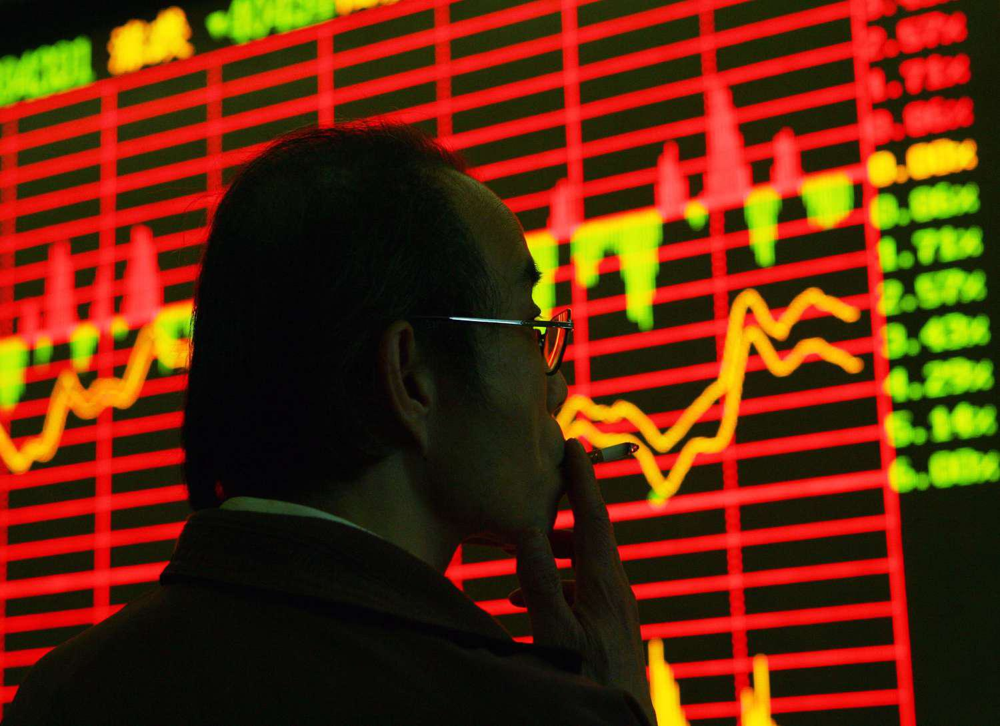

Financial markets are fundamental components of the global economy, functioning as platforms where financial instruments such as stocks, bonds, and derivatives are traded. They facilitate the efficient allocation of resources, contribute to economic stability, and influence economic growth by determining the cost of capital. 

The China stock market is a crucial player on the global stage, representing the world's second-largest economy. Comprised of major exchanges like the Shanghai Stock Exchange (SSE) and the Shenzhen Stock Exchange (SZSE), it offers a diverse array of investment opportunities in one of the most rapidly growing economic environments. The market has evolved significantly since its inception, shaped by regulatory reforms, technological advances, and international participation.



Economic indicators play a vital role in stock market analysis. They are statistics about economic activities, used to evaluate the overall health of the economy, predict future performance, and guide investment decisions. Key indicators include GDP growth rates, inflation rates, interest rates, and trade balances. Accurate interpretation of these indicators helps investors assess market trends and make informed decisions.

Algorithmic trading has revolutionized financial markets by employing algorithms to execute trades at high speed and volume. These computer-based trading strategies leverage mathematical models and historical data to identify and exploit market inefficiencies. The rise of algorithmic trading has transformed market dynamics, increasing liquidity and market efficiency, but also introducing challenges such as increased volatility and systemic risk.

This article aims to provide insights into the China stock market, emphasizing the interplay between economic indicators and algorithmic trading. Readers can expect to learn about the structure and development of the Chinese stock market, the influence of economic indicators, the operational aspects of algorithmic trading, and how these elements shape market opportunities and challenges.

## Table of Contents

## Understanding the China Stock Market

The China stock market has undergone significant transformation since its inception, evolving into a robust and dynamic financial system with substantial global influence. Its development traces back to the late 19th century, but the modern era started in the late 20th century.

### Historical Development

The China stock market officially began with the establishment of the Shanghai Stock Exchange (SSE) and Shenzhen Stock Exchange (SZSE) in the early 1990s. Before this, the Chinese economy was predominantly state-controlled, with no formal stock market until economic reforms initiated by Deng Xiaoping. The SSE was officially opened in December 1990, followed by the SZSE in 1991. These openings marked China’s shift towards a market-oriented economy, facilitating [capital raising](/wiki/hedge-fund-capital-raising) for domestic enterprises and providing investment opportunities for the public.

### Key Characteristics and Components

The China stock market is characterized by its unique blend of A-shares and B-shares. A-shares are denominated in the local currency, the renminbi (RMB), and are available primarily to domestic investors, though foreign investors can access them through the Qualified Foreign Institutional Investor (QFII) program and Stock Connect schemes. B-shares, in contrast, are denominated in foreign currencies like U.S. dollars or Hong Kong dollars and are available to both domestic and international investors.

The market is also characterized by a relatively high level of retail investor participation compared to other global markets, where institutional investors dominate.

### Major Stock Exchanges: Shanghai and Shenzhen

The Shanghai Stock Exchange (SSE) and Shenzhen Stock Exchange (SZSE) are the two major exchanges in China. 

#### Shanghai Stock Exchange (SSE)

The SSE is located in the financial hub of Shanghai and is one of the largest stock exchanges globally by market capitalization. It primarily lists large-cap companies, including many state-owned enterprises and financial service firms. It is noted for its blue-chip component, the SSE 50 Index, which tracks the 50 most representative stocks listed on the SSE.

#### Shenzhen Stock Exchange (SZSE)

The SZSE is known for listing emerging small and medium-sized enterprises, as well as high-tech companies. One of its major indices is the ChiNext, which is similar to the NASDAQ and represents innovative sectors, including biotech and IT.

### Role of Government and Regulatory Bodies

The Chinese government plays a critical role in the regulation and oversight of its stock markets through several agencies, notably the China Securities Regulatory Commission (CSRC). The CSRC is responsible for drafting financial market regulations, enforcing laws to protect investors, and maintaining market integrity. Additionally, government policies significantly influence market trends, often supporting state-owned companies and sectors aligned with national strategic priorities.

### Recent Trends and Performances

In recent years, the China stock market has witnessed significant trends, including increased participation of foreign investors, facilitated by initiatives such as the Shanghai-Hong Kong Stock Connect and Shenzhen-Hong Kong Stock Connect. These programs allow international investors to trade A-shares, enhancing market [liquidity](/wiki/liquidity-risk-premium) and integration with global financial systems.

Another notable trend is the growth of technology stocks and the shift towards sustainability-related sectors, reflecting China's strategic focus on innovation and green development.

In summary, the China stock market is a complex and evolving entity with distinct characteristics that distinguish it from other global markets. Its development is deeply intertwined with China's economic policies and reforms, reflecting both opportunities and challenges for investors worldwide.

## Key Economic Indicators Influencing the China Stock Market

Economic indicators are vital tools for understanding the dynamics of the China stock market, providing insights into the country's economic health and guiding investors' decision-making processes. These indicators help assess the economic environment and potential market trends, influencing investment strategies.

### GDP Growth Rate and Market Performance

Gross Domestic Product (GDP) growth rate is a crucial indicator reflecting the overall economic health and development of China. A high GDP growth rate often signals a robust economy, which can boost investor confidence and lead to an increase in stock market investments. Conversely, a slowdown in GDP growth may trigger caution among investors, potentially leading to reduced market enthusiasm and lower stock valuations. During periods of rapid economic expansion, sectors related to infrastructure, manufacturing, and consumer goods often see substantial gains in stock prices due to increased demand and production capabilities.

### Inflation and Interest Rates

Inflation and interest rates are interlinked economic indicators that significantly influence stock market trends. In China, as in many economies, inflation impacts purchasing power and cost of living. Moderate inflation is typically seen as a sign of economic growth, while high inflation can erode value and deter investment. Central banks, like the People's Bank of China, manipulate interest rates to control inflation. Higher interest rates generally increase borrowing costs, potentially reducing consumer spending and corporate investments, which can negatively impact stock prices. Conversely, lower interest rates may encourage borrowing, stimulate growth, and have a positive effect on the stock market.

### Trade Balances and Foreign Investment

China's trade balance, which records the difference between exports and imports, plays a vital role in the stock market. A positive trade balance indicates export strength and can enhance economic stability, strengthening investor confidence and therefore increasing market investments. Additionally, foreign direct investment (FDI) is a significant driver of growth, incorporating capital, technology, and management expertise into the domestic economy. High levels of FDI are generally correlated with stock market growth, as they suggest foreign investor confidence in the market's long-term prospects.

### Leading Economic Indicators

Several leading economic indicators are closely monitored by investors to predict future market trends. These indicators include the Purchasing Managers' Index (PMI), which provides information about the manufacturing sector's health, and retail sales data, reflecting consumer spending trends. Other critical indicators include employment rates, government fiscal policies, and the [volume](/wiki/volume-trading-strategy) of money supply (M2). Investors analyze these indicators to anticipate economic shifts that could impact stock prices. 

Understanding these economic indicators allows investors to make informed decisions and better navigate the complexities of the China stock market. These factors collectively offer a comprehensive overview of the economy's trajectory and the potential for investment returns.

## Algorithmic Trading: Transformation of Financial Markets

Algorithmic trading refers to the use of computer algorithms to execute trades based on predefined criteria and strategies. It involves the automation of the trading process, from the analysis of market conditions to the execution of buy or sell orders. This method of trading leverages mathematical models and complex computations, enabling the execution of trades at speeds and frequencies impossible for human traders.

### How Algorithmic Trading Operates in Financial Markets

In financial markets, [algorithmic trading](/wiki/algorithmic-trading) operates through the use of advanced algorithms that monitor market data in real time, identify trading opportunities, and execute orders. These algorithms analyze various parameters, such as price, volume, timing, and other market conditions, to make data-driven decisions. Once a predefined condition is met, the algorithm automatically places a trade order.

A simple example of an algorithmic trading strategy is a moving average crossover. This involves tracking two moving averages of different periods and generating buy or sell signals when they cross. A buy signal is generated when a short-term moving average crosses above a long-term moving average, and a sell signal is generated when the reverse occurs.

```python
# Example of a moving average crossover strategy in Python
import pandas as pd

def moving_average_crossover(data, short_window, long_window):
    signals = pd.DataFrame(index=data.index)
    signals['price'] = data['price']
    signals['short_ma'] = data['price'].rolling(window=short_window, min_periods=1, center=False).mean()
    signals['long_ma'] = data['price'].rolling(window=long_window, min_periods=1, center=False).mean()
    signals['signal'] = 0.0
    signals['signal'][short_window:] = np.where(signals['short_ma'][short_window:] > signals['long_ma'][short_window:], 1.0, 0.0)
    signals['positions'] = signals['signal'].diff()
    return signals
```

### Advantages of Algorithmic Trading

Algorithmic trading offers several advantages, particularly in terms of speed and efficiency. Trades are executed faster and at better prices due to reduced latency when compared to manual trading. Additionally, the removal of human emotion from the trading process reduces the likelihood of mistakes due to emotional or psychological factors. Algorithms can also handle multiple transactions and strategies simultaneously, which is more challenging for human traders.

### Potential Risks and Challenges

Despite its advantages, algorithmic trading presents certain risks and challenges. The high speed and frequency of trades can lead to market manipulation or flash crashes, where stock prices drop sharply and recover quickly. Moreover, algorithms are only as good as the data and logic upon which they are based. Poorly designed algorithms can result in significant financial losses.

To mitigate these risks, rigorous testing of algorithms using historical data and simulations is crucial before live deployment. Regular monitoring and updates are also necessary to address any changes in market conditions or detect errors.

### Regulatory Considerations and Future Outlook

Regulation of algorithmic trading varies globally, with financial authorities implementing measures to monitor and control its impact on market stability. These regulations often focus on ensuring transparency, minimizing market manipulation, and protecting market integrity. For instance, authorities may require traders to maintain detailed records of algorithmic strategies and transactions.

The future outlook for algorithmic trading is closely linked to advancements in technology, including [artificial intelligence](/wiki/ai-artificial-intelligence) and [machine learning](/wiki/machine-learning). These technologies are expected to enhance the ability of algorithms to learn from data and improve trade execution strategies over time. As such, regulatory frameworks will need to evolve to accommodate these advancements while maintaining fair market practices.

In summary, algorithmic trading has transformed financial markets by increasing trading efficiency and speed. However, it comes with inherent risks that necessitate careful regulation and ongoing technological innovation to ensure a stable and efficient trading environment.

## The Intersection of Economic Indicators and Algorithmic Trading

Algorithmic trading fundamentally transforms how economic indicators are utilized in financial markets, particularly in stock markets like China's. At its core, algorithmic trading employs complex mathematical models and statistical techniques to make trading decisions, typically at speeds and frequencies beyond human capability. Here, economic indicators—critical in assessing the economic health and trends—are pivotal in informing these algorithmic models, essentially guiding the decision-making processes.

### Incorporation of Economic Indicators

Algorithms integrate economic indicators through data-driven strategies. Economic indicators such as GDP growth rates, inflation rates, interest rates, and trade balances provide essential data points that influence stock prices. Algorithms use these indicators to predict market trends by analyzing their past and current impact on stock prices. For instance, a rise in GDP might signal economic strength, prompting the algorithm to increase equity purchases in sectors correlated with economic expansion.

### Role of Data and Analytics

Data analytics play a crucial role in shaping algorithmic trading strategies. Algorithms utilize historical and live data to identify patterns and predict future movements. Machine learning models, a subset of artificial intelligence, are often employed to enhance predictions. By training on vast datasets, these models can detect subtle relationships between economic indicators and market behavior that may elude traditional analysis. For example, using Python's pandas library, data can be preprocessed and analyzed to feed algorithms:

```python
import pandas as pd

# Load historical stock and economic indicator data
stock_data = pd.read_csv('stock_data.csv')
economic_data = pd.read_csv('economic_indicators.csv')

# Data preprocessing and feature engineering
data_merged = pd.merge(stock_data, economic_data, on='date')
data_merged['GDP_influence'] = data_merged['GDP_growth'] * data_merged['stock_price']
```

### Example Algorithms Utilizing Economic Indicators

Various algorithms integrate economic indicators to enhance trading strategies. The [momentum](/wiki/momentum) strategy, for instance, uses past price movements along with economic conditions to determine the best entry and [exit](/wiki/exit-strategy) points for trades. Another example is the mean-reversion strategy, which postulates that prices will revert to their historical mean levels influenced by changing economic conditions. Both strategies exploit inefficiencies, often compounded or dampened by recent economic data.

### Synergy Between Human Expertise and Algorithmic Decision-Making

Despite the prominence of algorithmic trading, human expertise remains crucial. Human insights complement algorithmic models, particularly in areas like parameter selection and interpretation of complex models. Experienced traders can adjust algorithms based on unexpected market events or anomalies that models might not fully grasp, ensuring a balanced approach that incorporates both computational precision and human intuition.

### Case Studies in the China Stock Market

In the China stock market, several firms have successfully employed algorithmic trading strategies rooted in economic indicators. For example, [quantitative trading](/wiki/quantitative-trading) firms utilize algorithms that analyze macroeconomic indicators and trade balances to anticipate market movements, leveraging the rapid processing capabilities of modern computation to execute trades far quicker than traditional brokers.

One notable instance involved using real-time economic data releases from the National Bureau of Statistics of China. Algorithms pre-set to respond to specific GDP growth benchmarks executed trades almost instantaneously, outperforming traditional methods during periods of economic disclosure.

In conclusion, the integration of economic indicators into algorithmic trading represents a dynamic interplay between data science and financial theory. As technology advances, the intersection of these domains is likely to grow deeper, offering further refinement and sophistication in stock market trading strategies.

## Challenges and Opportunities in the China Stock Market

Volatility and unpredictability characterize the China stock market due to various factors, including economic shifts, regulatory changes, and international trade dynamics. These aspects present significant challenges for investors. For instance, regulatory interventions can lead to abrupt price changes, while global economic conditions and trade tensions may induce market [volatility](/wiki/volatility-trading-strategies). Consequently, investors need to remain vigilant and adaptable to navigate these fluctuations effectively.

Despite the challenges, the China stock market offers substantial opportunities for growth and investment. China's economy has been expanding rapidly, with increasing urbanization and a burgeoning middle class that drives consumption. Emerging industries such as technology, renewable energy, and healthcare present lucrative investment prospects. The sustained push toward economic reform and liberalization, including efforts to integrate more closely with global financial systems, further enhances the market's attractiveness to foreign investors.

Investors can leverage economic indicators to make informed decisions. Key indicators such as the Gross Domestic Product (GDP) growth rate, inflation rates, and manufacturing indices provide insights into the economic health and potential stock market trends. For instance, accelerating GDP growth may indicate rising corporate earnings, potentially boosting stock prices. Inflation rates can inform [interest rate](/wiki/interest-rate-trading-strategies) predictions, influencing investment strategies. Moreover, understanding trade balances and foreign direct investment (FDI) trends offers insights into international economic relations and capital flows, aiding investors in asset allocation.

The emergence of technologies such as artificial intelligence and big data analytics is reshaping the future market landscape. These technologies enable sophisticated data analysis and predictive modeling, enhancing decision-making processes. Algorithmic trading, which utilizes complex algorithms to execute trades at high speed, can efficiently process vast amounts of data, including economic indicators, to identify trading opportunities. Thus, technological advancements are creating a dynamic trading environment with new possibilities for efficiency and profit generation.

Policy implications and potential reforms are crucial considerations for investors in the China stock market. The Chinese government plays a significant role in market regulation and development, often implementing policy changes to stabilize the market or stimulate economic growth. Potential reforms may include improving transparency, reducing market barriers, or enhancing regulatory frameworks to protect investors. Keeping abreast of these policy shifts enables investors to anticipate market movements and adjust their strategies accordingly.

In conclusion, while the China stock market presents unique challenges, it also offers abundant opportunities for savvy investors. By harnessing economic indicators, adapting to technological advancements, and staying informed about policy developments, investors can effectively navigate and capitalize on the evolving market dynamics.

## Conclusion

In conclusion, the current landscape of financial markets underscores the critical importance of understanding both economic indicators and algorithmic trading. Economic indicators, such as GDP growth rates, inflation, and interest rates, offer valuable insights into the macroeconomic environment, affecting investor confidence and market dynamics. Meanwhile, algorithmic trading continues to revolutionize financial markets through enhanced efficiency and speed, necessitating a robust comprehension of its mechanisms and implications.

Investors today must adapt to a rapidly evolving financial landscape where data and technology play pivotal roles. Integrating economic indicators into investment strategies through advanced data analytics can lead to more informed decision-making. For instance, leveraging Python to model and forecast market trends using economic data can be highly beneficial. Here is a simple example of how Python can be employed to track GDP growth trends:

```python
import pandas as pd
import matplotlib.pyplot as plt

# Sample data: GDP growth rate over years
gdp_data = {
    'Year': [2018, 2019, 2020, 2021, 2022],
    'GDP Growth Rate (%)': [6.8, 6.1, 2.3, 8.1, 5.5]
}

# Create DataFrame
df = pd.DataFrame(gdp_data)

# Plotting the GDP growth rate
plt.plot(df['Year'], df['GDP Growth Rate (%)'], marker='o')
plt.title('GDP Growth Rate over Years')
plt.xlabel('Year')
plt.ylabel('GDP Growth Rate (%)')
plt.grid(True)
plt.show()
```

Continued learning and research in financial markets remain imperative for staying competitive. As the China stock market evolves, driven by policy changes and technological advancements, understanding its complexities offers both challenges and opportunities. The potential for reforms and the integration of emerging technologies could further shape its future trajectory, providing fertile ground for investors and researchers alike.

In summary, a comprehensive grasp of both economic indicators and algorithmic trading equips investors to navigate the unpredictable yet promising future of finance, particularly within the dynamic context of China's stock market.

## References & Further Reading

[1]: Yang, L., & Yu, J. (2017). ["The development of China’s stock market and examinations of its foundational theories."](https://www.sciencedirect.com/science/article/pii/S0040162521001037) SAGE Open.

[2]: "[Algorithmic Trading in Practice: Application to Financial Markets of China](https://academic.oup.com/edited-volume/41262/chapter/350850196)" by Zhenguo Li and Xuehu Wu, Finance Research Letters, 2020.

[3]: Yu, J., & Zhang, Z. (2013). ["The Chinese Stock Market in the Post-financial Crisis Era."](https://www.annualreviews.org/content/journals/10.1146/annurev-financial-111620-010537) Cambridge University Press.

[4]: Gao, S., & Kling, G. (2008). ["Corporate Governance and Efficiency in the Chinese Stock Market."](https://www.sciencedirect.com/science/article/abs/pii/S0927538X07000741) Economic Development and Cultural Change.

[5]: Chan, E. P. (2017). ["Machine Trading: Deploying Computer Algorithms to Conquer the Markets."](https://github.com/ftvision/quant_trading_echan_book) John Wiley & Sons.

[6]: Lou, D. (2012). ["A Flow-Based Explanation for Return Predictability."](https://academic.oup.com/rfs/article-abstract/25/12/3457/1594242) The Review of Financial Studies.