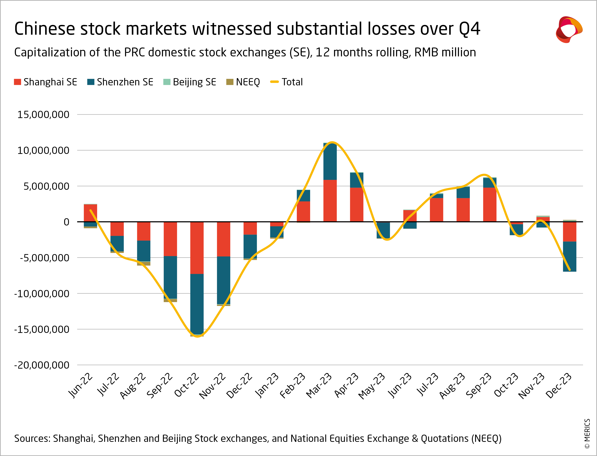

## Table of Contents

## What are the basic concepts of China's stock market?

China's stock market is made up of two main exchanges: the Shanghai Stock Exchange and the Shenzhen Stock Exchange. These exchanges allow companies to sell shares to the public, which helps them raise money to grow their businesses. People can buy and sell these shares, hoping to make a profit. The market is overseen by the China Securities Regulatory Commission, which makes sure that everything is done fairly and according to the rules.

The stock market in China is influenced by many things, like the country's economy, government policies, and global events. When the economy is doing well, stock prices usually go up. But if there are problems, like a slowdown in the economy or changes in government rules, stock prices can go down. It's important for investors to understand these factors and keep an eye on them when making decisions about buying or selling stocks.

There are different types of stocks in China's market, including A-shares and B-shares. A-shares are traded in Chinese yuan and are mainly for domestic investors, while B-shares are traded in foreign currencies and are aimed at international investors. This system helps China's market connect with the global financial world, but it also means that investors need to be aware of the different rules and opportunities available to them.

## How does the Shanghai Stock Exchange (SSE) differ from the Shenzhen Stock Exchange (SZSE)?

The Shanghai Stock Exchange (SSE) and the Shenzhen Stock Exchange (SZSE) are the two main stock markets in China, but they have some differences. The SSE is located in Shanghai and is the bigger and older of the two exchanges. It focuses on bigger and more established companies. Many of the companies listed on the SSE are state-owned or large corporations. The SSE is also home to the SSE Composite Index, which tracks the performance of all stocks listed on the exchange and is a key indicator of the Chinese stock market's health.

On the other hand, the Shenzhen Stock Exchange (SZSE) is located in Shenzhen and is known for listing smaller and newer companies, including many tech startups. The SZSE is often seen as more innovative and riskier than the SSE. It has the SZSE Component Index, which tracks the performance of the largest and most liquid stocks on the exchange. The SZSE also has a special board called the ChiNext, which is similar to the NASDAQ in the United States and is designed for high-growth, high-tech companies.

Both exchanges play important roles in China's economy, but they cater to different types of companies and investors. The SSE is more traditional and stable, while the SZSE is more dynamic and focused on growth. Understanding these differences can help investors decide which exchange might be better for their investment goals.

## What are the main indices used to gauge the performance of China's stock market?

The main indices used to gauge the performance of China's stock market are the SSE Composite Index and the SZSE Component Index. The SSE Composite Index tracks the performance of all stocks listed on the Shanghai Stock Exchange. It includes a wide range of companies, from big state-owned enterprises to smaller firms. This index is often used as a general indicator of how the Chinese stock market is doing overall. When people talk about the Chinese stock market's performance, they often refer to the SSE Composite Index.

The SZSE Component Index, on the other hand, focuses on the Shenzhen Stock Exchange. It tracks the performance of the largest and most liquid stocks listed on the SZSE. This index is important because it gives a good picture of how the more dynamic and growth-oriented part of the Chinese market is doing. The SZSE is known for having many tech companies and startups, so the SZSE Component Index can show how these sectors are performing.

In addition to these two main indices, there is also the ChiNext Index, which is part of the SZSE. The ChiNext Index tracks the performance of high-growth, high-tech companies listed on the ChiNext board. This index is useful for investors who are interested in the tech sector and want to see how these innovative companies are doing. Together, these indices provide a comprehensive view of the Chinese stock market's health and trends.

## How do economic indicators like GDP growth influence China's stock market?

Economic indicators like GDP growth have a big impact on China's stock market. When China's GDP is growing, it usually means the economy is doing well. This makes people feel more confident about investing in stocks. Companies can make more money when the economy is strong, which can lead to higher stock prices. For example, if GDP growth is high, it might mean that people are buying more things, and companies are selling more products. This can make investors happy and cause stock prices to go up.

On the other hand, if GDP growth slows down or becomes negative, it can hurt the stock market. A slowdown in GDP growth might mean that people are not spending as much money, and companies are not making as much profit. This can make investors worried and cause them to sell their stocks, which can lead to lower stock prices. So, GDP growth is an important thing for investors to watch because it can give them a good idea of how the economy is doing and how that might affect the stock market.

## What role do government policies play in the performance of China's stock markets?

Government policies have a big impact on China's stock markets. When the government makes new rules or changes old ones, it can affect how companies do business and how much money they make. For example, if the government decides to help certain industries, like technology or green energy, by giving them special benefits or money, the stock prices of companies in those industries might go up. On the other hand, if the government puts new restrictions on businesses, like tougher rules on pollution or foreign investment, it might make it harder for companies to make money, and their stock prices might go down.

Another way government policies affect the stock market is through interest rates and money supply. If the government decides to lower interest rates, it can make it cheaper for companies to borrow money, which can help them grow and make more profit. This can make investors feel good about buying stocks, and stock prices might go up. But if the government raises interest rates, borrowing money becomes more expensive, and companies might have a harder time growing, which can make stock prices go down. So, investors need to keep an eye on what the government is doing because it can really change how the stock market performs.

## How do foreign investments impact the Chinese stock market?

Foreign investments can really change things in the Chinese stock market. When foreign investors put money into Chinese stocks, it can make stock prices go up. This is because more people want to buy the stocks, which makes them more valuable. Foreign money can also help Chinese companies grow bigger and stronger. This is good for the whole economy because it creates jobs and makes more money for everyone. But, if foreign investors suddenly decide to take their money out of China, it can make stock prices fall. This is because there are fewer people who want to buy the stocks, so they become less valuable.

The Chinese government has rules about how much foreign money can come into the stock market. These rules are there to keep things stable and make sure the market doesn't get too crazy. Sometimes, the government might make it easier for foreigners to invest, which can bring in more money and help the stock market grow. Other times, they might make it harder, which can slow things down. So, foreign investments can be a big help to the Chinese stock market, but they can also make things more unpredictable. It's important for everyone to pay attention to what foreign investors are doing because it can affect the whole market.

## What are the key sectors driving the performance of the Chinese stock market?

The Chinese stock market is driven by several key sectors, with technology being one of the most important. Many big tech companies in China are listed on the stock market, and they are always coming up with new ideas and products. This makes investors excited and willing to put their money into these companies, which can make their stock prices go up. The tech sector is also helped by the government, which wants to make China a leader in technology. So, when the tech sector does well, it can really help the whole stock market.

Another important sector is consumer goods. As more people in China get richer, they want to buy more things like clothes, food, and cars. Companies that make these products can make a lot of money, which makes their stock prices go up. The government also helps this sector by making it easier for people to spend money. So, when people are buying a lot of stuff, it's good for the stock market. 

The financial sector also plays a big role in the Chinese stock market. Banks and insurance companies are important because they help other businesses grow by giving them money to borrow. When the economy is doing well, these financial companies can make more money, which can make their stock prices go up. The government keeps a close eye on the financial sector to make sure it stays stable, which is good for the whole stock market.

## How do market sentiment and investor behavior affect stock prices in China?

Market sentiment and investor behavior can really change stock prices in China. When people feel good about the economy and think that companies will make more money, they are more likely to buy stocks. This makes the demand for stocks go up, and the prices go up too. For example, if there is good news about a new government policy that helps businesses, investors might feel happy and want to buy more stocks. On the other hand, if people are worried about the economy or think that companies might not do well, they might sell their stocks. This can make the demand for stocks go down, and the prices can fall. So, how people feel about the market can make a big difference in stock prices.

Investor behavior also plays a big role in the Chinese stock market. Sometimes, investors can get caught up in what everyone else is doing, which is called a herd mentality. If a lot of people start buying a certain stock, others might follow, even if they don't know much about the company. This can make the stock price go up really fast. But if everyone suddenly decides to sell, the price can drop just as quickly. This kind of behavior can make the market go up and down a lot. Also, when investors are feeling nervous, they might move their money to safer places, like government bonds, instead of keeping it in stocks. This can make stock prices go down. So, understanding how investors behave can help explain why stock prices in China move the way they do.

## What technical analysis tools are most effective for predicting trends in China's stock market?

Technical analysis tools can help predict trends in China's stock market by looking at past price movements and trading volumes. One of the most effective tools is the moving average, which smooths out price data to show the overall direction of a stock's price over time. For example, a 50-day moving average can help investors see if a stock is in an uptrend or a downtrend. Another useful tool is the Relative Strength Index (RSI), which measures how fast and how much a stock's price has changed. If the RSI is over 70, it might mean the stock is overbought and could go down soon. If it's under 30, the stock might be oversold and could go up.

Another important tool is the Bollinger Bands, which show how much a stock's price has been moving around. The bands get wider when the price is moving a lot and narrower when it's not moving much. This can help investors see if a stock is about to make a big move. The MACD (Moving Average Convergence Divergence) is also very helpful. It shows the relationship between two moving averages of a stock's price. When the MACD line crosses above the signal line, it might be a good time to buy. When it crosses below, it might be a good time to sell. By using these tools together, investors can get a better idea of where the Chinese stock market might be headed.

## How does the integration of China's stock market with global markets affect its performance?

The integration of China's stock market with global markets means that what happens in other countries can affect stock prices in China. When the global economy is doing well, investors from around the world might want to put their money into Chinese stocks. This can make stock prices go up because more people want to buy them. But if there are problems in other countries, like a financial crisis or a big drop in stock prices, investors might take their money out of China. This can make Chinese stock prices go down because fewer people want to buy them. So, China's stock market is not just affected by what happens in China, but also by what happens all over the world.

Another way integration affects China's stock market is through trade and investment rules. When other countries make it easier for their investors to buy Chinese stocks, more money can come into the market, which can help stock prices go up. But if other countries put new rules in place that make it harder to invest in China, it can slow things down. Also, if China makes it easier for foreign companies to list their stocks on Chinese exchanges, it can bring in more money and help the market grow. So, the rules about how countries can invest in each other's markets can really change how well China's stock market does.

## What are the regulatory challenges and reforms affecting China's stock market?

China's stock market faces many regulatory challenges. One big challenge is making sure that companies follow the rules and tell the truth about their businesses. Sometimes, companies might not be honest about how much money they are making or how they are doing. This can make investors lose trust in the market. Another challenge is keeping the market stable. The government has to make sure that stock prices do not go up and down too much, which can be hard when there are a lot of people buying and selling stocks. The government also has to watch out for too much borrowing, which can make the market risky.

To deal with these challenges, the Chinese government has been making reforms. They have been making the rules stricter to make sure companies tell the truth about their businesses. They have also been trying to make it easier for foreign investors to put their money into the Chinese stock market. This can help bring in more money and make the market grow. The government has also been working on new ways to keep the market stable, like setting up special funds to buy stocks when prices are falling too fast. These reforms are helping to make the Chinese stock market safer and more attractive to investors.

## How can advanced quantitative models be used to forecast movements in China's stock market?

Advanced quantitative models can help forecast movements in China's stock market by using math and data to find patterns and trends. These models look at a lot of information, like past stock prices, trading volumes, and economic indicators. They use this information to make predictions about where stock prices might go next. For example, a model might use [machine learning](/wiki/machine-learning) to learn from past data and then guess if a stock will go up or down. This can help investors make better decisions about when to buy or sell stocks.

These models can also take into account things like news and social media to see how people feel about the market. If a lot of people are talking about a company in a good way, the model might predict that the stock price will go up. On the other hand, if there is bad news about a company, the model might predict that the stock price will go down. By using all this information, advanced quantitative models can give investors a better idea of what might happen in China's stock market, helping them make smarter choices.

## References & Further Reading

[1]: Yang, L., & Yu, J. (2017). ["The development of China’s stock market and examinations of its foundational theories."](https://www.sciencedirect.com/science/article/pii/S0040162521001037) SAGE Open.

[2]: "[Algorithmic Trading in Practice: Application to Financial Markets of China](https://academic.oup.com/edited-volume/41262/chapter/350850196)" by Zhenguo Li and Xuehu Wu, Finance Research Letters, 2020.

[3]: Yu, J., & Zhang, Z. (2013). ["The Chinese Stock Market in the Post-financial Crisis Era."](https://www.annualreviews.org/content/journals/10.1146/annurev-financial-111620-010537) Cambridge University Press.

[4]: Gao, S., & Kling, G. (2008). ["Corporate Governance and Efficiency in the Chinese Stock Market."](https://www.sciencedirect.com/science/article/abs/pii/S0927538X07000741) Economic Development and Cultural Change.

[5]: Chan, E. P. (2017). ["Machine Trading: Deploying Computer Algorithms to Conquer the Markets."](https://github.com/ftvision/quant_trading_echan_book) John Wiley & Sons.

[6]: Lou, D. (2012). ["A Flow-Based Explanation for Return Predictability."](https://academic.oup.com/rfs/article-abstract/25/12/3457/1594242) The Review of Financial Studies.