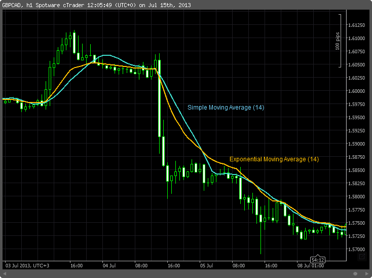

## Table of Contents

## What is an Exponential Moving Average (EMA) and how is it calculated?

An Exponential Moving Average (EMA) is a type of moving average that puts more weight on recent prices. This makes it more responsive to new information compared to a Simple Moving Average (SMA), which treats all prices equally. Traders and investors often use EMAs to identify trends and potential buy or sell signals in financial markets.

To calculate an EMA, you start with a Simple Moving Average (SMA) for the first data point. After that, you use a formula that includes a multiplier, which is calculated as 2 divided by the number of periods plus 1. For example, if you're using a 10-day EMA, the multiplier would be 2/(10+1) = 0.1818. The EMA formula is: EMA = (Current Price - Previous EMA) * Multiplier + Previous EMA. This means that each new EMA value depends on the previous EMA and the current price, giving more weight to recent data.

## Why are indicators used to complement the EMA in trading?

Indicators are used to complement the EMA in trading because they help traders get a fuller picture of the market. The EMA is good at showing trends, but it doesn't tell the whole story. By using other indicators, traders can see more details about what's happening in the market. For example, an indicator like the Relative Strength Index (RSI) can show if a stock is overbought or oversold, which can help traders decide when to buy or sell.

Another reason to use indicators with the EMA is to confirm signals. Sometimes, the EMA might suggest a trend, but it's not always clear if it's a good time to act on that trend. Other indicators, like the Moving Average Convergence Divergence (MACD), can help confirm if the trend is strong and likely to continue. This way, traders can feel more confident in their decisions, reducing the risk of making a wrong move based on the EMA alone.

## What are the most common indicators used alongside the EMA?

Traders often use the Relative Strength Index (RSI) with the EMA. The RSI helps show if a stock is overbought or oversold. If the RSI is above 70, it means the stock might be overbought and could go down soon. If it's below 30, the stock might be oversold and could go up. By looking at the RSI and the EMA together, traders can see if the trend shown by the EMA is strong or if it might change soon.

Another common indicator used with the EMA is the Moving Average Convergence Divergence (MACD). The MACD helps traders see if the trend is getting stronger or weaker. It does this by showing the difference between two EMAs. If the MACD line crosses above the signal line, it might be a good time to buy. If it crosses below, it might be a good time to sell. Using the MACD with the EMA can help traders confirm if the trend they see on the EMA is likely to continue.

The Bollinger Bands are also often used with the EMA. Bollinger Bands show how much a stock's price moves up and down. They are made of a middle band, which is usually an EMA, and two outer bands that are set a certain number of standard deviations away from the middle band. If the price touches the upper band, it might be overbought, and if it touches the lower band, it might be oversold. By using Bollinger Bands with the EMA, traders can see if the price is moving a lot and if the trend shown by the EMA is likely to keep going.

## How does the Moving Average Convergence Divergence (MACD) work with the EMA?

The Moving Average Convergence Divergence (MACD) works with the Exponential Moving Average (EMA) by helping traders see if the trend shown by the EMA is getting stronger or weaker. The MACD is made up of two lines: the MACD line and the signal line. The MACD line is the difference between a 12-day EMA and a 26-day EMA. The signal line is a 9-day EMA of the MACD line. When the MACD line crosses above the signal line, it's called a bullish crossover, which might mean it's a good time to buy. When the MACD line crosses below the signal line, it's called a bearish crossover, which might mean it's a good time to sell.

By using the MACD with the EMA, traders can get a better idea of whether the trend they see on the EMA is likely to continue. For example, if the EMA shows an upward trend and the MACD line is above the signal line and moving away from it, it suggests that the upward trend is strong and likely to keep going. On the other hand, if the EMA shows an upward trend but the MACD line is below the signal line or moving closer to it, it might mean the upward trend is weakening and could reverse soon. This way, the MACD helps traders confirm the signals they get from the EMA, making their trading decisions more reliable.

## Can you explain the use of the Relative Strength Index (RSI) in conjunction with the EMA?

The Relative Strength Index (RSI) is a useful tool that traders use together with the Exponential Moving Average (EMA) to make better trading decisions. The RSI measures how fast and how much a stock's price is changing. It gives a number between 0 and 100. If the RSI is over 70, it means the stock might be overbought and could go down soon. If it's under 30, the stock might be oversold and could go up soon. When you look at the RSI alongside the EMA, you can see if the trend shown by the EMA is strong or if it might change soon.

For example, if the EMA shows an upward trend and the RSI is also moving up but stays below 70, it suggests that the upward trend is strong and likely to continue. But if the EMA shows an upward trend and the RSI goes above 70, it might mean the stock is overbought and the upward trend could reverse soon. By using the RSI with the EMA, traders can get a better sense of when to buy or sell, making their trading decisions more informed and potentially more profitable.

## How does the Bollinger Bands indicator enhance the use of the EMA?

Bollinger Bands help traders understand the EMA better by showing how much a stock's price is moving up and down. The Bollinger Bands are made up of three lines: the middle line, which is usually an EMA, and two outer lines that are set a certain distance away from the middle line. This distance is based on how much the stock's price has been moving, called the standard deviation. When the price of the stock goes near or touches the top band, it might mean the stock is overbought and could go down soon. If the price goes near or touches the bottom band, it might mean the stock is oversold and could go up soon.

By using Bollinger Bands with the EMA, traders can see if the trend shown by the EMA is likely to keep going or if it might change. For example, if the EMA is going up and the price is moving away from the top band, it suggests that the upward trend is strong and could continue. But if the EMA is going up and the price is close to or touching the top band, it might mean the upward trend is getting weak and could reverse soon. This way, Bollinger Bands help traders make better decisions by giving them more information about the strength and direction of the trend shown by the EMA.

## What role does the Stochastic Oscillator play when used with the EMA?

The Stochastic Oscillator is another tool that traders use with the EMA to make better trading decisions. It helps show if a stock is overbought or oversold. The Stochastic Oscillator gives a number between 0 and 100. If the number is over 80, it means the stock might be overbought and could go down soon. If it's under 20, the stock might be oversold and could go up soon. When you use the Stochastic Oscillator with the EMA, you can see if the trend shown by the EMA is strong or if it might change soon.

For example, if the EMA shows an upward trend and the Stochastic Oscillator is also moving up but stays below 80, it suggests that the upward trend is strong and likely to continue. But if the EMA shows an upward trend and the Stochastic Oscillator goes above 80, it might mean the stock is overbought and the upward trend could reverse soon. By using the Stochastic Oscillator with the EMA, traders can get a better sense of when to buy or sell, making their trading decisions more informed and potentially more profitable.

## How can the Average True Range (ATR) be used to complement the EMA in volatility assessment?

The Average True Range (ATR) is a tool that helps traders understand how much a stock's price moves up and down. When you use the ATR with the EMA, you can see if the trend shown by the EMA is happening in a calm market or a wild one. The ATR gives a number that shows the average size of the price moves over a certain time. If the ATR number is high, it means the price is moving a lot, and the market is more volatile. If the ATR number is low, it means the price is not moving much, and the market is calmer.

By looking at the ATR and the EMA together, traders can make better decisions. For example, if the EMA shows an upward trend and the ATR is low, it suggests that the upward trend is happening in a calm market and might be more reliable. But if the EMA shows an upward trend and the ATR is high, it means the upward trend is happening in a wild market, and the trend might not last long. This way, the ATR helps traders understand the strength and reliability of the trend shown by the EMA, making their trading decisions more informed.

## What advanced techniques involve combining the EMA with the Fibonacci Retracement levels?

When traders use the EMA with Fibonacci Retracement levels, they can find good times to buy or sell a stock. The EMA helps show the trend of the stock's price, while Fibonacci Retracement levels help show where the price might go next. If the EMA is going up and the price pulls back to a Fibonacci level, like 38.2% or 61.8%, it might be a good time to buy. This is because the price might go back up after hitting one of these levels. On the other hand, if the EMA is going down and the price goes up to a Fibonacci level, it might be a good time to sell because the price might go back down.

Using the EMA and Fibonacci Retracement levels together can help traders see if the trend is strong or if it might change soon. For example, if the EMA is going up and the price hits a Fibonacci level but then keeps going up, it suggests that the upward trend is strong. But if the EMA is going up and the price hits a Fibonacci level and then starts going down, it might mean the upward trend is getting weak. By looking at both the EMA and Fibonacci levels, traders can make better decisions about when to buy or sell, making their trading more successful.

## How do professional traders use multiple time frame analysis with the EMA and other indicators?

Professional traders often use multiple time frame analysis with the EMA and other indicators to get a better understanding of the market. They look at different time frames, like daily, hourly, and 15-minute charts, to see the big picture and the small details. For example, they might use a longer time frame, like a daily chart, to see the overall trend with the EMA. If the EMA on the daily chart is going up, it suggests a long-term upward trend. Then, they look at a shorter time frame, like an hourly chart, to find the best times to buy or sell within that trend. They might use other indicators like the RSI or MACD on the shorter time frame to confirm when to make a trade.

By combining different time frames, traders can make more informed decisions. For instance, if the EMA on the daily chart shows an upward trend and the EMA on the hourly chart also shows an upward trend, but the RSI on the hourly chart is below 30, it might be a good time to buy. This way, traders can use the big picture from the longer time frame to guide their overall strategy and the details from the shorter time frame to time their trades better. Using multiple time frames with the EMA and other indicators helps traders see if the trend is strong across different time scales, making their trading more successful.

## What are the potential pitfalls of over-relying on indicators including the EMA?

Over-relying on indicators like the EMA can lead to some problems. One big issue is that indicators can give false signals. This means they might tell you to buy or sell when it's not a good time. If you follow these signals too much, you might make bad trades and lose money. Another problem is that indicators look at past data, but the market can change quickly. If you rely too much on what happened before, you might miss new trends or big changes in the market.

Another pitfall is that too many indicators can make things confusing. When you use a lot of them together, it can be hard to see what's really happening with the stock's price. This can make you feel unsure about what to do next. Also, if you depend too much on indicators, you might not learn to think for yourself. It's important to use your own judgment and understand the market, not just follow what the indicators say. Balancing the use of indicators with your own analysis can help you make better trading decisions.

## How can machine learning models be integrated with EMA and other technical indicators to enhance trading strategies?

Machine learning models can be used with the EMA and other technical indicators to make trading strategies better. These models can look at a lot of data very quickly and find patterns that people might not see. For example, a machine learning model can use the EMA, RSI, and MACD to predict if a stock's price will go up or down. The model can learn from past data and get better over time, making its predictions more accurate. By using machine learning with these indicators, traders can make smarter decisions about when to buy or sell.

One way to use machine learning with the EMA and other indicators is to create a model that looks at many different time frames at once. The model can see the big picture on a daily chart and the small details on an hourly chart. It can use the EMA to understand the trend and other indicators like the RSI to see if the stock is overbought or oversold. By combining all this information, the machine learning model can help traders find the best times to make trades. This way, traders can use technology to improve their strategies and make more money.

## What is the Understanding of Exponential Moving Average (EMA)?

The Exponential Moving Average (EMA) is a type of moving average that places greater emphasis on recent price data compared to the Simple Moving Average (SMA). This unique characteristic allows the EMA to be more responsive to the latest price information, making it a preferred tool for traders who seek to capture short-term movements in the stock market.

The calculation of the EMA involves a specific formula that assigns a decreasing weight to past prices, ensuring that the most recent data points exert a stronger influence on the average. The formula for calculating the EMA at a given time $t$ is as follows:

$$
\text{EMA}_t = \left( \frac{2}{N + 1} \right) \times (\text{Price}_t - \text{EMA}_{t-1}) + \text{EMA}_{t-1}
$$

In this formula, $\text{Price}_t$ represents the current price, $\text{EMA}_{t-1}$ is the EMA from the previous period, and $N$ is the number of periods over which the EMA is calculated. The multiplier, $\frac{2}{N + 1}$, determines the weight applied to the most recent price data.

Traders employ various EMA lengths to analyze different time horizons and price trends. Short-term trends are typically assessed using a 10-day EMA, while medium to long-term trends might involve a 50-day or 200-day EMA. The choice of EMA length depends on the trader's strategy and the specific patterns they aim to identify within the market. For instance, a 10-day EMA might be used by traders looking to capitalize on rapid price movements, while a 200-day EMA can help in identifying overall trends over a prolonged period.

These different EMA lengths provide traders with the flexibility to tailor their analysis according to their trading style and objectives, making the EMA an essential component in technical analysis. Through its responsiveness to current price changes, the EMA offers an insightful perspective on market dynamics, aiding traders in making more informed decisions.

## What is Algorithmic Trading Using EMA?

Algorithmic trading systems leverage Exponential Moving Averages (EMAs) due to their inherent ability to swiftly respond to market dynamics. EMAs assign greater weight to recent price data, allowing algorithms to adapt rapidly to new information and make real-time trading decisions. This feature is crucial for algorithms designed to determine precise entry and exit points in volatile market environments.

The calculation of an EMA involves a recursive formula, which can be expressed as:

$$
\text{EMA}_t = \alpha \times \text{Price}_t + (1 - \alpha) \times \text{EMA}_{t-1}
$$

where $\alpha$ is the smoothing factor, typically calculated as:

$$
\alpha = \frac{2}{n+1}
$$

Here, $n$ represents the time period over which the EMA is calculated. The smoothing [factor](/wiki/factor-investing) ensures that the most recent price data has a more significant impact on the EMA’s value, making it more responsive to short-term price changes.

In [algorithmic trading](/wiki/algorithmic-trading), EMAs are frequently combined with other technical indicators to enhance decision-making processes and reduce the occurrence of false signals. For instance, integrating the Moving Average Convergence Divergence (MACD) or the Relative Strength Index (RSI) with EMAs can provide additional confirmation of market trends and potential reversals. This multi-indicator approach helps in filtering noise and improving the accuracy of trading signals, thereby optimizing the performance of trading algorithms.

Python provides robust tools for implementing EMAs in algorithmic trading strategies. The popular library `pandas` can easily compute EMAs, which can then be employed within algorithmic scripts. Below is an example of how to calculate an EMA in Python:

```python
import pandas as pd

# Sample price data
data = {'Price': [100, 102, 101, 105, 110]}
df = pd.DataFrame(data)

# Calculate the EMA with a span of 3 periods
df['EMA'] = df['Price'].ewm(span=3, adjust=False).mean()

print(df)
```

In summary, the application of EMAs in algorithmic trading is instrumental for adapting to swift market changes. By effectively utilizing EMAs in conjunction with other technical indicators, trading algorithms can achieve a balanced approach, mitigating the risk of false signals and enhancing the precision of automated trading decisions.

## References & Further Reading

[1]: ["Technical Analysis of the Financial Markets: A Comprehensive Guide to Trading Methods and Applications"](https://archive.org/details/technicalanalysi0000murp) by John J. Murphy

[2]: Wilder, J. W. (1978). ["New Concepts in Technical Trading Systems."](https://archive.org/details/newconceptsintec00wild) Trend Research

[3]: ["Algorithmic Trading: Winning Strategies and Their Rationale"](https://www.wiley.com/en-us/Algorithmic+Trading%3A+Winning+Strategies+and+Their+Rationale-p-9781118460146) by Ernie Chan

[4]: Appel, G. (2005). ["Technical Analysis: Power Tools for Active Investors"](https://www.amazon.com/Technical-Analysis-Power-Active-Investors/dp/0132930048) FT Press

[5]: ["The Evaluation and Optimization of Trading Strategies"](https://onlinelibrary.wiley.com/doi/book/10.1002/9781119196969) by Robert Pardo

[6]: Pring, M. J. (1991). ["Technical Analysis Explained: The Successful Investor's Guide to Spotting Investment Trends and Turning Points."](https://archive.org/details/technicalanalysi00prin) McGraw-Hill

[7]: "John Murphy's Ten Laws of Technical Trading." Available at [StockCharts.com](https://chartschool.stockcharts.com/table-of-contents/overview/john-murphys-10-laws-of-technical-trading)

[8]: "MACD - Moving Average Convergence Divergence." Available at [Investopedia](https://www.investopedia.com/terms/m/macd.asp)

[9]: "Relative Strength Index (RSI)." Available at [Investopedia](https://www.investopedia.com/terms/r/rsi.asp)