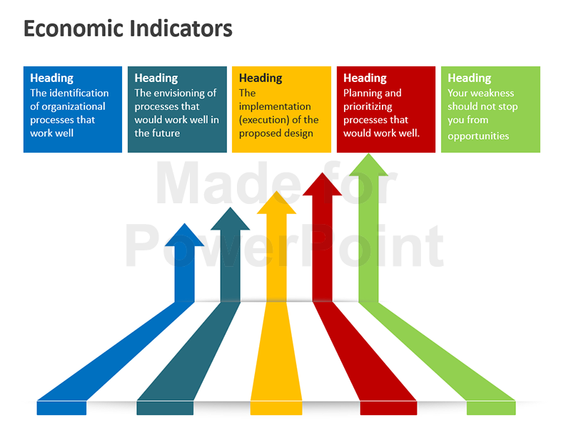

## Table of Contents

## What is economic growth?

Economic growth is when a country's economy gets bigger over time. It means that the country is making more goods and services than it did before. This can happen because more people are working, new technology is being used, or businesses are finding better ways to do things. When the economy grows, people usually have more money to spend and can enjoy a better standard of living.

One way to measure economic growth is by looking at the Gross Domestic Product (GDP). GDP is the total value of everything a country produces in a year. If the GDP goes up from one year to the next, it shows that the economy is growing. Governments and businesses pay close attention to GDP because it helps them make decisions about spending and investments.

## Why is economic growth important for a country?

Economic growth is important for a country because it helps make life better for its people. When the economy grows, there are more jobs and people can earn more money. This means they can buy more things they need and want, like food, clothes, and houses. It also means the government can collect more taxes, which can be used to build schools, hospitals, and roads. All these things help improve the standard of living for everyone in the country.

Another reason economic growth is important is that it makes a country stronger and more stable. When the economy is doing well, businesses can invest more in new projects and ideas. This can lead to new technology and better ways of doing things, which can help the economy grow even more. A strong economy also makes a country more attractive to other countries, which can lead to more trade and better relationships. Overall, economic growth is key to making a country a better place to live and work.

## What are the basic indicators of economic growth?

The main indicator of economic growth is the Gross Domestic Product (GDP). GDP is the total value of all goods and services produced in a country in a year. When the GDP goes up from one year to the next, it means the economy is growing. People often look at the GDP growth rate, which is how much the GDP increased compared to the previous year. A higher growth rate means the economy is doing well.

Another important indicator is employment. When the economy grows, more jobs are created, and the unemployment rate goes down. The unemployment rate is the percentage of people who want to work but can't find a job. A lower unemployment rate is a good sign that the economy is growing because it means more people are working and [earning](/wiki/earning-announcement) money.

Other indicators include personal income and consumer spending. When people earn more money, they can spend more on things they need and want. This increase in spending helps businesses grow and can lead to more economic growth. So, when personal income and consumer spending go up, it's another sign that the economy is doing well.

## How is Gross Domestic Product (GDP) used as an indicator of economic growth?

Gross Domestic Product, or GDP, is like a big scoreboard for a country's economy. It adds up the value of all the things people make and the services they provide in a year. When the GDP goes up from one year to the next, it means the economy is growing. People look at the GDP growth rate, which is how much the GDP increased compared to the last year. A higher growth rate means the economy is doing well.

GDP is important because it gives us a clear picture of how the economy is doing. If the GDP is growing, it usually means more people are working and businesses are making more money. This can lead to better lives for everyone because people have more money to spend on things they need and want. Governments and businesses use GDP to make decisions about spending and investments, helping to plan for the future.

## What role does employment rate play in indicating economic growth?

The employment rate is a big clue about how well an economy is doing. When more people have jobs, it means the economy is growing. This is because businesses need more workers when they are making and selling more things. When the employment rate goes up, it shows that companies are doing well and need more help to keep up with demand. This is good news because it means more people are earning money and can spend it on things they need and want.

On the other hand, if the employment rate goes down, it can mean the economy is not doing so well. When fewer people are working, it can be a sign that businesses are not making as much money and don't need as many workers. This can lead to less money being spent in the economy, which can slow down growth. So, watching the employment rate helps us understand if the economy is getting stronger or weaker.

## How can inflation rates affect economic growth?

Inflation is when prices for things like food and toys go up over time. It can affect how fast the economy grows. When inflation is low and steady, it can help the economy grow because people know what to expect and can plan better. They feel more confident about spending money and businesses can make good decisions about what to make and sell. But if inflation gets too high, it can be bad for the economy. People might start to worry that prices will keep going up, so they spend less money. This can slow down the economy because businesses sell less and might have to cut jobs.

On the other hand, if inflation is too low or even goes down, it can also be a problem. When prices are not going up much, people might think the economy is not doing well and they might save their money instead of spending it. This can make it harder for businesses to grow and can lead to less economic growth. So, keeping inflation at a good level is important for helping the economy grow in a healthy way. Governments and central banks try to manage inflation to keep the economy on track.

## What are some advanced indicators of economic growth beyond GDP?

Besides GDP, another way to see if the economy is growing is by looking at the stock market. When the stock market goes up, it usually means people feel good about the economy. They think businesses will make more money in the future, so they buy more stocks. This can help the economy grow because companies can use the money from selling stocks to start new projects and hire more people. But if the stock market goes down a lot, it can mean people are worried about the economy, and this can slow down growth.

Another advanced indicator is consumer confidence. This is about how people feel about their money and the future. When people feel good about their money, they are more likely to spend it on things they want and need. This spending helps the economy grow because businesses make more money and can hire more workers. But if people are worried about the future, they might save their money instead of spending it, and this can slow down the economy. So, keeping an eye on how people feel about their money is important for understanding economic growth.

## How do productivity levels serve as an indicator of economic growth?

Productivity levels are a key sign of how well an economy is doing. Productivity is about how much stuff people can make or how many services they can provide in a certain amount of time. When productivity goes up, it means workers are getting better at their jobs. They might be using new tools or finding smarter ways to work. This is good for the economy because when workers make more things or provide more services, businesses can sell more and make more money. This can lead to more jobs and higher wages, which helps the economy grow.

But if productivity goes down, it can be a problem for the economy. When workers are less productive, businesses might not be able to make as much stuff or provide as many services. This can lead to less money for businesses and fewer jobs for people. When this happens, the economy might not grow as fast. So, watching productivity levels helps us understand if the economy is getting stronger or if it might need help to keep growing.

## Can international trade balances indicate economic growth?

International trade balances can tell us a lot about how an economy is doing. A trade balance is the difference between what a country sells to other countries (exports) and what it buys from them (imports). When a country sells more than it buys, it has a trade surplus. This can be a good sign for the economy because it means other countries want the things the country makes. More exports can lead to more jobs and more money for businesses, which can help the economy grow.

On the other hand, if a country buys more than it sells, it has a trade deficit. This might not always be bad, but if the deficit is too big, it can be a problem. A big trade deficit means the country is spending more money on things from other countries than it is making from selling its own things. This can lead to less money in the economy and might slow down growth. So, keeping an eye on the trade balance helps us understand if the economy is doing well or if it might need help to keep growing.

## How do technological advancements influence economic growth indicators?

Technological advancements can really help the economy grow. When new technology comes out, it can make workers more productive. This means they can make more things or provide more services in less time. For example, a new machine might help a factory make more cars faster. When productivity goes up, businesses can sell more and make more money. This can lead to more jobs and higher wages, which helps the economy grow. Also, new technology can make the stock market go up because people think businesses will do better in the future. They buy more stocks, which gives businesses more money to grow even more.

But technological advancements can also change how we look at economic growth. Sometimes, new technology can make some jobs go away. For example, if a machine can do a job that people used to do, those people might lose their jobs. This can make the unemployment rate go up, which might make it look like the economy is not doing well, even if it is growing in other ways. Also, new technology can change what countries buy and sell. A country might start making new things to sell to other countries, which can affect its trade balance. So, while technology can help the economy grow, it can also make some of the indicators we use to measure growth look different.

## What are the limitations of traditional economic growth indicators?

Traditional economic growth indicators, like GDP, have some problems. They don't always show the whole picture of how well a country is doing. For example, GDP only counts the money value of what a country makes and sells, but it doesn't tell us if people are happy or if the environment is healthy. If a country cuts down a lot of trees to make more stuff, the GDP might go up, but the country might lose important forests. Also, GDP doesn't show if the money is spread out fairly among people. If only a few people get richer while many others stay poor, the GDP might still go up, but it doesn't mean everyone is doing better.

Another problem with traditional indicators like employment rates is that they can be misleading. Just because more people have jobs doesn't always mean the economy is doing well. Some jobs might not pay enough for people to live well, and they might not be steady jobs. Also, if people are working more hours but not getting paid more, the employment rate might look good, but people might not feel better off. Inflation rates can also be tricky. If prices go up a lot, people might not be able to buy as much even if they have more money. So, while these indicators can tell us some things about the economy, they don't tell the whole story.

## How can alternative indicators like the Human Development Index (HDI) provide a more comprehensive view of economic growth?

The Human Development Index (HDI) is a way to see how well a country is doing beyond just looking at money. It looks at three big things: how long people live, how much education they get, and how much money they make. By putting these together, HDI gives a fuller picture of how people's lives are improving. If a country has a high HDI, it means people are living longer, getting more education, and earning enough money to live well. This is important because it shows that the economy is growing in a way that helps everyone, not just a few people.

Traditional indicators like GDP focus mostly on how much money a country is making, but they don't show if that money is making people's lives better. HDI helps us see if the economy is growing in a way that improves people's health, education, and living standards. For example, if a country's GDP goes up but its HDI stays the same or goes down, it might mean that the money is not being shared fairly or used to help people live better lives. So, using HDI along with other indicators gives us a more complete understanding of how well a country and its people are really doing.

## What is the relationship between Gross Domestic Product and Economic Growth?

Gross Domestic Product (GDP) is the most widely recognized measure of economic growth and serves as an essential barometer for assessing the economic performance of a nation. It quantifies the total value of all goods and services produced within a country's borders over a specified period, usually reported quarterly or annually. The GDP can be calculated using three primary approaches: the production (or output) approach, the expenditure approach, and the income approach. Each provides different insights into how economic value is generated and distributed across the economy.

The GDP is expressed mathematically as:

$$
\text{GDP} = C + I + G + (X - M)
$$

where:  
- $C$ is private consumption.
- $I$ is gross private investment.
- $G$ is government spending.
- $X$ is exports of goods and services.
- $M$ is imports of goods and services.

Despite its widespread use as a measure of economic health, GDP has inherent limitations. Primarily, it does not account for factors such as income distribution, environmental degradation, and the informal economy, all of which are critical to understanding the holistic well-being of a society. GDP growth might indicate economic expansion, but it does not necessarily reflect improvements in living standards or economic equity.

Because of these limitations, alternative metrics have been developed to provide a more comprehensive view of economic well-being. Gross National Product (GNP) is one such alternative, which includes the value of goods and services produced by a nation's residents regardless of the geographical location of production. This measurement accounts for international income flows, such as remittances and income from foreign investments, offering a broader perspective on national economic health.

Additionally, productivity metrics, such as Total Factor Productivity (TFP), provide valuable insights into the efficiency and technological progress within an economy. TFP measures how effectively inputs such as labor and capital are used to produce economic output, thus capturing the innovative capabilities and efficiency improvements that GDP might overlook.

Incorporating these various metrics provides a more rounded understanding of economic growth and health, addressing the qualitative dimensions of development that GDP alone cannot. By recognizing the strengths and limitations of GDP alongside alternative indicators like GNP and productivity measures, policymakers and economists can gain a more nuanced appreciation of economic progress, potentially leading to more informed and equitable economic decisions.

## What are the key indicators for the economic pulse?

In addition to Gross Domestic Product (GDP), several key economic indicators provide a comprehensive understanding of economic conditions. These indicators include the Consumer Price Index (CPI), the Producer Price Index (PPI), and unemployment rates, each offering unique insights into different aspects of the economy.

The Consumer Price Index (CPI) is a critical measure used to monitor inflation by tracking changes in the prices of a basket of consumer goods and services. It serves as a gauge for the purchasing power of money and helps policymakers and economists assess inflationary pressures within the economy. The CPI is calculated by taking price changes for each item in the predetermined basket of goods and averaging them. Items are weighted according to their importance. The formula for calculating the CPI is:

$$
\text{CPI} = \left( \frac{\text{Cost of Basket in Current Year}}{\text{Cost of Basket in Base Year}} \right) \times 100
$$

The Producer Price Index (PPI) complements the CPI by providing insights into the pricing trends at the wholesale level. It measures the average change over time in the selling prices received by domestic producers for their output. Unlike the CPI, which focuses on consumers, the PPI tracks inflation from the perspective of the seller and covers various stages of production including raw materials, intermediate goods, and finished products. An increase in the PPI can indicate future increases in the CPI since higher production costs are often passed on to consumers.

Unemployment rates provide a snapshot of the job market, reflecting the percentage of the labor force that is unemployed and actively seeking employment. Employment data, including non-farm payroll reports, are instrumental in assessing the overall health of the labor market and consumer spending power. The unemployment rate is calculated as follows:

$$
\text{Unemployment Rate} = \left( \frac{\text{Number of Unemployed Individuals}}{\text{Labor Force}} \right) \times 100
$$

Non-farm payroll data, a crucial part of employment reports, highlight the number of jobs added or lost in the economy over a specified period, excluding the farming sector due to its seasonal variability. This data is pivotal for understanding job market trends and is watched closely by traders and policymakers for indications of economic growth or contraction.

Together, these indicators form a more comprehensive picture of an economy's current state by providing insights into inflation trends, production costs, and employment dynamics. They help investors, policymakers, and businesses make informed decisions by offering a multidimensional view of economic activity.

## References & Further Reading

[1]: Investopedia. ["Economic Indicators."](https://www.investopedia.com/terms/e/economic_indicator.asp) Retrieved from https://www.investopedia.com.

[2]: Bureau of Economic Analysis, U.S. Department of Commerce. ["Gross Domestic Product (GDP)."](https://www.bea.gov/data/gdp/gross-domestic-product) Retrieved from https://www.bea.gov.

[3]: Lopez de Prado, M. (2018). ["Advances in Financial Machine Learning."](https://www.amazon.com/Advances-Financial-Machine-Learning-Marcos/dp/1119482089) John Wiley & Sons.

[4]: Chan, E. (2009). ["Quantitative Trading: How to Build Your Own Algorithmic Trading Business."](https://github.com/ftvision/quant_trading_echan_book) John Wiley & Sons.

[5]: Benninga, S. (2014). ["Financial Modeling."](https://mitpress.mit.edu/9780262046428/financial-modeling/) MIT Press.