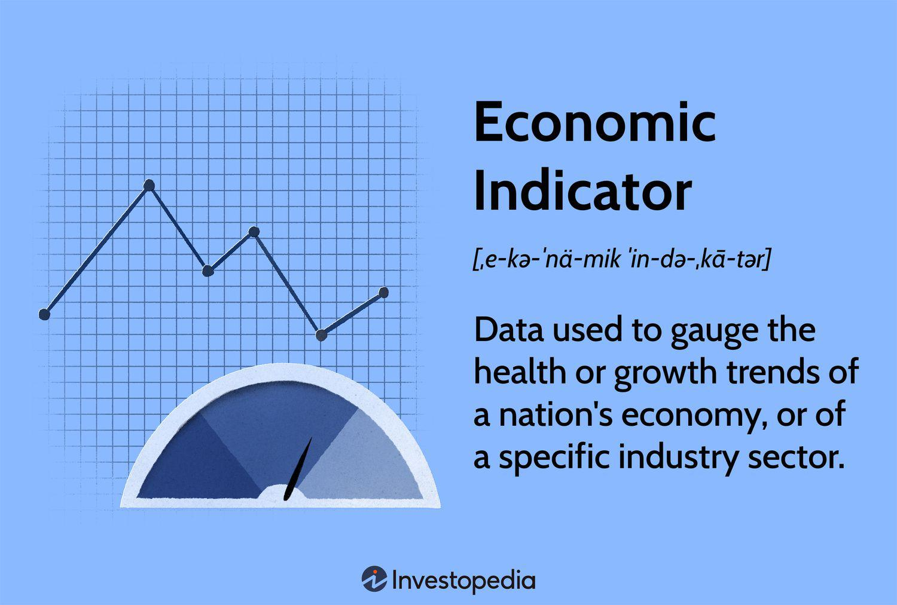

In today's fast-paced financial world, understanding economic indicators and their impact on economic growth is crucial. Economic indicators serve as the backbone of financial analysis, offering a window into the complex dynamics of economies. These indicators not only help in gauging the performance and direction of economic activity but also play a pivotal role in shaping investment strategies, particularly in the domain of algorithmic trading. By analyzing data from economic indicators, investors and traders can make informed decisions, optimize their strategies, and potentially enhance returns.

This article focuses on key economic indicators and their integral role in measuring Gross Domestic Product (GDP), a primary benchmark of economic health. Understanding GDP and its components is fundamental for investors and policymakers alike. By grasping how GDP is influenced by various economic activities, stakeholders can better predict economic trends and make strategic decisions.



Moreover, the rise of technology has transformed trading practices. Algo trading, which relies heavily on the interpretation of economic indicators, has become increasingly popular. This automated trading strategy leverages economic data to execute trades with precision and speed, capitalizing on market opportunities that arise from economic changes and announcements.

Through this discussion, we aim to equip readers with the knowledge required to interpret economic data effectively and harness it for strategic trading decisions. By combining insights from economic indicators with the capabilities of algo trading, investors can navigate the complexities of financial markets more efficiently and drive investment success.

## Table of Contents

## Understanding Economic Indicators

Economic indicators are essential tools for gauging the performance and trajectory of an economy. They encompass a wide range of statistics that provide valuable insights into various economic aspects. These indicators are typically divided into three primary categories: leading, lagging, and coincident, each offering a unique perspective on economic conditions.

**Leading Indicators**

Leading indicators are metrics that tend to change before the economy as a whole changes, making them useful for predicting future economic conditions. These indicators are closely watched by economists and policymakers because they can provide early signals of economic shift. Prominent examples include manufacturing indices, such as the Purchasing Managers' Index (PMI), and consumer confidence surveys. The rationale behind leading indicators is that they reflect preemptive actions taken by businesses and consumers in anticipation of changing economic circumstances. For instance, a rising PMI may suggest increased manufacturing activity, which could signal future GDP growth.

**Lagging Indicators**

Lagging indicators, in contrast, are [statistics](/wiki/bayesian-statistics) that change after the economy has already begun to follow a particular trend. These indicators verify and confirm patterns in the economic cycle. Common examples include the unemployment rate and corporate profits. Because they provide confirmation of economic conditions, they are less useful for predicting future trends but are valuable for validating economic analysis and decisions. The unemployment rate, for example, often rises after an economy has entered a recession and only falls after recovery, reflecting past economic events.

**Coincident Indicators**

Coincident indicators provide a snapshot of the current state of the economy, moving in line with the general economic activity at a specific time. They are particularly useful for identifying the present phase of the business cycle. Examples of coincident indicators include gross domestic product (GDP), industrial production, and retail sales. These indicators are instrumental for real-time economic analysis and can help policymakers assess whether the economy is expanding or contracting at a given moment.

Understanding the categories and examples of economic indicators helps analysts and traders interpret economic data effectively. By recognizing whether an indicator is leading, lagging, or coincident, one can better understand its implication for economic forecasting and strategic planning. This classification not only aids in anticipating economic shifts but also in validating current economic conditions, providing a comprehensive toolkit for analyzing and responding to economic developments.

## Gross Domestic Product and Economic Growth

Gross Domestic Product (GDP) is the most widely recognized measure of economic growth and serves as an essential barometer for assessing the economic performance of a nation. It quantifies the total value of all goods and services produced within a country's borders over a specified period, usually reported quarterly or annually. The GDP can be calculated using three primary approaches: the production (or output) approach, the expenditure approach, and the income approach. Each provides different insights into how economic value is generated and distributed across the economy.

The GDP is expressed mathematically as:

$$
\text{GDP} = C + I + G + (X - M)
$$

where:  
- $C$ is private consumption.
- $I$ is gross private investment.
- $G$ is government spending.
- $X$ is exports of goods and services.
- $M$ is imports of goods and services.

Despite its widespread use as a measure of economic health, GDP has inherent limitations. Primarily, it does not account for factors such as income distribution, environmental degradation, and the informal economy, all of which are critical to understanding the holistic well-being of a society. GDP growth might indicate economic expansion, but it does not necessarily reflect improvements in living standards or economic equity.

Because of these limitations, alternative metrics have been developed to provide a more comprehensive view of economic well-being. Gross National Product (GNP) is one such alternative, which includes the value of goods and services produced by a nation's residents regardless of the geographical location of production. This measurement accounts for international income flows, such as remittances and income from foreign investments, offering a broader perspective on national economic health.

Additionally, productivity metrics, such as Total Factor Productivity (TFP), provide valuable insights into the efficiency and technological progress within an economy. TFP measures how effectively inputs such as labor and capital are used to produce economic output, thus capturing the innovative capabilities and efficiency improvements that GDP might overlook.

Incorporating these various metrics provides a more rounded understanding of economic growth and health, addressing the qualitative dimensions of development that GDP alone cannot. By recognizing the strengths and limitations of GDP alongside alternative indicators like GNP and productivity measures, policymakers and economists can gain a more nuanced appreciation of economic progress, potentially leading to more informed and equitable economic decisions.

## Limitations of GDP as a Measure of Economic Health

Gross Domestic Product (GDP) is often cited as a primary indicator of economic health, reflecting the total monetary value of all goods and services produced within a country's borders over a specified period. However, its ability to comprehensively represent the health of an economy is limited. GDP does not encompass elements such as income distribution or environmental sustainability, which can significantly affect the overall well-being of a population and future economic stability.

One of the main criticisms leveled against GDP is its inadequacy in capturing income inequality. GDP aggregates national output, yet fails to disclose how income is distributed among individuals in the society. A rising GDP might indicate that a country's economic output is increasing, but it does not necessarily mean that all segments of the population are benefiting equally. To address income distribution, additional measures such as the Gini coefficient are often employed.

Furthermore, GDP does not take environmental factors into account. Traditional GDP calculations ignore the depletion of natural resources and environmental degradation, which can undermine long-term economic growth. The destruction of ecosystems and the costs of pollution are not deducted from GDP figures, potentially portraying a misleading picture of sustainable development. Alternative indicators like the Genuine Progress Indicator (GPI) attempt to adjust GDP by accounting for environmental costs and social factors.

Apart from the issues of inequality and environmental considerations, GDP has its shortcomings in reflecting improvements in living standards and innovations. GDP tends to focus narrowly on economic transactions without accounting for changes in quality of life, such as health, education, and leisure time. Additionally, it often overlooks the role of technological advancements and digital economy activities that do not have physical transactions but contribute significantly to economic and social wellbeing.

International organizations such as the Organization for Economic Co-operation and Development (OECD) advocate for the use of more comprehensive metrics, such as multi-[factor](/wiki/factor-investing) productivity, to better assess economic efficiency and progress. Multi-factor productivity considers the output produced relative to a combination of inputs, including labor, capital, and technological innovations, offering a more nuanced view of economic performance that GDP alone cannot provide.

In summary, while GDP remains a crucial macroeconomic indicator, its limitations necessitate the use of supplementary metrics to holistically evaluate an economy's health and ensure a focus on sustainable and equitable growth.

## Algo Trading and Economic Indicators

Algorithmic trading, often abbreviated as algo trading, integrates advanced software and mathematical models to execute trades at exceptional speeds and volumes. A pivotal aspect of this trading approach is the utilization of economic indicators to make informed trading decisions. These indicators, when timely and accurately interpreted, provide invaluable insights that can be leveraged by algorithmic traders to predict market movements.

Economic data releases are known for creating fluctuations in market prices, which algo trading systems can capitalize on. For instance, significant economic announcements, such as changes in the Consumer Price Index (CPI) or employment reports, are closely monitored by algorithmic systems because they often precipitate shifts in investor sentiment and asset prices. The CPI, offering a measure of inflation by tracking the average change over time in the prices paid by urban consumers for a basket of goods and services, helps algorithms assess the inflationary pressures within an economy. A higher-than-expected CPI release typically signals increased inflation, potentially leading to rising interest rates, which can impact stock and bond markets.

Similarly, employment reports, especially non-farm payroll data, are crucial indicators that provide insights into the job market's health and reliability. These reports assess the number of jobs added or lost in the economy, excluding the farming industry, and are instrumental in forecasting consumer spending behaviors, as employment levels are tied to income generation and economic confidence.

In practice, algo trading systems parse this economic data, employing complex statistical methods to filter out noise and identify genuine trends. These systems operate on the principle of quantitative analysis, often employing models that factor in historical data, market sentiment, and other exogenous variables. For example, a Python-based algorithm might use a library like NumPy or pandas to manage and analyze large datasets swiftly and efficiently:

```python
import pandas as pd

# Load CPI data from a CSV file
cpi_data = pd.read_csv('cpi_data.csv')

# Calculate the percentage change in CPI
cpi_data['CPI_Change'] = cpi_data['CPI'].pct_change()

# Define a threshold for significant CPI change
threshold = 0.02

# Identify significant changes in CPI
significant_cpi_changes = cpi_data[cpi_data['CPI_Change'].abs() > threshold]
```

This code snippet enables the algorithm to detect meaningful shifts in the CPI, thereby allowing trading strategies to adjust accordingly, either by entering new positions or liquidating existing ones to maximize profits or minimize losses. 

The strategic advantage of algo trading lies in its ability to process large volumes of data at remarkable speeds, thereby enhancing the precision of economic analysis and trading decisions. By continuously integrating the latest economic indicators into their modeling, algo traders maintain a competitive edge, adapting swiftly to economic realities and exploiting market inefficiencies as they arise.

## Key Indicators for Economic Pulse

In addition to Gross Domestic Product (GDP), several key economic indicators provide a comprehensive understanding of economic conditions. These indicators include the Consumer Price Index (CPI), the Producer Price Index (PPI), and unemployment rates, each offering unique insights into different aspects of the economy.

The Consumer Price Index (CPI) is a critical measure used to monitor inflation by tracking changes in the prices of a basket of consumer goods and services. It serves as a gauge for the purchasing power of money and helps policymakers and economists assess inflationary pressures within the economy. The CPI is calculated by taking price changes for each item in the predetermined basket of goods and averaging them. Items are weighted according to their importance. The formula for calculating the CPI is:

$$
\text{CPI} = \left( \frac{\text{Cost of Basket in Current Year}}{\text{Cost of Basket in Base Year}} \right) \times 100
$$

The Producer Price Index (PPI) complements the CPI by providing insights into the pricing trends at the wholesale level. It measures the average change over time in the selling prices received by domestic producers for their output. Unlike the CPI, which focuses on consumers, the PPI tracks inflation from the perspective of the seller and covers various stages of production including raw materials, intermediate goods, and finished products. An increase in the PPI can indicate future increases in the CPI since higher production costs are often passed on to consumers.

Unemployment rates provide a snapshot of the job market, reflecting the percentage of the labor force that is unemployed and actively seeking employment. Employment data, including non-farm payroll reports, are instrumental in assessing the overall health of the labor market and consumer spending power. The unemployment rate is calculated as follows:

$$
\text{Unemployment Rate} = \left( \frac{\text{Number of Unemployed Individuals}}{\text{Labor Force}} \right) \times 100
$$

Non-farm payroll data, a crucial part of employment reports, highlight the number of jobs added or lost in the economy over a specified period, excluding the farming sector due to its seasonal variability. This data is pivotal for understanding job market trends and is watched closely by traders and policymakers for indications of economic growth or contraction.

Together, these indicators form a more comprehensive picture of an economy's current state by providing insights into inflation trends, production costs, and employment dynamics. They help investors, policymakers, and businesses make informed decisions by offering a multidimensional view of economic activity.

## Impact of Economic Announcements on Markets

Economic announcements, such as changes in interest rates, inflation data, and employment statistics, significantly influence market dynamics. These announcements often result in immediate and considerable shifts in asset prices and trading volumes due to their impact on investors' expectations and market sentiment.

### Timing and Impact

The timing of economic announcements is highly predictable, with reports typically released according to a pre-scheduled calendar. This predictability enables traders to prepare for potential market movements. For example, the U.S. Bureau of Labor Statistics releases the Employment Situation Summary, which includes the non-farm payroll numbers, on the first Friday of every month. This report can cause substantial market movement because it provides insights into employment trends and consumer spending power, essential components of economic health.

Financial markets tend to exhibit a pattern of increased [volatility](/wiki/volatility-trading-strategies) immediately following major announcements. This is particularly true for announcements that exceed or fall short of market expectations. For instance, if the announced inflation rate is higher than expected, it might lead to a sell-off in bond markets as investors anticipate future [interest rate](/wiki/interest-rate-trading-strategies) hikes by central banks.

### Trading Strategies

To navigate the volatility associated with economic announcements, traders employ a variety of strategies. Hedging is a common approach, where traders aim to offset potential losses in one position by taking an opposite position in a related asset. For instance, a trader with a large portfolio of U.S. equities might hedge against unexpected payroll data by taking a short position in a U.S. stock index future.

Options also play a crucial role in strategies designed to capitalize on post-announcement volatility. Traders might buy call or put options as a way to gain exposure to significant price movements without committing to the outright purchase or sale of the underlying asset. For example, if a trader anticipates that an upcoming GDP report will reveal stronger than expected economic performance, they might purchase call options on a stock index to benefit from the potential uptrend.

Additionally, [algorithmic trading](/wiki/algorithmic-trading) systems are increasingly used to react swiftly to economic announcements. These systems can analyze large volumes of data at rapid speeds, allowing traders to execute strategies almost instantaneously upon the release of new economic data. A basic algorithm could monitor real-time news feeds and automatically execute trades based on predefined criteria related to economic data releases.

```python
# Example of a simple algorithmic trading logic based on economic data announcements
def trade_on_announcement(data, criteria):
    """
    Execute trade based on economic data announcements.

    :param data: dict, contains economic data with values.
    :param criteria: dict, specifies the thresholds for trading decisions.
    """
    if data['inflation_rate'] > criteria['max_inflation']:
        print("Action: Sell bonds, inflation rate too high.")
    elif data['inflation_rate'] < criteria['min_inflation']:
        print("Action: Buy bonds, inflation rate favorable.")
    else:
        print("No significant action, market stable.")

# Example usage
economic_data = {'inflation_rate': 3.0}
decision_criteria = {'max_inflation': 2.5, 'min_inflation': 1.0}
trade_on_announcement(economic_data, decision_criteria)
```

In conclusion, understanding the nuances of market responses to economic announcements is vital for traders aiming to leverage volatility for profit. By preparing for these announcements, employing strategic trading practices, and utilizing technological advancements, traders can effectively mitigate risks and capitalize on market dynamics.

## Conclusion

A thorough understanding of economic indicators and their implications is essential for effective economic analysis and successful trading strategies. Economic indicators, which include measures like Gross Domestic Product (GDP), Consumer Price Index (CPI), Producer Price Index (PPI), and employment statistics, provide crucial insights into economic health, inflation trends, and labor market conditions. By accurately interpreting these indicators, investors and traders can better assess the economic environment and make informed decisions regarding asset allocation and market timing.

The nuances of GDP and its limitations, for example, underline the importance of looking beyond headline figures to understand economic well-being fully. GDP, while a significant measure of economic activity, does not account for factors such as income inequality, environmental sustainability, and overall quality of life. Recognizing these limitations allows investors to consider a more comprehensive set of data when evaluating economic performance.

Algorithmic trading, or algo trading, offers traders the tools to harness economic data effectively. By incorporating real-time economic indicators into trading algorithms, traders can respond swiftly to economic announcements and leverage market volatility to their advantage. Python, a popular programming language for financial applications, supports libraries such as `pandas` and `numpy` that aid in analyzing economic data and developing trading algorithms. Below is an example of Python code that can be used to analyze GDP data using pandas:

```python
import pandas as pd

# Sample GDP data
data = {'Quarter': ['Q1 2021', 'Q2 2021', 'Q3 2021'],
        'GDP': [21500, 22000, 23000]}  # in billions USD

gdp_df = pd.DataFrame(data)

# Calculate GDP growth rate
gdp_df['Growth Rate'] = gdp_df['GDP'].pct_change() * 100

print(gdp_df)
```

The ability to integrate insights from economic data with algorithmic strategies can significantly enhance decision-making and drive investment success. By staying informed about key economic releases and understanding their potential impact, traders and investors can better navigate the dynamic and complex landscapes of financial markets, thus optimizing their trading strategies and achieving superior portfolio performance.

## References & Further Reading

[1]: Investopedia. ["Economic Indicators."](https://www.investopedia.com/terms/e/economic_indicator.asp) Retrieved from https://www.investopedia.com.

[2]: Bureau of Economic Analysis, U.S. Department of Commerce. ["Gross Domestic Product (GDP)."](https://www.bea.gov/data/gdp/gross-domestic-product) Retrieved from https://www.bea.gov.

[3]: Lopez de Prado, M. (2018). ["Advances in Financial Machine Learning."](https://www.amazon.com/Advances-Financial-Machine-Learning-Marcos/dp/1119482089) John Wiley & Sons.

[4]: Chan, E. (2009). ["Quantitative Trading: How to Build Your Own Algorithmic Trading Business."](https://github.com/ftvision/quant_trading_echan_book) John Wiley & Sons.

[5]: Benninga, S. (2014). ["Financial Modeling."](https://mitpress.mit.edu/9780262046428/financial-modeling/) MIT Press.