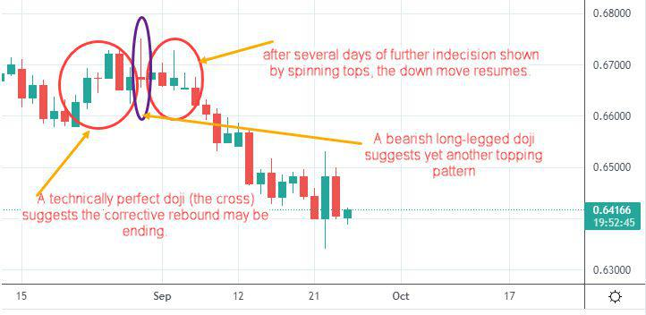

The financial markets are a complex and dynamic entity, characterized by constant evolution driven by advances in technology and innovative practices. As traders engage with these markets, they encounter a myriad of challenges and opportunities—each requiring strategic approaches to maximize returns. Among the critical aspects of successful trading is the development and implementation of effective exit strategies. These strategies are essential not only for realizing profits but also for managing risks inherent in the trading process.

An exit strategy, in trading terms, refers to a predefined plan when a trader decides to close an existing position. Unlike entry strategies, which often capture more attention and excitement, exit strategies need precision and foresight due to their direct impact on the bottom line. The absence of a well-thought-out exit plan can turn profitable trades into losses, underscoring the need for traders to prioritize them equally as entrance strategies.



This article examines the interplay between exit strategies, trading signals, and algorithmic trading, aiming to clarify how these elements synchronize to enhance trading performance. Trading signals serve as indicators guiding traders on optimal moments to enter or exit positions. When aligned with sound algorithmic trading practices, these signals can significantly upgrade decision-making processes, lessening reliance on emotional impulses. Algorithmic trading leverages sophisticated systems to automate decision-making processes, offering opportunities for executing trades with greater efficiency and accuracy. 

An understanding of how exit strategies fit into the broader context of algorithmic trading is invaluable for improving both risk management and profitability. By leveraging exit strategies effectively, traders can guard against market volatility and make well-informed decisions that align with their financial objectives. As technology continues to transform the landscape of trading, the onus is on traders to embrace adaptive strategies that reflect the changing dynamics of the financial markets.

## Table of Contents

## The Role of Exit Strategies in Trading

Exit strategies play a vital role in trading as they are essential tools for managing risk and maximizing profits. These strategies establish clear, predefined conditions for closing trades, effectively reducing the influence of emotional biases that can cloud decision-making. Traders often focus more on identifying entry points, but exit strategies require equal, if not greater, attention, as they can significantly influence trading outcomes. A well-devised exit plan is often the determining [factor](/wiki/factor-investing) between a profitable trade and a loss. 

Various types of exit strategies are used to accommodate different trading styles and risk appetites. One common strategy is the fixed target exit, where traders set a specific price level at which they will exit a trade. This method allows for straightforward decision-making, especially in scenarios where a trader has a strong conviction regarding a security's potential price movement. 

Another crucial [exit](/wiki/exit-strategy) strategy is the stop-loss exit, which involves placing an order to sell a security once it reaches a particular price, thereby limiting potential losses. A stop-loss is particularly effective in volatile markets as it provides a safety net that automatically executes a trade, safeguarding the trader from significant market downturns. 

The trailing stop exit method enhances risk management by allowing traders to protect gains while giving a trade room to continue its favorable movement. In a trailing stop, the stop-loss level is not fixed but moves with the market price, typically by a predetermined percentage or dollar amount. This method allows traders to capitalize on upward trends while locking in gains as the price rises. 

Let us consider a Python script that simulates a trailing stop logic:

```python
def trailing_stop(prices, trailing_percent):
    """
    Calculate trailing stop prices.

    :param prices: List of daily closing prices
    :param trailing_percent: The trailing percentage as a decimal
    :return: List of trailing stop prices
    """
    max_price = prices[0]
    stop_prices = []

    for price in prices:
        max_price = max(max_price, price)
        trailing_stop_price = max_price * (1 - trailing_percent)
        stop_prices.append(trailing_stop_price)

    return stop_prices

# Example usage
closing_prices = [100, 102, 105, 104, 108, 107]
trailing_percent = 0.05  # 5%
trailing_stops = trailing_stop(closing_prices, trailing_percent)
print(trailing_stops)
```

In this example, the trailing stop function calculates the trailing stop prices based on a list of closing prices and a specified trailing percentage. This approach ensures the stop loss moves up with the price, thereby optimizing profit capture while limiting downside risk.

Clearly defining and implementing exit strategies requires meticulous planning and skill. They ensure that trades are concluded optimally, safeguarding traders' capital and maximizing the potential for profit retention. Therefore, placing a significant emphasis on exit strategies is fundamental to successful trading operations.

## Trading Signals and Their Impact on Exits

Trading signals serve as crucial indicators that inform traders when to enter or exit trades based on predefined criteria. They are integral in anticipating potential market movements and developing effective exit strategies. These signals often originate from technical analysis tools, including moving averages, the Relative Strength Index (RSI), and trend lines.

### Deriving Trading Signals from Technical Indicators

1. **Moving Averages:** Moving averages smooth out price data to identify trends over specific time periods. A signal to exit might occur when a short-term moving average crosses below a long-term moving average, suggesting a potential downtrend.

2. **Relative Strength Index (RSI):** RSI measures the speed and change of price movements on a scale of 0 to 100. Typically, an RSI above 70 may indicate that a stock is overbought, hinting at a potential exit point, while an RSI below 30 might suggest that it is oversold.

3. **Trend Lines:** Trend lines are straight lines drawn on a chart that connect price points, indicating the prevailing direction of price movements. A break in a trend line might signal the end of a trend and the need for a trader to exit a position.

### Reliability and Effectiveness

The efficacy of an exit strategy is closely linked to the dependability of the trading signals utilized. Reliable signals increase the probability of exiting trades at optimal times, which is essential for managing risk and enhancing profitability. Traders often backtest their signals using historical data to assess performance and make necessary adjustments. Accuracy, timeliness, and adaptability to varying market conditions are key factors in judging the reliability of a signal.

### Refining Exit Strategies with Trading Signals

Traders can improve the effectiveness of their exit strategies by incorporating multiple signals. By doing so, they can create a more robust strategy that mitigates risk and capitalizes on market opportunities. For instance, combining moving averages with RSI might provide corroborative signals that strengthen the decision to exit a trade.

```python
import pandas as pd
import talib

# Example: Calculating an RSI signal in Python
data = pd.read_csv('historical_prices.csv')
close_prices = data['Close'].values

# Calculate RSI
rsi_period = 14
rsi = talib.RSI(close_prices, timeperiod=rsi_period)

# Determine exit signals
exit_signal = rsi > 70  # Example condition to exit if RSI indicates overbought
```

Integrating such quantitative methods aids traders in refining their exit strategies by ensuring decisions are based on objective data rather than emotional biases. In essence, the strategic use of trading signals not only enhances the precision of exits but can significantly contribute to a trader’s overall performance in the financial markets.

## Algorithmic Trading and Exit Strategies

Algorithmic trading, often referred to as algo trading, utilizes automated systems to execute trades based on a predetermined set of criteria. These systems are designed to [carry](/wiki/carry-trading) out trades with minimal human intervention, ensuring a streamlined and efficient process. The implementation of well-defined exit strategies within these systems is crucial to closing trades at optimal moments, thereby maximizing potential profits and minimizing losses.

Exit strategies in [algorithmic trading](/wiki/algorithmic-trading) are essential because they provide a systematic approach to determining the appropriate timing and conditions to sell securities. Algorithms can continuously monitor market conditions, analyzing data such as price movements, [volume](/wiki/volume-trading-strategy) changes, and various technical indicators. By processing this information, algorithms can trigger exits based on predefined rules, such as stop-loss limits, profit targets, or trailing stops. This precise function reduces the influence of human emotions, which often lead to premature exits or holding onto losing positions for too long.

The integration of exit strategies into algorithmic trading systems enhances the speed and accuracy of trade executions. Algorithms operate at a speed beyond human capability, swiftly reacting to market fluctuations and ensuring transactions are completed at the desired levels. This rapid execution is particularly advantageous in volatile markets where delays could result in significant financial discrepancies.

Moreover, algorithmic trading provides substantial risk management benefits. By adhering to specific exit criteria, traders can mitigate potential losses that arise from abrupt market reversals. Algorithms allow for dynamic adjustment of exit points based on real-time data, ensuring that strategies remain aligned with current market conditions. For example, an algorithm might include a rule to adjust a trailing stop upwards following an increase in a security’s price, thus securing a larger portion of the gained profits if the price begins to fall.

Performance optimization is another significant advantage provided by algorithmic trading with integrated exit strategies. Algorithms can be backtested using historical data to evaluate the effectiveness of various exit strategies under different market conditions. This process enables traders to refine strategies, optimizing them for both risk management and profit maximization. For instance, a backtest might reveal that a combination of a fixed exit point with a dynamic stop-loss provides better performance than either strategy alone.

Here is a simple illustration in Python showing how an algorithm might implement an exit strategy using a moving average crossover as a signal:

```python
import pandas as pd

# Sample data containing stock prices
data = pd.read_csv('stock_prices.csv')
data['Short_MA'] = data['Close'].rolling(window=50).mean()
data['Long_MA'] = data['Close'].rolling(window=200).mean()

position = None

for i in range(1, len(data)):
    if data['Short_MA'].iloc[i] > data['Long_MA'].iloc[i]:
        if position != 'buy':
            print(f"Enter trade at {data['Date'].iloc[i]}, Price: {data['Close'].iloc[i]}")
            position = 'buy'
    elif data['Short_MA'].iloc[i] < data['Long_MA'].iloc[i]:
        if position == 'buy':
            print(f"Exit trade at {data['Date'].iloc[i]}, Price: {data['Close'].iloc[i]}")
            position = None
```

In this example, the algorithm enters a trade when the short-term moving average crosses above the long-term moving average and exits when the short-term moving average drops below the long-term moving average. By automating this process, traders can capitalize on trends without the need for constant manual oversight.

In summary, the integration of exit strategies into algorithmic trading systems offers substantial benefits, particularly in enhancing risk management and optimizing trading performance. By leveraging technology, traders can implement strategies that automatically execute trades based on carefully defined exit criteria, reducing human error and responding swiftly to market dynamics.

## Case Studies and Practical Examples

### Case Studies and Practical Examples

Exit strategies are vital components of trading systems, directly impacting the financial outcomes of traders and institutions. Understanding their application through real-world examples provides traders with insights to enhance their performance.

#### Successful Algo Trades with Robust Exit Strategies

A notable example of the efficacy of exit strategies in algorithmic trading can be found in the operations of Renaissance Technologies. Known for its Medallion Fund, Renaissance employs sophisticated algorithms that integrate precise exit strategies. By implementing automated stop-loss mechanisms and profit-taking scripts, the fund exemplifies how disciplined exit strategies minimize losses and protect profits. These algorithms are typically crafted using advanced statistical models to dynamically adjust exit points based on market conditions, reducing drawdown and increasing overall returns.

A Python example of a simple stop-loss and take-profit strategy might look like this:

```python
def execute_trade_strategy(entry_price, current_price, stop_loss, take_profit):
    if current_price <= entry_price * (1 - stop_loss):
        return "Exit trade: Stop loss triggered"
    elif current_price >= entry_price * (1 + take_profit):
        return "Exit trade: Take profit hit"
    else:
        return "Hold position"

entry_price = 100
current_price = 105
stop_loss = 0.05  # 5% stop loss
take_profit = 0.10  # 10% take profit

decision = execute_trade_strategy(entry_price, current_price, stop_loss, take_profit)
print(decision)
```

#### Failures and Lessons Learned

An example of an exit strategy failure can be observed in the 2010 Flash Crash. Numerous high-frequency trading ([HFT](/wiki/high-frequency-trading-strategies)) algorithms failed to incorporate effective exit strategies, leading to massive sell-offs. This incident highlighted the necessity for robust, fail-safe exits. A key takeaway from such failures is the importance of incorporating market [volatility](/wiki/volatility-trading-strategies) measures and circuit breakers that can halt trades in extreme conditions.

#### Integrating Exit Strategies with Trading Algorithms

Effective integration of exit strategies into trading algorithms requires consideration of factors like market volatility, [liquidity](/wiki/liquidity-risk-premium), and trader psychology. The use of trailing stops is one such strategy, allowing traders to adapt to market trends while securing profits. For instance, by setting a trailing stop at a certain percentage below the market price, traders can automatically lock in gains while allowing profits to run as prices rise.

Python can again be used to simulate this:

```python
def trailing_stop(entry_price, current_price, trailing_percent):
    trailing_stop_price = current_price * (1 - trailing_percent)
    return trailing_stop_price

entry_price = 100
current_price = 110
trailing_percent = 0.05  # 5% trailing stop

trailing_stop_price = trailing_stop(entry_price, current_price, trailing_percent)
print(f"Trailing stop set at: {trailing_stop_price}")
```

### Conclusion

Real-world examples demonstrate the critical role of exit strategies in trading success. They not only safeguard against potential losses but also enhance profitability when effectively integrated into trading algorithms. By analyzing both successful trades and failures, traders can gain practical insights to refine their strategies and better navigate the complexities of financial markets.

## Conclusion

Incorporating well-structured exit strategies is crucial for enhancing trading success. Such strategies are vital for effective risk management and maximizing profitability. By defining stringent criteria for closing trades, exit strategies mitigate emotional biases, helping traders to remain objective in their decision-making. Moreover, the synergy between exit strategies, trading signals, and algorithmic trading is undeniable. Trading signals, derived from technical indicators, provide critical input for defining exit points, while algorithmic trading leverages these signals to execute trades automatically, thus reducing human error.

Furthermore, the dynamic nature of financial markets necessitates continuous refinement of exit strategies. Traders are encouraged to adapt their approaches in response to evolving market conditions. By doing so, they can ensure that their strategies remain optimal, preserving capital during adverse movements while capturing gains during favorable trends.

Technology plays a pivotal role in enhancing trading practices. Through algorithmic trading platforms, traders can implement and test exit strategies with speed and precision that manual trading cannot match. This technological advantage provides traders with the ability to back-test strategies against historical data, optimize performance, and swiftly adapt to market changes.

In conclusion, prioritizing well-structured exit strategies in trading plans is essential for achieving financial goals. Traders must not only focus on entry strategies but equally on exits to ensure a comprehensive trading plan that aligns with their long-term objectives. The integration of trading signals and algorithmic systems offers a powerful toolset, paving the way for improved performance and risk management. As market landscapes evolve, so should exit strategies, anchoring them as a fundamental component of any successful trading endeavor.

## References & Further Reading

[1]: Bergstra, J., Bardenet, R., Bengio, Y., & Kégl, B. (2011). ["Algorithms for Hyper-Parameter Optimization."](https://dl.acm.org/doi/10.5555/2986459.2986743) Advances in Neural Information Processing Systems 24.

[2]: ["Advances in Financial Machine Learning"](https://www.amazon.com/Advances-Financial-Machine-Learning-Marcos/dp/1119482089) by Marcos Lopez de Prado

[3]: ["Evidence-Based Technical Analysis: Applying the Scientific Method and Statistical Inference to Trading Signals"](https://www.amazon.com/Evidence-Based-Technical-Analysis-Scientific-Statistical/dp/0470008741) by David Aronson

[4]: ["Machine Learning for Algorithmic Trading"](https://github.com/stefan-jansen/machine-learning-for-trading) by Stefan Jansen

[5]: ["Quantitative Trading: How to Build Your Own Algorithmic Trading Business"](https://github.com/LucindaYa/quant-resources/blob/master/Quantitative%20Trading%20How%20to%20Build%20Your%20Own%20Algorithmic%20Trading%20Business.pdf) by Ernest P. Chan