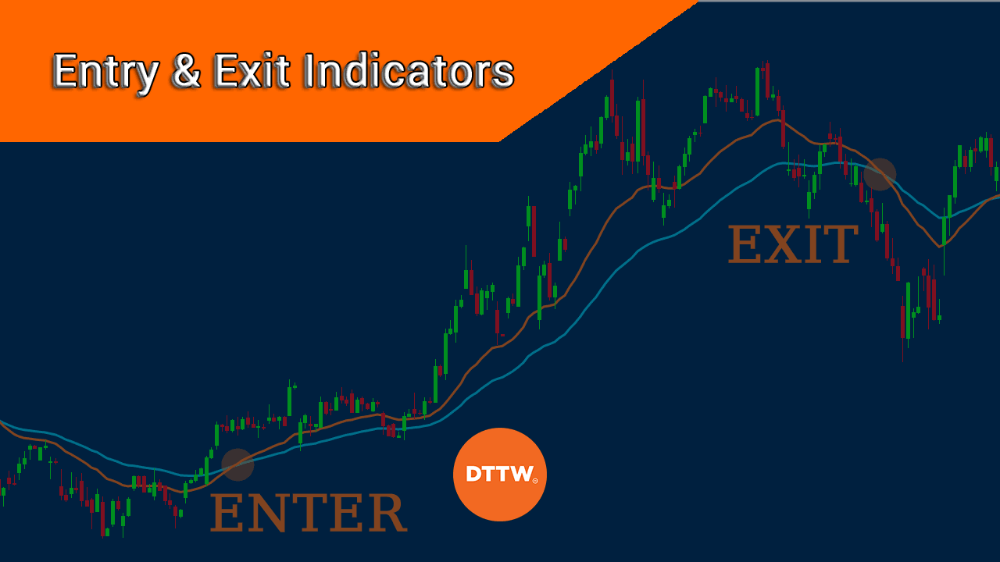

## Table of Contents

## What is an exit indicator in trading?

An exit indicator in trading is a tool that helps traders decide when to sell their investments. It uses different signals or data to tell traders that it might be a good time to get out of a trade. This can help them avoid big losses or make sure they keep their profits.

These indicators can be based on things like price movements, trading volume, or other market data. For example, if a stock's price starts to drop a lot, an exit indicator might suggest selling to avoid losing more money. By using exit indicators, traders can make smarter decisions about when to leave a trade, which is just as important as knowing when to enter one.

## Why is it important to use exit indicators?

Using exit indicators is important because they help traders know when it's a good time to sell their investments. This can stop them from losing a lot of money if the market goes down. For example, if a stock's price starts to fall, an exit indicator can tell the trader to sell before the price drops even more. This way, traders can protect their money and avoid big losses.

Exit indicators also help traders keep the profits they've made. If a stock's price has gone up a lot, an [exit](/wiki/exit-strategy) indicator might suggest selling to lock in those gains before the price goes down again. By using these indicators, traders can make smarter choices about when to get out of a trade, which is just as important as knowing when to get in. This can lead to better overall results in trading.

## What are the most common exit indicators for beginners?

For beginners, some of the most common exit indicators are moving averages and the Relative Strength Index (RSI). A moving average is a line on a chart that shows the average price of a stock over a certain time. If the stock's price goes below this line, it might be a sign to sell. This helps beginners see when a stock's price is starting to go down. The RSI is another tool that measures how fast a stock's price is going up or down. If the RSI goes above 70, it might mean the stock is overbought and could soon go down, so it's a good time to sell.

Another simple exit indicator for beginners is the Simple Moving Average Crossover. This involves using two moving averages, one short-term and one long-term. When the short-term average crosses below the long-term average, it's a signal to sell. This method is easy to understand and can help beginners make decisions about when to exit a trade. By using these indicators, new traders can better manage their investments and avoid big losses.

## How do moving averages help in deciding when to exit a trade?

Moving averages help traders decide when to exit a trade by showing the average price of a stock over a certain time. This average is shown as a line on a chart. If the stock's price goes below this moving average line, it might be a sign that the price is starting to go down. This can tell a trader that it's a good time to sell the stock to avoid losing more money.

Another way moving averages help is by using two different moving averages, one short-term and one long-term. When the short-term moving average crosses below the long-term moving average, it's called a "death cross." This is a strong signal that the stock's price might keep going down, so it's a good time to sell. By watching these moving averages, traders can make better decisions about when to get out of a trade and protect their money.

## Can you explain how the Relative Strength Index (RSI) can signal an exit?

The Relative Strength Index, or RSI, is a tool that helps traders know when a stock might be a good time to sell. It measures how fast the price of a stock is going up or down. The RSI gives a number between 0 and 100. If the RSI goes above 70, it means the stock might be overbought. This means a lot of people have bought the stock, and the price might go down soon. So, when the RSI is over 70, it can be a signal for traders to sell their stock to avoid losing money when the price drops.

Another way the RSI can signal an exit is when it goes below 30. This means the stock might be oversold, which means a lot of people have sold the stock, and the price might go up soon. But, if the RSI stays below 30 for a long time, it might mean the stock will keep going down. So, if the RSI is below 30 and starts to go up again, it can be a good time to sell to avoid bigger losses. By watching the RSI, traders can make smart choices about when to get out of a trade.

## What role does the MACD (Moving Average Convergence Divergence) play in exiting trades?

The MACD, or Moving Average Convergence Divergence, is a tool that helps traders know when to sell their stocks. It uses two lines on a chart: the MACD line and the signal line. When the MACD line crosses below the signal line, it's called a bearish crossover. This means the stock's price might start going down, so it's a good time to sell and avoid losing money.

Another way the MACD can signal an exit is by looking at the histogram, which shows the difference between the MACD line and the signal line. If the histogram bars start getting smaller and turn from positive to negative, it can mean the stock's upward trend is weakening. This is another sign for traders to sell their stock before the price drops more. By watching these signals, traders can make better choices about when to get out of a trade.

## How can Bollinger Bands be used to determine exit points?

Bollinger Bands are a tool that helps traders know when to sell their stocks. They are made up of three lines on a chart: the middle line is a moving average, and the top and bottom lines are set a certain distance away from the middle line. When the price of a stock goes above the top Bollinger Band, it might mean the stock is overbought and could soon go down. This is a signal for traders to sell their stock to avoid losing money when the price drops.

Another way to use Bollinger Bands to find exit points is by watching for the price to break below the bottom band. If the price goes below the bottom Bollinger Band, it might mean the stock is oversold and could keep going down. This can be a sign to sell the stock to avoid bigger losses. By paying attention to where the stock's price is compared to the Bollinger Bands, traders can make smart choices about when to get out of a trade.

## What are some advanced exit strategies involving multiple indicators?

Advanced exit strategies often use more than one indicator to help traders decide when to sell their stocks. One common strategy is to use both the MACD and the RSI together. When the MACD shows a bearish crossover (the MACD line goes below the signal line) and the RSI is over 70 (meaning the stock is overbought), it's a strong sign that the stock's price might go down soon. This double signal can give traders more confidence to sell their stock and avoid losing money.

Another advanced strategy is to combine Bollinger Bands with moving averages. If a stock's price goes above the top Bollinger Band and then falls below a short-term moving average, it can be a good time to sell. This shows that the stock was overbought and is now starting to go down. By using these two indicators together, traders can get a clearer picture of when to exit a trade and protect their money.

## How do volume-based indicators assist in making exit decisions?

Volume-based indicators help traders know when to sell their stocks by showing how many people are buying or selling. One common [volume](/wiki/volume-trading-strategy)-based indicator is the On-Balance Volume (OBV). If the OBV starts to go down while the stock's price is still going up, it can mean that fewer people are buying the stock. This is a warning sign that the price might soon go down, so it's a good time to sell and avoid losing money.

Another volume-based indicator is the Volume Rate of Change (VROC). This tool measures how fast the trading volume is changing. If the VROC goes down and the stock's price is going up, it can mean that the stock's upward trend is losing strength. This is another sign for traders to sell their stock before the price drops. By watching these volume-based indicators, traders can make smarter choices about when to get out of a trade and protect their money.

## Can you discuss the use of Fibonacci retracement levels as exit indicators?

Fibonacci retracement levels help traders know when to sell their stocks by showing key price levels where the stock might stop going up or down. These levels are based on the Fibonacci sequence, which is a series of numbers where each number is the sum of the two before it. Traders draw lines on a chart at certain percentages like 23.6%, 38.2%, 50%, 61.8%, and 100%. If the stock's price goes up and then starts to go down, it might stop at one of these levels. If the price hits a Fibonacci level and then starts to go down again, it can be a good time to sell the stock to avoid losing more money.

Another way to use Fibonacci retracement levels for exiting trades is by watching for the price to break through these levels. If the stock's price goes below a key Fibonacci level like 61.8% after going up, it might mean the stock will keep going down. This can be a strong sign for traders to sell their stock to avoid bigger losses. By paying attention to where the stock's price is compared to these Fibonacci levels, traders can make smart choices about when to get out of a trade and protect their money.

## What are the psychological factors to consider when using exit indicators?

When using exit indicators, it's important to think about how our feelings can affect our choices. Sometimes, we might feel scared when we see the stock's price going down, and we might want to sell too early. This can make us miss out on more money if the price goes back up. Other times, we might feel too hopeful and not want to sell even when the exit indicator says it's time. This can lead to big losses if the price keeps going down. It's good to have a plan and stick to it, no matter how we feel.

Another thing to think about is how we react to wins and losses. When we make money, we might feel too confident and ignore the exit signals, thinking the price will keep going up. But when we lose money, we might feel bad and sell too soon, even if the stock could go back up. It's important to keep our feelings in check and follow the exit indicators we set up. This way, we can make better choices and not let our emotions mess up our trading plan.

## How can traders backtest and optimize their exit strategies using historical data?

Traders can backtest and optimize their exit strategies by using old stock data to see how well their plan would have worked in the past. They can use special computer programs to look at what happened to stock prices and other numbers over time. By pretending to buy and sell stocks using their exit rules on this old data, traders can see if their strategy makes money or loses money. If it loses money, they can change their rules a bit and test again until they find a way that works better.

Once traders find a good exit strategy, they can keep making it better by trying different settings or adding new rules. They might change the numbers they use for their exit indicators or try using more than one indicator together. By testing these changes on the old data, they can see which ones make their strategy work better. This way, traders can feel more sure that their exit plan will help them make money when they use it for real trading.

## References & Further Reading

[1]: Bergstra, J., Bardenet, R., Bengio, Y., & Kégl, B. (2011). ["Algorithms for Hyper-Parameter Optimization."](https://dl.acm.org/doi/10.5555/2986459.2986743) Advances in Neural Information Processing Systems 24.

[2]: ["Advances in Financial Machine Learning"](https://www.amazon.com/Advances-Financial-Machine-Learning-Marcos/dp/1119482089) by Marcos Lopez de Prado

[3]: ["Evidence-Based Technical Analysis: Applying the Scientific Method and Statistical Inference to Trading Signals"](https://www.amazon.com/Evidence-Based-Technical-Analysis-Scientific-Statistical/dp/0470008741) by David Aronson

[4]: ["Machine Learning for Algorithmic Trading"](https://github.com/stefan-jansen/machine-learning-for-trading) by Stefan Jansen

[5]: ["Quantitative Trading: How to Build Your Own Algorithmic Trading Business"](https://github.com/LucindaYa/quant-resources/blob/master/Quantitative%20Trading%20How%20to%20Build%20Your%20Own%20Algorithmic%20Trading%20Business.pdf) by Ernest P. Chan