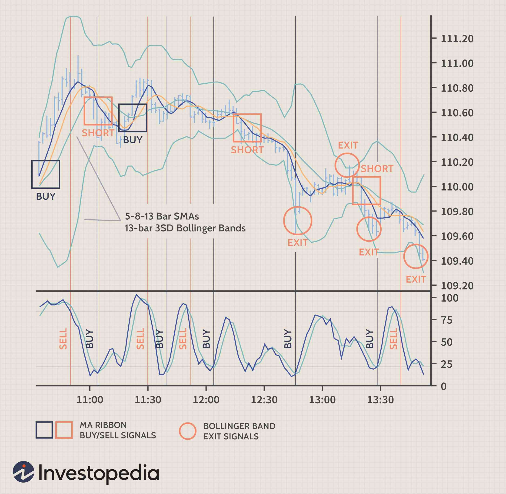

Trading indicators, day trading, scalping, and algorithmic trading are instrumental components in today's fast-paced trading environment, each contributing unique advantages and utilities for traders. Trading indicators are mathematical calculations based on the price, volume, or open interest of a security. They serve as tools that help traders analyze price movements and predict future market behavior, enhancing their decision-making capabilities. Commonly used indicators include Moving Averages, Relative Strength Index (RSI), and Bollinger Bands, which allow traders to identify trends, measure momentum, and assess volatility.

Day trading, characterized by the buying and selling of financial instruments within the same trading day, requires rapid decision-making and acute analysis of market trends. This strategy often relies on trading indicators to inform entry and exit points, offering opportunities for profit in fluctuating markets without holding any positions overnight. Scalping takes day trading a step further by focusing on profiting from small price changes, requiring the use of precise trading indicators for capturing minimal market movements in brief periods.



Algorithmic trading has revolutionized traditional trading methods by leveraging computer algorithms to execute trades at speeds impossible for human traders. This evolution is fueled by advances in technology and data analytics, making high-frequency trading strategies and comprehensive data analysis more accessible. Algorithms can integrate trading indicators to execute trades based on predefined criteria, making trading more efficient and devoid of emotional bias.

The rise of technology within trading has transformed traditional practices profoundly. Powerful computing capabilities and sophisticated software have equipped traders with tools that process vast amounts of data rapidly, enabling them to capitalize on market opportunities with speed and precision. The integration of technology has opened new horizons in financial markets, including automated trading systems and complex quantitative models.

This article aims to explore various trading strategies and the indicators that aid these strategic decisions. The sections will address the definitions and roles of trading indicators, the specifics of day trading, the nuances of scalping techniques, and the advancements brought about by algorithmic trading. Additionally, a comparison of these trading strategies will be presented to provide a comprehensive understanding, ultimately guiding traders in selecting the right indicators for their specific strategy to maximize effectiveness and achieve their individual trading goals.

## Table of Contents

## Understanding Trading Indicators

Trading indicators are essential analytical tools that help traders evaluate and interpret price movements within financial markets. These tools, derived from statistical formulas, provide insights into potential future market behavior by examining past data, primarily price and volume.

Indicators fall into four primary categories: trend, [momentum](/wiki/momentum), [volatility](/wiki/volatility-trading-strategies), and [volume](/wiki/volume-trading-strategy) indicators. Each category serves distinct purposes and combines to provide a comprehensive market overview.

**Trend indicators** help traders determine the direction of the market. They smooth out price data to highlight the underlying trend, rather than the noise of short-term fluctuations. Moving Averages (MAs) are among the most commonly used trend indicators, providing a smoothed representation of market direction over a specified period. For instance, the Simple Moving Average (SMA) is defined as:

$$
\text{SMA} = \frac{P_1 + P_2 + ... + P_n}{n}
$$

where $P$ represents the price at each time period and $n$ is the number of periods.

**Momentum indicators** measure the speed of price movements, providing insights into the strength of a price trend. The Relative Strength Index (RSI) is a widely recognized momentum indicator. The RSI oscillates between 0 and 100, identifying overbought or oversold conditions, typically with threshold levels of 70 and 30 respectively:

$$
\text{RSI} = 100 - \left( \frac{100}{1 + \frac{\text{Average Gain}}{\text{Average Loss}}} \right)
$$

**Volatility indicators** assess the rate of price fluctuations, reflecting the degree of uncertainty or risk in price changes. Bollinger Bands are a popular choice, consisting of a moving average line with additional lines above and below representing standard deviations, creating a dynamic range. These bands expand and contract with price volatility.

**Volume indicators** provide insights into the strength of a price move based on trading volume. They verify price trends and potential reversals by examining the relationship between price movement and volume. An example is the Volume Weighted Average Price (VWAP), which calculates the average price a security has traded at throughout the day, based on both volume and price.

Trading indicators are vital for informed decision-making, helping traders identify potential entry and [exit](/wiki/exit-strategy) points, confirm trends, and gauge market sentiment. By integrating different indicators, traders can cross-verify signals and reduce the likelihood of false readings. Recognizing the strengths and limitations of each indicator enables investors to craft more strategic trading plans, enhancing their ability to predict price movements effectively.

## Day Trading: An Overview

Day trading is a form of trading in which financial instruments such as stocks, currencies, or commodities are bought and sold within the same trading day. The primary characteristic that sets [day trading](/wiki/day-trading-spy) apart from other trading strategies, such as swing trading or long-term investing, is the completion of all transactions by the end of the trading day, thereby avoiding overnight positions and the associated risks.

To succeed in day trading, practitioners need a blend of skills and a specific mindset. Key skills include analytical thinking, discipline, and a comprehensive understanding of financial markets. The ability to remain focused and maintain emotional neutral stability amidst rapid market fluctuations is critical. An effective day trader must also master technical analysis and have the capacity to interpret a multitude of trading indicators quickly.

Speed and information are cornerstones of effective day trading. The fast-paced nature of the market necessitates rapid decision-making capabilities, often aided by high-speed internet and sophisticated trading platforms. These platforms enable the use of trading indicators, which are mathematical calculations based on the price, volume, or open interest of a security. Indicators such as Moving Averages and the Moving Average Convergence Divergence (MACD) assist traders in identifying potential buying or selling opportunities by signaling trends and potential reversals.

Day trading offers both risks and rewards. The potential for substantial profit is a robust lure; however, the risks are equally significant due to high market volatility and leverage use. Factors such as economic news releases and sudden market shifts can result in drastic price movements. Effective risk management strategies, such as setting stop-loss orders and restraining the amount of capital risked on a single trade, are integral to mitigate losses.

In conclusion, while day trading can be highly rewarding, it requires a disciplined approach, keen understanding of the markets, and effective use of technical indicators. Traders must remain vigilant, continually improve their strategies, and strictly adhere to their risk management protocols to thrive in this demanding trading environment.

## Scalping Strategies with Trading Indicators

Scalping is a high-frequency short-term trading strategy aimed at profiting from small price fluctuations within highly liquid markets. Traders who engage in [scalping](/wiki/gamma-scalping), known as scalpers, execute multiple trades throughout the day, often holding positions for mere seconds to minutes. The goal is to accumulate small gains that collectively amount to substantial profit over time. Scalping requires precision, discipline, and a solid understanding of market dynamics, with trading indicators playing a crucial role in identifying favorable entry and exit points.

Trading indicators are essential tools for scalpers as they assist in gauging price movements within volatile markets. By analyzing historical and real-time market data, these indicators help traders make informed decisions. For scalping, the speed and accuracy of indicators are paramount since traders must react quickly to short-term market movements.

Several strategies are popular among scalpers, often involving the use of specific indicators that cater to their need for rapid decision-making. One such technique is using momentum indicators to detect overbought or oversold conditions, allowing traders to anticipate potential price reversals. In this context, the Stochastic Oscillator is frequently employed. It compares a particular closing price of a security to a range of its prices over a certain period, providing insights on potential market turning points. The formula for the Stochastic Oscillator is:

$$
\text{Stochastic \%K} = \frac{\text{Current Close} - \text{Lowest Low}}{\text{Highest High} - \text{Lowest Low}} \times 100
$$

Additionally, Volume-Weighted Average Price (VWAP) is another vital indicator for scalpers. VWAP represents the average price a security has traded throughout the day, based on both volume and price. It provides traders with a benchmark to gauge intraday price trends and assess the strength and direction of current movements. Traders often enter buy positions when the price is below the VWAP and sell when above, believing that an asset will return to its average price.

Another popular scalping strategy involves using moving averages to identify trend continuations or reversals. Moving averages smooth out price data, creating a single flowing line that can help detect emerging trends. A common method involves the use of crossover strategies, such as when a short-term moving average crosses above a long-term moving average, signaling a buy opportunity, or vice versa for selling.

A combination of indicators is often employed to enhance decision-making. For example, scalpers might use VWAP in tandem with momentum indicators like the Relative Strength Index (RSI) to confirm market conditions and reduce false signals. Successful scalping hinges on the trader's ability to process various signals quickly and efficiently, with computers and algorithms often playing an integral role in this process.

In conclusion, scalping strategies leverage trading indicators to capitalize on fleeting market opportunities. The use of indicators such as Stochastics and VWAP is critical for successfully identifying and exploiting these opportunities, allowing scalpers to achieve consistent, albeit small, profits through a thorough understanding of market behavior and effective risk management.

## Algorithmic Trading: Integrating Indicators

Algorithmic trading, also known as algo trading, involves the use of computer algorithms to execute trading orders based on predefined criteria. It has gained substantial traction in recent years due to advancements in technology and the advent of big data. The goal of [algorithmic trading](/wiki/algorithmic-trading) is to leverage computational power to make trades faster and more efficiently than human traders can, often capitalizing on minute price discrepancies or market inefficiencies.

In algorithmic trading, traders automate their strategies by combining algorithms with various trading indicators. Indicators such as Moving Averages, Relative Strength Index (RSI), and Moving Average Convergence Divergence (MACD) serve as key components in decision-making processes by identifying trends, momentum, and price volatility. These indicators help in formulating rules that the algorithm can follow, thus executing trades without human intervention. For example, a basic algorithm could be triggered to execute a buy order when an asset's 50-day moving average crosses above its 200-day moving average—this is known as a "golden cross," a common bullish indicator.

The benefits of algorithmic trading are numerous. Most prominently, it offers unparalleled speed and efficiency, enabling transactions to be executed in fractions of a second. This high speed allows traders to exploit temporary market conditions that may last only moments. Additionally, because the trades are executed based on objective criteria and pre-set rules, algo trading is free from emotional biases that can cloud judgment and lead to suboptimal decisions. This emotion-free trading environment often leads to more consistent performance over the long term.

Several examples illustrate the use of algorithms in conjunction with trading indicators. Pair trading algorithms utilize statistical [arbitrage](/wiki/arbitrage) methods with the help of indicators to identify correlated instruments and execute trades when their price relationships deviate. Another popular approach is trend-following algorithms, which rely on technical indicators like Moving Averages or MACD to identify and trade along prevailing market trends.

In Python, implementing a simple moving average crossover strategy could look like this:

```python
import pandas as pd
import numpy as np

# Load your data
data = pd.read_csv('market_data.csv')

# Calculate moving averages
data['50_MA'] = data['Close'].rolling(window=50).mean()
data['200_MA'] = data['Close'].rolling(window=200).mean()

# Generate signals
data['Signal'] = np.where(data['50_MA'] > data['200_MA'], 1, -1)

# Execute trades based on signals
for index, row in data.iterrows():
    if row['Signal'] == 1:
        # Execute buy order
        print(f"Buy: {row['Close']} on {row['Date']}")
    elif row['Signal'] == -1:
        # Execute sell order
        print(f"Sell: {row['Close']} on {row['Date']}")
```

In conclusion, algorithmic trading represents a paradigm shift in financial markets, offering speed, precision, and a systematic approach to trading. By incorporating trading indicators within algorithms, traders can optimize their strategies and potentially improve their performance across diverse market conditions. The continuous evolution of computational technologies will likely further enhance the capabilities and reach of algorithmic trading in the future.

## Comparison of Trading Strategies

Day trading, scalping, and algorithmic trading represent three distinctive trading strategies, each with varying levels of risk, reward, and complexity. Understanding how these strategies compare and perform under different market conditions is crucial for traders seeking to tailor their approach to their individual goals and market knowledge.

Day trading involves executing a large volume of trades within a single day to take advantage of small price movements. This strategy is characterized by its high complexity and significant risk due to the rapid decision-making required. The reward, however, can be substantial for skilled traders who can navigate the volatile intraday market movements effectively. Day trading performs optimally in highly liquid markets where ample price fluctuations provide numerous opportunities for entry and exit. The integration of trading indicators such as Moving Averages and Relative Strength Index (RSI) facilitates better timing of trades and risk management.

Scalping, as an even shorter-term trading strategy, focuses on capitalizing on small price changes, often holding positions for mere seconds or minutes. The complexity of scalping lies in its execution speed and the necessity for precise entry and exit points, often using indicators like Stochastics and Volume Weighted Average Price (VWAP). Despite the challenges, scalping can yield consistent, albeit smaller, rewards that accumulate over time. Scalping strategies tend to perform well in stable yet liquid markets where price movements are predictable. The adaptability of scalping is enhanced by the use of algorithmic systems that can execute trades at high speed, reducing the emotional strain on traders.

Algorithmic trading leverages computer algorithms to automate trading strategies, offering a less emotionally taxing approach compared to manual trading. The use of algorithms with trading indicators such as MACD or Bollinger Bands can optimize strategy execution speed and efficiency. Algorithmic trading is complex due to the programming and testing involved but can yield significant rewards through high-frequency trading ([HFT](/wiki/high-frequency-trading-strategies)) practices and large-volume trades across various market conditions. It performs well in both volatile and stable markets, provided that the algorithm is designed to adapt to changing conditions dynamically.

When choosing a trading strategy, it is essential to consider individual goals, risk tolerance, and market expertise. Beginners may gravitate towards simpler, less risky strategies like scalping, while experienced traders might exploit the potential of day trading and algorithmic trading. Combining multiple indicators can enhance these strategies by providing additional confirmation signals and reducing false positives. Ensuring strategy adaptability through regular [backtesting](/wiki/backtesting) and refinement is key to long-term success in the ever-evolving financial markets.

## Choosing the Right Indicators for Your Strategy

Selecting the appropriate trading indicators depends significantly on the chosen trading strategy and the trader's level of experience. For beginners, it is usually advisable to start with a few simple indicators, which can provide clear signals without overwhelming complexity. Common selections include moving averages and the Relative Strength Index (RSI). A Moving Average is a lagging indicator that smooths price data to identify the direction of the trend. RSI, a momentum oscillator, measures the speed and change of price movements, helping to identify overbought or oversold conditions.

Experienced traders might explore a combination of multiple indicators to capture a more holistic market view. For instance, combining moving averages with the Moving Average Convergence Divergence (MACD) indicator can enhance the decision-making process. MACD, which involves components like the MACD line, the signal line, and a histogram, offers insights into trends' strength and potential changes.

Utilizing multiple indicators can provide a more comprehensive analysis, as they offer confirmation or divergence in trading signals. While an indicator like the Bollinger Bands analyzes volatility based on standard deviation, the Average True Range (ATR) may also be considered to quantify market volatility. A combination like this might help traders corroborate the adequacy of an entry or exit point.

Backtesting is crucial when combining indicators. It involves testing a strategy on historical data to evaluate its viability before applying it to live markets. Backtesting helps ensure the strategy is effective and provides confidence in real-time trading. This process can be done using various software tools and platforms, such as MetaTrader or Python libraries like Backtrader. 

Here's a simple example of backtesting using Python:

```python
import backtrader as bt

class MovingAverageStrategy(bt.Strategy):
    def __init__(self):
        self.sma = bt.indicators.SimpleMovingAverage(self.data.close, period=20)

    def next(self):
        if self.data.close > self.sma:
            self.buy(size=10)
        elif self.data.close < self.sma:
            self.sell(size=10)

cerebro = bt.Cerebro()
data = bt.feeds.YahooFinanceData(dataname='AAPL', fromdate=datetime(2020,1,1),
                                 todate=datetime(2021,1,1))
cerebro.adddata(data)
cerebro.addstrategy(MovingAverageStrategy)
cerebro.run()
```

This code outlines a basic strategy using a Simple Moving Average to generate buy and sell signals, demonstrating how backtesting can be implemented using historical data.

For beginners, starting with less complex strategies and backtesting methods ensures they understand the underlying principles before moving to advanced techniques. Conversely, experienced traders can delve into strategies that integrate various indicators, balancing simplicity with robust analytics to refine entry and exit strategies, thereby enhancing trading effectiveness.

## Conclusion

In summary, the article explored the crucial role of trading indicators in various trading strategies, including day trading, scalping, and algorithmic trading. Trading indicators, such as Moving Averages, RSI, MACD, and Bollinger Bands, offer valuable insights into price movements, helping traders make informed decisions. The diverse strategies discussed each benefit from these indicators, enabling more precise entry and exit points, efficient risk management, and enhanced adaptability to different market conditions.

The evolving nature of financial markets underscores the importance of continual learning and adaptation. Traders must stay abreast of technological advancements and market dynamics to refine their strategies and ensure long-term success. Regularly updating their knowledge base equips traders to leverage the full potential of indicators, adapting strategies to their unique financial goals and risk tolerances.

Ultimately, the effectiveness of a trading strategy hinges on its alignment with individual objectives, risk profiles, and market understanding. By selecting the right indicators and continuously refining their approach, traders can develop robust strategies that respond to both market nuances and their personal trading aspirations. The article emphasizes the synergy between well-chosen indicators and thoughtful strategy implementation as a pathway to achieving trading success.

## References & Further Reading

[1]: Bergstra, J., Bardenet, R., Bengio, Y., & Kégl, B. (2011). ["Algorithms for Hyper-Parameter Optimization."](https://papers.nips.cc/paper/4443-algorithms-for-hyper-parameter-optimization) Advances in Neural Information Processing Systems 24.

[2]: ["Advances in Financial Machine Learning"](https://www.amazon.com/Advances-Financial-Machine-Learning-Marcos/dp/1119482089) by Marcos Lopez de Prado

[3]: ["Evidence-Based Technical Analysis: Applying the Scientific Method and Statistical Inference to Trading Signals"](https://www.amazon.com/Evidence-Based-Technical-Analysis-Scientific-Statistical/dp/0470008741) by David Aronson

[4]: ["Machine Learning for Algorithmic Trading"](https://github.com/stefan-jansen/machine-learning-for-trading) by Stefan Jansen

[5]: ["Quantitative Trading: How to Build Your Own Algorithmic Trading Business"](https://www.amazon.com/Quantitative-Trading-Build-Algorithmic-Business/dp/1119800064) by Ernest P. Chan