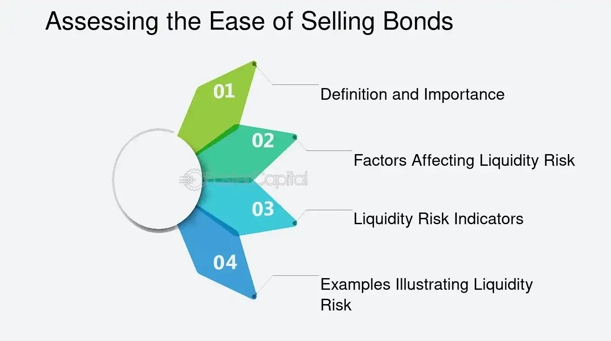

## Table of Contents

## What are bonds and why do people invest in them?

Bonds are like IOUs that governments or companies give to people who lend them money. When you buy a bond, you are lending money to the issuer, and in return, they promise to pay you back the amount you lent, plus some extra money called interest, over a certain period of time. Bonds are seen as a safer investment compared to stocks because they usually have a fixed interest rate and a set date when you get your money back.

People invest in bonds for a few main reasons. First, they want a steady income. The interest payments from bonds can provide a regular, predictable source of money, which is especially appealing to retirees or anyone looking for a stable income. Second, bonds can help balance out the risk in an investment portfolio. Since bonds are generally less risky than stocks, they can help protect your money if the stock market goes down. Overall, bonds are a way to grow your money safely and steadily over time.

## What does it mean to sell a bond before its maturity date?

Selling a bond before its maturity date means you are getting your money back from the bond before the date when the issuer promised to pay you back. When you sell a bond early, you sell it to someone else who then takes over the bond and gets the future interest payments and the final payment at maturity. The price you get for the bond can be different from what you paid for it, depending on things like interest rates and how much time is left until the bond matures.

If interest rates have gone up since you bought the bond, the price of your bond might go down because new bonds are being issued with higher interest rates, making your bond less attractive to buyers. On the other hand, if interest rates have gone down, your bond might be worth more because it has a higher [interest rate](/wiki/interest-rate-trading-strategies) than new bonds being issued. So, selling a bond before its maturity date can be a good or bad decision depending on the current market conditions and your need for the money.

## What are the basic indicators that suggest it might be time to sell a bond?

One basic indicator that it might be time to sell a bond is if interest rates are going up. When interest rates rise, new bonds are issued with higher interest rates, making your older bond less attractive to other investors. This means the price of your bond might go down if you try to sell it. If you think interest rates will keep going up, selling your bond now could be a good idea before its value drops even more.

Another indicator is if you need the money for something important. If you suddenly need cash for an emergency or a big purchase, selling your bond early can give you the money you need. Just remember, you might not get back all the money you put in if you sell before the bond matures, especially if the bond's price has gone down.

Lastly, if the issuer of the bond is having financial trouble, that's a sign to sell. If a company or government is struggling to pay its debts, there's a risk they might not be able to pay you back when the bond matures. Selling the bond before things get worse can help you avoid losing your investment.

## How does interest rate movement affect the decision to sell bonds?

When interest rates go up, it usually means it's a good time to think about selling your bonds. This is because new bonds that are issued will have higher interest rates, making your old bond less attractive to other people who might want to buy it. If you try to sell your bond when interest rates are higher, you might have to sell it for less money than what you paid for it. So, if you think interest rates will keep going up, selling your bond now could be a smart move before its value drops even more.

On the other hand, if interest rates are going down, you might want to hold onto your bond instead of selling it. When interest rates drop, your bond becomes more valuable because it has a higher interest rate than the new bonds being issued. If you sell your bond at this time, you could get more money than what you originally paid for it. But if you don't need the money right away, keeping the bond until it matures could be better because you'll keep getting the higher interest payments.

## What role does credit rating play in deciding to sell a bond?

Credit rating is like a report card for the company or government that issued the bond. It tells you how likely they are to pay back the money they borrowed from you. If the credit rating of the bond issuer goes down, it means there's a higher chance they might not be able to pay you back. This can make your bond less valuable because other people might not want to buy it. If you see the credit rating dropping, it might be a good time to sell your bond before it loses even more value.

On the other hand, if the credit rating goes up, it means the issuer is doing better and is more likely to pay you back. This can make your bond more valuable because more people will want to buy it. In this case, you might not need to sell your bond right away, especially if you're happy with the interest payments you're getting. But if you think the credit rating might keep going up, selling the bond now could let you make a profit from the increased value.

## How can changes in inflation rates influence the decision to sell bonds?

When inflation rates go up, it can make bonds less attractive to hold onto. Inflation means that the value of money goes down over time, so the interest you get from your bond might not be worth as much in the future. If you think inflation will keep going up, selling your bond now could be a good idea. That way, you can use the money to buy things before they get more expensive, or invest in something else that might do better in a high-inflation environment.

On the other hand, if inflation rates are going down, it might be better to keep your bond. When inflation is low, the interest you get from your bond will be worth more over time. This makes your bond more valuable because the money you get back will have more buying power. So, if you see inflation rates dropping, you might want to hold onto your bond and keep getting those interest payments, rather than selling it and losing out on that steady income.

## What are yield curve indicators and how do they impact bond selling decisions?

Yield curve indicators show how the interest rates on bonds change depending on how long the bonds last. A normal yield curve goes up, meaning longer-term bonds have higher interest rates than shorter-term ones. But sometimes, the yield curve can get flat or even turn upside down, which is called an inverted yield curve. These changes can tell you a lot about what might happen to the economy and help you decide if it's a good time to sell your bonds.

When the yield curve starts to flatten or invert, it might mean that people think the economy is going to slow down or even go into a recession. If you see this happening, it could be a good time to sell your longer-term bonds. That's because if interest rates go down in the future (which often happens during a recession), the price of your bonds might go up. Selling your bonds before this happens could mean you miss out on making some extra money. But if you need cash soon or you're worried about the economy, selling your bonds when the yield curve changes can help you play it safe.

## How do market liquidity conditions affect the timing of selling bonds?

Market [liquidity](/wiki/liquidity-risk-premium) means how easy it is to buy or sell something without changing its price too much. When the market is very liquid, you can sell your bonds quickly and easily, at a price close to what you expect. If you see that the market is very liquid, it might be a good time to sell your bonds because you can get your money out fast without losing much value. This is helpful if you need cash right away or if you think the bond's price might go down soon.

On the other hand, if the market is not very liquid, it can be hard to sell your bonds. You might have to wait a long time to find a buyer, or you might have to sell your bonds for less money than you wanted. If you see that the market is not very liquid, you might want to wait before selling your bonds. Waiting for better market conditions could mean you get a better price for your bonds and don't lose as much money. So, checking the market's liquidity can help you decide the best time to sell your bonds.

## What advanced financial models can be used to determine the optimal time to sell bonds?

One advanced financial model that can help decide when to sell bonds is the Duration and Convexity Model. This model looks at how sensitive your bond's price is to changes in interest rates. Duration tells you how much the bond's price will change for a small change in interest rates. If the duration is high, even a small rise in interest rates can make the bond's price drop a lot. Convexity adds more detail by showing how the bond's price reacts to big changes in interest rates. Using this model, you can figure out the best time to sell your bond based on what you think will happen to interest rates.

Another model is the Yield to Maturity (YTM) Model. This model calculates the total return you would get if you held the bond until it matures. It takes into account the bond's current price, its face value, the interest payments you'll get, and how long until the bond matures. By comparing the YTM of your bond to the YTM of other bonds or investments, you can decide if selling your bond now and buying something else might give you a better return. If the YTM of your bond is lower than other options, it might be a good time to sell.

A third model to consider is the Binomial Interest Rate Tree Model. This model helps you predict how interest rates might change in the future and how those changes will affect your bond's price. It creates a tree of possible interest rate paths and calculates the bond's value for each path. By looking at all these possible futures, you can see if selling your bond now would be better than waiting. This model is especially useful if you think the market might be very unpredictable.

## How do macroeconomic indicators, like GDP growth, influence bond selling strategies?

Macroeconomic indicators like GDP growth can tell you a lot about the economy and help you decide if it's a good time to sell your bonds. When GDP growth is strong, it usually means the economy is doing well. This can make interest rates go up because the government might raise rates to keep inflation in check. If interest rates go up, the price of your bonds might go down because new bonds will have higher interest rates. So, if you see strong GDP growth, you might want to sell your bonds before their value drops.

On the other hand, if GDP growth is slowing down or even shrinking, it might mean the economy is heading into a recession. During a recession, interest rates often go down as the government tries to help the economy recover. Lower interest rates can make your bonds more valuable because they have higher interest rates than new bonds being issued. If you think a recession is coming, holding onto your bonds might be a better strategy than selling them. But if you need cash soon or are worried about the economy, selling your bonds before things get worse can help you avoid losing money.

## What are the tax implications of selling bonds and how should they factor into the decision?

When you sell a bond, you need to think about taxes because they can affect how much money you actually get to keep. If you sell your bond for more money than you paid for it, you might have to pay capital gains tax on the profit. The tax rate depends on how long you held the bond. If you held it for less than a year, you'll pay a higher short-term capital gains tax rate. If you held it for more than a year, you'll pay a lower long-term capital gains tax rate. Also, the interest you earned from the bond while you owned it is usually taxed as regular income, which can be at a higher rate than capital gains.

Taxes can make a big difference in whether selling your bond is a good idea. If you think you'll have to pay a lot in taxes, it might be better to hold onto the bond until it matures, especially if the tax on the interest is less than the tax on the profit from selling it early. But if you need the money now or think the bond's value will go down, selling it might still be worth it, even after taxes. Always think about how taxes will affect your decision so you can make the best choice for your money.

## How can portfolio rebalancing strategies guide the decision to sell bonds?

Portfolio rebalancing means adjusting your investments to keep them in line with your goals and how much risk you want to take. If you have a plan to keep a certain mix of stocks and bonds, and the value of your stocks goes up a lot, you might have too many stocks and not enough bonds. To fix this, you might need to sell some of your bonds to buy more stocks or other investments. This helps you keep the right balance and not take on too much risk. So, if your portfolio is out of balance, selling bonds can be a good way to get it back on track.

On the other hand, if the value of your bonds goes up a lot and you now have too many bonds compared to stocks, you might want to sell some bonds to buy more stocks. This keeps your investments spread out the way you want. Also, if you're getting close to a big goal, like retirement, you might want to sell riskier bonds and buy safer ones to protect your money. By thinking about your overall investment plan and making sure it stays balanced, you can decide when it's a good time to sell your bonds.

## References & Further Reading

[1]: Bergstra, J., Bardenet, R., Bengio, Y., & Kégl, B. (2011). ["Algorithms for Hyper-Parameter Optimization."](https://proceedings.neurips.cc/paper/2011/file/86e8f7ab32cfd12577bc2619bc635690-Paper.pdf) Advances in Neural Information Processing Systems 24.

[2]: ["Advances in Financial Machine Learning"](https://www.amazon.com/Advances-Financial-Machine-Learning-Marcos/dp/1119482089) by Marcos Lopez de Prado

[3]: ["Evidence-Based Technical Analysis: Applying the Scientific Method and Statistical Inference to Trading Signals"](https://www.amazon.com/Evidence-Based-Technical-Analysis-Scientific-Statistical/dp/0470008741) by David Aronson

[4]: ["Machine Learning for Algorithmic Trading"](https://github.com/PacktPublishing/Machine-Learning-for-Algorithmic-Trading-Second-Edition) by Stefan Jansen

[5]: ["Quantitative Trading: How to Build Your Own Algorithmic Trading Business"](https://www.amazon.com/Quantitative-Trading-Build-Algorithmic-Business/dp/1119800064) by Ernest P. Chan