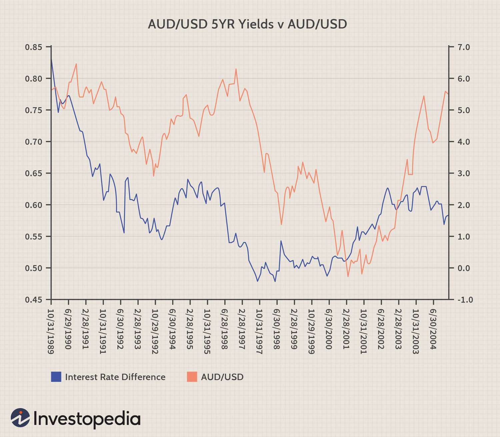

Investing in bonds has consistently been regarded as a stable and reliable option by many investors, primarily due to their fixed income and lower risk compared to stocks. Bonds represent loans made to entities such as governments and corporations, which promise to return the principal amount along with regular interest payments over time. This structured return format offers a sense of predictability and security for investors seeking steady income streams, thereby making bonds an attractive investment choice.

Simultaneously, the advent of algorithmic trading, often referred to as 'algo trading', has dramatically transformed the landscape of financial markets. Through the utilization of sophisticated mathematical models and high-frequency trade execution, algorithmic trading systems are capable of processing vast quantities of data rapidly, taking advantage of market inefficiencies that might be elusive to human traders. These systems employ a variety of strategies, such as trend analysis and arbitrage, to optimize trading decisions and maximize returns.

This article aims to provide insights into the intersection of bond investments and algorithmic trading, highlighting the unique opportunities and challenges that arise from their integration. By examining the foundational principles underlying bond investments alongside the mechanics of algorithmic trading, investors can cultivate a deeper understanding of how these elements can be combined to enhance portfolio performance and inform decision-making.

In an era where technology continues to reshape the financial landscape, understanding the interplay between traditional and modern investment practices is crucial. As bonds provide stability, and algorithmic trading offers precision and speed, the convergence of these domains presents a significant opportunity for investors to craft strategies that harness both predictability and innovation. Through informed decision-making and strategic portfolio management, investors stand to gain substantial growth potential, provided they remain adaptive to ongoing advancements in the market.

## Table of Contents

## Understanding Bonds: A Traditional Investment Vehicle

Bonds are fundamental instruments in financial markets, representing a debt security where an investor loans money to an entity, typically a government or corporation, under the agreement that the principal amount will be repaid at a later date, usually with periodic interest payments. This makes bonds a foundational element of investment portfolios, known for their comparative stability and predictable income generated through these interest payments, also referred to as coupon payments.

### Types of Bonds

There are several primary types of bonds, each exhibiting unique characteristics concerning risk and return:

1. **Government Bonds**: Issued by national governments, these bonds are generally considered low-risk due to the perceived reliability of government repayment. In the United States, these include Treasury bonds (T-bonds), Treasury notes (T-notes), and Treasury bills (T-bills), which vary in their maturity periods and interest payment structures. 

2. **Municipal Bonds**: Issued by local governments or municipalities, these bonds are often used to finance public projects such as infrastructure improvements or schools. Municipal bonds can offer tax advantages, as their interest payments may be exempt from federal and sometimes state taxes.

3. **Corporate Bonds**: Issued by corporations to fund business expansion or operations, these bonds typically carry higher risk compared to government bonds, reflecting the creditworthiness of the issuing company. As a result, they often offer higher yields to compensate for the increased risk.

### Factors Influencing Bond Prices

The pricing of bonds in the market is influenced by several key factors:

- **Interest Rates**: The inverse relationship between bond prices and interest rates is a principal concept in bond investing. When interest rates rise, existing bonds with lower coupon rates become less attractive, driving their prices down, and vice versa.

- **Inflation**: Inflation erodes the purchasing power of a bond's future cash flows. If inflation is expected to increase, bond prices typically decrease as the real value of the interest payments declines.

- **Issuer's Creditworthiness**: The perceived ability of the bond issuer to meet its debt obligations is critical. A decrease in creditworthiness increases the risk of default, reducing bond prices as investors demand a risk premium.

### Stability and Income

Investors often turn to bonds seeking stability and predictable income, making them a pillar of conservative investment strategies. Their relative safety compared to stocks lies in the set schedule of interest payments and the obligation of the issuer to repay the principal. However, investing in bonds requires careful consideration of the factors affecting bond prices to optimize their role within a diversified portfolio. Understanding these aspects of bond investing allows investors to manage risk effectively while capitalizing on the steady income stream bonds provide.

## The Rise of Algorithmic Trading in Finance

Algorithmic trading, often referred to as "algo trading," is the process of using computer algorithms to execute trades based on pre-set criteria. This approach has transformed the financial markets, providing a host of advantages, including enhanced speed and precision, and the capacity to analyze and act upon large volumes of data in real time.

The primary benefit of [algorithmic trading](/wiki/algorithmic-trading) is its speed. Computers can observe market conditions and execute trades much faster than a human trader could. This capability allows investors to take advantage of fleeting opportunities and price discrepancies that would be otherwise missed. For instance, while a human trader might take several seconds to recognize and act on a price change, an algorithm can accomplish this task in milliseconds.

Accuracy is another significant advantage of algo trading. By minimizing human intervention, algorithmic trading reduces the likelihood of errors associated with manual trading. Algorithms follow predetermined rules and criteria, ensuring that trades are executed consistently and precisely, thereby reducing the impact of human emotions or distractions.

Algo trading supports a variety of sophisticated strategies. Statistical [arbitrage](/wiki/arbitrage), for example, involves algorithms that exploit price inefficiencies between related securities. Trend following strategies benefit from algorithms that identify and leverage sustained movements in market prices. Market making, another common strategy, involves algorithms providing [liquidity](/wiki/liquidity-risk-premium) to the market by quoting both a buy and a sell price.

Despite its numerous advantages, algorithmic trading is not without risks. Computational models and algorithms are subject to system failures, such as power outages or software bugs, which can lead to significant losses. Moreover, the reliance on algorithms can lead to increased market [volatility](/wiki/volatility-trading-strategies). The "flash crash" of May 6, 2010, is a famous example, where rapidly executed algorithmic trades contributed to a dramatic drop in U.S. stock market indices within minutes.

In conclusion, algorithmic trading has carved out a pivotal role in modern financial markets. Its ability to offer speed, accuracy, and the potential for strategic complexity makes it an attractive option for investors. However, it also demands careful risk management and an understanding of the underlying technological infrastructure to mitigate potential pitfalls. As technology progresses, the role and impact of algorithmic trading are likely to evolve further, shaping the future dynamics of financial markets.

## Integrating Bonds with Algorithmic Trading Strategies

The bond market, typically characterized by its relative stability compared to equities, presents distinct challenges when integrated with algorithmic trading strategies. Algorithms employed in trading bonds require a nuanced understanding of market dynamics and must account for variables such as [interest rate](/wiki/interest-rate-trading-strategies) trends, credit ratings, and economic indicators.

### Algorithm Design for Bond Trading
Algorithms for bond trading can be specifically designed to analyze interest rate movements. Since bond prices inversely relate to interest rates, predicting rate changes can significantly impact trading decisions. For instance, should an algorithm identify an impending interest rate hike, it might recommend selling off bonds to avoid potential depreciation.

Moreover, credit ratings are integral to bond valuation. Algorithms can be programmed to monitor real-time updates on issuers' creditworthiness, automatically adjusting holdings based on deteriorating or improving credit scenarios. Economic indicators, such as inflation rates or Gross Domestic Product (GDP) growth, also inform these algorithms, assisting in forecasting future bond performance.

### Identifying Mispriced Bonds
Through algorithmic integration, investors can better identify mispriced bonds. Algorithms can scan market data to spot anomalies between a bond's current market price and its intrinsic value calculated based on yield, maturity, and coupon rates. This capability allows investors to capitalize on arbitrage opportunities, purchasing undervalued bonds before the market corrects itself.

### Combining Strategies for Success
Successful algorithmic trading strategies for bonds often employ a combination of [fundamental analysis](/wiki/fundamental-analysis) and high-frequency trading techniques. Fundamental analysis involves evaluating financial statements, market conditions, and other macroeconomic factors to ascertain a bond's fair value. Meanwhile, high-frequency trading allows algorithms to process and act on this information swiftly, executing numerous transactions in mere seconds to optimize portfolio performance.

### Diversification and Risk Management
Incorporating bonds into algorithmic trading frameworks also supports diversification and risk management efforts. Bonds typically exhibit lower volatility than equities, providing a stabilizing effect within a broader trading strategy. By diversifying across asset classes, investors can mitigate systemic risk, ensuring that adverse developments in equity markets do not disproportionately affect the entire portfolio.

Overall, integrating bonds with algorithmic trading strategies requires careful consideration of various financial metrics and market conditions. However, with correctly optimized algorithms, investors can potentially enhance returns, manage risks, and maintain a well-balanced portfolio.

## Challenges and Risks of Algo Trading with Bonds

Algorithmic trading, while augmenting efficiency in bond markets, introduces a range of complexities that investors must navigate. These complexities arise from various factors such as market conditions, regulatory frameworks, and technical intricacies.

One of the primary challenges in algo trading with bonds is liquidity. Bond markets are typically less liquid than equity markets, meaning there are fewer buyers and sellers. This reduced liquidity can lead to significant price impacts from large trades and can complicate the execution of algorithms designed to capitalize on minute price discrepancies. In illiquid markets, the bid-ask spread tends to widen, which can erode potential profits from algorithmic strategies. Algorithms must be designed robustly to account for varying levels of liquidity and avoid scenarios where they exacerbate market imbalances.

Regulatory challenges also present significant hurdles. Global bond markets are subject to extensive regulatory oversight, with rules varying significantly across jurisdictions. These regulations are designed to protect investors and maintain market integrity, but they can also inhibit certain algorithmic strategies. For instance, regulations may limit the frequency or size of trades, impacting high-frequency trading models. Compliance with these laws is crucial, and algorithms must be continually updated to reflect any changes in regulatory requirements.

Risks associated with algorithmic errors also need careful management. These errors could stem from software bugs, incorrect data feeds, or flawed model assumptions. An algorithmic error in a bond trading strategy could result in unintended market impacts, such as executing trades at suboptimal prices or even triggering flash crashes. This highlights the necessity for rigorous testing and validation of algorithms before they are deployed in live markets, as well as ongoing monitoring to detect and remedy any anomalies promptly.

Balancing technological investments with expected returns is a critical consideration for investors in algorithmic bond trading. Developing sophisticated algorithms capable of navigating the complexities of bond markets requires substantial investment in technology and expertise. This financial and intellectual capital should only be committed if the expected returns justify the costs. Investors must evaluate whether the potential performance improvements and efficiencies achieved through algorithmic trading balance the operational risks and costs involved.

In conclusion, while algorithmic trading presents a promising frontier for bond markets, its adoption comes with distinct challenges and risks. Successful implementation demands a comprehensive understanding of market dynamics, a commitment to regulatory compliance, and an acute awareness of potential errors. Investors who effectively address these challenges can harness the power of algorithms to enhance their bond trading strategies.

## Future Trends: How Technology is Shaping Bond Markets

Advancements in technology are significantly transforming bond markets and algorithmic trading. These changes chiefly involve blockchain, [artificial intelligence](/wiki/ai-artificial-intelligence) (AI), [machine learning](/wiki/machine-learning), and cloud computing, each contributing to a more efficient and transparent market.

Blockchain technology, along with smart contracts, is being recognized for its potential to enhance transparency and efficiency in the bond market. Blockchain provides a decentralized ledger that facilitates secure and transparent transactions, potentially reducing fraud and increasing trust among investors. Smart contracts, self-executing contracts with terms directly written into code, can automate processes such as coupon payments and bond redemption, thus improving operational efficiency and reducing costs.

AI and machine learning are proving invaluable for predictive analytics and improved decision-making in bond markets. By analyzing vast amounts of data, these technologies can identify patterns and trends, offering insights into market behavior and aiding in the development of predictive models. For instance, machine learning algorithms can predict changes in interest rates or assess creditworthiness by analyzing economic indicators, thereby improving the accuracy of bond pricing and risk assessment.

The shift to cloud computing plays a critical role by enabling faster data processing and facilitating real-time trading capabilities. Cloud platforms can handle large volumes of data with high speed and reliability, allowing traders to execute decisions swiftly and efficiently. This is particularly advantageous in the competitive environment of algo trading, where milliseconds can impact profitability.

For investors in bond markets, staying informed about these technological trends is essential to harness their potential benefits. As technology continues to evolve, it is imperative for investors to adapt and integrate these innovations into their trading and investment strategies. By doing so, they can improve their decision-making processes, optimize their portfolios, and better manage risks associated with the dynamic financial markets.

## Conclusion

Bonds and algorithmic trading together present new opportunities in the financial markets. By understanding both, investors can create strategies that capture stability and leverage innovation. Bonds offer the safety of a relatively stable investment vehicle, while algorithmic trading adds the potential to optimize buying and selling practices through advanced technology. This combination allows for better risk management and potentially higher returns.

Adapting to the evolving financial landscape is crucial. Rapid advancements in technology continually transform trading methodologies, requiring investors to stay informed and flexible. Educational pursuits in both traditional financial theory and modern technological tools can be invaluable for success. 

As technology evolves, so too do the methods and strategies available to investors. Innovations like artificial intelligence and machine learning are becoming integral for analyzing market trends and predicting movements with greater accuracy. This accelerating technological growth can facilitate enhanced decision-making processes and portfolio diversification.

Investors willing to embrace change by investing in both knowledge and technology may discover significant potential for growth. By fostering a proactive approach to learning and integrating new tools, investors can harness the full spectrum of opportunities offered by the fusion of bonds and algorithmic trading. This dynamic landscape promises not only the preservation of wealth through bonds' stability but also the potential for growth via the strategic prowess of algorithmic trading.

## References & Further Reading

[1]: Bergstra, J., Bardenet, R., Bengio, Y., & Kégl, B. (2011). ["Algorithms for Hyper-Parameter Optimization."](https://proceedings.neurips.cc/paper/2011/file/86e8f7ab32cfd12577bc2619bc635690-Paper.pdf) Advances in Neural Information Processing Systems 24.

[2]: ["Advances in Financial Machine Learning"](https://www.amazon.com/Advances-Financial-Machine-Learning-Marcos/dp/1119482089) by Marcos Lopez de Prado

[3]: ["Evidence-Based Technical Analysis: Applying the Scientific Method and Statistical Inference to Trading Signals"](https://www.amazon.com/Evidence-Based-Technical-Analysis-Scientific-Statistical/dp/0470008741) by David Aronson

[4]: ["Machine Learning for Algorithmic Trading"](https://github.com/PacktPublishing/Machine-Learning-for-Algorithmic-Trading-Second-Edition) by Stefan Jansen

[5]: ["Quantitative Trading: How to Build Your Own Algorithmic Trading Business"](https://www.amazon.com/Quantitative-Trading-Build-Algorithmic-Business/dp/1119800064) by Ernest P. Chan