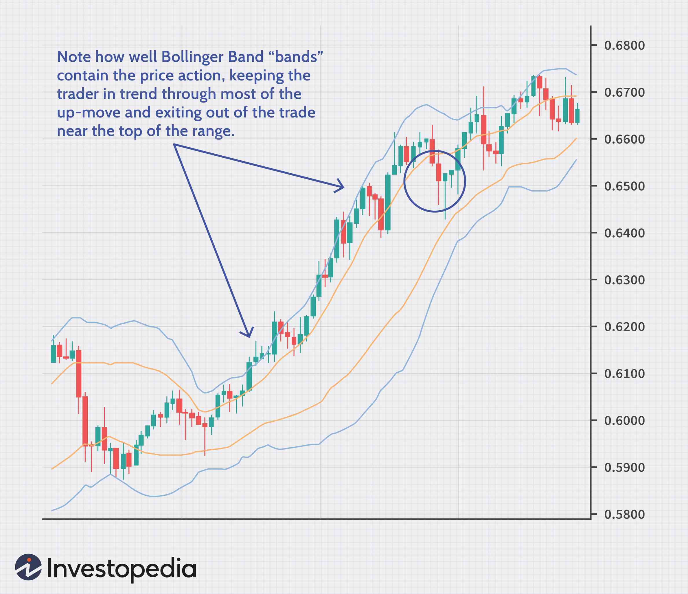

In today's dynamic financial landscape, investors have a myriad of options to consider when managing their portfolios. This article examines some key selling tips and investment strategies related to mutual funds and algorithmic trading. By understanding these facets, investors can make more informed decisions that align with their financial goals. The focus is on recognizing when to sell mutual funds, identifying effective investment strategies, and understanding the role of algorithmic trading. Selling mutual funds at the right time can maximize returns or minimize losses, while strategic rebalancing of a portfolio ensures it aligns with investment goals. Understanding algorithmic trading, which executes trades based on predefined strategies using computer programs, further allows investors to leverage technology for efficient market analysis. By combining sound mutual fund strategies with innovative trading techniques, investors can enhance their portfolio’s performance, leading to more pragmatic financial decisions.

## Table of Contents



## Understanding Mutual Funds

Mutual funds are investment vehicles that pool money from various investors to purchase a diversified portfolio of stocks, bonds, and other financial instruments. These funds are managed by professional fund managers who allocate the fund's assets in alignment with its investment objectives. The principle advantage of mutual funds is diversification, which aims to reduce risk by investing across a wide array of asset classes. This diversification mitigates the impact of volatility and market downturns on the portfolio by spreading risk.

Investing in mutual funds differs significantly from purchasing individual stocks. While individual stock purchases concentrate investment in specific companies, mutual funds encompass a wider variety of securities within a single investment package. This distinction supports risk management, as poor performance in a single security within the fund may be offset by gains in others.

Market trends can greatly impact the performance of mutual funds. Economic conditions, interest rates, and inflation are some factors that influence market trends, affecting the returns on mutual funds. For example, a high-interest-rate environment could impact bond fund prices negatively due to an inverse relationship between interest rates and bond prices. Conversely, equity funds might benefit from economic growth that increases corporate earnings.

Understanding the nuanced differences between mutual funds and direct stock investments is crucial for investors when constructing their portfolios. Mutual funds offer a hands-off approach with professional management, making them appealing for those who prefer not to engage in daily trading decisions. As market conditions fluctuate, mutual funds offer a strategic foundation by balancing the performance across diverse investments, assisting investors in meeting their financial goals.

## When to Sell a Mutual Fund

Recognizing the right time to sell a mutual fund is essential to maximize returns or minimize potential losses. Investors should consider several factors when making this decision.

Firstly, consistent underperformance of the mutual fund is a significant indicator that it may be time to sell. This involves comparing the fund's returns against its benchmark index or other similar funds over a defined period. Consistent underperformance suggests that the fund manager’s strategy might not be effective, urging a reassessment of the investment.

Another crucial [factor](/wiki/factor-investing) is a change in fund management or investment strategy. A new fund manager can bring a different approach, which might not align with the investor’s objectives. Likewise, if the fund’s investment strategy changes, it could alter the risk profile or goal of the fund. Investors should evaluate whether these changes fit their overall portfolio strategy.

Additionally, when a mutual fund grows too large, its flexibility in managing investments might diminish. A larger asset base can make it challenging to capitalize on market inefficiencies or to maintain the same level of performance as when the fund was smaller. This phenomenon is often referred to as "asset bloat".

Tax implications are also vital when deciding to sell. Selling a mutual fund can trigger capital gains taxes, particularly if the fund has appreciated significantly. Investors should assess their tax situation or consult with a tax advisor to understand the potential tax liabilities.

Back-end load fees are another consideration. Some mutual funds charge a fee when shares are sold within a specific timeframe. Understanding these fees is crucial, as they can reduce the net amount received from the sale.

In summary, the decision to sell a mutual fund should be based on a combination of performance metrics, managerial and strategic changes, fund size, tax considerations, and any associated fees. By considering these factors, investors can make informed decisions that align with their financial objectives.

## Investment Strategies for Mutual Funds

Rebalancing a portfolio is a crucial tactic to ensure alignment with an investor's goals, such as transitioning from growth-oriented funds to income-generating ones. This process involves periodically adjusting the fund allocations to maintain the desired asset mix. Over time, the performance of different assets can cause the portfolio to drift away from its target allocation. Rebalancing helps to mitigate risks and capitalize on favorable market conditions.

Investors often evaluate mutual funds against benchmarks or peer funds to decide whether to hold or sell. The benchmark is typically an index that matches the fund's investment style. For example, a large-cap equity fund might use the S&P 500 as a benchmark. Comparing fund performance to such benchmarks helps determine if a fund manager is delivering value over passive index investing. Additionally, analyzing peer group performance offers insights into a fund's relative success or struggles within its category.

Tax strategies play an integral role in mutual fund investments. One effective method is tax loss harvesting, which involves selling underperforming securities at a loss to offset gains elsewhere in the portfolio. This strategy can reduce the overall tax liability, enhancing post-tax returns. The losses can offset capital gains taxes, potentially leading to significant tax savings. It's essential to note, however, the IRS wash sale rule, which prohibits repurchasing the same or substantially identical security within 30 days of the sale to claim a tax loss.

 to Algorithmic Trading

Algorithmic trading, commonly referred to as algo trading, employs computer programs to execute trades based on predetermined strategies. This approach effectively minimizes human error and capitalizes on the ability of computers to quickly process and analyze large volumes of market data. The automation inherent in [algorithmic trading](/wiki/algorithmic-trading) allows for precise and efficient operation, making it a preferred choice for large-scale investment activities.

At its core, algorithmic trading involves the development and use of algorithms that can automatically manage trading instructions and decisions. These algorithms can incorporate a multitude of trading strategies that range from simple to highly complex. They can factor in various triggers such as price, timing, [volume](/wiki/volume-trading-strategy), or any other mathematical model that can be programmed. As a result, the automation process reduces delay in decision-making, allowing traders to respond instantly to market opportunities with defined criteria.

Given its efficiency, algo trading has become indispensable in high-frequency trading ([HFT](/wiki/high-frequency-trading-strategies)), a segment of the market characterized by high-speed and high-turnover trades. The accuracy and rapid execution achieved through computerized systems surpass the potential speeds of human traders, thus offering a significant competitive advantage in fast-moving markets. Moreover, algorithms can be back-tested using historical data to ensure their viability in various market conditions, allowing for optimized trading results.

Algo trading's capacity to handle complex calculations and massive datasets promotes a data-driven decision-making process. This technological leverage ensures the mitigation of emotional biases that often affect human traders, paving the way for more rational financial outcomes. As algorithms can be systematically adjusted and programmed, they provide the flexibility to modify strategies in response to changing market conditions, thereby offering adaptability in diverse market environments.

In sum, algorithmic trading stands as a formidable tool in modern finance, allowing for enhanced trade execution, improved accuracy, and efficient resource use. By transforming trading into a systematic and automated process, algo trading not only improves operational efficiency but also significantly contributes to a more orderly and potentially more profitable trading landscape.

## Top Algo Trading Strategies

Algorithmic trading employs various strategies to optimize market participation and enhance the efficacy of trading operations. A few prominent strategies include trend identification, delta neutral strategies, and position sizing.

**Trend Identification**: This strategy relies on the ability of algorithms to analyze historical and real-time data to identify current market trends and potential price reversals. These algorithms use indicators such as moving averages, momentum oscillators, and relative strength indexes to make informed buy or sell decisions. For example, a simple moving average (SMA) crossover strategy generates buy signals when a short-term SMA rises above a long-term SMA and vice versa for sell signals. Implementing such strategies with Python is straightforward:

```python
import pandas as pd

data = pd.read_csv('market_data.csv')  # Assume market data is loaded
short_window = 40
long_window = 100

signals = pd.DataFrame(index=data.index)
signals['short_mavg'] = data['Close'].rolling(window=short_window, min_periods=1, center=False).mean()
signals['long_mavg'] = data['Close'].rolling(window=long_window, min_periods=1, center=False).mean()
```

**Delta Neutral Strategies**: Delta neutral strategies aim to minimize the directional risk associated with market volatility by offsetting long and short positions. The objective is to maintain a portfolio where the overall delta—the sensitivity of the portfolio's value to changes in the underlying asset's price—is close to zero. This balance reduces the impact of unpredictable market movements. Implementing delta neutral strategies often involves a mix of options and underlying assets to achieve the desired delta level, adjusting positions as market conditions change.

**Position Sizing**: This aspect of algorithmic trading ensures consistent trade size, thus maintaining discipline and mitigating risk. The algorithms calculate the optimal size of each trade based on account balance, risk tolerance, and predefined risk per trade. For instance, the Kelly Criterion can be utilized for determining optimal bet size:

$$
\text{Kelly Criterion} = \frac{bp - q}{b}
$$

where $b$ is the win probability (fraction of winning trades), $q$ is the loss probability (fraction of losing trades), and $b$ is the reward-to-risk ratio. Implementing this criterion programmatically can aid in maintaining systematic risk management:

```python
def kelly_criterion(win_probability, reward_risk_ratio):
    loss_probability = 1 - win_probability
    return (win_probability * reward_risk_ratio - loss_probability) / reward_risk_ratio

optimal_position_size = kelly_criterion(0.6, 2)  # Example: 60% win rate, 2:1 reward-to-risk
```

By employing these strategies, traders can harness the computational power of algorithms to maximize returns while effectively managing risk.

## Optimizing Risk with Algo Trading

Algorithmic trading supports risk management by integrating automatic adjustments to stop-loss orders that align with evolving market conditions, thereby minimizing potential losses. This automated mechanism ensures that trades are closed when they reach certain loss thresholds, protecting the capital from excessive losses without the need for constant human monitoring.

Moreover, algo trading facilitates the execution of larger trade volumes by adhering to predefined risk controls. These controls are embedded in the trading algorithms and ensure that each trade adheres to specified risk parameters, such as maximum allowable loss or position size. This systematic approach mitigates human errors and emotional biases that may arise during manual trading, thereby enhancing the overall trading efficiency and maintaining discipline in position management.

Scalping, a technique involving frequent buying and selling to exploit small price movements, derives significant benefits from algorithmic trading. The precision and speed of algorithms allow traders to rapidly capitalize on minor market fluctuations, which is essential in executing the high volume of trades associated with [scalping](/wiki/gamma-scalping) strategies. Algorithms can process vast amounts of market data in real-time, swiftly identifying and capitalizing on short-term opportunities that are typically invisible in manual trading environments.

The use of algorithms in scalping also incorporates features like real-time risk assessment and adaptive sizing of trades, which are essential for optimizing profitability while minimizing exposure to market [volatility](/wiki/volatility-trading-strategies). Additionally, advanced algorithms can incorporate [machine learning](/wiki/machine-learning) techniques to adapt to changing market conditions, further enhancing the effectiveness of risk management strategies. This adaptability ensures that the trading strategies remain robust even amid volatile market environments, thus providing a comprehensive risk optimization framework.

## Conclusion

Selling mutual funds and engaging in algorithmic trading both necessitate a thoughtful and strategic approach that aligns with individual financial objectives. By applying sound selling tips and adopting innovative trading strategies, investors have the opportunity to enhance the performance of their financial portfolios. Whether navigating the various facets of mutual funds or harnessing the precision and efficiency of algorithmic trading, informed decisions are crucial.

Understanding mutual funds involves recognizing the benefits and risks associated with diversification. Investors must evaluate when to sell, considering factors like fund performance, management changes, and overall strategy. The decision to sell should balance potential returns against the costs, including tax implications and fees. Successful mutual fund strategies also necessitate periodic portfolio rebalancing and using benchmark evaluations to inform sell or hold decisions. 

On the other hand, algorithmic trading provides a technological edge in handling large-scale operations with precision. By leveraging predefined strategies, algo trading reduces human error and enhances decision-making based on comprehensive data analysis. This approach not only facilitates trend identification and risk management but also optimizes trading executions, leading to better market engagement. 

Both mutual funds and algorithmic trading, when approached strategically, can lead to pragmatic investment decisions. The integration of disciplined selling strategies and innovative trading methods ensures that investors maximize their financial potential and adapt effectively to the ever-changing financial landscape.

## References & Further Reading

[1]: ["Advances in Financial Machine Learning"](https://www.amazon.com/Advances-Financial-Machine-Learning-Marcos/dp/1119482089) by Marcos Lopez de Prado

[2]: ["Evidence-Based Technical Analysis: Applying the Scientific Method and Statistical Inference to Trading Signals"](https://www.amazon.com/Evidence-Based-Technical-Analysis-Scientific-Statistical/dp/0470008741) by David Aronson

[3]: ["Machine Learning for Algorithmic Trading"](https://github.com/stefan-jansen/machine-learning-for-trading) by Stefan Jansen

[4]: ["Quantitative Trading: How to Build Your Own Algorithmic Trading Business"](https://www.amazon.com/Quantitative-Trading-Build-Algorithmic-Business/dp/1119800064) by Ernest P. Chan

[5]: Bergstra, J., Bardenet, R., Bengio, Y., & Kégl, B. (2011). ["Algorithms for Hyper-Parameter Optimization."](https://dl.acm.org/doi/10.5555/2986459.2986743) Advances in Neural Information Processing Systems 24.