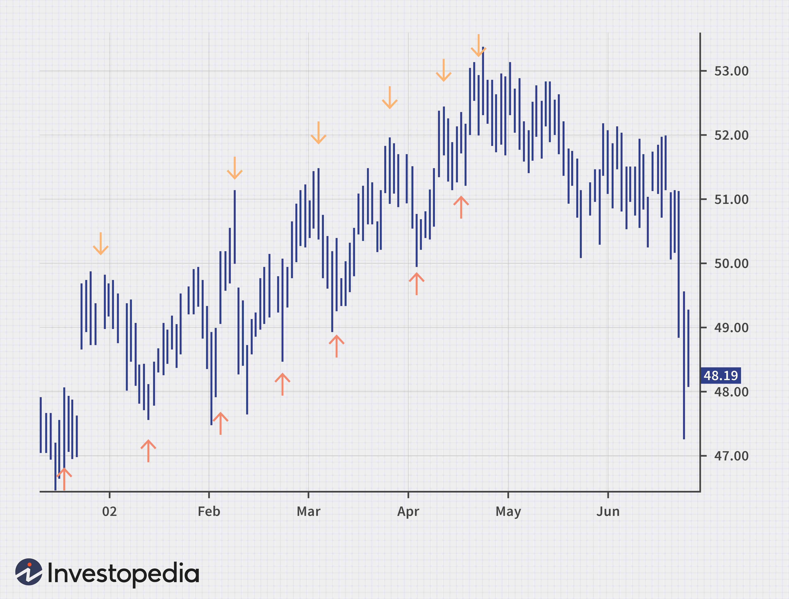

In today's fast-paced financial markets, the ability to interpret economic indicators and employ algorithmic trading strategies is crucial for enhancing market analysis. Economic indicators, such as employment rates, Gross Domestic Product (GDP), and inflation, serve as vital statistics that reflect the health of an economy. These indicators are instrumental in guiding trader decisions by influencing market movements and anticipating shifts. This foundational understanding allows traders to align their strategies with the prevailing economic climate, optimizing their decision-making processes.

Additionally, recognizing market top signals is essential in identifying the points where bullish trends reverse, thus enabling traders to maximize profits and mitigate losses during downturns. Key signs, including a decline in 52-week highs and major indexes dropping below swing lows, offer crucial insights into potential market tops, aiding traders in timing their exits effectively.



Algorithmic trading presents another layer of sophistication by automating the execution of trades through pre-programmed strategies based on quantitative indicators. This approach not only minimizes emotional biases but also capitalizes on market inefficiencies with precision. Popular algorithmic trading tools, such as Moving Averages, the Relative Strength Index (RSI), and Bollinger Bands, provide traders with the analytical prowess required to navigate complex market scenarios.

By the conclusion of this article, readers will gain a comprehensive understanding of how integrating these elements—economic indicators, market top signals, and algorithmic trading strategies—can shape informed and strategic trading decisions, harnessing the potential of both traditional and innovative market analysis techniques.

## Table of Contents

## Understanding Economic Indicators

Economic indicators are pivotal statistical measures that furnish insights into the current state and future trajectory of an economy. These indicators include a range of metrics such as employment rates, Gross Domestic Product (GDP), inflation rates, consumer price indices (CPI), and others. These indicators not only reflect the economic health but also significantly influence market movements and inform trader decisions.

Understanding the employment rate is crucial as it reflects the percentage of the labor force that is employed. High employment rates typically indicate economic growth, whereas rising unemployment can suggest economic downturns or structural changes within an economy. The GDP, which measures the total value of goods and services produced, serves as a broad indicator of economic activity and health. A rising GDP implies a growing economy, whereas a declining GDP could be a precursor to economic recessions.

Inflation and consumer price indices measure the rate at which prices for goods and services rise, eroding purchasing power. An optimal inflation rate indicates economic stability, but hyperinflation or deflation can signal economic instability, influencing central bank policies and market reactions. 

Incorporating such indicators into market analysis enables traders to anticipate potential market shifts, allowing them to adjust their strategies accordingly. For instance, a consistent rise in GDP paired with a robust employment rate might encourage traders to pursue bullish strategies. Conversely, an increase in unemployment along with accelerating inflation could prompt more conservative trading approaches.

Thus, by systematically analyzing economic indicators, traders can identify and mitigate risks, making informed decisions that align with the broader economic environment.

## Analyzing Market Tops

Market tops occur at pivotal points in financial markets when a previously bullish trend reaches its peak and begins to reverse. Recognizing these tops is critical for investors and traders aiming to maximize gains and mitigate potential losses during subsequent downturns.

**Recognizing Market Tops Early:**

Identifying a market top requires a keen understanding of various indicators that hint at an impending reversal. Early recognition of these tops enables traders to close profitable positions at optimal times and strategically hedge or [exit](/wiki/exit-strategy) to avoid the downside risks associated with descending markets.

**Key Signs of a Market Top:**

1. **Decline in 52-Week Highs:**
   A diminishing number of stocks reaching 52-week highs is a subtle yet telling signal of a market top. In healthy bull markets, numerous stocks regularly attain new highs, reflecting strong market breadth. However, when fewer stocks reach these levels despite rising indexes, it may indicate that the market's upward [momentum](/wiki/momentum) is waning and a top might be approaching.

2. **Weakening NYSE Advance Rates:**
   The New York Stock Exchange (NYSE) advance rates provide critical insights into market sentiment. The advance/decline ratio, which compares the number of advancing stocks to declining ones, can highlight weakening advances. A decline in this ratio suggests deteriorating market participation, hinting at a potential top as fewer stocks fuel the market's upward movement.
$$
   \text{Advance/Decline Ratio} = \frac{\text{Number of Advancing Stocks}}{\text{Number of Declining Stocks}}

$$

3. **Major Indexes Dropping Below Prior Swing Lows:**
   Technical analysts closely watch major indexes for structural shifts, such as major indexes falling below previous swing lows. Such breaches can confirm a trend reversal, suggesting a market top has been reached. Swing lows, representing troughs in the market's price action, are critical support levels; breaking them often indicates increased selling pressure and a potential end to the bullish trajectory.

By monitoring these indicators, traders and investors can make more informed decisions, potentially averting losses during market downturns. Integrating these signals with broader economic indicators and technical analysis strengthens market analysis, positioning traders strategically during periods of transition.

 to Algorithmic Trading

Algorithmic trading refers to the use of computer programs to automate trading activities based on pre-defined strategies and mathematical models. These strategies are composed of quantitative indicators that analyze market data to make trading decisions. By executing trades automatically, [algorithmic trading](/wiki/algorithmic-trading) removes the emotional aspect often associated with manual trading, allowing for more consistent and objective decision-making.

One of the primary advantages of algorithmic trading is its ability to exploit market inefficiencies. Algorithms can process large volumes of market data faster than human traders, enabling them to identify and act on [arbitrage](/wiki/arbitrage) opportunities or rapid market fluctuations with speed and precision. The use of sophisticated algorithms helps traders capitalize on price discrepancies and execute trades at optimal moments.

Several popular indicators are employed in algorithmic trading to inform strategy development. Moving Averages, for instance, are utilized to smooth out price data by creating an average that updates as new prices are added. This helps in identifying ongoing market trends and generating buy or sell signals. The formula for a simple moving average (SMA) can be represented as:

$$
\text{SMA} = \frac{\sum_{i=1}^{n} P_i}{n}
$$

where $P_i$ represents the price at time $i$, and $n$ is the number of periods considered.

The Relative Strength Index (RSI) is another crucial indicator, measuring the magnitude of recent price changes to evaluate overbought or oversold conditions in a market. It is calculated using the formula:

$$
\text{RSI} = 100 - \left( \frac{100}{1 + \frac{\text{Average Gain}}{\text{Average Loss}}} \right)
$$

The Moving Average Convergence Divergence (MACD) indicator tracks the relationship between two exponential moving averages (EMAs) to spot potential trend reversals. Bollinger Bands, on the other hand, consist of a centerline moving average with two standard deviation lines, helping traders identify [volatility](/wiki/volatility-trading-strategies) and potential [breakout](/wiki/breakout-trading) points.

Here's a simple Python implementation to calculate an SMA:

```python
def calculate_sma(prices, n):
    return [sum(prices[i:i+n]) / n for i in range(len(prices) - n + 1)]

# Example usage:
prices = [100, 102, 104, 103, 105]
sma = calculate_sma(prices, 3)
print(sma)  # Output: [102.0, 103.0, 104.0]
```

In summary, algorithmic trading leverages pre-defined quantitative strategies, thereby enhancing the precision and efficiency of trades while minimizing emotional and cognitive biases. By utilizing popular indicators such as Moving Averages, RSI, MACD, and Bollinger Bands, traders can develop robust algorithmic strategies aimed at improving market analysis and capitalizing on trading opportunities.

## Popular Indicators for Algorithmic Trading

Popular indicators play a critical role in algorithmic trading by providing quantitative measures that guide automatic trade decisions. These indicators help traders interpret market conditions, identify potential trading opportunities, and execute trades based on pre-defined criteria. The following are some of the most widely used indicators in algorithmic trading:

### Moving Averages

Moving Averages (MAs) are essential tools for smoothing out price data and identifying ongoing market trends. A Moving Average takes the average of a set number of past prices, reducing short-term fluctuations and highlighting longer-term trends. There are different types of Moving Averages, with the Simple Moving Average (SMA) and the Exponential Moving Average (EMA) being the most common. The SMA calculates the mean of a given number of closing prices, while the EMA gives more weight to recent prices, making it more responsive to new information.

In algorithmic trading, MAs are often used to identify trend directions. For example, a basic strategy might involve buying when a short-term MA crosses above a long-term MA (a "golden cross") and selling when it crosses below (a "death cross").

### Relative Strength Index (RSI)

The Relative Strength Index (RSI) is a momentum oscillator that measures the speed and change of price movements. RSI values range from 0 to 100, with levels above 70 typically indicating an overbought condition and levels below 30 indicating an oversold condition. The formula for RSI is:

$$

RSI = 100 - \frac{100}{1 + RS}
$$

Where $RS$ is the average gain of 'n' periods divided by the average loss of 'n' periods. Traders use RSI to detect possible reversal points in market trends or to confirm the strength of a trend.

### Moving Average Convergence Divergence (MACD)

The Moving Average Convergence Divergence (MACD) is employed to identify changes in the momentum, direction, and strength of a stock price. It is calculated by subtracting the 26-period EMA from the 12-period EMA. A nine-day EMA of the MACD, known as the "signal line," is then plotted on top of the MACD line, which can function as a trigger for buy or sell signals. Generally, when the MACD crosses above the signal line, it is a bullish signal, whereas a cross below indicates a bearish signal.

### Bollinger Bands

Bollinger Bands consist of a middle band (usually an SMA) and two outer bands that are standard deviations away from the middle band. These bands expand and contract based on market volatility. When the bands are close together, it suggests low volatility, while bands that move apart indicate high volatility. A common strategy incorporates buying when the price touches the lower band, indicating potential undervaluation, and selling when it hits the upper band, suggesting overvaluation.

In algorithmic trading, the use of these indicators assists in the systematic targeting of trading conditions, allowing traders to execute well-informed and timely decisions based on quantitative analysis rather than emotion. Combining these indicators can offer a more comprehensive outlook on market behavior, thereby enhancing the precision and effectiveness of trading algorithms.

## Integrating Indicators for Market Analysis

Combining economic indicators with technical signals provides a robust framework for market analysis. This approach leverages the strengths of both fundamental and technical perspectives, resulting in more comprehensive insights that can improve trading decisions.

Integrating Moving Averages with economic data can enhance trend forecasts. Moving Averages (MA) are a popular tool used to smooth out price data over a specific period, helping to identify trends by filtering out short-term fluctuations. When combined with economic indicators, such as GDP growth rates or employment figures, Moving Averages can provide traders with a clearer picture of market direction. For instance, if economic indicators suggest a strong economic outlook, aligning this data with an upward-trending MA could reinforce a buy strategy in financial markets.

Utilizing the Relative Strength Index (RSI) with market top indicators can confirm overbought signals at market peaks. RSI is a momentum oscillator that measures the speed and change of price movements on a scale of 0 to 100. Typically, an RSI above 70 indicates overbought conditions, while below 30 suggests oversold conditions. By integrating RSI with market top signals, such as a decline in 52-week highs or a drop in major indexes below swing lows, traders can substantiate overbought conditions, providing a stronger basis for predicting potential market reversals.

This integrated approach, combining the predictive power of economic indicators with the precise timing of technical signals, enhances the ability to anticipate market shifts. This fusion not only supports better trend identification but also refines the decision-making process, mitigating risks associated with abrupt market changes. As a result, traders and analysts can develop more resilient strategies, maintaining an edge in the rapidly changing landscape of financial markets.

## The Future of Market Analysis and Trading

Advancements in [artificial intelligence](/wiki/ai-artificial-intelligence) (AI) and [machine learning](/wiki/machine-learning) are transforming algorithmic trading, offering unprecedented opportunities for market analysis and execution. These technologies are enhancing the speed and precision of trading algorithms by utilizing complex data processing methods to analyze vast amounts of market data in real-time.

AI's ability to process large datasets allows for the development of more sophisticated trading models. Machine learning algorithms, particularly those employing techniques such as supervised learning, unsupervised learning, and [reinforcement learning](/wiki/reinforcement-learning), can identify and leverage subtle patterns and correlations within market data that were previously undetectable. For example, supervised learning can be used to predict stock prices by training models on historical price data, while reinforcement learning can optimize trading strategies by simulating numerous market scenarios and learning from outcomes.

Real-time data processing capabilities are crucial as they significantly enhance the accuracy of economic forecasts and trading signals. This involves using state-of-the-art data architecture and processing frameworks like distributed computing and cloud infrastructure to handle streaming data efficiently. The accurate and timely interpretation of economic indicators such as employment rates, GDP, and inflation, when integrated with evolving market data, enables traders to make informed decisions rapidly.

To illustrate, consider a Python-based algorithm that utilizes a [neural network](/wiki/neural-network) to predict market movements. By continually training on updated datasets, the algorithm adapts to new market conditions:

```python
import numpy as np
import pandas as pd
from sklearn.model_selection import train_test_split
from sklearn.neural_network import MLPRegressor

# Mockup data preparation
data = pd.read_csv('market_data.csv')
X = data[['feature1', 'feature2', 'feature3']]  # Example features
y = data['target']  # Example target variable

# Train-test split
X_train, X_test, y_train, y_test = train_test_split(X, y, test_size=0.2, random_state=42)

# Neural network model
model = MLPRegressor(hidden_layer_sizes=(100,), activation='relu', solver='adam', max_iter=500)
model.fit(X_train, y_train)

# Prediction
predictions = model.predict(X_test)
```

The evolving landscape of technology implies that traders and investors must adapt continually, updating their strategies to stay competitive. This entails not only adoption of machine learning tools but also an ongoing commitment to education in computational techniques and statistical analysis to interpret sophisticated models correctly.

Moreover, the integration of natural language processing (NLP) with AI systems offers unique insights by analyzing textual data from financial reports, news sources, and social media, broadening the scope of market analysis. This allows for sentiment analysis which adds another dimension to trading strategies by assessing the market mood.

In conclusion, the future of market analysis and trading is being reshaped by advancements in AI and machine learning. These technologies, combined with real-time data processing, are poised to refine the accuracy of forecasts and trading strategies. Market participants must remain agile, continuously updating their knowledge and tools to capitalize on these technological innovations.

## Conclusion

Mastering the intersection of economic indicators, market tops, and algorithmic trading is pivotal for effective market analysis. These three elements collectively form the foundation for constructing well-informed trading strategies. Economic indicators, serving as statistical measures, offer valuable insights into the broader economic landscape, directly influencing market decisions. Meanwhile, identifying market tops provides an opportunity to capitalize on gains and mitigate potential losses by recognizing shifts in bullish trends. Algorithmic trading, on the other hand, leverages quantitative strategies to automate trading processes, significantly enhancing efficiency and precision.

The synergy of these components enables traders to make strategic decisions based on a comprehensive analysis framework. By integrating economic indicators with technical tools, traders can anticipate market shifts and respond proactively. For instance, using technical indicators like Moving Averages alongside economic data can refine trend analysis, providing clarity in volatile markets. This approach not only enhances decision-making but also helps in optimizing entry and exit points in trades.

Continuous learning and technological adoption are crucial in maintaining a competitive edge in financial markets. As advancements in artificial intelligence and machine learning progress, they promise to revolutionize trading practices by enabling real-time data processing and improving the accuracy of forecasts. Traders must stay abreast of these technological trends, adapting their strategies accordingly to harness the full potential of emerging tools and techniques.

In conclusion, a profound understanding of economic indicators, market tops, and algorithmic trading lays the groundwork for successful market analysis. By intertwining these aspects, traders are better equipped to navigate the complexities of financial markets. Embracing a culture of continuous learning and technological integration is imperative for sustaining success in this rapidly evolving field.

## References & Further Reading

[1]: Bergstra, J., Bardenet, R., Bengio, Y., & Kégl, B. (2011). ["Algorithms for Hyper-Parameter Optimization."](https://dl.acm.org/doi/10.5555/2986459.2986743) Advances in Neural Information Processing Systems 24.

[2]: ["Advances in Financial Machine Learning"](https://www.amazon.com/Advances-Financial-Machine-Learning-Marcos/dp/1119482089) by Marcos Lopez de Prado

[3]: ["Evidence-Based Technical Analysis: Applying the Scientific Method and Statistical Inference to Trading Signals"](https://www.amazon.com/Evidence-Based-Technical-Analysis-Scientific-Statistical/dp/0470008741) by David Aronson

[4]: ["Machine Learning for Algorithmic Trading"](https://github.com/stefan-jansen/machine-learning-for-trading) by Stefan Jansen

[5]: ["Quantitative Trading: How to Build Your Own Algorithmic Trading Business"](https://www.amazon.com/Quantitative-Trading-Build-Algorithmic-Business/dp/1119800064) by Ernest P. Chan