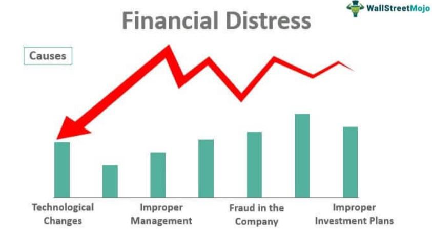

In today's fast-paced business environment, recognizing the warning signs of corporate distress is more crucial than ever. Corporate distress can lead to significant financial losses, affect stakeholder trust, and even result in bankruptcy if not addressed timely. As businesses operate under increased pressure to perform and remain competitive, the ability to detect early indicators of corporate distress is essential for sustaining long-term viability. These indicators often manifest through symptoms such as declining profits, poor cash flow, and increasing debt, which threaten a company's financial and operational stability.

The detection of distress signals is not solely about identifying a company's weaknesses; it involves understanding the breadth of potential financial pitfalls that could emerge. This article explores key indicators that may signal an underlying crisis within a company, focusing predominantly on financial and operational aspects. From liquidity issues to mismatched revenue expectations, each signal offers a glimpse into an organization's fiscal health.



Moreover, the integration of algorithmic trading presents a novel approach in identifying distress signals early on. Algorithmic trading platforms, utilizing complex algorithms and real-time data analysis, have the potential to reveal patterns and irregularities that indicate distress, which might be missed by conventional methods. By leveraging these technological advancements, management and investors can be better equipped to anticipate and respond to emergent risks.

Understanding these signs can empower management and investors to enact strategies that mitigate risks and potentially save a company from collapse. This proactive approach not only safeguards financial stability but also preserves stakeholder confidence and ensures a company can navigate challenges effectively.

## Table of Contents

## Understanding Corporate Distress

Corporate distress refers to the financial instability that can undermine a company's operations and solvency. This instability typically arises from declining profits and mounting debts, which create a precarious financial situation that must be urgently addressed. The manifestations of corporate distress are evident in both financial metrics and operational functions.

Financially, distress often presents through deteriorating cash reserves, erratic cash flow, and an increasing imbalance between debt obligations and available funds. A company may find itself unable to comfortably service its debt, leading to a low interest coverage ratio. This ratio, defined as:

$$
\text{Interest Coverage Ratio} = \frac{\text{Earnings Before Interest and Taxes (EBIT)}}{\text{Interest Expense}}
$$

indicates the company's capacity to pay interest on its outstanding debt. A ratio less than 1 suggests that the company does not generate enough profit to cover its interest obligations, posing a critical warning of distress.

Operationally, companies experiencing distress may face disruptions such as inefficiencies and reduced ability to maintain optimal production levels. These operational difficulties may stem from factors like outdated technology, reduced workforce morale, or inadequate management practices.

Understanding the contributors to corporate distress involves analyzing both internal and external factors. Internal factors include poor strategic management decisions, lack of innovation, or inefficient processes. Externally, factors such as market competition, economic downturns, or regulatory changes can exacerbate the situation.

Addressing corporate distress effectively requires a comprehensive assessment of these financial and operational indicators. By recognizing and understanding the multifaceted nature of distress, companies can devise strategies that not only stabilize their financial position but also enhance operations, thereby creating a pathway for recovery and long-term sustainability.

## Financial Warning Signs

Dwindling cash reserves or inconsistent cash flow are immediate red flags in assessing a company's financial health. Cash flow issues often signal a company's struggle to generate sufficient revenue to cover its expenses, which can lead to severe [liquidity](/wiki/liquidity-risk-premium) problems. An inability to service debt is another critical financial warning sign, often reflected in low interest coverage ratios. The interest coverage ratio, calculated as EBIT (Earnings Before Interest and Taxes) divided by interest expenses, provides a measure of a company's ability to meet its interest obligations. A low ratio suggests that a company may struggle to pay interest, thereby indicating potential financial distress.

Switching auditors without clear explanations might point to underlying accounting concerns. Such changes can indicate disagreements over financial reporting practices or attempts to obscure financial instability. Frequent managerial changes or insider selling could signal a lack of confidence in the company's future. When top executives or insiders sell their shares or frequently leave, it may suggest that those closest to the company's operations foresee difficulties ahead, potentially driven by poor performance or impending challenges.

Addressing these financial warning signs promptly can prevent exacerbation of the issues and aid in strategizing effective recovery measures.

## Operational Red Flags

Operational red flags are critical indicators of underlying corporate distress and often provide early warnings of potential financial instability. These red flags can manifest through various strategic and structural changes within a company, signaling a shift from long-term sustainability to urgent short-term solutions.

One common operational red flag is the reduction of employee benefits or perks. Such cuts may reflect a company's efforts to conserve cash, but they can also be symptomatic of deeper financial troubles. When a company faces liquidity issues, scaling back on employee benefits becomes a quick way to shore up finances. However, this strategy can lead to decreased morale and productivity, potentially exacerbating the company’s challenges.

Another significant indicator is the sale of flagship products or key assets. When a company divests these critical components, it typically signifies an urgent need for cash. Flagship products often embody a brand's identity and market differentiation; their sale not only impacts current revenue streams but also compromises future growth prospects. This approach can be seen as a last resort to meet immediate financial obligations at the expense of strategic assets.

A decline in innovation is equally telling. Companies thriving in the long term prioritize continuous innovation and development of new products and services. However, when financial distress looms, there is often a noticeable shift in focus from core strategic goals to immediate gains or "quick wins." This pivot can undermine long-term sustainability by neglecting research and development (R&D) and failing to adapt to market changes. Reduced investment in R&D often hampers a company's ability to compete effectively, leading to a cycle of declining competitiveness and revenue.

In conclusion, recognizing operational red flags is essential for diagnosing potential crises early on. While actions like cutting benefits and selling key assets might offer short-term relief, they can substantially hinder long-term viability if not paired with a comprehensive recovery strategy. Maintaining a balance between immediate financial needs and the preservation of strategic growth areas is crucial to avoid further distress and facilitate recovery.

## The Role of Algorithmic Trading in Spotting Distress Signals

Algorithmic trading platforms have become integral in the early detection of corporate distress signals through their ability to process and analyze vast datasets with unprecedented speed and precision. These systems utilize sophisticated algorithms capable of identifying subtle patterns and emerging trends indicative of financial and operational instabilities that might elude conventional analysis methods.

The foundation of [algorithmic trading](/wiki/algorithmic-trading) is rooted in quantitative models that assess a variety of financial metrics. For instance, algorithms can continuously monitor fluctuations in stock prices, trading volumes, and [volatility](/wiki/volatility-trading-strategies) indicators. By doing so, they can detect anomalies that may suggest underlying corporate distress. A sudden increase in trading [volume](/wiki/volume-trading-strategy) coupled with a sharp decline in stock price could signal potential problems, prompting further investigation.

Moreover, algorithmic trading employs real-time data analysis to predict potential risks and opportunities. By processing current market data, these systems can forecast market dynamics and anticipate movements that may affect a company's financial health. This predictive capability is critical in identifying distress signals before they become evident through traditional financial reporting channels.

Python is a popular programming language used to develop algorithmic trading strategies due to its extensive libraries, such as NumPy, pandas, and scikit-learn, which facilitate data analysis and [machine learning](/wiki/machine-learning). Here's a simple example of how Python can be used to identify distress signals by analyzing stock price movements:

```python
import pandas as pd
import numpy as np
from sklearn.ensemble import RandomForestClassifier
from sklearn.model_selection import train_test_split
from sklearn.metrics import classification_report

# Sample data: loading stock prices and associated features
data = pd.read_csv('stock_prices.csv')
features = data[['open', 'high', 'low', 'volume']]
target = data['price_drop']  # A binary target indicating significant price drop

# Split data into training and testing sets
X_train, X_test, y_train, y_test = train_test_split(features, target, test_size=0.2, random_state=42)

# Initialize and train a Random Forest model
model = RandomForestClassifier(n_estimators=100, random_state=42)
model.fit(X_train, y_train)

# Predict and display results
predictions = model.predict(X_test)
print(classification_report(y_test, predictions))
```

In this example, a machine learning model is trained to predict significant price drops, a potential indicator of distress. By refining such models to include additional features, like trading volumes and news sentiment, algorithmic trading systems can enhance their accuracy in detecting distress signals.

Utilizing algorithmic trading, companies and investors are empowered to make more informed decisions, based on a blend of historical data and real-time analytics. Thus, these platforms not only identify potential threats to corporate stability but also provide insights into mitigating risks and capitalizing on opportunities in a dynamic market environment.

## Actionable Steps for Business Leaders

Proactively managing cash flow and cutting unnecessary expenditures are essential first steps for business leaders aiming to alleviate financial distress. Effective cash flow management ensures that a company maintains sufficient liquidity to meet short-term obligations without resorting to unfavorable financing options. Techniques such as rigorous budget reviews, renegotiation of payment terms with suppliers, and implementing efficient inventory management systems can help optimize cash flow. Conducting a cost-benefit analysis to identify and eliminate superfluous expenses can further stabilize a company's financial health.

Engaging with financial experts is vital for developing robust restructuring or turnaround strategies. Financial consultants bring an external perspective and expertise in diagnosing the root causes of distress, facilitating strategic reorientation. These experts can aid in the formulation of comprehensive plans that might include debt restructuring, equity recapitalization, or mergers and acquisitions. Their objective analysis assists in prioritizing key initiatives, focusing resources where they can have the most significant impact.

Investments in technology, including algorithmic trading systems, enhance decision-making capabilities. By leveraging real-time data analysis, business leaders can anticipate market shifts and adjust their strategies accordingly. Algorithmic systems, using machine learning and advanced data analytics, can assess vast datasets to identify patterns indicative of potential risks and opportunities. This data-driven approach can significantly improve the precision of financial forecasts and investment decisions.

Focused leadership and transparent communication with stakeholders rebuild trust and stability. Clear communication ensures all parties, including employees, investors, and creditors, are informed of the challenges and the steps being taken to address them. Transparency fosters an environment of confidence and collective effort towards recovery. Additionally, strong leadership can drive the strategic execution of turnaround plans, setting a vision and motivating the organization to achieve transformative goals.

In summary, by effectively managing cash flow, engaging expert consultancy, adopting advanced technological tools, and maintaining transparent communication, business leaders can steer distressed companies towards recovery and sustainable growth. These steps not only stabilize the current situation but also lay a solid foundation for future resilience and competitiveness.

## Conclusion

Detecting corporate distress early plays a critical role in a company’s survival and future success. Business leaders should remain vigilant, continuously monitoring both financial and operational warning signs that suggest potential distress. For example, metrics such as dwindling cash reserves, low interest coverage ratios, or frequent managerial changes can indicate deeper issues that require immediate attention. Similarly, operational red flags like cuts in employee benefits or the sale of key assets should prompt leaders to evaluate the company’s strategic direction.

Leveraging modern tools such as algorithmic trading can significantly enhance the ability to identify and respond to these warning signs. Algorithmic trading platforms analyze vast amounts of data to detect trends and patterns that might escape traditional analysis. By implementing these advanced technologies, companies can predict potential risks and opportunities, allowing for timely and informed decision-making.

Ultimately, a proactive and informed approach is essential to avoid the negative consequences of corporate distress. By effectively managing identified risks and adopting innovative strategies, business leaders can stabilize their organizations and ensure long-term sustainability. This approach not only prevents a downward spiral but also facilitates restructuring and recovery, paving the way for renewed growth and competitiveness in the market.

## References & Further Reading

[1]: Bergstra, J., Bardenet, R., Bengio, Y., & Kégl, B. (2011). ["Algorithms for Hyper-Parameter Optimization."](https://dl.acm.org/doi/10.5555/2986459.2986743) Advances in Neural Information Processing Systems 24.

[2]: ["Advances in Financial Machine Learning"](https://www.amazon.com/Advances-Financial-Machine-Learning-Marcos/dp/1119482089) by Marcos Lopez de Prado

[3]: ["Evidence-Based Technical Analysis: Applying the Scientific Method and Statistical Inference to Trading Signals"](https://www.amazon.com/Evidence-Based-Technical-Analysis-Scientific-Statistical/dp/0470008741) by David Aronson

[4]: ["Machine Learning for Algorithmic Trading"](https://github.com/stefan-jansen/machine-learning-for-trading) by Stefan Jansen

[5]: ["Quantitative Trading: How to Build Your Own Algorithmic Trading Business"](https://www.amazon.com/Quantitative-Trading-Build-Algorithmic-Business/dp/1119800064) by Ernest P. Chan