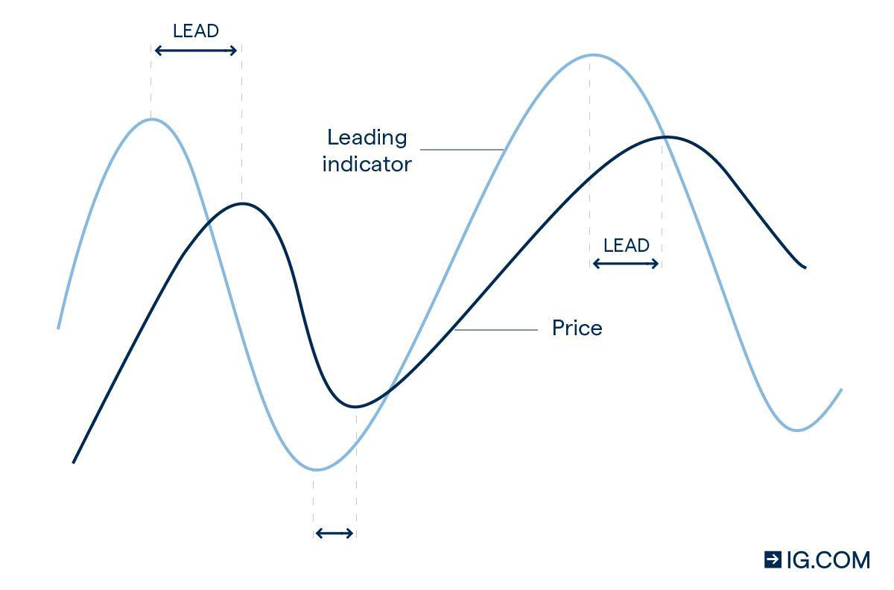

## Table of Contents

## What is economic recovery?

Economic recovery is when a country's economy starts to get better after it has been doing badly. This can happen after a recession, which is when the economy shrinks and people lose jobs. During an economic recovery, more people start to find jobs, businesses begin to make more money, and people feel more confident about spending their money.

The process of recovery can take a long time and depends on many things. Governments and central banks often help by making policies that encourage spending and investment. For example, they might lower interest rates to make it cheaper for people to borrow money. As more people spend and invest, the economy grows stronger, leading to a full recovery.

## What are the basic indicators of economic recovery?

The first sign of economic recovery is usually an increase in Gross Domestic Product (GDP). GDP measures the total value of all goods and services produced in a country. When GDP starts to grow after a period of decline, it means the economy is starting to recover. Another important indicator is the unemployment rate. When more people are finding jobs and the unemployment rate goes down, it's a good sign that the economy is getting better.

A third indicator is consumer confidence. When people feel more confident about their financial future, they are more likely to spend money. This increased spending helps businesses grow and can lead to more jobs. Another sign is rising stock market prices. When stock prices go up, it often means that investors believe the economy will improve. All these indicators together show that an economic recovery is happening.

Lastly, business activity also plays a big role. When businesses start to invest more in new projects and expand their operations, it's a clear sign of recovery. This increased activity can lead to more jobs and higher incomes for people, which in turn fuels further economic growth. Keeping an eye on these indicators can help us understand if and how an economy is recovering.

## How does GDP growth signal economic recovery?

GDP growth is a key sign that an economy is recovering. GDP stands for Gross Domestic Product, which is the total value of all the goods and services made in a country. When GDP starts to grow after it has been shrinking, it means that businesses are making more things and providing more services. This growth shows that the economy is getting better because more money is being made and spent.

When GDP goes up, it often means that people are buying more stuff. This can lead to businesses hiring more workers, which helps lower unemployment. More jobs mean more people have money to spend, which can make the economy grow even more. So, when we see GDP growing, it's a good sign that the economy is on its way to recovery.

## What role do employment rates play in indicating economic recovery?

Employment rates are a big sign of how well an economy is doing. When more people have jobs, it means the economy is getting better. This is because when people are working, they earn money and can spend it on things they need and want. More spending helps businesses grow and can lead to even more jobs. So, when the unemployment rate goes down, it's a good sign that the economy is recovering.

On the other hand, if a lot of people are out of work, it can slow down the economy. When people don't have jobs, they don't have money to spend, and businesses might struggle. This can make the economy worse. That's why watching the employment rates is important. When more people start finding jobs, it's a clear signal that the economy is on the way to recovery.

## How can consumer spending be used as an indicator of economic recovery?

Consumer spending is a big sign that tells us if the economy is getting better. When people feel good about their money and start buying more things, it's a good sign that the economy is recovering. This is because when people spend more, businesses make more money. They might then hire more workers or make more things, which helps the economy grow.

On the other hand, if people are not spending much, it can mean the economy is still struggling. When people are worried about their jobs or money, they might save more and spend less. This can slow down the economy because businesses don't make as much money. So, watching how much people are spending can help us see if the economy is on its way to getting better.

## What is the significance of industrial production in economic recovery?

Industrial production is really important when we talk about economic recovery. It means how much stuff factories and industries are making. When industrial production goes up, it's a good sign that the economy is getting better. This is because when factories make more things, they often need to hire more workers. More jobs mean more people have money to spend, which can help the economy grow even more.

If industrial production is going down, it can mean the economy is still struggling. When factories are not making as much, they might not need as many workers. This can lead to more people being out of work, which makes it harder for the economy to recover. So, watching industrial production can give us a good idea of whether the economy is on the way to getting better or not.

## How do stock market trends reflect economic recovery?

Stock market trends can show us if the economy is getting better. When the stock market goes up, it often means that people who invest money think the economy will do well in the future. They buy stocks because they believe companies will make more money. This belief can make more people feel good about the economy, leading them to spend and invest more, which helps the economy recover.

However, the stock market can be tricky. Sometimes it goes up even if the rest of the economy is not doing so well. But over time, a strong and steady rise in stock prices can be a good sign that the economy is on its way to recovery. When businesses do well and their stock prices go up, it often means they are making more money, hiring more people, and helping the economy grow.

## What are the advanced indicators used by economists to predict economic recovery?

Economists use some special signs to guess if the economy will get better soon. One of these signs is the Purchasing Managers' Index (PMI). The PMI looks at how much new stuff factories are making and how many new orders they are getting. If the PMI number is going up, it means factories are busy and the economy might start to recover. Another sign is the Leading Economic Index (LEI), which is made up of different things like how many new houses are being built, how much money people are making, and how many new jobs are being created. If the LEI is going up, it can mean the economy will get better soon.

Another important sign is consumer confidence. This is a measure of how people feel about their money and the economy. When people feel good, they spend more, which can help the economy grow. Economists also look at business investments. If businesses are spending more money on new projects and equipment, it's a good sign that they think the economy will do well. All these signs together help economists predict if the economy is on its way to getting better.

## How do housing market statistics contribute to understanding economic recovery?

Housing market [statistics](/wiki/bayesian-statistics) help us see if the economy is getting better. When more people are buying houses, it's a good sign. This is because buying a house is a big decision that people usually make when they feel good about their money and the economy. More house sales can lead to more jobs in building and selling homes, which helps the economy grow. Also, when house prices go up, it means people are willing to spend more, which is another sign that the economy might be recovering.

On the other hand, if fewer people are buying houses and prices are going down, it can mean the economy is still struggling. When people are worried about their jobs or money, they might not want to buy a house. This can slow down the economy because it means less spending and fewer jobs in the housing industry. So, by looking at how many houses are being sold and what their prices are doing, we can get a good idea of whether the economy is on its way to getting better or not.

## What is the impact of business investment on economic recovery?

Business investment plays a big role in helping the economy recover. When businesses spend money on new projects, machines, or buildings, it's a sign they believe the economy will get better. This spending creates jobs because businesses need workers to build and run these new projects. More jobs mean more people have money to spend, which can help the economy grow even more. So, when businesses invest more, it's a good sign that the economy is on its way to recovery.

However, if businesses are not investing much, it can slow down the economy. When companies are worried about the future, they might save their money instead of spending it on new things. This can lead to fewer jobs and less spending by people, making it harder for the economy to recover. That's why watching how much businesses are investing can give us a good idea of whether the economy is getting better or not.

## How do international trade balances affect economic recovery indicators?

International trade balances can show us a lot about how an economy is doing. When a country sells more stuff to other countries than it buys, it has a trade surplus. This is good for the economy because it means more money is coming into the country. More money can help businesses grow and create more jobs, which helps the economy recover. On the other hand, if a country buys more from other countries than it sells, it has a trade deficit. This can be bad because it means money is leaving the country, which might slow down the economy.

Trade balances can also affect other important signs of economic recovery. For example, if a country has a trade surplus, it might make the country's currency stronger. A stronger currency can make people feel more confident about their money, leading them to spend more. This increased spending can help the economy grow. But if there's a trade deficit, the currency might get weaker, which can make people worry about the economy and spend less. So, watching the trade balance can help us understand if the economy is getting better or not.

## What are the limitations and criticisms of traditional economic recovery indicators?

Traditional economic recovery indicators like GDP growth, employment rates, and consumer spending can have some problems. One big issue is that they might not show the whole picture of how people are doing. For example, GDP might go up, but if most of the money is going to just a few rich people, many others might still be struggling. Also, these indicators can take a while to show changes, so they might not be the best at telling us what's happening right now in the economy. Sometimes, they can even be wrong because they depend on numbers that are guessed or not completely accurate.

Another problem is that these indicators can be affected by things that don't really have to do with the economy getting better. For instance, a big event like a natural disaster can make GDP go up because of rebuilding, but it doesn't mean the economy is truly recovering. Critics also say that these indicators don't look at important things like how happy people are, how fair the economy is, or how sustainable it is for the future. So, while these traditional indicators can give us some clues about economic recovery, they don't tell the whole story and should be used carefully.

## References & Further Reading

[1]: Bergstra, J., Bardenet, R., Bengio, Y., & Kégl, B. (2011). ["Algorithms for Hyper-Parameter Optimization."](https://papers.nips.cc/paper/4443-algorithms-for-hyper-parameter-optimization) Advances in Neural Information Processing Systems 24.

[2]: ["Advances in Financial Machine Learning"](https://www.amazon.com/Advances-Financial-Machine-Learning-Marcos/dp/1119482089) by Marcos Lopez de Prado

[3]: ["Evidence-Based Technical Analysis: Applying the Scientific Method and Statistical Inference to Trading Signals"](https://www.amazon.com/Evidence-Based-Technical-Analysis-Scientific-Statistical/dp/0470008741) by David Aronson

[4]: ["Machine Learning for Algorithmic Trading"](https://github.com/stefan-jansen/machine-learning-for-trading) by Stefan Jansen

[5]: ["Quantitative Trading: How to Build Your Own Algorithmic Trading Business"](https://www.amazon.com/Quantitative-Trading-Build-Algorithmic-Business/dp/1119800064) by Ernest P. Chan