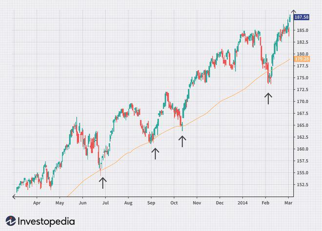

In today's dynamic financial landscape, investor interest in penny stocks is on the rise as they seek opportunities that promise substantial returns, even with minimal initial capital. Penny stocks, defined as shares trading for under $5, attract investors due to their potential for significant appreciation. However, this potential is counterbalanced by inherent risks, including high volatility and financial uncertainty. This article focuses on the complex nature of stock valuation within the context of penny stocks, exploring how key investment indicators and advances in algorithmic trading are transforming investment strategies in these markets.

Understanding the nuances of penny stocks is crucial for investors aiming to navigate the complexities of these investments effectively. While the lure of large gains is undeniable, penny stocks require careful evaluation and risk management. The limited financial disclosures and smaller market capitalization associated with these stocks pose unique challenges in traditional valuation models. This necessitates the use of innovative techniques and a keen understanding of financial data interpretation.



The evolving landscape is further influenced by the rise of technology-assisted decision-making processes, such as algorithmic trading. These technological advances enable investors to analyze market trends and execute trades with greater efficiency and precision, thereby potentially enhancing returns while managing risks better. This discussion will offer insights into effective valuation techniques and elucidate how modern investors employ technology to balance risks with potential rewards, positioning themselves strategically in the penny stock market.

## Table of Contents

## Understanding Penny Stocks

Penny stocks are a unique category within the stock market, typically defined by their low share price and market capitalization. Generally, these stocks are traded at prices below $5 per share, making them accessible to investors with limited capital. Despite their appealing price point, penny stocks are often associated with high risk, primarily due to their significant volatility and the speculative nature of their markets.

Investors are primarily attracted to penny stocks for their potential to deliver exponential growth. The low initial investment required means that even small price movements can translate into substantial percentage gains. However, this potential for rapid appreciation is accompanied by considerable risks. Penny stocks are often less liquid, meaning that they may not trade as frequently as larger stocks, leading to wider bid-ask spreads and difficulty executing trades.

Moreover, companies behind penny stocks often have unstable financials, limited operational history, or uncertain market prospects, which contribute to their price instability. The lack of extensive financial reporting requirements further adds to the uncertainty, as investors may not have a comprehensive picture of the company's operations and financial health. This scenario makes due diligence crucial, as investors must evaluate the risks and potential rewards before incorporating penny stocks into their investment portfolios.

The allure of penny stocks often leads investors to prioritize their potential returns. Still, a thorough understanding of the associated risks is essential to make informed decisions. Given the [volatility](/wiki/volatility-trading-strategies) and speculative nature of these stocks, investors need to employ strategies, such as diversification and the application of technical indicators, to manage risk and optimize their portfolio performance.

## Stock Valuation Techniques for Penny Stocks

Valuing penny stocks presents a unique set of challenges, primarily due to their speculative nature and the scarcity of detailed financial information. Despite these hurdles, several stock valuation techniques can be adapted to assess the potential of these low-priced securities. Three widely recognized valuation methods are the Price-to-Earnings (P/E) ratio, the Price-to-Book (P/B) ratio, and the Discounted Cash Flow (DCF) analysis. However, their application to penny stocks requires careful adjustment and consideration.

1. **Price-to-Earnings Ratio (P/E Ratio):**

   The P/E ratio is a critical tool in determining a stock's market value relative to its earnings. For penny stocks, the P/E ratio may not always be reliable due to erratic earnings or negative profits. However, in cases where companies have stable earnings, the P/E ratio is calculated as:
$$
   \text{P/E Ratio} = \frac{\text{Market Price per Share}}{\text{Earnings per Share (EPS)}}

$$

   Investors need to be cautious when utilizing the P/E ratio for penny stocks, considering industry comparisons and the potential for inflated market prices based on speculative buying rather than fundamental strength.

2. **Price-to-Book Ratio (P/B Ratio):**

   The P/B ratio provides insights into how the market values a company compared to its book value. This measure is particularly useful for penny stocks with substantial tangible assets, which may provide a safety net against market volatility. It is computed as:
$$
   \text{P/B Ratio} = \frac{\text{Market Price per Share}}{\text{Book Value per Share}}

$$

   When evaluating penny stocks, investors should examine the quality and [liquidity](/wiki/liquidity-risk-premium) of the assets underpinning the book value, as these can significantly impact the firm's financial health and investment risk.

3. **Discounted Cash Flow Analysis (DCF Analysis):**

   DCF analysis estimates a company's value based on its expected future cash flows. This approach involves projecting the future cash flows and discounting them back to their present value using a discount rate. For penny stocks, this method poses challenges due to uncertain cash flow projections and the volatility inherent in these stocks. The formula used is:
$$
   \text{DCF} = \sum \left( \frac{\text{Cash Flow}_t}{(1 + r)^t} \right)

$$

   where $\text{Cash Flow}_t$ is the cash flow in year $t$ and $r$ is the discount rate.

   Investors must conduct thorough research to ensure realistic assumptions and projections about the company's future prospects, market conditions, and risk factors.

### Due Diligence

A thorough due diligence process is indispensable when evaluating penny stocks. Given the limited availability and reliability of financial statements, investors should extend their analysis beyond traditional metrics. This includes assessing the company's management team, industry position, and potential for competitive advantage, as well as considering macroeconomic factors that might impact the business model. Ensuring a comprehensive understanding of the company's strategy and market dynamics can reveal significant insights that complement traditional valuation techniques.

Analyzing penny stocks requires an informed approach that integrates both quantitative metrics and qualitative factors, ensuring that investors can differentiate between speculative opportunities and genuine growth prospects.

## Key Investment Indicators

Investment indicators provide invaluable insights into the potential performance of penny stocks, especially given their typically volatile nature and limited financial data. They offer a way to make more informed decisions by applying objective, quantitative measures. Understanding and effectively utilizing these indicators can be the difference between a profitable investment and a significant loss.

**Relative Strength Index (RSI)** is a momentum oscillator that measures the speed and change of price movements. It ranges from 0 to 100, typically viewed over a 14-day period. In the context of penny stocks, an RSI above 70 may indicate that the stock is overbought, potentially signaling a price correction. Conversely, an RSI below 30 suggests that the stock may be oversold, indicating a potential buying opportunity.

$$
RSI = 100 - \left( \frac{100}{1 + \frac{\text{Average Gain}}{\text{Average Loss}}} \right)
$$

**Moving Average Convergence Divergence (MACD)** is a trend-following momentum indicator that shows the relationship between two moving averages of a stock’s price. The MACD is calculated by subtracting the 26-period Exponential Moving Average (EMA) from the 12-period EMA. The result of this calculation is the MACD line. A nine-day EMA of the MACD, called the "signal line," is then plotted on top of the MACD line, which can function as a trigger for buy and sell signals. MACD is particularly useful for identifying potential entry and exit points in penny stocks.

```python
import pandas as pd

def calculate_macd(close_prices):
    ema_short = close_prices.ewm(span=12, adjust=False).mean()
    ema_long = close_prices.ewm(span=26, adjust=False).mean()
    macd = ema_short - ema_long
    signal = macd.ewm(span=9, adjust=False).mean()
    return macd, signal
```

**Volume analysis** is another critical indicator that helps in understanding the strength of a stock’s price movement. For penny stocks, significant price moves accompanied by high volume provide a stronger signal than those on low volume. Volume increases can indicate investor conviction and precede trend continuations or reversals. A spike in volume may suggest heightened interest or a significant news event related to the stock.

Technical analysis, employing indicators like RSI, MACD, and [volume](/wiki/volume-trading-strategy), is essential for assessing [momentum](/wiki/momentum) and market sentiment surrounding penny stocks. Given the high volatility, robust technical analysis ensures investors can identify patterns and trends that may not be immediately obvious, allowing for strategic timing on entry and [exit](/wiki/exit-strategy) points. These tools equip investors to navigate the unpredictable nature of penny stocks, thereby encouraging more data-driven decisions.

## Algorithmic Trading in the Penny Stock Market

Algorithmic trading, often referred to as algo trading, employs fully automated systems for executing orders based on predefined strategies and market analyses. These systems capitalize on technologies designed to navigate the fast-paced environment of financial markets, including penny stocks. Penny stocks, known for their low price and high volatility, provide a fertile ground for [algorithmic trading](/wiki/algorithmic-trading) due to their susceptibility to swift price changes.

Algo trading in the penny stock market is primarily focused on leveraging micro-fluctuations in stock prices. The ability to execute trades at speeds significantly faster than human reaction times enables traders to capitalize on small price movements, a practice often crucial in markets where margins are thin. High-frequency trading ([HFT](/wiki/high-frequency-trading-strategies)) is a subset of algorithmic trading that is particularly relevant, where a high volume of trades is executed over short durations to exploit these small price discrepancies.

One of the fundamental components of these systems is the ability to process vast amounts of data efficiently. Algo trading systems are designed to analyze historical data, market trends, and technical indicators to predict short-term price movements. This task requires substantial computational power and the implementation of complex algorithms. For example, techniques such as moving averages, momentum indicators, and statistical [arbitrage](/wiki/arbitrage) are encoded into algorithms to generate buy or sell signals.

Python is a popular programming language in this domain due to its extensive range of libraries and frameworks suited for data analysis and algorithm development. Libraries such as NumPy, pandas, and Scikit-learn provide tools for data manipulation and statistical analysis, while [backtesting](/wiki/backtesting) libraries like Backtrader allow traders to test their algorithms on historical data before deploying them in live markets.

Consider a simple moving average cross-over strategy implemented in Python:

```python
import pandas as pd
import numpy as np

# Load historical price data
data = pd.read_csv('penny_stock_data.csv')
data['SMA_50'] = data['Close'].rolling(window=50).mean()
data['SMA_200'] = data['Close'].rolling(window=200).mean()

# Define a simple moving average crossover trading signal
def generate_signals(data):
    data['Signal'] = 0
    data['Signal'][50:] = np.where(data['SMA_50'][50:] > data['SMA_200'][50:], 1, 0)
    data['Position'] = data['Signal'].diff()
    return data

signals = generate_signals(data)

# Visualize the data with trading signals
signals[['Close', 'SMA_50', 'SMA_200']].plot()
plt.scatter(signals.index, signals['Position'], marker='^', color='g')  # Buy signals
plt.scatter(signals.index, signals['Position'], marker='v', color='r')  # Sell signals
plt.show()
```

The above code illustrates a strategy where buy and sell signals are generated based on the crossover of a 50-day simple moving average (SMA) over a 200-day SMA. This type of algorithm highlights how traders can use technical indicators to make objective trading decisions. 

In highly volatile markets, such as those for penny stocks, real-time data processing and decision-making are crucial for successful investment. The integration of [machine learning](/wiki/machine-learning) techniques, such as decision trees and neural networks, can further refine these trading strategies by adapting to market dynamics. The ongoing advancement in AI and machine learning continues to push the boundaries of what is possible in algorithmic trading, making technology an indispensable tool for traders in the penny stock market.

## Risks and Challenges in Penny Stock Investments

Penny stocks are intriguing yet perilous investment vehicles due to several inherent risks and challenges. These stocks are often associated with limited liquidity, as they usually have low trading volumes. This lack of liquidity can lead to difficulties in executing trades at desired prices, potentially resulting in financial losses for investors. 

Moreover, penny stocks are susceptible to fraudulent schemes, such as "pump and dump" operations. These schemes involve artificially inflating the price of a stock to attract investors, only for the perpetrators to sell their shares at a profit, leaving other investors with devalued holdings. Given that many penny stocks are not subject to the rigorous financial disclosure requirements imposed on larger companies, investors may not have access to comprehensive information about a company's financial health and operations, further exacerbating potential risks.

Investors should also be cognizant of the high volatility that characterizes penny stock investments. Prices can fluctuate dramatically in short periods due to limited market information and speculation, making these stocks highly unpredictable. This volatility can amplify the potential for rapid financial losses, necessitating a strong risk management strategy.

A fundamental aspect of managing these risks is the employment of stop-loss orders, which allow investors to set a predetermined sell price to limit potential losses. Additionally, diversification—spreading investments across various stocks—can mitigate risk by reducing the impact of poor performance by individual holdings. Diversification is a key tenet of sound investment strategy that helps manage the inherent uncertainties of penny stocks.

Implementing these protective measures requires diligence and a firm commitment to strategy. Investors should combine technical and [fundamental analysis](/wiki/fundamental-analysis) to make informed decisions, staying abreast of market trends and company-specific developments. Those willing to navigate the complexities and challenges of penny stocks may find opportunities for potential gains, but they must remain vigilant against the multifaceted risks presented by these investments.

## Tips for Successful Investment in Penny Stocks

Conducting thorough research is essential when investing in penny stocks. Investors should make a habit of staying informed about market news and trends, as these can significantly impact stock prices and valuations. Reliable financial news platforms, online forums, and industry reports are useful sources of information. Closer inspection of a company’s financial statements, leadership background, and industry position can further help identify viable investment opportunities. Given the high volatility and speculative nature of penny stocks, informed decisions can mitigate some risks.

Starting with a small investment is a prudent strategy for gauging the market and testing various investment strategies. This approach minimizes financial exposure and allows investors to learn from their experiences without risking significant capital. It is advisable to only increase investment sizes as familiarity with market dynamics grows and strategies prove successful.

Leveraging paper trading platforms is an effective way to hone trading skills without financial risk. These platforms simulate stock trading in real-time, allowing investors to execute trades using virtual money. This practice fosters a better understanding of trading mechanisms and helps refine decision-making processes. Moreover, it provides an opportunity to test different technical indicators and strategies, such as those based on Relative Strength Index (RSI) or Moving Average Convergence Divergence (MACD), before applying them to actual investments. Developing proficiency in paper trading can enhance confidence and skill, ultimately contributing to more effective real-world trading decisions.

## Conclusion

Investing in penny stocks presents a unique opportunity for those willing to explore the volatile world of low-priced equities. The potential for substantial returns is enticing, yet these investments come with inherent risks that necessitate a thoughtful and strategic approach. Successful navigation of penny stock investments relies heavily on a comprehensive understanding of stock valuation methods and the integration of cutting-edge technological advancements, such as algorithmic trading, in the decision-making process.

Sound stock valuation techniques are crucial in assessing the true potential of penny stocks. By utilizing common financial metrics, such as the Price-to-Earnings (P/E) ratio, Price-to-Book (P/B) ratio, and Discounted Cash Flow (DCF) analysis, investors can form a foundational understanding of a company's financial health and future prospects. These techniques, although sometimes less applicable due to the speculative nature of penny stocks, provide essential insights needed to make informed decisions.

Algorithmic trading has become increasingly influential in the investment landscape, offering a significant edge through its ability to process large volumes of data with speed and precision. This technology allows investors to capitalize on micro-fluctuations in stock prices, inherently beneficial in the highly volatile penny stock market. By deploying algorithms to automate trades based on predefined criteria, investors can reduce human error and improve the efficiency of their investment strategies.

The future of penny stock investment is closely tied to technological innovation. As trading platforms evolve and data analytics tools improve, investors are equipped with better resources to analyze and act upon market developments. This technological shift continues to reshape the potential for success in penny stock markets, presenting exciting opportunities for those with the foresight and expertise to embrace these advanced tools.

In summary, while investing in penny stocks involves significant risks, the rewards can be noteworthy for those who adopt a strategic and informed approach. By combining sound valuation techniques with advanced algorithmic trading strategies, investors can enhance their decision-making process and increase their likelihood of achieving favorable outcomes in the dynamic and ever-evolving world of penny stock investments.

## References & Further Reading

[1]: Bergstra, J., Bardenet, R., Bengio, Y., & Kégl, B. (2011). ["Algorithms for Hyper-Parameter Optimization."](https://dl.acm.org/doi/10.5555/2986459.2986743) Advances in Neural Information Processing Systems 24.

[2]: ["Advances in Financial Machine Learning"](https://www.amazon.com/Advances-Financial-Machine-Learning-Marcos/dp/1119482089) by Marcos Lopez de Prado

[3]: ["Evidence-Based Technical Analysis: Applying the Scientific Method and Statistical Inference to Trading Signals"](https://www.amazon.com/Evidence-Based-Technical-Analysis-Scientific-Statistical/dp/0470008741) by David Aronson

[4]: ["Machine Learning for Algorithmic Trading"](https://github.com/stefan-jansen/machine-learning-for-trading) by Stefan Jansen

[5]: ["Quantitative Trading: How to Build Your Own Algorithmic Trading Business"](https://www.amazon.com/Quantitative-Trading-Build-Algorithmic-Business/dp/1119800064) by Ernest P. Chan