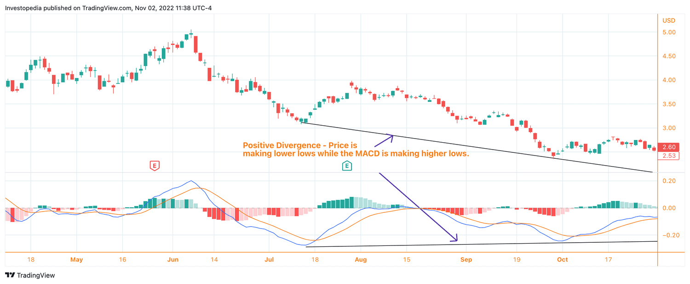

## Table of Contents

## What are penny stocks and why are they considered high-risk?

Penny stocks are stocks that trade at a very low price, usually less than a dollar. They are often from small companies that are just starting out or are not doing well. Because they are cheap, some people think they can buy a lot of them and make a big profit if the price goes up. But, penny stocks are not traded on big stock exchanges like the New York Stock Exchange. Instead, they are traded on smaller markets, which makes them harder to buy and sell.

Penny stocks are considered high-risk for a few reasons. First, they are very volatile, which means their prices can go up and down a lot in a short time. This makes it hard to predict what will happen to their value. Second, there is often less information available about these companies, so it's harder to know if they are a good investment. Finally, because they are not on big exchanges, it can be hard to sell them quickly if you need to. All these things make penny stocks a risky choice for investors.

## What defines a high-value penny stock?

A high-value penny stock is one that has the potential to grow a lot in the future. These stocks come from small companies that might be working on something new or exciting. Even though they are cheap now, if the company does well, the stock price could go up a lot. People look for penny stocks with strong business plans, good management, and a clear path to making money. These things can make a penny stock more valuable than others.

But, it's important to remember that even high-value penny stocks are risky. They can still lose value quickly, and it's hard to know for sure which ones will do well. Investors need to do a lot of research and be ready to lose their money. High-value penny stocks might offer big rewards, but they also come with big risks.

## How can a beginner identify potential high-value penny stocks?

A beginner can start by looking at the company's business plan. A good business plan will explain what the company does and how it plans to make money. It should be easy to understand and sound like it could work. Beginners should also check out the management team. A team with experience and a good track record can make a big difference. Look for news or articles about the company to see if people think it has a bright future.

Another way to find high-value penny stocks is by looking at the company's financials. Even though penny stock companies are small, they should still show signs of growth. Look for companies that are making more money each year or that are getting more customers. It's also a good idea to see if other investors are buying the stock. If a lot of people are interested, it might mean the stock has potential. Remember, though, that even with all this research, penny stocks are still risky. Always be ready to lose the money you invest.

## What are the key financial ratios to look at when evaluating penny stocks?

When evaluating penny stocks, it's important to look at a few key financial ratios. The first one to consider is the price-to-earnings (P/E) ratio. This ratio tells you how much you are paying for each dollar of the company's earnings. A lower P/E ratio might mean the stock is a good deal, but it could also mean the company is not doing well. Another important ratio is the price-to-sales (P/S) ratio. This shows how much you are paying for each dollar of the company's sales. A lower P/S ratio can be a sign that the stock is undervalued.

You should also look at the debt-to-equity (D/E) ratio. This ratio shows how much debt the company has compared to its equity. A high D/E ratio can mean the company is risky because it has a lot of debt. Finally, the current ratio is useful because it shows if the company can pay its short-term bills. A current ratio above 1 means the company has more assets than liabilities, which is good. These ratios can help you understand if a penny stock might be a good investment, but remember, they are just part of the story. Always do more research before you decide to buy.

## What role does market volatility play in the valuation of penny stocks?

Market [volatility](/wiki/volatility-trading-strategies) plays a big role in the valuation of penny stocks. Penny stocks are known for being very up and down. This means their prices can change a lot in a short time. When the market is volatile, the prices of penny stocks can go up and down even more than usual. This makes it hard to know what a penny stock is really worth because its price can change so quickly.

Because of this volatility, it can be risky to invest in penny stocks. If you buy one when its price is high, it might drop a lot very soon. On the other hand, if you buy one when its price is low, it could go up a lot if the company does well. But it's hard to predict what will happen. So, when you're looking at penny stocks, you need to think about how the market's ups and downs can affect their value.

## How important is the company's business model and sector in determining the value of penny stocks?

The company's business model and the sector it is in are very important when figuring out the value of penny stocks. A good business model means the company has a clear plan for making money. If the plan makes sense and seems like it could work, the penny stock might be worth more. Also, some sectors, like technology or healthcare, can be more exciting to investors because they are growing fast. If a penny stock company is in one of these hot sectors, its value might go up because people think it has a good future.

But, even if a company has a great business model and is in a good sector, penny stocks are still risky. The business model might not work out, or the sector might change. For example, a new law could make it harder for companies in that sector to make money. So, while the business model and sector are important, they are just part of what you need to look at. You also need to think about other things like the company's financials and how the market is doing.

## What are the common indicators of a potential breakout in penny stocks?

A potential [breakout](/wiki/breakout-trading) in penny stocks can often be spotted by looking at the stock's trading volume. If a lot more people are buying and selling the stock than usual, it might mean that something big is about to happen. This could be good news about the company or just more interest from investors. When the trading volume goes up a lot, it can push the stock's price up too, which is what people call a breakout.

Another sign of a breakout can be seen in the stock's price patterns. If the stock's price has been moving in a certain way for a while and then suddenly breaks out of that pattern, it might be a sign that the stock is about to go up a lot. For example, if the stock has been going up and down between two prices and then suddenly goes above the higher price, that could be a breakout. It's important to watch these patterns and volumes closely because they can help you decide if it's a good time to buy the stock.

## How do insider trading activities influence the perception of high-value penny stocks?

Insider trading activities can have a big impact on how people see high-value penny stocks. When people who work at the company, like the CEO or other top managers, buy a lot of the company's stock, it can make other investors think the stock is a good buy. They might think these insiders know something good is going to happen to the company, so they want to buy more stock before the price goes up. This can make the stock seem more valuable and attract more investors.

On the other hand, if insiders are selling a lot of their stock, it can make people worried. They might think the insiders know something bad is going to happen, so they want to get rid of their stock before the price goes down. This can make the stock seem less valuable and scare away other investors. So, watching what insiders do with their stock can give you clues about whether a penny stock might be a good investment or not.

## What technical analysis tools are most effective for trading high-value penny stocks?

When trading high-value penny stocks, one of the most effective technical analysis tools is the moving average. A moving average helps you see the average price of a stock over a certain time, like 50 days or 200 days. If the stock's price goes above the moving average, it might be a good time to buy because the stock could be starting to go up. If the price goes below the moving average, it might be a good time to sell because the stock could be starting to go down. Watching where the price is compared to the moving average can help you make better decisions about when to buy or sell.

Another useful tool is the Relative Strength Index (RSI). The RSI tells you if a stock is being bought a lot or sold a lot. It gives you a number between 0 and 100. If the RSI is over 70, it means the stock might be bought too much and could go down soon. If the RSI is under 30, it means the stock might be sold too much and could go up soon. Using the RSI can help you find good times to buy or sell penny stocks. Both moving averages and RSI can help you understand what might happen to the price of a high-value penny stock, but remember, they are just tools and don't guarantee success.

## How can an investor assess the management team's credibility and its impact on stock value?

An investor can assess the management team's credibility by looking at their past work and what they have done for the company so far. If the people running the company have a lot of experience and have done well in other jobs before, that's a good sign. You can also read news articles or reports about the company to see if people think the management team is doing a good job. If they are making smart choices and the company is growing, that can make the stock more valuable.

The impact of the management team on stock value is big. If investors trust the people running the company, they will be more likely to buy the stock. This can make the stock price go up. On the other hand, if the management team makes bad choices or if people don't trust them, investors might sell the stock, which can make the price go down. So, it's important to keep an eye on what the management team is doing and how well they are doing it.

## What are the advanced strategies for mitigating risks associated with high-value penny stocks?

One advanced strategy for mitigating risks with high-value penny stocks is to use stop-loss orders. A stop-loss order is a way to tell your broker to sell your stock if it drops to a certain price. This can help you limit how much money you lose if the stock goes down a lot. Another strategy is to diversify your investments. This means not putting all your money into just one or two penny stocks. Instead, you can spread your money out across different stocks or even different types of investments. This way, if one stock does badly, you won't lose all your money.

Another important strategy is to do a lot of research before you buy. Look at the company's financials, read news about the company, and check out what the management team is doing. The more you know about the company, the better you can guess if the stock will go up or down. Also, it's smart to keep an eye on the market and how other investors are acting. If a lot of people are buying or selling the stock, it can give you clues about what might happen next. By using these strategies, you can make smarter choices and lower the risks of investing in high-value penny stocks.

## How do macroeconomic factors affect the performance and valuation of high-value penny stocks?

Macroeconomic factors can have a big impact on high-value penny stocks. These factors include things like interest rates, inflation, and the overall health of the economy. When the economy is doing well, people might feel more confident about investing in risky things like penny stocks. This can make the prices of these stocks go up. On the other hand, if the economy is not doing well, people might be more scared to invest in risky stocks, which can make the prices of penny stocks go down.

Also, changes in interest rates can affect penny stocks. If interest rates go up, it can be harder for small companies to borrow money, which can make it harder for them to grow. This can make their stocks less valuable. Inflation can also play a role. If prices are going up a lot, it can make it harder for companies to make money, which can hurt their stock prices. So, keeping an eye on these big economic factors can help you understand what might happen to high-value penny stocks.

## What are the stock valuation techniques for penny stocks?

Valuing penny stocks presents a unique set of challenges, primarily due to their speculative nature and the scarcity of detailed financial information. Despite these hurdles, several stock valuation techniques can be adapted to assess the potential of these low-priced securities. Three widely recognized valuation methods are the Price-to-Earnings (P/E) ratio, the Price-to-Book (P/B) ratio, and the Discounted Cash Flow (DCF) analysis. However, their application to penny stocks requires careful adjustment and consideration.

1. **Price-to-Earnings Ratio (P/E Ratio):**

   The P/E ratio is a critical tool in determining a stock's market value relative to its earnings. For penny stocks, the P/E ratio may not always be reliable due to erratic earnings or negative profits. However, in cases where companies have stable earnings, the P/E ratio is calculated as:
$$
   \text{P/E Ratio} = \frac{\text{Market Price per Share}}{\text{Earnings per Share (EPS)}}

$$

   Investors need to be cautious when utilizing the P/E ratio for penny stocks, considering industry comparisons and the potential for inflated market prices based on speculative buying rather than fundamental strength.

2. **Price-to-Book Ratio (P/B Ratio):**

   The P/B ratio provides insights into how the market values a company compared to its book value. This measure is particularly useful for penny stocks with substantial tangible assets, which may provide a safety net against market volatility. It is computed as:
$$
   \text{P/B Ratio} = \frac{\text{Market Price per Share}}{\text{Book Value per Share}}

$$

   When evaluating penny stocks, investors should examine the quality and [liquidity](/wiki/liquidity-risk-premium) of the assets underpinning the book value, as these can significantly impact the firm's financial health and investment risk.

3. **Discounted Cash Flow Analysis (DCF Analysis):**

   DCF analysis estimates a company's value based on its expected future cash flows. This approach involves projecting the future cash flows and discounting them back to their present value using a discount rate. For penny stocks, this method poses challenges due to uncertain cash flow projections and the volatility inherent in these stocks. The formula used is:
$$
   \text{DCF} = \sum \left( \frac{\text{Cash Flow}_t}{(1 + r)^t} \right)

$$

   where $\text{Cash Flow}_t$ is the cash flow in year $t$ and $r$ is the discount rate.

   Investors must conduct thorough research to ensure realistic assumptions and projections about the company's future prospects, market conditions, and risk factors.

### Due Diligence

A thorough due diligence process is indispensable when evaluating penny stocks. Given the limited availability and reliability of financial statements, investors should extend their analysis beyond traditional metrics. This includes assessing the company's management team, industry position, and potential for competitive advantage, as well as considering macroeconomic factors that might impact the business model. Ensuring a comprehensive understanding of the company's strategy and market dynamics can reveal significant insights that complement traditional valuation techniques.

Analyzing penny stocks requires an informed approach that integrates both quantitative metrics and qualitative factors, ensuring that investors can differentiate between speculative opportunities and genuine growth prospects.

## What are the key investment indicators?

Investment indicators provide invaluable insights into the potential performance of penny stocks, especially given their typically volatile nature and limited financial data. They offer a way to make more informed decisions by applying objective, quantitative measures. Understanding and effectively utilizing these indicators can be the difference between a profitable investment and a significant loss.

**Relative Strength Index (RSI)** is a momentum oscillator that measures the speed and change of price movements. It ranges from 0 to 100, typically viewed over a 14-day period. In the context of penny stocks, an RSI above 70 may indicate that the stock is overbought, potentially signaling a price correction. Conversely, an RSI below 30 suggests that the stock may be oversold, indicating a potential buying opportunity.

$$
RSI = 100 - \left( \frac{100}{1 + \frac{\text{Average Gain}}{\text{Average Loss}}} \right)
$$

**Moving Average Convergence Divergence (MACD)** is a trend-following momentum indicator that shows the relationship between two moving averages of a stock’s price. The MACD is calculated by subtracting the 26-period Exponential Moving Average (EMA) from the 12-period EMA. The result of this calculation is the MACD line. A nine-day EMA of the MACD, called the "signal line," is then plotted on top of the MACD line, which can function as a trigger for buy and sell signals. MACD is particularly useful for identifying potential entry and exit points in penny stocks.

```python
import pandas as pd

def calculate_macd(close_prices):
    ema_short = close_prices.ewm(span=12, adjust=False).mean()
    ema_long = close_prices.ewm(span=26, adjust=False).mean()
    macd = ema_short - ema_long
    signal = macd.ewm(span=9, adjust=False).mean()
    return macd, signal
```

**Volume analysis** is another critical indicator that helps in understanding the strength of a stock’s price movement. For penny stocks, significant price moves accompanied by high volume provide a stronger signal than those on low volume. Volume increases can indicate investor conviction and precede trend continuations or reversals. A spike in volume may suggest heightened interest or a significant news event related to the stock.

Technical analysis, employing indicators like RSI, MACD, and [volume](/wiki/volume-trading-strategy), is essential for assessing [momentum](/wiki/momentum) and market sentiment surrounding penny stocks. Given the high volatility, robust technical analysis ensures investors can identify patterns and trends that may not be immediately obvious, allowing for strategic timing on entry and [exit](/wiki/exit-strategy) points. These tools equip investors to navigate the unpredictable nature of penny stocks, thereby encouraging more data-driven decisions.

## References & Further Reading

[1]: Bergstra, J., Bardenet, R., Bengio, Y., & Kégl, B. (2011). ["Algorithms for Hyper-Parameter Optimization."](https://dl.acm.org/doi/10.5555/2986459.2986743) Advances in Neural Information Processing Systems 24.

[2]: ["Advances in Financial Machine Learning"](https://www.amazon.com/Advances-Financial-Machine-Learning-Marcos/dp/1119482089) by Marcos Lopez de Prado

[3]: ["Evidence-Based Technical Analysis: Applying the Scientific Method and Statistical Inference to Trading Signals"](https://www.amazon.com/Evidence-Based-Technical-Analysis-Scientific-Statistical/dp/0470008741) by David Aronson

[4]: ["Machine Learning for Algorithmic Trading"](https://github.com/stefan-jansen/machine-learning-for-trading) by Stefan Jansen

[5]: ["Quantitative Trading: How to Build Your Own Algorithmic Trading Business"](https://www.amazon.com/Quantitative-Trading-Build-Algorithmic-Business/dp/1119800064) by Ernest P. Chan