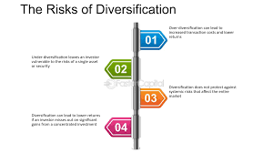

## Table of Contents

## What is over-diversification in the context of investments?

Over-diversification in investments happens when an investor spreads their money across too many different investments. Instead of focusing on a few good opportunities, they end up owning a lot of different stocks, bonds, or funds. This can make it hard to keep track of everything and might lead to lower returns because the good performers get diluted by the poor ones.

When you over-diversify, you might think you're reducing risk, but you could actually be making your portfolio less effective. It's like trying to catch too many fish with a net that's too wide – you might end up with a lot of small fish instead of a few big ones. It's important to find a balance where you have enough variety to manage risk but not so much that you lose the potential for good returns.

## How can an investor identify if their portfolio is over-diversified?

An investor can tell if their portfolio is over-diversified by looking at how many different investments they have. If they own a lot of stocks, bonds, or funds, especially if they can't easily keep track of all of them, it might be a sign of over-diversification. Another clue is if the portfolio is so spread out that no single investment makes a big difference in the overall performance. If the good and bad performers cancel each other out, and the portfolio just moves with the market without any standout gains, it could be too diversified.

Another way to spot over-diversification is by checking if the portfolio includes too many similar investments. For example, if an investor has many different tech stocks, it might look diverse, but it's really just a lot of the same thing. This doesn't reduce risk as much as having a mix of different types of investments, like tech, healthcare, and real estate. If an investor feels overwhelmed by the complexity of managing their investments or if they're not seeing the returns they expected despite a large number of holdings, it's likely time to simplify and focus on fewer, but stronger, investments.

## What are the common signs that indicate a portfolio might be over-diversified?

One sign that a portfolio might be over-diversified is when an investor has too many different investments. It's hard to keep track of all of them, and they might forget what they own. If the portfolio has so many stocks, bonds, or funds that it's confusing to manage, it could be over-diversified. Another sign is when no single investment really stands out in terms of performance. If the good and bad investments balance each other out, and the portfolio just moves along with the market without any big wins, that's a clue that it might be spread too thin.

Another way to tell if a portfolio is over-diversified is by looking at how similar the investments are. For example, if someone has a lot of different tech stocks, it might seem diverse, but it's really just a lot of the same thing. This doesn't reduce risk as much as having a mix of different types of investments, like tech, healthcare, and real estate. If an investor feels overwhelmed by managing their investments or isn't seeing the returns they hoped for despite having many holdings, it's a good idea to simplify and focus on fewer, but stronger, investments.

## Can over-diversification impact the overall performance of an investment portfolio?

Over-diversification can definitely affect how well an investment portfolio does. When an investor spreads their money across too many different investments, it can water down the impact of the best performers. Instead of focusing on a few strong opportunities, the portfolio ends up with a lot of small gains and losses that cancel each other out. This can lead to lower returns because the good investments don't have enough weight to make a big difference.

It's also harder to keep track of everything when a portfolio is over-diversified. An investor might own so many different stocks, bonds, or funds that they lose sight of what they have. This can make it tough to make smart decisions about buying or selling. Plus, if the portfolio is filled with similar types of investments, like a bunch of tech stocks, it might seem diverse but really isn't. This doesn't help reduce risk as much as having a good mix of different kinds of investments.

## What is the difference between diversification and over-diversification?

Diversification is when an investor spreads their money across different types of investments to reduce risk. It's like not putting all your eggs in one basket. By having a mix of stocks, bonds, and maybe even real estate or commodities, an investor can protect themselves if one type of investment doesn't do well. The idea is to have enough variety so that if one investment goes down, others might go up or stay steady, balancing things out.

Over-diversification happens when an investor spreads their money too thin, across too many different investments. Instead of focusing on a few good opportunities, they end up with a lot of small investments that can be hard to keep track of. This can water down the impact of the best performers, leading to lower overall returns. Over-diversification can make it hard to see which investments are doing well and which aren't, and it might not reduce risk as much as having a well-thought-out mix of different types of investments.

## How does over-diversification affect risk management in a portfolio?

Over-diversification can make it harder to manage risk in a portfolio. When an investor spreads their money across too many different investments, it can be tough to keep track of everything. If something goes wrong with one investment, it might be hard to notice because there are so many others to look at. This can lead to missing important signs that it's time to sell or buy more of something else. Instead of reducing risk, over-diversification might actually make it harder to handle because the investor can't focus on the most important parts of their portfolio.

Also, over-diversification might not help reduce risk as much as a well-thought-out mix of different types of investments. If an investor has a lot of similar investments, like many different tech stocks, it might look diverse but really isn't. This doesn't spread out the risk as well as having a mix of stocks, bonds, real estate, and other kinds of investments. When a portfolio is over-diversified, it can be hard to see the big picture and make smart decisions about managing risk.

## What are the potential drawbacks of having too many assets in a portfolio?

Having too many assets in a portfolio can make it hard to keep track of everything. When an investor owns a lot of different stocks, bonds, or funds, it can be confusing to manage. They might forget what they own or miss important updates about their investments. This can lead to missing out on chances to sell something that's not doing well or buy more of something that's doing great. Instead of helping, having too many assets can actually make it harder to make good decisions.

Another problem with having too many assets is that it can water down the impact of the best performers. If an investor spreads their money too thin, the good investments don't have enough weight to make a big difference in the overall portfolio. This can lead to lower returns because the gains from the best investments get mixed in with a lot of smaller gains and losses. It's like trying to catch too many fish with a net that's too wide – you might end up with a lot of small fish instead of a few big ones.

## How can an investor measure the level of diversification in their portfolio?

An investor can measure the level of diversification in their portfolio by looking at how many different types of investments they have. If they have a mix of stocks, bonds, real estate, and maybe even commodities, that's a good sign of diversification. They should also check if these investments are spread across different industries and countries. For example, having stocks in tech, healthcare, and energy, as well as bonds from different countries, shows a well-diversified portfolio. If they find they have too many similar investments, like a lot of tech stocks, it might mean their portfolio isn't as diversified as they thought.

Another way to measure diversification is by looking at how each investment affects the overall performance of the portfolio. If one investment going up or down makes a big difference, the portfolio might not be very diversified. On the other hand, if the portfolio moves smoothly without big swings, it's likely well-diversified. An investor can also use tools like the correlation coefficient to see how different investments move together. If many investments move in the same way, it might mean the portfolio is not as diversified as it should be. By keeping an eye on these things, an investor can make sure their portfolio is balanced and not over-diversified.

## What strategies can be used to avoid over-diversification?

To avoid over-diversification, an investor should focus on having a good mix of different types of investments, like stocks, bonds, and maybe real estate or commodities. Instead of buying a lot of different stocks, they should pick a few strong ones from different industries. For example, they could have stocks in tech, healthcare, and energy. This way, if one industry doesn't do well, the others might help balance things out. It's also important to not have too many similar investments, like a bunch of tech stocks, because that doesn't really spread out the risk.

Another strategy is to keep the portfolio simple and easy to manage. If an investor can't easily keep track of all their investments, it might be a sign that they have too many. They should aim to have enough variety to reduce risk but not so much that it's hard to see what's going on. Regularly checking the portfolio to see how each investment affects the overall performance can help. If one investment going up or down makes a big difference, it might be time to add more variety. By focusing on quality over quantity and keeping things simple, an investor can avoid over-diversification and manage their portfolio better.

## How does over-diversification relate to the concept of diminishing returns?

Over-diversification can lead to diminishing returns because when an investor spreads their money across too many different investments, it can water down the impact of the best performers. Instead of focusing on a few strong opportunities, the portfolio ends up with a lot of small gains and losses that cancel each other out. This means the good investments don't have enough weight to make a big difference in the overall performance, leading to lower returns.

When a portfolio is over-diversified, it's hard to see which investments are doing well and which aren't. This can make it tough to make smart decisions about buying or selling. If an investor has too many assets, they might miss out on the chance to sell something that's not doing well or buy more of something that's doing great. So, over-diversification can lead to diminishing returns because it makes it harder to focus on the investments that really matter.

## What are advanced metrics or tools that can help detect over-diversification?

Advanced metrics like the correlation coefficient can help detect over-diversification. This tool measures how different investments move together. If many investments in a portfolio move in the same way, it might mean the portfolio is not as diversified as it should be. Another useful metric is the Herfindahl-Hirschman Index (HHI), which looks at the concentration of investments. A high HHI score means the portfolio is focused on a few investments, while a low score might show over-diversification because the investments are spread too thin.

Portfolio analysis software can also help detect over-diversification. These tools can show how each investment affects the overall performance of the portfolio. If the portfolio moves smoothly without big swings, it's likely well-diversified. But if it's hard to see which investments are doing well because there are too many, it might be over-diversified. By using these advanced metrics and tools, an investor can keep their portfolio balanced and avoid spreading their money too thin.

## How can portfolio rebalancing help in managing over-diversification?

Portfolio rebalancing can help manage over-diversification by making sure the investments are spread out in a good way. If an investor has too many different investments, rebalancing can help them focus on the ones that are doing well. They can sell some of the weaker investments and use that money to buy more of the strong ones. This way, the portfolio stays balanced and the best investments can have a bigger impact on the overall performance.

Rebalancing also helps keep the portfolio in line with the investor's goals. If the portfolio gets too spread out, it might not be following the original plan. By regularly checking and adjusting the investments, an investor can make sure they are not over-diversified. This means they can keep the right mix of stocks, bonds, and other investments, making it easier to manage risk and aim for better returns.

## What is Over-Diversification and How Can We Understand It?

Over-diversification occurs when the inclusion of additional assets in a portfolio leads to diminished returns, primarily because of increased complexity and heightened management expenses. This phenomenon often manifests in several identifiable ways. For example, investors may find themselves holding a multitude of similar funds or stocks. This redundancy not only fails to offer significant diversification benefits but also escalates transaction and management costs.

Another common sign of over-diversification is the possession of assets that do not align with an investor's expertise or financial objectives. In such scenarios, the investor might be acquiring assets that contribute little to portfolio optimization, again tipping the cost-benefit scale unfavorably. This situation underscores the importance of having a clear investment strategy and selecting assets accordingly.

The objective of diversification is to mitigate risk, but when taken too far, it can result in what is referred to as risk dilution. This occurs when the variety of investments is so wide that the added complexity and overlap cancel out the risk mitigation benefits, leaving the portfolio's overall risk profile virtually unchanged or even increased. This is counterproductive as the core aim of diversification is to balance risk and potential returns.

A simple mathematical representation of diversification benefits employs the correlation coefficient ($\rho$) between asset returns. Ideally, reducing portfolio risk ($\sigma_p$) is achieved by combining negatively correlated assets:

$$
\sigma_p = \sqrt{\frac{1}{n^2} \sum_{i=1}^{n}\sum_{j=1}^{n}\sigma_i \sigma_j \rho_{ij}}
$$

Here, $\sigma_i$ and $\sigma_j$ are the standard deviations of assets $i$ and $j$, and $n$ is the number of assets. When $\rho_{ij} = 1$, the portfolio risk remains high. As more assets are added without regard to their correlation, the reduction in $\sigma_p$ may plateau or reverse, effectively nullifying the benefits of diversification.

In conclusion, prudent portfolio management requires a nuanced approach to diversification, ensuring that the addition of assets genuinely contributes to mitigating risk without introducing excessive complexity and unnecessary costs.

## References & Further Reading

[1]: Bergstra, J., Bardenet, R., Bengio, Y., & Kégl, B. (2011). ["Algorithms for Hyper-Parameter Optimization."](https://dl.acm.org/doi/10.5555/2986459.2986743) Advances in Neural Information Processing Systems 24.

[2]: ["Advances in Financial Machine Learning"](https://www.amazon.com/Advances-Financial-Machine-Learning-Marcos/dp/1119482089) by Marcos Lopez de Prado

[3]: ["Evidence-Based Technical Analysis: Applying the Scientific Method and Statistical Inference to Trading Signals"](https://www.amazon.com/Evidence-Based-Technical-Analysis-Scientific-Statistical/dp/0470008741) by David Aronson

[4]: ["Machine Learning for Algorithmic Trading"](https://github.com/stefan-jansen/machine-learning-for-trading) by Stefan Jansen

[5]: ["Quantitative Trading: How to Build Your Own Algorithmic Trading Business"](https://www.amazon.com/Quantitative-Trading-Build-Algorithmic-Business/dp/1119800064) by Ernest P. Chan

[6]: Markowitz, H. (1952). ["Portfolio Selection."](https://onlinelibrary.wiley.com/doi/abs/10.1111/j.1540-6261.1952.tb01525.x) The Journal of Finance, 7(1), 77-91.

[7]: Sharpe, W. F. (1994). ["The Sharpe Ratio."](https://web.stanford.edu/~wfsharpe/art/sr/SR.htm) The Journal of Portfolio Management, 21(1), 49-58.

[8]: Clarke, R. G., de Silva, H., & Thorley, S. (2002). ["Portfolio Constraints and the Fundamental Law of Active Management."](https://www.jstor.org/stable/4480417) Financial Analysts Journal, 58(5), 48-66.

[9]: Kritzman, M., Page, S., & Turkington, D. (2010). ["In Defense of Optimization: The Fallacy of 1/N."](https://www.jstor.org/stable/27809177) Financial Analysts Journal, 66(2), 31-39.