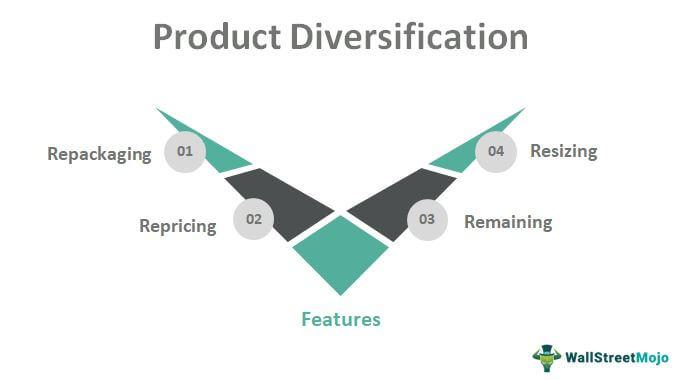

Diversification remains a cornerstone strategy in the management of investment portfolios, primarily aimed at reducing risk and optimizing returns. Ideally, diversification involves spreading investments across various financial instruments, sectors, or markets to mitigate potential losses from any single asset underperforming. This classical approach, rooted in modern portfolio theory, is symbolized by the adage, "Don't put all your eggs in one basket."

However, diversification can sometimes be taken to extremes, resulting in what is termed as "over-diversification" or "diworsification." This occurs when a portfolio becomes overly complex, involving excessive investment across multiple assets, which can inadvertently lead to inefficiencies. Excessive diversification may heighten management costs, complicate performance tracking, and ultimately yield returns that fall short on a risk-adjusted basis. Instead of reducing risk, an over-diversified portfolio may actually dilute potential returns without providing significant additional risk mitigation.



With the advent of algorithmic trading, new dimensions have been added to the discourse on diversification. Algorithmic trading utilizes computer programs to automatically execute trades when predetermined criteria are met, facilitating opportunities for more sophisticated and rapid diversification strategies. These algorithms have the capability to process vast amounts of market data and execute trades across various asset classes and geographic markets. Such capabilities can theoretically enhance portfolio diversification, offering exposure to a wide array of investments while reducing human error and emotional bias.

Despite these advantages, algorithmic trading also presents challenges in the context of diversification. The automated nature of algorithms can lead to over-diversification if not properly calibrated. Without meticulous oversight, algorithmic strategies might inadvertently accumulate a large number of similar or correlated assets, negating the intended risk-mitigating effects of diversification.

This article examines the nuanced risks associated with over-diversification, particularly in the domain of algorithmic trading. By analyzing potential pitfalls and strategies for maintaining effective diversification, it aims to offer valuable insights into optimizing portfolio strategies for robust performance.

## Table of Contents

## Understanding Over-Diversification

Over-diversification occurs when the inclusion of additional assets in a portfolio leads to diminished returns, primarily because of increased complexity and heightened management expenses. This phenomenon often manifests in several identifiable ways. For example, investors may find themselves holding a multitude of similar funds or stocks. This redundancy not only fails to offer significant diversification benefits but also escalates transaction and management costs.

Another common sign of over-diversification is the possession of assets that do not align with an investor's expertise or financial objectives. In such scenarios, the investor might be acquiring assets that contribute little to portfolio optimization, again tipping the cost-benefit scale unfavorably. This situation underscores the importance of having a clear investment strategy and selecting assets accordingly.

The objective of diversification is to mitigate risk, but when taken too far, it can result in what is referred to as risk dilution. This occurs when the variety of investments is so wide that the added complexity and overlap cancel out the risk mitigation benefits, leaving the portfolio's overall risk profile virtually unchanged or even increased. This is counterproductive as the core aim of diversification is to balance risk and potential returns.

A simple mathematical representation of diversification benefits employs the correlation coefficient ($\rho$) between asset returns. Ideally, reducing portfolio risk ($\sigma_p$) is achieved by combining negatively correlated assets:

$$
\sigma_p = \sqrt{\frac{1}{n^2} \sum_{i=1}^{n}\sum_{j=1}^{n}\sigma_i \sigma_j \rho_{ij}}
$$

Here, $\sigma_i$ and $\sigma_j$ are the standard deviations of assets $i$ and $j$, and $n$ is the number of assets. When $\rho_{ij} = 1$, the portfolio risk remains high. As more assets are added without regard to their correlation, the reduction in $\sigma_p$ may plateau or reverse, effectively nullifying the benefits of diversification.

In conclusion, prudent portfolio management requires a nuanced approach to diversification, ensuring that the addition of assets genuinely contributes to mitigating risk without introducing excessive complexity and unnecessary costs.

## Risks of Over-Diversification

Over-diversification presents several risks that can impair an investor's ability to achieve optimal returns. Central to this issue is the inefficiency introduced when a portfolio becomes excessively diversified without a corresponding reduction in risk. One manifestation of this is the ownership of too many similar funds, especially within the same asset class or investment style. Such redundancies can lead to increased transaction costs because each fund incurs management fees and operational expenses. While diversification aims to spread risk, having multiple similar investments can result in negligible additional risk mitigation, thus yielding diminishing returns.

The use of multimanager products further compounds the risks associated with over-diversification. These products often incorporate multiple investment managers within a single portfolio, each potentially employing overlapping strategies. This can lead to a lack of customization tailored to an investor's specific objectives and an increase in the layers of fees paid. With each manager commanding a fee, the cumulative cost can significantly erode the portfolio's net returns. Additionally, having multiple managers with similar mandates might not effectively diversify risk but rather replicate holdings, adding to portfolio complexity without commensurate benefits.

Moreover, holding an excessive number of individual stocks, especially when these holdings are not carefully selected, can mimic the characteristics of broad market indexes. This is problematic because such mimicry comes with the costs typically associated with active management—research, transaction fees, and increased administration—without harnessing the low-cost efficiency of passive index investing. In essence, investors face the dual burden of higher management costs and complicated portfolio oversight without achieving true diversification beyond what an index provides.

Investors must balance these considerations to avoid counterproductive over-diversification. A prudent approach involves critically assessing each addition to a portfolio, ensuring that it contributes unique value and genuinely aids in risk reduction relative to its cost.

## Algorithmic Trading and Diversification

Algorithmic trading is a sophisticated process that leverages computer algorithms to execute trades based on predetermined criteria, offering various advantages in terms of diversification. It enhances diversification opportunities by enabling broader asset exposure, granting traders access to global markets, and allowing for dynamic portfolio allocation.

One key advantage of [algorithmic trading](/wiki/algorithmic-trading) is its capacity to manage a diversified portfolio with precision and speed that is nearly impossible for human traders to achieve manually. Algorithms can process and analyze vast amounts of market data to identify opportunities across different asset classes, sectors, and geographies. This broad exposure helps in spreading risk across a wide array of investments, which is a fundamental principle of diversification.

Furthermore, algorithmic trading can identify uncorrelated assets—those that do not move in tandem with the rest of the market—allowing traders to construct portfolios that are less susceptible to systemic risks. By including assets with low correlation to each other, algorithms can minimize the [volatility](/wiki/volatility-trading-strategies) of the portfolio and improve its risk-adjusted returns. The mathematical foundation behind this is often explored through the covariance matrix, which assesses the interdependencies among asset returns. For example, by minimizing the off-diagonal elements of this matrix, algorithms can craft asset combinations that reduce overall portfolio risk.

In addition to identifying uncorrelated assets, algorithmic trading enables dynamic portfolio allocation. Algorithms continually adjust asset positions in response to real-time market developments, optimizing the allocation of assets to maximize returns while controlling for risk. This adaptive capability ensures that portfolios are not static and can capitalize on short-term trading opportunities while maintaining long-term investment objectives.

Python, a popular programming language in finance, provides libraries such as pandas, numpy, and scikit-learn that are instrumental in building and testing algorithmic trading strategies for diversification. Here's an example of how one might use Python to calculate the correlation between different asset returns to assist in diversification:

```python
import pandas as pd
import numpy as np

# Sample data for asset returns
data = {
    'Asset_A': [0.01, 0.02, 0.015, 0.02, 0.03],
    'Asset_B': [0.012, 0.018, 0.014, 0.022, 0.028],
    'Asset_C': [0.015, 0.017, 0.016, 0.021, 0.026]
}

# Create a DataFrame
df = pd.DataFrame(data)

# Calculate the correlation matrix
correlation_matrix = df.corr()

print(correlation_matrix)
```

This script calculates the correlation matrix for a given set of asset returns, which can be used to determine how the assets could be combined to achieve an optimal diversified portfolio. Algorithmic trading, through such tools and techniques, thus offers a robust mechanism for diversification, enhancing risk management and potentially leading to superior financial outcomes.

## Strategies Employed in Algorithmic Trading

Algorithmic trading employs a range of sophisticated strategies aimed at capitalizing on market inefficiencies, enhancing portfolio diversity, and optimizing returns. Three prominent strategies include statistical [arbitrage](/wiki/arbitrage), [global macro](/wiki/global-macro-strategy) strategies, and sector rotation.

Statistical arbitrage, often referred to as stat arb, is a strategy that exploits the statistical mean-reversion properties of asset prices. It involves identifying price discrepancies among multiple securities that are statistically related. This strategy utilizes mathematical models to evaluate historical price data and predict future price movements. Here’s a simple Python example illustrating the concept of [statistical arbitrage](/wiki/statistical-arbitrage):

```python
import numpy as np
import pandas as pd
from statsmodels.tsa.stattools import coint

# Hypothetical prices for stock A and B
prices_A = np.random.normal(100, 1, 1000)
prices_B = prices_A + np.random.normal(0, 0.1, 1000)

# Calculate the cointegration between stock A and B
score, p_value, _ = coint(prices_A, prices_B)

if p_value < 0.05:
    print("Statistical arbitrage opportunity detected")
```

This script checks for cointegration between the price series of two stocks, indicating a potential arbitrage opportunity when p-value is below a threshold (typically 0.05).

Global macro strategies involve making investment decisions based on macroeconomic indicators and events. These strategies take into account economic conditions like interest rates, currency strengths, GDP growth, and geopolitical events to diversify investments across various geographies. By utilizing these economic indicators, traders seek to predict and profit from the effects on asset classes and the global economy. For instance, a trader might increase holdings in emerging markets if indicators suggest upcoming economic growth in those regions.

Sector rotation involves shifting portfolio investments among different sectors of the economy at the appropriate times to capture performance disparities. This strategy is based on the economic cycle, as different sectors outperform during different phases. For example, consumer staples might perform better during economic downturns, while technology stocks could outperform during times of economic expansion. Sector rotation requires a keen understanding of economic indicators and their expected influence on various sectors, and it often aligns investments with the most favorable sectors based on predicted economic conditions.

Together, these strategies highlight the diverse approaches utilized in algorithmic trading that leverage economic data, market inefficiencies, and statistical analyses to make informed trading decisions that aim to optimize portfolio management and returns.

## Avoiding Over-Diversification in Algorithmic Portfolios

In algorithmic portfolios, mitigation of over-diversification begins with strategic diversification across multiple algorithmic strategies. By diversifying strategies, investors can address the potential for over-reliance on a singular strategy or market, thereby enhancing the resilience of their portfolio against unforeseen market changes. For example, incorporating [momentum](/wiki/momentum), mean reversion, and arbitrage strategies can distribute risk more evenly across various trading paradigms, thus reducing the concentration risk.

Regular monitoring and prudent adjustment of portfolios according to performance metrics and predefined risk parameters are crucial components of maintaining an effectively diversified portfolio. Algorithmic tools facilitate real-time analysis and adjustments, allowing investors to optimize their holdings dynamically. This involves conducting periodic reviews of the portfolio's performance relative to its benchmarks, and making necessary adjustments when deviations exceed predefined thresholds. Investors should consider employing risk metrics such as Value at Risk (VaR) or Conditional Value at Risk (CVaR) to quantify and adjust to potential losses.

Thorough [backtesting](/wiki/backtesting) is an indispensable process for ensuring that algorithmic strategies are aligned with the investor's risk profile and objectives. Backtesting involves simulating the performance of a strategy using historical data to assess its viability. A comprehensive backtesting process should encompass multiple market scenarios and stress tests to ascertain the strategy's robustness across different conditions. This ensures that the strategy remains effective, even during periods of market volatility.

The use of backtesting in Python can be illustrated through a simple example using the pandas and numpy libraries for simulating a basic moving average crossover strategy:

```python
import numpy as np
import pandas as pd

# Sample historical price data
data = pd.DataFrame({'Price': [100, 101, 102, 103, 102, 100, 99, 98, 100, 102]})

# Calculate short and long moving averages
short_window = 3
long_window = 5

data['Short_MA'] = data['Price'].rolling(window=short_window, min_periods=1).mean()
data['Long_MA'] = data['Price'].rolling(window=long_window, min_periods=1).mean()

# Generate trading signals
data['Signal'] = 0
data['Signal'][short_window:] = np.where(data['Short_MA'][short_window:] > data['Long_MA'][short_window:], 1, 0)
data['Position'] = data['Signal'].diff()

print(data)
```

In this example, a simple moving average crossover strategy is backtested using historical price data. By evaluating the periods where the short-term moving average crosses above the long-term moving average, a buy signal is generated, indicating a potential profitable trend. Through iterative testing and refinement of similar strategies, investors can identify the optimal parameters that meet their risk tolerance and return expectations.

Ultimately, avoiding over-diversification through these methodologies helps maintain balance in an algorithmic portfolio, aligning it with the investor's objectives while mitigating avoidable risks.

## Conclusion

Effective diversification is crucial in constructing an investment portfolio that balances risk and potential returns. This strategy embodies the principle of not putting all eggs in one basket, thus spreading investment across various asset classes, sectors, or geographic locations to mitigate risk. However, diversification should not excessively dilute potential gains.

Algorithmic trading brings a sophisticated layer to diversification, enabling portfolios to access a broader range of assets and markets with precision and speed. By employing algorithms, investors can dynamically adjust portfolios, taking advantage of market opportunities while maintaining a balanced risk profile. This advanced approach allows the identification of uncorrelated assets, which helps in reducing portfolio volatility and enhancing risk-adjusted returns.

The true power of algorithmic trading lies in its ability to implement strategies such as statistical arbitrage, sector rotation, and global macro strategies with discipline and accuracy. These methods enable investors to capitalize on market inefficiencies and economic changes while maintaining diversification.

Despite these advantages, investors must exercise prudence in strategy selection and continuous portfolio management to prevent over-diversification. Over-diversifying can lead to increased transaction costs and diluted returns, as excessive exposure to similar assets or strategies may mimic broader market indices without the associated benefits. To avoid this pitfall, investors should regularly monitor portfolio performance and make adjustments based on thorough analysis and backtesting. This ensures that portfolios align with predefined risk parameters and investor goals.

In conclusion, while algorithmic trading has revolutionized diversification strategies, achieving optimal results hinges on maintaining a delicate balance. By understanding and avoiding over-diversification, investors can craft portfolios that not only mitigate risk but also enhance performance, providing both stability and growth in the ever-evolving financial markets.

## References & Further Reading

[1]: Bergstra, J., Bardenet, R., Bengio, Y., & Kégl, B. (2011). ["Algorithms for Hyper-Parameter Optimization."](https://dl.acm.org/doi/10.5555/2986459.2986743) Advances in Neural Information Processing Systems 24.

[2]: ["Advances in Financial Machine Learning"](https://www.amazon.com/Advances-Financial-Machine-Learning-Marcos/dp/1119482089) by Marcos Lopez de Prado

[3]: ["Evidence-Based Technical Analysis: Applying the Scientific Method and Statistical Inference to Trading Signals"](https://www.amazon.com/Evidence-Based-Technical-Analysis-Scientific-Statistical/dp/0470008741) by David Aronson

[4]: ["Machine Learning for Algorithmic Trading"](https://github.com/stefan-jansen/machine-learning-for-trading) by Stefan Jansen

[5]: ["Quantitative Trading: How to Build Your Own Algorithmic Trading Business"](https://www.amazon.com/Quantitative-Trading-Build-Algorithmic-Business/dp/1119800064) by Ernest P. Chan

[6]: Markowitz, H. (1952). ["Portfolio Selection."](https://onlinelibrary.wiley.com/doi/abs/10.1111/j.1540-6261.1952.tb01525.x) The Journal of Finance, 7(1), 77-91.

[7]: Sharpe, W. F. (1994). ["The Sharpe Ratio."](https://web.stanford.edu/~wfsharpe/art/sr/SR.htm) The Journal of Portfolio Management, 21(1), 49-58.

[8]: Clarke, R. G., de Silva, H., & Thorley, S. (2002). ["Portfolio Constraints and the Fundamental Law of Active Management."](https://www.jstor.org/stable/4480417) Financial Analysts Journal, 58(5), 48-66.

[9]: Kritzman, M., Page, S., & Turkington, D. (2010). ["In Defense of Optimization: The Fallacy of 1/N."](https://www.jstor.org/stable/27809177) Financial Analysts Journal, 66(2), 31-39.