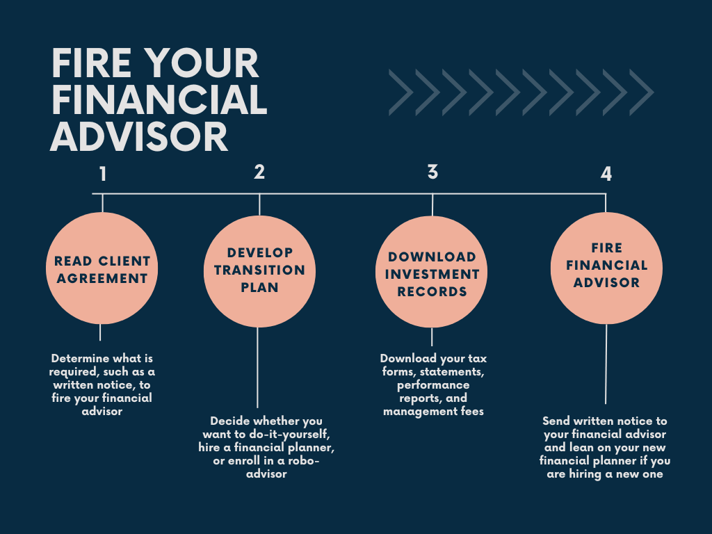

## Table of Contents

## What is a financial advisor?

A financial advisor is a person who helps you with your money. They give you advice on how to save, invest, and plan for the future. They can help you make smart choices about things like buying a house, saving for your kids' college, or planning for when you retire.

Financial advisors know a lot about money and can help you understand things that might be confusing. They look at your whole financial situation and make a plan that fits your goals and needs. It's like having a coach for your money, making sure you're on the right track to reach your dreams.

## Why might someone need to terminate their financial advisor?

Someone might need to terminate their financial advisor if they're not happy with the service they're getting. Maybe the advisor isn't giving good advice, or they're not helping the person reach their money goals. It's important that the advisor listens and understands what the person wants, and if they're not doing that, it might be time to find someone new.

Another reason could be if the person's financial situation changes a lot. For example, if they get a new job, have a baby, or retire, they might need different kinds of help. If their current advisor can't meet these new needs, it makes sense to look for someone who can. It's all about making sure the advisor is the right fit for where the person is in their life and with their money.

## What are common signs that it might be time to end the relationship with a financial advisor?

One common sign that it might be time to end the relationship with a financial advisor is if you feel like they're not listening to you or understanding your goals. If your advisor keeps suggesting investments or plans that don't match what you want, it might mean they're not the right fit for you. Another sign is if you're not seeing any progress. If your money isn't growing or if you're not getting closer to your financial goals, it might be time to find someone who can help you better.

Another reason to consider ending the relationship is if you feel like you're not being treated fairly. This could be because of high fees that don't seem worth it, or if you feel like the advisor is pushing you to do things that might benefit them more than you. Trust is really important, and if you don't trust your advisor, it's hard to work with them. Lastly, if your life changes a lot—like if you get a new job, have a baby, or retire—and your advisor can't adapt to these changes, it might be time to find someone who can better meet your new needs.

## How can you evaluate the performance of your financial advisor?

To evaluate the performance of your financial advisor, start by looking at your financial goals and see if you're getting closer to them. Are you saving more money? Are your investments growing? If your advisor promised certain results, check if they're meeting those promises. It's also important to compare your returns with the market or similar investments. If your advisor is doing a good job, your money should be doing at least as well as, if not better than, the average.

Another way to evaluate your advisor is by looking at how they communicate with you. Do they explain things in a way you can understand? Do they listen to your concerns and adjust their advice based on what you need? Good communication is a big part of a successful relationship with a financial advisor. Also, consider the fees you're paying. Are they reasonable for the service you're getting? If the fees are too high and you're not seeing good results, it might be time to look for someone else.

## What are the ethical considerations when thinking about terminating a financial advisor?

When thinking about ending your relationship with a financial advisor, it's important to think about doing it the right way. You should be honest and clear about why you want to end the relationship. It's not fair to just stop talking to them without explaining. Also, think about any contracts or agreements you have with them. You need to follow the rules in those agreements, like giving them notice or paying any fees you owe. Being fair and respectful is important, even if you're not happy with their service.

Another thing to consider is how ending the relationship might affect your money. You might need to move your investments or accounts to a new advisor, and this can take time and might cost money. Make sure you understand all the steps and costs involved before you make a decision. It's also good to think about how your decision might affect the advisor. They might depend on your business, so try to handle the situation in a way that is kind and professional.

## What steps should you take before deciding to terminate your financial advisor?

Before you decide to end your relationship with your financial advisor, it's a good idea to take a close look at why you're thinking about it. Ask yourself if there are specific problems or if your needs have changed. Maybe you're not happy with the advice you're getting, or you feel like your advisor isn't listening to you. It's also important to check if your financial goals are being met. Are your investments growing? Are you saving enough? If you're not seeing the results you want, it might be time to consider a change.

Next, talk to your advisor about your concerns. It's fair to give them a chance to explain or fix any issues. They might not know you're unhappy unless you tell them. If after talking, you still feel like it's not working out, then start looking for a new advisor. Make sure to check any contracts you have with your current advisor to see if there are rules about ending the relationship, like giving notice or paying fees. Being honest and respectful during this process is important, even if you decide to move on.

## How can you assess whether your financial goals are being met by your current advisor?

To assess whether your financial goals are being met by your current advisor, start by looking at the specific goals you set at the beginning of your relationship. Are you saving more money? Are your investments growing? If you wanted to buy a house or save for your kids' college, are you on track to do that? Comparing your progress to what you hoped to achieve can show you if your advisor is helping you reach those goals. If you see that your money is growing and you're closer to your dreams, that's a good sign.

Another way to check is by looking at how your investments are doing compared to the market. If your advisor is doing a good job, your money should be doing at least as well as, if not better than, similar investments. Also, think about the fees you're paying. Are they worth it for the service you're getting? If the fees are high but your money isn't growing much, it might mean your advisor isn't the right fit for you. Taking a close look at these things can help you decide if your advisor is helping you meet your financial goals.

## What are the potential costs and benefits of switching financial advisors?

Switching financial advisors can have some costs. You might need to pay fees to end your relationship with your current advisor, like a termination fee if it's in your contract. Moving your investments and accounts to a new advisor can also take time and might cost money. You might lose some money if you have to sell investments at a bad time. It can also be stressful and take a lot of work to find a new advisor and start over with them.

But there are also benefits to switching. If your current advisor isn't helping you meet your financial goals, a new advisor might do a better job. They might have new ideas and strategies that can help your money grow more. A new advisor might also be a better fit for your needs, especially if your life has changed. They could listen better and help you feel more confident about your money. If you find the right advisor, switching can be a smart move for your financial future.

## How do regulatory compliance and fiduciary duties factor into the decision to terminate a financial advisor?

Regulatory compliance and fiduciary duties are important things to think about when you're deciding if you should end your relationship with your financial advisor. Fiduciary duty means your advisor has to put your interests first and give you advice that's best for you. If you think your advisor isn't doing this, like if they're pushing you to buy things that might help them more than you, that's a big reason to consider switching. Also, your advisor has to follow rules set by regulators, like the SEC or FINRA. If they're not following these rules, it can be a sign that it's time to find a new advisor who will.

Looking at how well your advisor is following these duties can help you make a smart decision. If you find out that your advisor isn't being honest or isn't following the rules, it's important to take action. You might want to talk to them about it first, but if things don't change, ending the relationship might be the best choice. It's all about making sure your money is in good hands and that you're getting the help you need to reach your financial goals.

## What are advanced metrics or benchmarks to use when evaluating a financial advisor's performance?

When you want to see how well your financial advisor is doing, you can look at some special numbers and measures. One way is to check the "alpha" of your investments. Alpha shows how much better your investments are doing compared to what you would expect from the market. If your advisor's choices are making more money than the market, that's a good sign. Another measure is the "Sharpe ratio," which looks at the return you're getting for the risk you're taking. A higher Sharpe ratio means your advisor is doing a good job of balancing risk and reward.

You can also use "benchmarks" to see how your advisor is doing. A benchmark is like a standard that you can compare your investments to. For example, if you have a lot of money in the stock market, you might compare your investments to the S&P 500, which is a big group of stocks. If your investments are doing better than the S&P 500, your advisor is probably doing a good job. Another important thing to look at is how much you're paying in fees. If the fees are high but your investments aren't doing much better than the market, it might be time to find a new advisor.

## How can technology and data analytics assist in deciding whether to terminate a financial advisor?

Technology and data analytics can help you decide if you should keep or change your financial advisor. You can use special computer programs to look at how well your investments are doing. These programs can show you numbers like "alpha" and "Sharpe ratio" that tell you if your advisor is making good choices. They can also compare your investments to things like the S&P 500 to see if your advisor is doing better than the market. If the numbers show your advisor isn't helping your money grow, it might be time to think about switching.

Another way technology helps is by keeping track of fees and costs. You can use apps or websites to see how much you're paying your advisor and if those fees are worth it. If the fees are high but your money isn't growing much, technology can show you that clearly. Also, some tools can help you see if your advisor is following the rules and putting your interests first. If you find out they're not, technology can make it easier to see that and decide to find a new advisor who will do a better job.

## What are the long-term implications of frequently changing financial advisors?

Changing financial advisors a lot can make it hard to reach your money goals. Every time you switch, you might have to pay fees to end the relationship with your old advisor and start a new one. This can cost you money and time. Also, when you change advisors, you might have to sell your investments at a bad time, which can mean losing money. It can be hard to keep a good plan going if you're always starting over with someone new. Your money might not grow as much as it could if you stayed with one advisor who knows you well.

On the other hand, staying with the same advisor for a long time can help you build a strong relationship. They get to know your goals and can make better plans to help you reach them. If you keep changing advisors, you might miss out on this kind of trust and understanding. It's important to find an advisor who fits your needs and sticks with them if they're doing a good job. But if you really need to switch because your advisor isn't helping you, it's better to do it carefully and not too often.

## References & Further Reading

[1]: Bergstra, J., Bardenet, R., Bengio, Y., & Kégl, B. (2011). ["Algorithms for Hyper-Parameter Optimization."](https://dl.acm.org/doi/10.5555/2986459.2986743) Advances in Neural Information Processing Systems 24.

[2]: ["Advances in Financial Machine Learning"](https://www.amazon.com/Advances-Financial-Machine-Learning-Marcos/dp/1119482089) by Marcos Lopez de Prado

[3]: ["Evidence-Based Technical Analysis: Applying the Scientific Method and Statistical Inference to Trading Signals"](https://www.amazon.com/Evidence-Based-Technical-Analysis-Scientific-Statistical/dp/0470008741) by David Aronson

[4]: ["Machine Learning for Algorithmic Trading"](https://github.com/stefan-jansen/machine-learning-for-trading) by Stefan Jansen

[5]: ["Quantitative Trading: How to Build Your Own Algorithmic Trading Business"](https://www.amazon.com/Quantitative-Trading-Build-Algorithmic-Business/dp/1119800064) by Ernest P. Chan