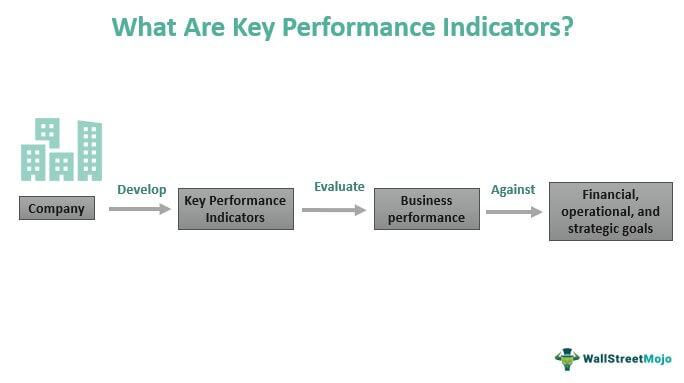

The rapid evolution of financial markets has brought significant transformations in investment management practices. Central to these changes is the emergence of algorithmic trading and automated investment management platforms. Algorithmic trading involves leveraging complex algorithms and computer systems to make trading decisions and execute trades automatically. This approach aims to optimize trading outcomes by analyzing vast amounts of data and identifying market trends with speed and precision.

Automated investment management platforms, commonly referred to as robo-advisors, have become increasingly popular among investors. These platforms offer a streamlined, cost-effective approach to managing portfolios, utilizing algorithms to allocate assets based on predefined criteria and investor inputs. The appeal of these platforms lies in their accessibility and efficiency, particularly for tech-savvy investors seeking low-cost solutions.

Despite these technological advancements, financial advisors continue to play a vital role in the industry. Financial advisors provide a personalized service that technology alone cannot replicate. They offer tailored advice that aligns with individual client goals, taking into account life changes and complex financial situations. The relationship between a financial advisor and their client is built on trust, transparency, and in-depth knowledge of a client's unique circumstances.

This article will explore two key aspects of investment management: the reasons investors may choose to terminate a financial advisor and the role algorithmic trading plays in contemporary investment strategies. Terminating a financial advisor can stem from various issues, including poor communication, high fees, or a misalignment with investor goals. Understanding the nuances of such a decision is essential for managing one's financial future effectively.

Moreover, as algorithmic trading becomes more prevalent, its role in shaping modern investment strategies is worth examining. These technologies boast the ability to react swiftly to market changes, potentially increasing returns. However, they lack the personalized insights and emotional intelligence that human advisors provide.

Finally, we will consider the essential factors investors must weigh when selecting between human advisors and automated platforms. Each option offers unique benefits and limitations, and the choice often depends on personal preferences, investment needs, and comfort with technology. By examining these elements, investors can make informed decisions about their financial management approach in a landscape that continually evolves.

## Table of Contents

## Understanding Financial Advisor Termination

Engagements with financial advisors can sometimes fail to meet investor expectations, leading to the decision to terminate their services. Common reasons for terminating a financial advisor include poor communication, lack of transparency, high fees, and misalignment with client goals. Investors often seek advisors who can effectively communicate and provide tailored advice to meet their financial objectives. If the advisor fails in these areas, it might necessitate a change.

A critical step in this process is reviewing the original contract with the advisor, which details the obligations and potential costs associated with termination. Contracts typically outline any termination fees or notice periods required, thus it's vital for investors to understand these terms. Such a review not only helps avoid unexpected costs but also facilitates an orderly departure from the advisor's services.

A structured termination process is essential for ensuring a smooth transition of financial management responsibilities. This involves developing a clear termination strategy that includes selecting a new advisor or switching to a different financial management system. A well-defined plan minimizes disruptions in financial strategies and ensures continuity in investment management.

Professional courtesy should be maintained throughout the termination process. It includes clear communication and formal documentation when notifying an advisor of the decision to part ways. A formal letter or email stating the reasons for termination and any relevant effective dates should suffice. This procedure not only upholds a professional standard but also helps in preserving potential future relationships or references.

Ultimately, these considerations play a crucial role in managing the complexities of financial advisor termination, safeguarding an investor's financial interests.

## Investment Management: The Role of Financial Advisors

Financial advisors play a critical role in investment management by providing personalized guidance tailored to an individual's financial goals and risk tolerance. This personalized service is essential because financial markets are complex, and each investor's situation and aspirations are unique. Advisors work closely with clients to develop investment strategies that align with their long-term objectives, whether it's saving for retirement, funding education, or accumulating wealth.

Advisors offer expert advice on specific financial planning areas beyond simple investment choices. For instance, estate planning involves creating strategies to manage an individual's estate during their life and after death, ensuring that assets are distributed according to their wishes and minimizing tax implications. Similarly, tax minimization strategies are devised to reduce an investor's taxable income, thereby maximizing the wealth retained by the individual. Retirement preparation involves planning to ensure financial security during the retirement years, taking into account factors like income streams, healthcare costs, and lifestyle choices.

The relationship between an advisor and a client is grounded in trust and transparent communication. Advisors must maintain a clear and open channel of communication, ensuring that clients are fully informed about the status of their investments and any adjustments being made to their portfolios. This transparency helps build confidence and reassures clients that their financial interests are being prioritized.

Advisors must also adapt to the changing needs of their clients. As individuals progress through different stages of life, their financial requirements and risk tolerances may evolve. An effective advisor will recognize these shifts and adjust strategies accordingly, offering value that surpasses the capabilities of automated solutions. While technology-driven platforms can provide cost-effective and data-heavy analysis, they often lack the nuanced understanding and empathetic approach that human advisors can offer.

Ultimately, financial advisors are fiduciaries, meaning they are legally and ethically obligated to act in the best interests of their clients. This fiduciary duty fosters a relationship built on trust, ensuring that advisors prioritize their clients' financial well-being above their own gains or interests. This commitment to the client's financial health is a fundamental advantage that human advisors maintain over purely algorithmic investment platforms.

In conclusion, while automated platforms have become a significant part of investment management, the role of financial advisors continues to be indispensable. Their ability to provide personalized, adaptive, and fiduciary-driven guidance makes them invaluable allies in navigating the complexities of financial markets and achieving long-term financial goals.

## Algorithmic Trading and Automated Investment Management

Algorithmic trading refers to the use of computer algorithms to automatically execute trading orders based on predetermined criteria. These algorithms can process vast amounts of market data, identifying trading opportunities with speed and precision beyond human capability. Historically, such trading strategies were only accessible to large financial institutions, but advancements in technology have democratized access, allowing individual investors to participate as well.

The rise of robo-advisors represents a significant shift towards automated investment management platforms. These platforms use algorithms to manage clients' investment portfolios, adjusting allocations based on factors like risk tolerance and financial goals. Robo-advisors appeal to tech-savvy investors due to their low-cost structure and the efficiency they bring to portfolio management. For instance, companies like Betterment and Wealthfront have popularized this model, offering diversified portfolios that are automatically rebalanced over time.

Algorithmic trading strategies are designed to capitalize on market inefficiencies and can operate at high frequencies, reacting almost instantaneously to market trends. This rapid response potential aims to enhance investment returns by exploiting short-term market movements. Common algorithmic strategies include statistical [arbitrage](/wiki/arbitrage), where algorithms identify and profit from price divergences between related financial instruments, and [momentum](/wiki/momentum) trading, which bets on the continuation of existing market trends.

Despite these benefits, [algorithmic trading](/wiki/algorithmic-trading) and automated platforms lack the personalized touch and nuanced understanding inherent in human financial advisors. Algorithms follow predefined rules and may not adequately react to unexpected market events or nuanced changes in an investor's life circumstances. Additionally, they may struggle to incorporate qualitative factors, such as geopolitical events, that could impact markets.

While automated platforms provide efficient solutions, they primarily suit investors comfortable with technology and less complex financial planning needs. Therefore, many investors might benefit from a hybrid approach, combining the precision and cost benefits of technology with the personal insights and adaptability that human advisors provide. In this way, investors can potentially achieve a more robust and resilient investment strategy.

## Comparing Financial Advisors and Algo-Trading Platforms

When deciding between financial advisors and algorithmic trading platforms, investors face a choice that hinges on their unique financial objectives and comfort with technology. Both options present distinct advantages and challenges.

Human financial advisors are renowned for their ability to deliver personalized service that considers an individual's life changes and intricate financial situations. These professionals are equipped to handle multifaceted aspects of personal finance, such as estate planning, tax strategies, and retirement planning, offering a human touch that is rooted in trust and communication. This adaptability ensures that clients receive a tailored approach to managing their finances.

Conversely, algorithmic trading platforms and robo-advisors provide low-cost, data-driven investment management solutions. These systems employ advanced algorithms to analyze market data and execute trades efficiently, often resulting in reduced fees compared to traditional advisory services. Such platforms are particularly appealing to tech-savvy investors who prioritize cost efficiency and rely on analytics for decision-making. However, a limitation of these systems is their inability to address the nuanced needs of clients who require more bespoke strategies.

Investors must evaluate several factors when choosing between these two options. Costs associated with hiring a human advisor can be significant, but they are often justified by the level of personalized advice and service provided. On the other hand, automated platforms typically offer lower fees but may lack flexibility. Accessibility is another crucial consideration; while human advisors may have limited availability, algorithmic platforms are accessible 24/7 via digital interfaces.

The element of trust also plays a critical role. Building a relationship with a human advisor allows for accountability and a personalized understanding of financial aspirations, which some investors may find irreplaceable. In contrast, investors who have confidence in technology and data processes may feel comfortable relying on algorithmic solutions.

Ultimately, a hybrid approach might be optimal, combining the strengths of both human advisors and automated platforms. This strategy allows investors to benefit from personalized insights and human interaction while leveraging technological advancements for cost efficiency and data-centric decision-making. By integrating both elements, investors may create a more robust and flexible financial management system that can adapt to their evolving needs.

## Conclusion

The decision to terminate a financial advisor or transition to algorithmic trading involves careful consideration of each option's advantages and drawbacks. Investors need to align their choices with specific financial objectives and personal circumstances to achieve optimal results. Human financial advisors offer personalized services and insights that are often critical for nuanced financial situations, offering a significant advantage when managing complex investment strategies or life changes. In contrast, algorithmic trading and automated platforms present a compelling case through cost-effectiveness, enhanced efficiency, and the ability to quickly adapt to market fluctuations.

A rapidly evolving financial environment demands that investors remain informed and flexible in their approach to investment management. With the growing availability of both traditional advisory services and cutting-edge algorithmic tools, investors today have a diverse set of resources to enhance their investment strategies. Each option introduces unique dynamics; therefore, forging a path that incorporates both human expertise and technological advancements can provide a robust strategy. A hybrid approach allows investors to leverage the strengths of both human advisors and automated systems, balancing the personal touch with technological efficiency.

Ultimately, the choice between a financial advisor and algorithmic trading should correspond with the investor's comfort level, financial literacy, and long-term aspirations. Acknowledging one's knowledge and goals will be critical in navigating the complexities of modern investment landscapes and achieving financial security. The decision should not only address current needs but also anticipate future developments in one's financial status and market conditions. As such, a well-considered choice can significantly impact the sustainability and growth of an investor's financial portfolio.

## References & Further Reading

[1]: Bergstra, J., Bardenet, R., Bengio, Y., & Kégl, B. (2011). ["Algorithms for Hyper-Parameter Optimization."](https://dl.acm.org/doi/10.5555/2986459.2986743) Advances in Neural Information Processing Systems 24.

[2]: ["Advances in Financial Machine Learning"](https://www.amazon.com/Advances-Financial-Machine-Learning-Marcos/dp/1119482089) by Marcos Lopez de Prado

[3]: ["Evidence-Based Technical Analysis: Applying the Scientific Method and Statistical Inference to Trading Signals"](https://www.amazon.com/Evidence-Based-Technical-Analysis-Scientific-Statistical/dp/0470008741) by David Aronson

[4]: ["Machine Learning for Algorithmic Trading"](https://github.com/stefan-jansen/machine-learning-for-trading) by Stefan Jansen

[5]: ["Quantitative Trading: How to Build Your Own Algorithmic Trading Business"](https://www.amazon.com/Quantitative-Trading-Build-Algorithmic-Business/dp/1119800064) by Ernest P. Chan