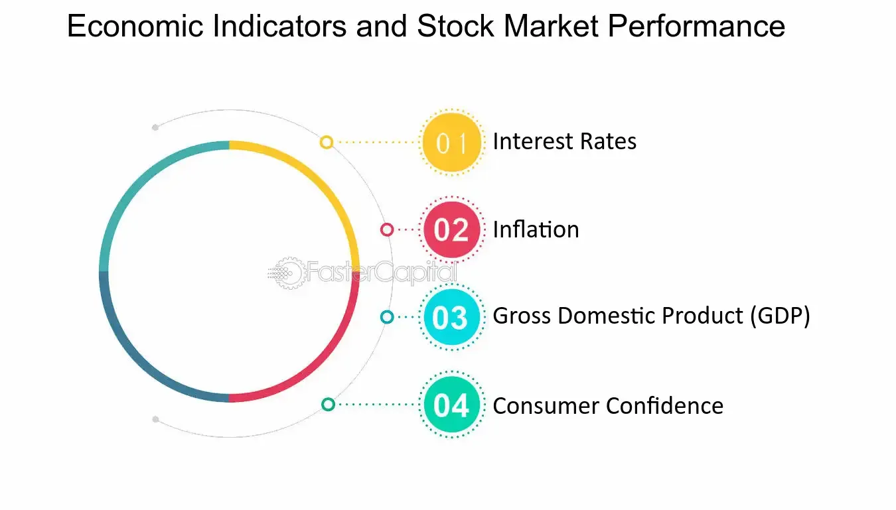

## Table of Contents

## What are the basic indicators used to track the stock market?

The stock market is tracked using several key indicators that help investors understand its performance. The most common indicator is the stock index, like the Dow Jones Industrial Average or the S&P 500. These indexes measure the performance of a group of stocks, giving a snapshot of how the market is doing overall. When the index goes up, it usually means the market is doing well, and when it goes down, the market might be struggling.

Another important indicator is the trading volume, which shows how many shares are being bought and sold. High trading volume can mean that there's a lot of interest in the market, which can lead to big price changes. On the other hand, low trading volume might mean that investors are not very active, and the market might be more stable. By looking at both the stock index and the trading volume, investors can get a better idea of what's happening in the market and make smarter decisions.

## How can the Gross Domestic Product (GDP) be used to gauge economic performance?

Gross Domestic Product, or GDP, is a big number that tells us how much a country's economy is producing in a certain time, like a year. It adds up everything that people buy, from food and clothes to cars and houses, and even services like haircuts and doctor visits. When the GDP goes up, it usually means the economy is doing well because people are buying more things and businesses are making more money. If the GDP goes down, it might mean that people are not spending as much, and the economy could be slowing down.

Governments and businesses use GDP to see how the economy is doing and to make plans. For example, if the GDP is growing, the government might feel confident to spend more on things like schools and roads. But if the GDP is shrinking, they might need to be more careful with their spending. Also, businesses look at GDP to decide if they should expand, hire more workers, or maybe even cut back. So, GDP is a really important tool for understanding and managing the economy.

## What is the significance of the Consumer Price Index (CPI) in understanding inflation?

The Consumer Price Index, or CPI, is a very important tool that helps us understand inflation. Inflation is when the prices of things we buy, like food and clothes, go up over time. The CPI measures the average change in prices over time for a basket of goods and services that people typically buy. When the CPI goes up, it means that inflation is happening and things are getting more expensive. This can affect how much money people have to spend and how they live their lives.

Governments and businesses pay close attention to the CPI because it helps them make decisions. For example, if the CPI is going up a lot, the government might decide to change interest rates to try to slow down inflation. Businesses might also use the CPI to decide if they should raise their prices or if they need to find ways to keep costs down. By keeping an eye on the CPI, everyone can better understand how inflation is affecting the economy and what they might need to do about it.

## How does the Unemployment Rate reflect the health of an economy?

The Unemployment Rate is a key indicator that shows how many people in a country are out of work and looking for a job. It's usually given as a percentage, like 5% or 10%. When the Unemployment Rate is low, it means that most people who want to work are able to find jobs. This is a sign that the economy is doing well because businesses are hiring and people have money to spend. On the other hand, when the Unemployment Rate is high, it means that a lot of people are out of work and struggling to find jobs. This can be a sign that the economy is not doing so well because businesses might be cutting back and people might not have as much money to spend.

Governments and economists watch the Unemployment Rate closely because it tells them a lot about the health of the economy. If the Unemployment Rate starts to go up, the government might take action to try to create more jobs and help the economy grow. They might do things like invest in new projects or offer training programs to help people find work. Businesses also look at the Unemployment Rate to decide if they should hire more workers or if they need to be careful about spending. By keeping an eye on the Unemployment Rate, everyone can get a better idea of how the economy is doing and what they might need to do to help it improve.

## What role do stock market indices like the S&P 500 and Dow Jones play in tracking market performance?

Stock market indices like the S&P 500 and the Dow Jones Industrial Average help us understand how the stock market is doing. These indices are like scorecards that track a group of important stocks. The S&P 500 looks at 500 big companies in the U.S., while the Dow Jones focuses on 30 major companies. When these indices go up, it usually means that the stock market is doing well and that the companies in the index are making more money. If they go down, it might mean that the market is not doing so great and that investors are worried.

People use these indices to get a quick idea of the market's health without having to look at every single stock. For example, if the S&P 500 is going up, it's a good sign that the overall economy might be doing well, because these companies are important parts of it. Investors, businesses, and even governments watch these indices to make decisions. If the indices are going down, they might decide to be more careful with their money or change their plans. So, the S&P 500 and Dow Jones are really helpful tools for understanding and reacting to what's happening in the stock market.

## How can investors use the Yield Curve to predict economic cycles?

The Yield Curve is a graph that shows the interest rates for bonds over different time periods. It's like a line that goes up or down depending on whether short-term or long-term bonds have higher interest rates. When the Yield Curve is normal, it slopes upward, meaning long-term bonds have higher interest rates than short-term ones. This is usually a sign that the economy is expected to grow because people think it's safe to lend money for a longer time. But when the Yield Curve is flat or even inverted, with short-term rates higher than long-term ones, it can be a warning sign. An inverted Yield Curve often means that people are worried about the future and think the economy might slow down or go into a recession.

Investors watch the Yield Curve closely because it can help them predict what might happen next in the economy. If they see the Yield Curve starting to flatten or invert, they might decide to be more careful with their money. They could move their investments into safer things like government bonds or cash to protect themselves if a recession comes. On the other hand, if the Yield Curve is normal and sloping upward, investors might feel more confident and choose to invest in stocks or other riskier assets that could grow more if the economy keeps doing well. By understanding the Yield Curve, investors can make smarter choices about where to put their money based on what they think will happen in the future.

## What are leading, lagging, and coincident economic indicators and how do they differ?

Economic indicators are like signs that help us understand what's happening with the economy. They are divided into three types: leading, lagging, and coincident indicators. Leading indicators are like early warnings. They show us what might happen in the economy before it actually happens. Things like stock market performance or new orders for factories can be leading indicators because they change before the economy as a whole does. If these indicators are going up, it might mean the economy will grow soon. If they're going down, it could mean a slowdown is coming.

Lagging indicators, on the other hand, show us what has already happened in the economy. They are like looking in the rearview mirror. Examples include unemployment rates and corporate profits. These indicators change after the economy has already started to move in a certain direction. They help confirm what leading indicators predicted. For instance, if the unemployment rate goes up after leading indicators suggested a slowdown, it confirms that the economy did indeed slow down.

Coincident indicators happen at the same time as the economy is changing. They give us a real-time snapshot of what's happening right now. Things like personal income and industrial production are coincident indicators. They help us see the current state of the economy without waiting for lagging indicators to catch up. By looking at all three types of indicators together, we can get a fuller picture of the economy's past, present, and future.

## How do Purchasing Managers' Index (PMI) readings affect stock market expectations?

The Purchasing Managers' Index (PMI) is like a report card for how businesses are doing. It's a number that shows how many new orders factories are getting, how much they're producing, and how fast they're getting things done. When the PMI number is above 50, it means that things are going well and businesses are growing. If it's below 50, it means businesses might be slowing down. Investors watch the PMI closely because it can tell them if the economy is getting better or worse. If the PMI goes up, it might mean that companies will make more money, and that can make stock prices go up because people want to buy stocks in growing companies.

On the other hand, if the PMI goes down, it can make investors worried. They might think that companies will make less money and that can make stock prices go down because people might want to sell their stocks before they lose value. The PMI can affect different parts of the stock market too. For example, if the PMI for manufacturing goes up, it's good news for companies that make things, and their stock prices might go up more than others. By watching the PMI, investors can get a heads-up on what might happen next in the stock market and make better choices about buying or selling stocks.

## What insights can be gained from analyzing the Balance of Trade?

The Balance of Trade shows the difference between what a country sells to other countries (exports) and what it buys from them (imports). If a country sells more than it buys, it has a trade surplus, which is usually seen as a good thing. It means that the country is making more money from selling things to other countries than it's spending on buying things from them. This can be a sign that the country's businesses are doing well and that its economy is strong. On the other hand, if a country buys more than it sells, it has a trade deficit. This can be a warning sign that the country might be spending too much money on things from other places and not making enough money from its own products.

By looking at the Balance of Trade, people can learn a lot about how a country's economy is doing. For example, if a country has a big trade deficit for a long time, it might mean that it needs to find ways to sell more of its own products or make things cheaper so people will buy them. Governments and businesses use this information to make plans. If they see a trade surplus, they might feel good about the economy and decide to invest more in new projects or businesses. But if they see a trade deficit, they might need to be careful and think about ways to improve their trade situation. So, the Balance of Trade is a helpful tool for understanding and managing a country's economy.

## How do central bank interest rate decisions impact stock market trends?

Central bank interest rate decisions can have a big impact on the stock market. When a central bank, like the Federal Reserve in the U.S., raises interest rates, it usually means that borrowing money will become more expensive. This can make businesses think twice about taking out loans to grow or invest in new projects. As a result, their profits might not grow as fast, which can make their stock prices go down. On the other hand, when interest rates go up, people might move their money from stocks to savings accounts or bonds because they can earn more interest there. This can also cause stock prices to fall because fewer people are buying stocks.

On the flip side, when a central bank lowers interest rates, it makes borrowing cheaper. This can encourage businesses to take out loans and invest in new projects, which can lead to higher profits and higher stock prices. Lower interest rates can also make people feel more confident about the economy, so they might be more willing to buy stocks. This increased demand can push stock prices up. So, central bank interest rate decisions are important because they can influence how much money businesses and people want to spend, which in turn affects stock market trends.

## What advanced technical indicators should expert traders use to analyze stock market volatility?

Expert traders often use advanced technical indicators like the Bollinger Bands to analyze stock market volatility. Bollinger Bands are like lines drawn above and below the price of a stock. The middle line is the average price over a certain time, and the other two lines show how much the price can go up or down. When these bands get closer together, it means the stock isn't moving much and might be ready for a big change. If the bands spread out, it shows that the stock is moving a lot and the market is more volatile. Traders use this to decide when to buy or sell stocks based on how much the price is changing.

Another useful indicator is the Average True Range (ATR). The ATR tells traders how much a stock's price has been moving up and down over a certain time. A higher ATR means the stock is more volatile, and a lower ATR means it's less volatile. Traders look at the ATR to understand if the market is calm or if it's going through big changes. This helps them figure out how risky it might be to trade a certain stock. By using these indicators, expert traders can make better guesses about when the market might get more or less volatile and plan their trades accordingly.

## How can machine learning models enhance the prediction of economic and stock market trends?

Machine learning models can help predict economic and stock market trends by finding patterns in big sets of data that people might miss. These models can look at lots of different things at once, like stock prices, news articles, and even social media posts. They use this information to learn what has happened in the past and guess what might happen next. For example, a machine learning model might notice that when certain words show up a lot in news stories, the stock market often goes up or down soon after. By finding these patterns, the model can give traders and investors a heads-up on what might happen next, helping them make better choices about buying or selling stocks.

These models can also keep getting better over time. As they see more data and get feedback on how well their predictions worked, they can adjust and improve their guesses. This means they can become more accurate at predicting economic trends and stock market movements. For instance, if a model's prediction about a stock price was wrong, it can learn from that mistake and do a better job next time. By using machine learning, people can get more reliable information about the economy and the stock market, which can help them plan and invest more wisely.

## What is Market Analysis in Stock Trading?

Market analysis plays a crucial role in stock trading, enabling investors to make informed decisions based on current and projected market conditions. This process primarily involves two types of analysis: fundamental and technical.

Fundamental analysis involves examining economic data, including macroeconomic indicators such as GDP growth, employment rates, and inflation figures, as well as microeconomic factors that illuminate a company's performance. Evaluating a company's financial statements, management team, competitive position, and overall economic environment helps investors assess the inherent value of its stock. For instance, the price-to-earnings (P/E) ratio, a common metric in [fundamental analysis](/wiki/fundamental-analysis), is computed as follows:

$$
\text{P/E ratio} = \frac{\text{Market Price per Share}}{\text{Earnings per Share (EPS)}}
$$

A lower P/E ratio might indicate that a stock is undervalued relative to its earnings, suggesting potential investment opportunities.

Technical analysis, on the other hand, concentrates on historical price data, trading volumes, and chart patterns to predict future market movements. Investors use technical indicators and charting tools to identify trends, support and resistance levels, and other significant price action signals. Key tools include moving averages, Bollinger Bands, and oscillators like the relative strength index (RSI).

Investors also consider qualitative factors such as market sentiment, which reflects the overall mood or attitude of market participants. Positive or negative sentiment can significantly impact stock prices beyond purely quantitative measures. News events, ranging from corporate announcements to broader geopolitical developments, also affect market conditions and can precipitate rapid changes in stock valuations.

Geopolitical issues, such as trade agreements, political stability, and regulatory changes, can influence market trends and are crucial to comprehensive market analysis. These factors may alter the risk-adjusted returns of stocks, necessitating adjustments in investment strategies.

By synthesizing these elements, market analysis enables traders to identify opportunities, optimize their portfolios, and effectively manage associated risks. Adopting a structured approach to market analysis ensures that investors can align their strategies with their risk tolerance and financial goals, enhancing their ability to navigate the dynamic landscape of stock trading.

## What are the key stock market indicators?

Stock market indicators are essential tools used by traders and investors to assess market strength and anticipate potential shifts. These metrics can provide valuable insights into price trends, market [momentum](/wiki/momentum), and overall investor sentiment.

One of the most popular indicators is the moving average. The moving average is utilized to smooth out price data, creating a trend-following indicator that helps to identify the direction of a trend over a specific period. There are several types of moving averages, including the simple moving average (SMA) and the exponential moving average (EMA). The SMA is calculated by taking the arithmetic mean of a given set of prices over a specified number of periods. For example:

$$
\text{SMA} = \frac{P_1 + P_2 + ... + P_n}{n}
$$

where $P$ represents the price at each time period, and $n$ is the number of periods.

The relative strength index (RSI) is another widely used indicator that measures the magnitude of recent price changes to evaluate overbought or oversold conditions. RSI values range from 0 to 100, with a traditional overbought condition indicated by a value above 70 and oversold conditions below 30. The RSI is calculated using the formula:

$$
\text{RSI} = 100 - \frac{100}{1 + \frac{\text{average gain}}{\text{average loss}}}
$$

The moving average convergence divergence (MACD) indicator, a blend of trend-following and momentum, utilizes two moving averages of varying lengths, typically the 12-day EMA and the 26-day EMA, to generate trading signals. The MACD line is derived by subtracting the 26-day EMA from the 12-day EMA, with the signal line being a 9-day EMA of the MACD line. The difference between MACD and the signal line can indicate potential buy or sell signals.

Market breadth indicators provide a comprehensive view of the market's overall mood by analyzing the number of advancing versus declining stocks. They help assess whether the market trend is supported by a broad base of securities, which can offer clues about sustainability.

Volume indicators evaluate the significance of price movements by analyzing the amount of traded assets. High trading [volume](/wiki/volume-trading-strategy) during a price increase or decrease can confirm the strength of a trend, whereas low volume may suggest a lack of conviction.

Incorporating these stock market indicators into trading strategies assists traders in confirming trends and aligning their strategies accordingly. By analyzing these indicators, investors can enhance their decision-making processes, reducing uncertainty and improving the potential for successful trades.

## References & Further Reading

[1]: Bergstra, J., Bardenet, R., Bengio, Y., & Kégl, B. (2011). ["Algorithms for Hyper-Parameter Optimization."](https://papers.nips.cc/paper/4443-algorithms-for-hyper-parameter-optimization) Advances in Neural Information Processing Systems 24.

[2]: ["Advances in Financial Machine Learning"](https://www.amazon.com/Advances-Financial-Machine-Learning-Marcos/dp/1119482089) by Marcos Lopez de Prado

[3]: ["Evidence-Based Technical Analysis: Applying the Scientific Method and Statistical Inference to Trading Signals"](https://www.amazon.com/Evidence-Based-Technical-Analysis-Scientific-Statistical/dp/0470008741) by David Aronson

[4]: ["Machine Learning for Algorithmic Trading"](https://github.com/stefan-jansen/machine-learning-for-trading) by Stefan Jansen

[5]: ["Quantitative Trading: How to Build Your Own Algorithmic Trading Business"](https://www.amazon.com/Quantitative-Trading-Build-Algorithmic-Business/dp/1119800064) by Ernest P. Chan