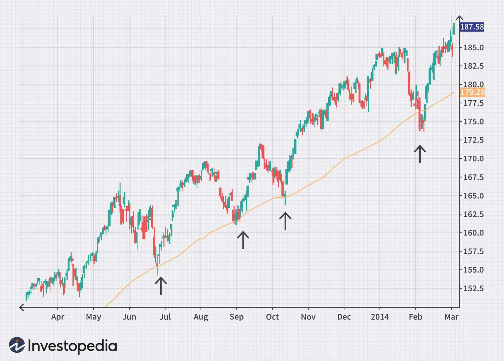

The financial world is intricate, influenced by numerous factors that drive market behavior and shape investment decisions. Central to understanding these dynamics are economic indicators, market analysis, and stock market indicators. Economic indicators, such as Gross Domestic Product (GDP), unemployment rates, and inflation indices, provide a snapshot of economic health and are vital for anticipating market movements.

Similarly, market analysis plays a crucial role in stock trading by offering evaluations of market conditions through various lenses. Fundamental analysis scrutinizes economic data and corporate performance, while technical analysis relies on historical price data and chart patterns. Together, these analyses guide investors in navigating the complexities of financial markets.



Algorithmic trading, known as algo trading, has revolutionized investment strategies by leveraging sophisticated algorithms to process and analyze large datasets. This approach allows for executing trades with unprecedented speed and precision, significantly transforming how investors approach market opportunities.

This article provides a comprehensive guide to these elements, offering valuable insights for both investors and traders. By exploring economic indicators and their market impacts, as well as the role of algo trading, readers will gain a deeper understanding of the factors influencing financial markets today.

## Table of Contents

## Understanding Economic Indicators

Economic indicators serve as vital instruments in the financial landscape, deeply influencing investment decisions and shaping market predictions. These indicators, which encompass various data points, offer insights into the current state and the future trajectory of an economy. Among the most crucial economic indicators are Gross Domestic Product (GDP), unemployment rates, inflation, and consumer confidence indexes.

Gross Domestic Product (GDP) is a comprehensive measure that represents the total market value of all finished goods and services produced within a country's borders in a specific time period. It is a primary indicator of economic performance, with higher GDP growth rates generally signaling a healthy, expanding economy.

Unemployment rates are another critical metric, providing information about the labor market's health. High unemployment rates may indicate economic distress, while lower rates can suggest a robust economy with more job opportunities and potentially increased consumer spending.

Inflation, reflecting the rate at which the general level of prices for goods and services is rising, is closely monitored by investors. Moderate inflation is typically associated with economic growth, but excessive inflation can erode purchasing power and lead to restrictive monetary policies.

The consumer confidence index measures the degree of optimism that consumers feel about the overall state of the economy and their personal financial situations. Higher consumer confidence generally translates to increased consumer spending, which is a significant component of economic growth.

Investors utilize these indicators to assess economic health and anticipate market fluctuations. By analyzing economic indicators, investors aim to predict future economic activities, which, in turn, influence stock and asset prices. For instance, positive GDP growth may lead to rising stock prices as economic activity heats up, while high inflation could signal potential [interest rate](/wiki/interest-rate-trading-strategies) hikes, affecting bond and equity markets.

Certain economic indicators can provide early signs of inflationary trends, policy changes, and potential recessions. For example, a sudden spike in inflation rates might lead central banks to adjust interest rates, affecting borrowing costs and investment returns. Similarly, an increase in unemployment rates could suggest economic slowdown risks, prompting strategic shifts in investment portfolios.

In integrating data from these indicators, investors seek to form a coherent picture of the economy's trajectory, allowing them to make informed decisions and strategically position their portfolios to mitigate risk and capitalize on opportunities. Understanding and interpreting these indicators remain fundamental to strategic investment and market prediction.

## Market Analysis in Stock Trading

Market analysis plays a crucial role in stock trading, enabling investors to make informed decisions based on current and projected market conditions. This process primarily involves two types of analysis: fundamental and technical.

Fundamental analysis involves examining economic data, including macroeconomic indicators such as GDP growth, employment rates, and inflation figures, as well as microeconomic factors that illuminate a company's performance. Evaluating a company's financial statements, management team, competitive position, and overall economic environment helps investors assess the inherent value of its stock. For instance, the price-to-earnings (P/E) ratio, a common metric in [fundamental analysis](/wiki/fundamental-analysis), is computed as follows:

$$
\text{P/E ratio} = \frac{\text{Market Price per Share}}{\text{Earnings per Share (EPS)}}
$$

A lower P/E ratio might indicate that a stock is undervalued relative to its earnings, suggesting potential investment opportunities.

Technical analysis, on the other hand, concentrates on historical price data, trading volumes, and chart patterns to predict future market movements. Investors use technical indicators and charting tools to identify trends, support and resistance levels, and other significant price action signals. Key tools include moving averages, Bollinger Bands, and oscillators like the relative strength index (RSI).

Investors also consider qualitative factors such as market sentiment, which reflects the overall mood or attitude of market participants. Positive or negative sentiment can significantly impact stock prices beyond purely quantitative measures. News events, ranging from corporate announcements to broader geopolitical developments, also affect market conditions and can precipitate rapid changes in stock valuations.

Geopolitical issues, such as trade agreements, political stability, and regulatory changes, can influence market trends and are crucial to comprehensive market analysis. These factors may alter the risk-adjusted returns of stocks, necessitating adjustments in investment strategies.

By synthesizing these elements, market analysis enables traders to identify opportunities, optimize their portfolios, and effectively manage associated risks. Adopting a structured approach to market analysis ensures that investors can align their strategies with their risk tolerance and financial goals, enhancing their ability to navigate the dynamic landscape of stock trading.

## Key Stock Market Indicators

Stock market indicators are essential tools used by traders and investors to assess market strength and anticipate potential shifts. These metrics can provide valuable insights into price trends, market [momentum](/wiki/momentum), and overall investor sentiment.

One of the most popular indicators is the moving average. The moving average is utilized to smooth out price data, creating a trend-following indicator that helps to identify the direction of a trend over a specific period. There are several types of moving averages, including the simple moving average (SMA) and the exponential moving average (EMA). The SMA is calculated by taking the arithmetic mean of a given set of prices over a specified number of periods. For example:

$$
\text{SMA} = \frac{P_1 + P_2 + ... + P_n}{n}
$$

where $P$ represents the price at each time period, and $n$ is the number of periods.

The relative strength index (RSI) is another widely used indicator that measures the magnitude of recent price changes to evaluate overbought or oversold conditions. RSI values range from 0 to 100, with a traditional overbought condition indicated by a value above 70 and oversold conditions below 30. The RSI is calculated using the formula:

$$
\text{RSI} = 100 - \frac{100}{1 + \frac{\text{average gain}}{\text{average loss}}}
$$

The moving average convergence divergence (MACD) indicator, a blend of trend-following and momentum, utilizes two moving averages of varying lengths, typically the 12-day EMA and the 26-day EMA, to generate trading signals. The MACD line is derived by subtracting the 26-day EMA from the 12-day EMA, with the signal line being a 9-day EMA of the MACD line. The difference between MACD and the signal line can indicate potential buy or sell signals.

Market breadth indicators provide a comprehensive view of the market's overall mood by analyzing the number of advancing versus declining stocks. They help assess whether the market trend is supported by a broad base of securities, which can offer clues about sustainability.

Volume indicators evaluate the significance of price movements by analyzing the amount of traded assets. High trading [volume](/wiki/volume-trading-strategy) during a price increase or decrease can confirm the strength of a trend, whereas low volume may suggest a lack of conviction.

Incorporating these stock market indicators into trading strategies assists traders in confirming trends and aligning their strategies accordingly. By analyzing these indicators, investors can enhance their decision-making processes, reducing uncertainty and improving the potential for successful trades.

## The Role of Algo Trading

Algorithmic trading, often referred to as algo trading, employs computer algorithms to execute trades with precision and speed, based on pre-defined criteria. This method has become pivotal in modern financial markets due to its efficiency in handling and analyzing vast amounts of data much faster than human capabilities would allow.

### Enhancing Trading Efficiency

The efficiency of [algorithmic trading](/wiki/algorithmic-trading) lies in its ability to process large datasets at remarkable speeds. These algorithms are adept at scanning various market parameters, identifying trends, and predicting future movements, facilitating the execution of trades within milliseconds. This rapid processing enables traders to capitalize on fleeting opportunities in the market that might be missed with manual trading methods.

### Algorithmic Strategies

Several distinct strategies are employed within algorithmic trading to optimize performance:

1. **Market-Making**: This strategy involves placing both buy and sell limit orders on a financial instrument to capture the spread. A well-designed market-making algorithm adjusts its quotes in response to market conditions, enhancing liquidity.

2. **Arbitrage**: Arbitrage strategies exploit price discrepancies of identical or similar financial instruments across different markets or forms. Algorithms can identify and execute these opportunities swiftly, often in near real-time, to generate profits while balancing the books.

3. **Trend-Following**: These algorithms analyze data to identify the direction of market movement, executing trades aligned with the current trend. The strategy leverages statistical techniques and historical data analysis to forecast future price directions.

### Reducing Human Error and Increasing Liquidity

One of the significant advantages of algorithmic trading is its reduction of human error. Automated strategies eliminate emotional decision-making, adhering strictly to the set criteria and logic embedded within the algorithms. This reliability not only increases efficiency but also enhances market [liquidity](/wiki/liquidity-risk-premium), as a larger volume of trades can be accurately processed without manual intervention.

### Improving Transaction Speed

Algorithms significantly expedite transaction processes, allowing traders to seize favorable conditions before they dissipate. The minimal delay in execution—often quantified in microseconds—provides a competitive edge and is crucial in high-frequency trading environments.

### Challenges

Despite its advantages, algorithmic trading is not without challenges. Market [volatility](/wiki/volatility-trading-strategies) can cause algorithms to behave unexpectedly, particularly if they are not programmed to handle extreme swings or unusual market conditions. Additionally, system errors and technological glitches pose risks that require robust risk management protocols and constant system monitoring.

Furthermore, the continuous evolution of markets necessitates regular updates and improvements to algorithmic systems. Market participants must invest in technology and maintain an edge over competitors to stay relevant in the fast-paced financial landscape.

In summary, algorithmic trading exemplifies the integration of technology into finance, offering enhanced trading capabilities through speed, precision, and strategic sophistication, while also highlighting the inherent challenges that must be navigated to harness its full potential.

## Integration of Economic Indicators and Algo Trading

Economic indicators are integral to the development and implementation of algorithmic trading strategies. These indicators supply the critical quantitative data necessary for constructing predictive models used by traders to anticipate market movements. By converting this data into actionable insights, algorithmic systems can respond swiftly to economic changes, such as fluctuations in interest rates or shifts in unemployment [statistics](/wiki/bayesian-statistics). This responsiveness is a fundamental advantage, enabling traders to capitalize on opportunities as they emerge.

Algorithms in trading are programmed to monitor specific economic indicators continuously, analyzing their variations and implementing predefined strategies when thresholds are met. For instance, an algorithm might automatically execute buy or sell orders if an indicator like the Consumer Price Index (CPI) deviates from expected values. This automation not only enhances efficiency but also mitigates the risk of human error, promoting more effective decision-making processes.

Integrating economic indicators with algorithmic trading also facilitates the development of adaptable strategies that can handle real-time economic shifts. For example, [machine learning](/wiki/machine-learning) models can be employed to discern patterns and correlations in the historical data of economic indicators, which can then be used to predict future market behaviors. A Python implementation might involve using libraries such as pandas for data manipulation, scikit-learn for predictive modeling, and NumPy for numerical operations. An example code snippet illustrating this could be:

```python
import pandas as pd
from sklearn.linear_model import LinearRegression
import numpy as np

# Load historical economic data
data = pd.read_csv('economic_indicators.csv')

# Select relevant indicators for the model
X = data[['interest_rate', 'unemployment_rate']]
y = data['stock_market_index']

# Train a simple regression model
model = LinearRegression()
model.fit(X, y)

# Make predictions based on current economic conditions
current_conditions = np.array([[0.05, 4.0]]) # Example conditions
predicted_index = model.predict(current_conditions)
print("Predicted Stock Market Index:", predicted_index)
```

The amalgamation of economic indicators and algo trading enhances the traders' ability to predict market direction and execute trades at optimal moments. This integration ensures that trading strategies remain congruent with the evolving economic landscape, thereby increasing the probability of successful outcomes. Moreover, creatively leveraging economic data through algorithms can provide traders with a competitive edge, allowing them to navigate complex market conditions more effectively. Thus, the strategic alignment of economic indicators with algorithmic trading not only improves accuracy in market forecasts but also optimizes trade execution, ultimately driving superior investment performance.

## Conclusion

Understanding economic indicators and market analysis forms the bedrock of modern investing, serving as indispensable tools for navigating complex financial landscapes. Economic indicators such as GDP, inflation rates, and unemployment figures provide insights into macroeconomic trends and potential market movements. Analyzing these indicators enables investors to anticipate shifts in economic activity, offering valuable information for adjusting investment strategies.

Stock market indicators, including moving averages and volume indicators, provide crucial insights into market trends and dynamics. These indicators help investors identify market patterns and potential reversals, allowing for more precise timing in buying or selling assets. The integration of algorithmic trading further enhances the utility of these indicators by automating the analysis process and enabling faster decision-making. Algorithms, with their ability to process vast amounts of data rapidly, implement trades based on pre-determined conditions, enhancing efficiency and reducing human error.

Algorithmic trading epitomizes the fusion of technology with traditional investment strategies, showcasing how data-driven approaches can refine and improve decision-making processes. These algorithms can quickly adjust to market conditions, accommodating new information from economic indicators or market shifts, thus providing a competitive edge.

The combination of comprehensive economic analysis and the strategic implementation of algorithms leads to more informed and timely trading decisions. As markets constantly evolve, the capacity to adapt to new tools and data becomes increasingly important for maintaining success. Continual investment in technology and the development of robust analytical frameworks are crucial, ensuring that trading strategies remain relevant and effective in a dynamic financial environment.

## References & Further Reading

[1]: Bergstra, J., Bardenet, R., Bengio, Y., & Kégl, B. (2011). ["Algorithms for Hyper-Parameter Optimization."](https://papers.nips.cc/paper/4443-algorithms-for-hyper-parameter-optimization) Advances in Neural Information Processing Systems 24.

[2]: ["Advances in Financial Machine Learning"](https://www.amazon.com/Advances-Financial-Machine-Learning-Marcos/dp/1119482089) by Marcos Lopez de Prado

[3]: ["Evidence-Based Technical Analysis: Applying the Scientific Method and Statistical Inference to Trading Signals"](https://www.amazon.com/Evidence-Based-Technical-Analysis-Scientific-Statistical/dp/0470008741) by David Aronson

[4]: ["Machine Learning for Algorithmic Trading"](https://github.com/stefan-jansen/machine-learning-for-trading) by Stefan Jansen

[5]: ["Quantitative Trading: How to Build Your Own Algorithmic Trading Business"](https://www.amazon.com/Quantitative-Trading-Build-Algorithmic-Business/dp/1119800064) by Ernest P. Chan